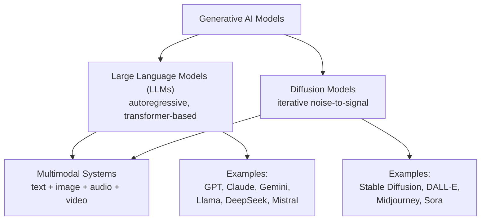

# Lesson 1-1: Introduction to Generative AI Models

> Student follow-along resources, key concepts, and references for this sublesson.

## Overview

Generative AI refers to a class of machine learning systems that create new, original content — text, images, audio, video, or code — by learning statistical patterns from very large training datasets. This sublesson sets the foundation for the rest of the course by contrasting generative AI with traditional (predictive) AI, introducing the two dominant model families you will work with (Large Language Models and diffusion models), and explaining why model choice drives what you can actually build.

## Learning objectives

By the end of this sublesson you should be able to:

- Define generative AI and explain how it differs from traditional, predictive AI.
- Identify the two dominant families of modern generative models (LLMs and diffusion models) and the kinds of outputs each is best suited for.
- Recognize the names of current flagship models (e.g., GPT, Claude, Gemini, Llama, DeepSeek, Stable Diffusion, Midjourney, DALL·E, Sora).
- Explain at a high level what "autoregressive" generation and "diffusion" generation mean.
- Justify why model-family choice matters when designing an AI application.

## Key concepts

### 1. Traditional AI vs. generative AI

Traditional AI is built primarily to **analyze, classify, or predict**. It detects fraud, ranks search results, recommends products, forecasts demand, or labels images. It works *with* existing content.

Generative AI is built to **create new content** that did not exist before. It writes, summarizes, codes, designs, and produces images, audio, and video. It is generally trained on much larger and more diverse datasets and is built on deep neural networks (most often transformers or diffusion architectures).

| Dimension | Traditional AI | Generative AI |
| --- | --- | --- |
| Primary goal | Classify, predict, optimize | Generate new content |
| Typical output | A label, score, or decision | Text, image, audio, video, code |
| Data needs | Often smaller, structured datasets | Massive, diverse datasets |
| Interpretability | Generally easier to interpret | Often a "black box" |
| Example use cases | Fraud detection, churn prediction, recommendation | Chat assistants, image generation, code generation, content drafting |

In practice, modern systems often combine both: traditional models route, score, and filter; generative models produce the user-facing content.

### 2. The two dominant families in 2025–2026

#### Large Language Models (LLMs)

- **Architecture:** Built on the **transformer** architecture, which uses self-attention to weigh relationships between tokens across long sequences.
- **Generation style:** **Autoregressive** — the model predicts the next **token** (a word, sub-word, or character) given all previous tokens, then feeds that prediction back in to predict the next token, one step at a time.
- **Inputs/outputs:** Originally text-in, text-out. Modern flagship LLMs are now **multimodal**: they can accept and/or produce images, audio, and video as well.
- **Flagship families (early 2026):** OpenAI **GPT-5.x**, Anthropic **Claude 4.x**, Google **Gemini 3.x**, Meta **Llama 4**, **DeepSeek-V3.x**, xAI **Grok 4**, Mistral, Microsoft **Phi** (small language models).
- **2026 trends to know:**
  - **Inference-time reasoning** ("thinking" / chain-of-thought / "Deep Think") instead of relying purely on bigger training runs.
  - **Mixture-of-Experts (MoE)** architectures for efficiency at very large scale.
  - **Small Language Models (SLMs)** for on-device, private, low-latency use cases.

#### Diffusion models

- **Core idea:** Learn to *reverse* a gradual noising process. During training the model sees data progressively corrupted with Gaussian noise; at inference it starts from pure random noise and **iteratively denoises** it into a coherent image, video frame, or other signal.
- **Architecture:** Typically a U-Net (or transformer-based "DiT") that predicts the noise at each step. **Latent diffusion** models (e.g., Stable Diffusion) run this process in a compressed latent space via a Variational Autoencoder (VAE) for big efficiency gains.
- **Conditioning:** Text prompts steer generation through techniques like **classifier-free guidance**, usually with a text encoder (often a CLIP-style or transformer encoder) feeding the U-Net.
- **Strengths:** State-of-the-art **image and video generation** quality; high controllability via prompts, image references, and adapters (LoRA, ControlNet, DreamBooth).
- **Examples:** **Stable Diffusion** (open-source, runs locally), **DALL·E** (OpenAI, integrated in ChatGPT), **Midjourney** (proprietary, known for an artistic look), **Sora** (OpenAI, video).
- **2025 research direction — diffusion language models:** A growing line of work explores using diffusion to generate **text in parallel** rather than one token at a time, with the goal of faster inference than autoregressive LLMs. This is still emerging but worth tracking.

### 3. Why this matters for an AI practitioner

The model family you pick determines what your application can actually do, how it will be priced, and what its failure modes look like:

- Need text understanding, summarization, chat, code, function calling, or tool use? → **LLM**.
- Need to produce images, illustrations, marketing assets, product mockups, or video? → **Diffusion model**.
- Need both — e.g., an assistant that interprets a user request *and* generates an image? → **Hybrid system** where an LLM plans/parses and calls a diffusion model (or a unified multimodal model that can do both).

The rest of Lesson 1 builds directly on this:

- **Lesson 1-2:** Major generative AI model families in detail.
- **Lesson 1-3:** Cloud vs. local hosting trade-offs.
- **Lesson 1-4:** Context windows and token management.
- **Lesson 1-5:** Choosing models from AI hubs.
- **Lesson 1-6:** Retrieval-Augmented Generation (RAG), embeddings, and vector databases.

## Glossary

- **Generative AI** — ML systems that create new content (text, image, audio, video, code) from learned patterns.
- **Token** — The atomic unit an LLM reads and produces. Roughly a word or sub-word.
- **Autoregressive generation** — Producing output one token at a time, each conditioned on all previous tokens.
- **Transformer** — The neural-network architecture, based on self-attention, that underlies modern LLMs and many diffusion text encoders.
- **Diffusion model** — A generative model that turns random noise into a coherent output through an iterative denoising process.
- **Latent diffusion** — Diffusion performed in a compressed latent space rather than raw pixels, for speed and efficiency.
- **Multimodal model** — A model that can ingest and/or produce more than one modality (e.g., text + images + audio).
- **Mixture-of-Experts (MoE)** — An architecture that activates only a subset of "expert" sub-networks per input, scaling capacity without proportional compute cost.
- **Small Language Model (SLM)** — A compact LLM optimized for on-device or edge use.
- **RAG (Retrieval-Augmented Generation)** — Grounding a generative model in retrieved, up-to-date documents to improve accuracy and reduce hallucinations. Covered in Lesson 1-6.

## Quick self-check

1. Give one example of a task best handled by traditional AI and one best handled by generative AI.
2. In one sentence, what does it mean for an LLM to be "autoregressive"?
3. What is the core mechanism by which a diffusion model produces an image from a text prompt?
4. Name one current flagship LLM and one current diffusion-based image or video model.
5. Why might a real product use both an LLM and a diffusion model together?

## References and further reading

- [Agentic AI for Cybersecurity: Building Autonomous Defenders and Adversaries](https://www.oreilly.com/library/view/agentic-ai-for/9780135589861/)
- [Beyond the Algorithm: AI, Security, Privacy, and Ethics](https://learning.oreilly.com/library/view/beyond-the-algorithm/9780138268442)
