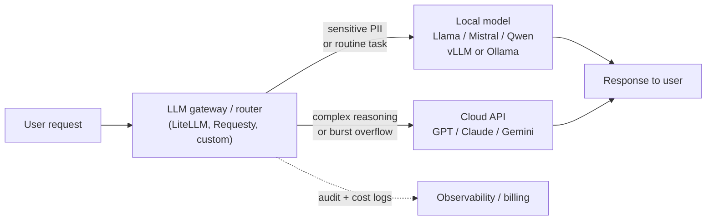

# Lesson 1-2: Model Hosting Options

> Student follow-along resources, key concepts, and references for this sublesson.

## Overview

Once you have decided what kind of generative model you need, the next architectural decision is **where it actually runs**. This sublesson compares the two main hosting approaches — **cloud-hosted APIs** (OpenAI, Anthropic, Google, AWS Bedrock, Azure AI Foundry, Vertex AI) and **local / self-hosted inference** (open-weight models served with tools like Ollama, vLLM, or LM Studio) — and introduces the **hybrid pattern** that has become the dominant production architecture. The right choice depends on cost, latency, privacy and compliance requirements, and how steady or bursty your workload is.

## Learning objectives

By the end of this sublesson you should be able to:

- Distinguish cloud-hosted, local/on-premises, and hybrid hosting for generative AI models.
- Compare the cost, latency, privacy, and operational trade-offs of cloud vs. local inference.
- Identify common open-source serving stacks (Ollama, vLLM, LM Studio) and their typical roles.
- Explain when and why an organization should pick cloud, local, or hybrid hosting.
- Estimate, at a high level, the break-even point at which self-hosting becomes cheaper than API calls.

## Key concepts

### 1. Cloud-hosted (API) inference

With cloud hosting, you call a managed API and the provider runs the model in their data center. You pay per token (or per request), get automatic updates, and inherit the provider's reliability and security posture.

- **Providers:** OpenAI, Anthropic, Google (Gemini API / Vertex AI), AWS (Bedrock), Microsoft (Azure AI Foundry / Azure OpenAI), Cohere, Mistral La Plateforme, and others.
- **Strengths:** No upfront hardware cost; instant access to flagship and frontier models (e.g., GPT-5.x, Claude 4.x, Gemini 3.x); automatic scaling for bursty traffic; managed safety, abuse, and compliance tooling; rapid prototyping and short time-to-market.
- **Trade-offs:** Data leaves your environment unless the provider offers strict data-handling guarantees (zero-retention modes, private endpoints, customer-managed keys); per-token cost can grow quickly at scale; network round-trip latency is typically **~200–400 ms** for chat-style requests; you depend on vendor availability and pricing changes.

Managed catalogs such as **AWS Bedrock**, **Azure AI Foundry**, and **Google Vertex Model Garden** are still cloud hosting — but they let you choose from many proprietary and open-weight models behind one unified API, including evaluation, guardrails, and fine-tuning tooling.

### 2. Local / self-hosted inference

Local hosting means you run the model on hardware you control — your own GPUs in a data center, a Kubernetes cluster, an on-prem workstation, or even a developer laptop.

- **Models:** Open-weight families such as **Meta Llama**, **Mistral**, **Qwen**, **DeepSeek**, **Phi (SLMs)**, and many fine-tuned variants on Hugging Face.
- **Serving stacks:**

| Tool | Best for | Notable characteristics |
| --- | --- | --- |
| **Ollama** | Single-user dev, prototyping, edge | CLI-first, very easy install, OpenAI-compatible API |
| **vLLM** | High-throughput production serving | Continuous batching, PagedAttention, OpenAI-compatible server |
| **LM Studio** | Desktop experimentation | Polished GUI, model browser, no-code friendly |
| **Hugging Face TGI** | Production text-generation inference | Optimized server with streaming, quantization, multi-GPU |
| **Llama.cpp** | CPU / Apple Silicon / quantized GGUF | Highly portable, runs efficiently on consumer hardware |

- **Strengths:** Data never leaves your infrastructure (critical for healthcare, finance, government, and other regulated workloads); predictable per-token cost at high volume; **lower and more stable latency** — often **~20–80 ms** for typical short responses on local GPUs because there is no network round-trip; full control over models, versions, and quantization.
- **Trade-offs:** Significant **upfront capital cost** for GPUs (RTX 4090/5090 for development; A10G/L4 for small production; A100/H100 for large production); ongoing DevOps, monitoring, and patching effort; you are limited to models that fit your VRAM, often via quantized GGUF/AWQ/GPTQ formats; you are responsible for safety, evaluation, and abuse controls yourself.
- **Quality gap:** Open-weight models have closed much of the historical gap with frontier APIs. By late 2025, leading open models reach roughly **85–95 percent of GPT-4-class performance** on many public benchmarks, and they often match or beat frontier models on narrow, fine-tuned tasks.

### 3. Cloud vs. local at a glance

| Dimension | Cloud API | Local / self-hosted |
| --- | --- | --- |
| Upfront cost | None | High (GPUs, networking, ops) |
| Marginal cost | Per-token, can compound at scale | Mostly electricity + amortized hardware |
| Latency | ~200–400 ms (network + queue) | ~20–80 ms (no network hop) |
| Data residency | Leaves your environment | Stays on your infrastructure |
| Model freshness | Always-current frontier models | You manage updates and migrations |
| Scaling | Elastic, on-demand | Bound by your provisioned hardware |
| Best for | Variable demand, prototyping, frontier capability | Steady high volume, regulated data, strict latency |

A common rule of thumb: cloud APIs are usually the right call up to a few hundred thousand tokens per day or while you are still searching for product-market fit. Self-hosting starts to win on cost once you have **sustained, high-volume workloads** (often cited break-even ranges run from a few million tokens per day for consumer-grade GPUs up to hundreds of millions of tokens per day for enterprise H100 clusters), or whenever **compliance** makes cloud impossible.

### 4. The hybrid pattern

In a hybrid architecture, an **LLM gateway** routes each request to the best backend based on three criteria:

- **Sensitivity** — Requests containing PII, PHI, or other regulated data are pinned to local models so they never leave your VPC.
- **Complexity** — Routine tasks (extraction, summarization, classification, code completion) go to a smaller local model; complex reasoning, agentic workflows, or unusually long context go to a frontier cloud model.
- **Availability** — Cloud APIs act as a failover when local capacity is saturated, and vice versa.

In practice, teams often handle **80–95 percent** of traffic on local or smaller cheaper models and reserve frontier APIs for the long tail of difficult queries. This pattern preserves the elasticity and capability of the cloud while capturing the privacy and cost benefits of self-hosting.

### 5. Decision checklist

Document the following before committing to a hosting strategy:

- **Volume** — Tokens per day today, and projected for 12 months.
- **Latency budget** — How fast must each request feel to the end user?
- **Compliance** — HIPAA, GDPR, SOC 2, FedRAMP, data residency, customer contracts.
- **Capability ceiling** — Do you genuinely need frontier-model quality, or will a tuned open model do?
- **Team capacity** — Do you have GPU/MLOps skills to run vLLM or TGI in production?
- **Exit strategy** — Can you swap providers or move on-prem if costs change?

## Why it matters / What's next

Hosting is the decision that ties model choice to **real-world cost, performance, and risk**. The same Llama-class model can cost ten times more or run ten times slower depending on where and how it is served, and the same workflow may be perfectly compliant on local hardware and impossible to deploy via a public API.

The next sublesson, **Lesson 1-4: Context Windows and Token Management**, looks at the per-request side of the same equation — how much text the model can actually consider, how tokens are billed, and how to design prompts that stay within budget. After that, **Lesson 1-5: Model Selection in AI Hubs** covers how to pick a specific model from catalogs like Hugging Face, Bedrock, Azure AI Foundry, and Vertex Model Garden.

## Glossary

- **Cloud-hosted model** — A model accessed over the network through a managed API; the provider runs the inference.
- **Local / self-hosted model** — A model whose weights you run on hardware you control.
- **Open-weight model** — A model whose trained weights are publicly downloadable (e.g., Llama, Mistral, Qwen). Not always the same as "open-source," which usually also implies an open license and open data.
- **vLLM** — A high-throughput open-source inference engine that uses PagedAttention and continuous batching for efficient GPU serving.
- **Ollama** — A developer-friendly local runtime that pulls and serves quantized open-weight models with an OpenAI-compatible API.
- **LM Studio** — A desktop GUI application for downloading and chatting with local models.
- **Quantization** — Compressing model weights (e.g., 4-bit GGUF/AWQ/GPTQ) to fit larger models in less VRAM with minor quality loss.
- **LLM gateway / router** — A proxy layer (e.g., LiteLLM, Requesty) that picks a backend per request and provides one unified API.
- **Hybrid hosting** — An architecture that combines local and cloud inference, routing requests by sensitivity, complexity, or availability.
- **Latency** — End-to-end time from request to first / last token; cloud calls add network round-trip on top of GPU compute time.
- **Total cost of ownership (TCO)** — All-in cost including hardware, electricity, ops labor, and downtime, used to compare hosting options honestly.

## Quick self-check

1. Name two situations where local hosting is clearly preferable to a cloud API, and two where the cloud is preferable.
2. Give a rough latency expectation for a typical chat request to a cloud API vs. to a local GPU server.
3. Why might an enterprise pick AWS Bedrock or Azure AI Foundry over calling OpenAI directly?
4. Describe one routing rule in a hybrid architecture and explain what it protects against.
5. What hidden costs make naive "GPU price ÷ tokens per second" math an unreliable estimate of self-hosting cost?

## References and further reading

- [Agentic AI for Cybersecurity: Building Autonomous Defenders and Adversaries](https://www.oreilly.com/library/view/agentic-ai-for/9780135589861/)
- [Beyond the Algorithm: AI, Security, Privacy, and Ethics](https://learning.oreilly.com/library/view/beyond-the-algorithm/9780138268442)
- [Amazon Bedrock](https://docs.aws.amazon.com/bedrock/latest/userguide/models-supported.html)
- [Amazon Bedrock Marketplace](https://aws.amazon.com/bedrock/marketplace/)
- [Azure AI Foundry](https://learn.microsoft.com/en-us/azure/ai-foundry/what-is-azure-ai-foundry)
- [Google Cloud Vertex AI Model Garden](https://cloud.google.com/vertex-ai/generative-ai/docs/model-garden/explore-models)
- [vLLM](https://docs.vllm.ai/en/latest/)
- [Ollama](https://docs.ollama.com/)
- [LM Studio](https://lmstudio.ai/)
- [Hugging Face TGI](https://huggingface.co/docs/text-generation-inference/index)
- [Requesty: LLM Gateway 101: Everything You Need to Know (2025)](https://www.requesty.ai/blog/llm-gateway-101-everything-you-need-to-know-in-2025-1751649864)  

