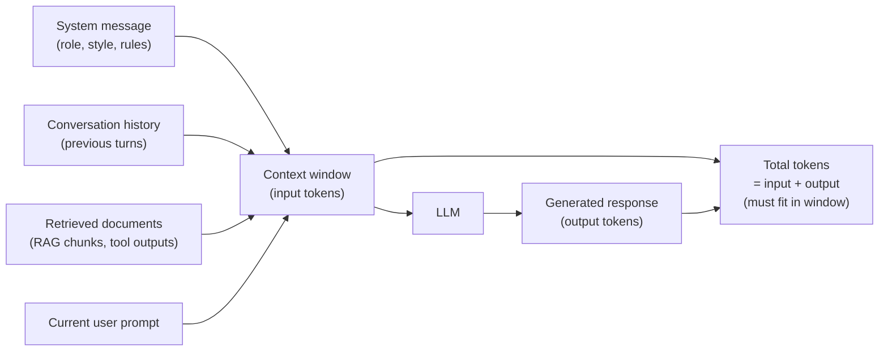

# Lesson 1-3: Context Windows and Token Management

> Student follow-along resources, key concepts, and references for this sublesson.

## Overview

LLMs do not see characters or words the way humans do. They read and write **tokens**, and they can only "see" a limited number of them at once — the **context window**. Every system message, user prompt, retrieved document, conversation turn, and generated response consumes part of that budget, and you pay for both the tokens you send in and the tokens the model produces. This sublesson explains how tokenization works, how big modern context windows have become, why the longest possible window is not always the best choice, and how to manage the input/output token budget in real applications.

## Learning objectives

By the end of this sublesson you should be able to:

- Define what a token is and estimate token counts from character or word counts.
- Explain what a context window contains and how it bounds a single request.
- Compare typical context-window sizes for current flagship models.
- Recognize the "lost in the middle" failure mode and design prompts that mitigate it.
- Use parameters like `max_tokens` / `max_completion_tokens` to control response length, cost, and latency.
- Plan a token budget for a prompt, RAG context, conversation history, and answer.

## Key concepts

### 1. What is a token?

A **token** is the atomic unit an LLM reads and produces. It is usually a sub-word fragment, not a full word.

- Most modern LLMs (GPT, Claude, Llama, Mistral) tokenize text with a **Byte-Pair Encoding (BPE)** family algorithm. BPE starts from raw bytes and iteratively merges the most frequent adjacent pairs into single tokens, so common words become one token while rare words split into multiple sub-word pieces.
- OpenAI's open-source `tiktoken` library implements the BPE encodings used by GPT-class models and is the canonical way to count tokens for those models.
- Other providers ship their own tokenizers (e.g., Anthropic's tokenizer for Claude; SentencePiece-based tokenizers for Llama and Mistral). **Token counts are not portable across providers** — the same English sentence may be 18 tokens for one model and 22 for another.

Useful rules of thumb for English text in OpenAI-style tokenizers:

- 1 token ≈ **4 characters** of English.
- 1 token ≈ **¾ of a word** (so 100 tokens ≈ 75 words).
- 1,000 tokens ≈ **750 words** ≈ a one-and-a-half page document.
- A typical paragraph: **100–150 tokens**. A long article: **1,500–2,000 tokens**. A book chapter: **5,000–10,000 tokens**.

Languages with non-Latin scripts (Chinese, Japanese, Arabic, etc.) and code with lots of symbols often produce **more tokens per character**, so always measure rather than assume.

### 2. The context window

The **context window** is the maximum number of tokens the model can see in a single request. It includes everything the model conditions on, **plus** the response it generates:

Two practical consequences:

- The total of **input tokens + output tokens** must fit inside the window. If the response would push the total over the limit, the API will either truncate or stop early.
- Long prompts crowd out the answer. If you fill 95 percent of the window with retrieved context, you have very little room left for the model to think and respond.

### 3. Context-window sizes

Modern flagship models offer dramatically larger windows than the early GPT-3.5 era (4K tokens). Sizes evolve quickly; check each provider's docs for the latest numbers.

| Model family | Provider | Typical context window |
| --- | --- | --- |
| GPT-5.x (incl. mini / nano variants) | OpenAI | up to ~1M |
| Claude 4.x (Sonnet / Opus / Haiku) | Anthropic | 200K standard; 1M on extended-context variants |
| Gemini 3.x Pro / Flash | Google | 1M (with research previews exploring more) |
| DeepSeek V4.x | DeepSeek | up to ~1M |
| Mistral Large / Medium | Mistral | up to ~1M |
| Phi small models | Microsoft | 128K on recent versions |

A larger window unlocks **whole-codebase analysis**, long legal or medical documents, multi-hour transcripts, and rich RAG pipelines. It is not free, however — see the next two sections.

### 4. Long context is not always "better"

Three forces push back on naively filling the window:

- **Cost** — Providers bill per input and output token. Filling a 1M-token window can cost cents to several dollars *per request* depending on the model. Cached or repeated input is sometimes discounted (Anthropic and OpenAI both offer prompt caching), which can cut costs by 50–90 percent for stable system prompts and document chunks.
- **Latency** — Both prefill (processing the prompt) and decode (generating tokens) take longer with more tokens. Time-to-first-token rises roughly linearly with input length on most architectures.
- **"Lost in the middle"** — Empirical studies show a U-shaped attention pattern: models recall information placed at the **start** or **end** of a long prompt much more reliably than information buried in the middle. As context length grows, performance on retrieval and reasoning tasks degrades — sometimes sharply — even for models that advertise multi-hundred-thousand-token windows. Benchmarks like **NoLiMa** specifically test recall when literal lexical matches are removed and show large drops between short and long contexts on most leading models.

Practical implications:

- Put critical instructions and the user's question at the **top or bottom** of long prompts, not the middle.
- Use **explicit structure** (section headers, XML or Markdown tags, numbered chunks) so the model can locate relevant material.
- Prefer **retrieval-augmented** designs (Lesson 1-6) that send a small, well-chosen set of chunks instead of the entire corpus.
- Compress, summarize, or trim conversation history when it grows beyond what the answer actually needs.

### 5. Output management with `max_tokens` / `max_completion_tokens`

Most chat completion APIs let you cap the response length:

- **OpenAI** — historically `max_tokens`; newer Responses / Chat Completions APIs use `max_completion_tokens` (and reasoning models also count internal "thinking" tokens against this budget).
- **Anthropic Claude** — `max_tokens` is **required** on every Messages API call; it is the upper bound on the assistant's reply.
- **Google Gemini** — `maxOutputTokens` in the generation config.
- **Open-source servers** (vLLM, TGI, Ollama) — typically expose `max_tokens` or `max_new_tokens` in OpenAI-compatible form.

Why this matters:

- **Cost control** — Output tokens are usually billed at a higher rate than input tokens; a runaway answer is expensive.
- **Latency control** — A short cap forces the model to finish quickly, which matters for streaming UIs and agent loops.
- **Predictability** — Together with structured-output features (JSON mode, schemas, tool calls), bounded outputs help downstream code parse responses safely.
- **Total budget** — `max_completion_tokens` plus your prompt tokens must still fit inside the model's context window. If the response gets cut off mid-sentence, either raise the cap, shorten the prompt, or move to a model with a larger window.

### 6. Designing a token budget

For any non-trivial prompt, plan token allocation up front. A simple template for a RAG chatbot with a 128K-token model might look like:

| Component | Suggested allocation | Notes |
| --- | --- | --- |
| System prompt | 500–2,000 tokens | Stable across requests; cache it if the provider supports prompt caching. |
| Conversation history | 2,000–8,000 tokens | Summarize older turns rather than dropping them silently. |
| Retrieved RAG chunks | 4,000–20,000 tokens | Top-K (often 4–10) chunks of 256–1,024 tokens each. |
| Current user message | 200–2,000 tokens | The actual question or instruction. |
| Reserved for response | 1,000–4,000 tokens (`max_completion_tokens`) | Leave room; reasoning models can need more. |
| **Headroom** | 10–20% of the window | Avoid the absolute edge; tokenization estimates are imprecise. |

Key habits:

- **Measure, don't guess** — Use the model's official tokenizer (e.g., `tiktoken`) before sending.
- **Log token usage** — Most APIs return `usage.prompt_tokens`, `usage.completion_tokens`, and `usage.total_tokens`; track them for cost and capacity planning.
- **Prefer shorter, well-structured prompts** — Quality scales with relevance, not raw length.

## Why it matters / What's next

Tokens and context windows are the **unit of cost, the unit of latency, and the unit of memory** for every LLM application. Mismanaging them shows up as silently truncated answers, surprise bills, slow responses, and quality regressions on long documents. Once you can reason in token budgets, the next step is to choose the right model for the job — which is the focus of **Lesson 1-5: Model Selection in AI Hubs**. After that, **Lesson 1-6** introduces RAG, which is the most common technique for keeping context windows full of *relevant* information instead of raw bulk.

## Glossary

- **Token** — The atomic unit an LLM reads and produces; usually a sub-word fragment.
- **Tokenizer** — The algorithm that converts text into token IDs; modern LLMs typically use BPE-family tokenizers.
- **BPE (Byte-Pair Encoding)** — A sub-word tokenization scheme that iteratively merges frequent byte pairs into new tokens.
- **`tiktoken`** — OpenAI's official Python library for counting GPT-family tokens.
- **Context window** — The maximum number of tokens (input + output combined) a model can process in one request.
- **Input / prompt tokens** — All tokens you send to the model, including system, history, retrieved docs, and the current message.
- **Output / completion tokens** — Tokens the model generates in response (and, for reasoning models, internal thinking tokens).
- **`max_tokens` / `max_completion_tokens`** — API parameter that caps how many tokens the response may contain.
- **Prompt caching** — A provider feature that stores hashed input prefixes to discount repeated tokens.
- **Lost in the middle** — The empirical finding that LLMs recall information placed at the start or end of long contexts more reliably than in the middle.
- **NoLiMa** — A long-context benchmark that strips literal lexical cues, exposing performance drops on long contexts.
- **Token budget** — A deliberate allocation of the context window across system prompt, history, retrieved context, user message, and response.

## Quick self-check

1. Roughly how many tokens are in a 1,200-word English article, and why is that only an estimate?
2. List every component that counts against a model's context window in a chat completion request.
3. Why might a 1M-token context window perform worse on a needle-in-a-haystack question than a 32K-token window with carefully retrieved chunks?
4. What is the difference between `max_tokens` and the model's context window, and why must they be planned together?
5. Sketch a token budget for a customer-support chatbot using a 200K-token model, RAG, and 10 turns of recent history.

## References and further reading
- [Agentic AI for Cybersecurity: Building Autonomous Defenders and Adversaries](https://www.oreilly.com/library/view/agentic-ai-for/9780135589861/)
- [Beyond the Algorithm: AI, Security, Privacy, and Ethics](https://learning.oreilly.com/library/view/beyond-the-algorithm/9780138268442)
- [OpenAI Help Center — *What are tokens and how to count them?*](https://help.openai.com/en/articles/4936856-what-are-tokens-and-how-to-count-them)
- [OpenAI — *tiktoken (GitHub).*](https://github.com/openai/tiktoken)
- [OpenAI Platform Docs — *Models and context lengths.*](https://platform.openai.com/docs/models)
- [Anthropic — *All models overview (Claude context windows).*](https://docs.claude.com/en/docs/about-claude/models/overview)
- [Anthropic — *Messages API (`max_tokens` parameter).*](https://docs.claude.com/en/api/messages)
- [Google AI for Developers — *Long context with Gemini.*](https://ai.google.dev/gemini-api/docs/long-context)
- [Liu et al. — *Lost in the Middle: How Language Models Use Long Contexts (arXiv).*](https://arxiv.org/abs/2307.03172)
- [Modarressi et al. — *NoLiMa: Long-Context Evaluation Beyond Literal Matching (arXiv, 2025).*](https://arxiv.org/abs/2502.05167)
- [Sebastian Raschka — *Implementing a Byte-Pair Encoding (BPE) Tokenizer From Scratch.*](https://sebastianraschka.com/blog/2025/bpe-from-scratch.html)
- [Hugging Face — *Tokenizer summary.*](https://huggingface.co/docs/transformers/en/tokenizer_summary)
- [DevTk.AI — *LLM Context Windows Explained: 4K to 1M Tokens (2026).*](https://devtk.ai/en/blog/llm-context-window-explained/)
- [Anthropic — *Prompt caching.*](https://docs.claude.com/en/docs/build-with-claude/prompt-caching)

