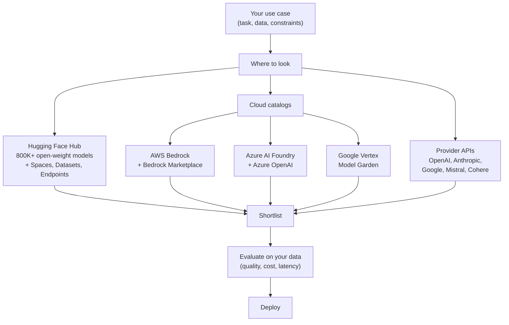

# Lesson 1-4: Model Selection in AI Hubs

> Student follow-along resources, key concepts, and references for this sublesson.

## Overview

There are now thousands of usable generative AI models — proprietary frontier APIs, open-weight models on **Hugging Face**, and curated catalogs inside **AWS Bedrock**, **Azure AI Foundry**, and **Google Vertex Model Garden**. Picking the right one for a given task can feel overwhelming. This sublesson teaches a repeatable selection process: start from the task, filter the catalog, read the model card, and validate with your own evaluation before you commit. It also covers what to look for when you specifically need strong **reasoning** or **multimodality**, and when smaller or quantized models are the better answer.

## Learning objectives

By the end of this sublesson you should be able to:

- Navigate Hugging Face and major cloud catalogs (Bedrock, Azure AI Foundry, Vertex Model Garden) to find candidate models.
- Filter models effectively by task, modality, size, license, framework, and language.
- Read a model card and identify the information that actually matters for production use.
- Choose models tailored to reasoning, multimodality, latency, cost, or domain specialization.
- Design a small, real-workload evaluation to validate a model before deployment.

## Key concepts

### 1. The model landscape

- **Hugging Face Hub** — The dominant open-source registry, hosting on the order of **800,000+ models** along with datasets and "Spaces" demo apps as of early 2026. You can filter by task (text generation, summarization, image-to-text, text-to-image, ASR, etc.), library (Transformers, Diffusers, PEFT, sentence-transformers), framework (PyTorch, TensorFlow, JAX, ONNX, GGUF), language, license, size, and more. The Hub also exposes **Inference Providers** and **Inference Endpoints** so you can try or deploy a model without setting up your own GPUs.
- **AWS Bedrock** — A unified API into a curated set of foundation models from Anthropic, Meta, Mistral, Cohere, AI21, Amazon (Nova / Titan), and others, plus **Bedrock Marketplace** for ~100+ specialized models. Bedrock includes built-in evaluation, guardrails, knowledge bases, and agents.
- **Azure AI Foundry** — Microsoft's enterprise model catalog, with deep OpenAI integration (GPT-5.x, o-series, Sora) plus Llama, Mistral, Phi, DeepSeek, and partner models. Includes evaluation, content filters, and integration with Microsoft security and compliance.
- **Google Vertex Model Garden** — A curated catalog inside Vertex AI featuring Gemini, Gemma, Imagen, Veo, plus partner and open models, with one-click deployment, tuning, and evaluation.
- **Direct provider APIs** — OpenAI, Anthropic, Google AI for Developers, Mistral La Plateforme, Cohere. Often the fastest path to the latest frontier model, with the trade-offs covered in Lesson 1-3 (Model Hosting Options).

### 2. A repeatable selection workflow

A good selection process is short, deliberate, and ends with **your own measurement**:

1. **Define the task precisely.** Inputs, outputs, languages, latency target, throughput target, privacy constraints, and budget per request.
2. **Filter the catalog by task and modality.** On Hugging Face, this is the left-hand sidebar; on cloud catalogs it is the search/filter UI.
3. **Apply hard constraints.** License (commercial vs. research-only, copyleft), maximum size that fits your hardware or budget, supported frameworks, regions, certifications.
4. **Shortlist 3–5 candidates** that span a range of sizes and providers.
5. **Read each model card** for training data, intended use, known limitations, evaluation results, and safety considerations.
6. **Run your own evaluation** on a representative slice of your real workloads — public benchmarks rarely match your application.
7. **Score on quality, cost, latency, and operational fit.** Pick the cheapest model that passes your quality bar; treat upgrades as a future option.
8. **Document the decision** and the assumptions behind it, so you can revisit when models, prices, or your traffic shape change.

### 3. Selecting for specific needs

#### Reasoning

For math, logic, multi-step planning, scientific QA, or tool-using agents, prefer models specifically trained or post-trained for reasoning:

- **Frontier closed:** OpenAI GPT-5 / o-series ("thinking" or "Deep Think" modes), Anthropic Claude 4.x Opus and Sonnet (extended thinking), Google Gemini 3.x Pro (Deep Think).
- **Open weight:** DeepSeek-V3.x and DeepSeek-R1-class reasoners, Qwen 3 reasoning variants, recent Llama 4 reasoning fine-tunes.
- **Benchmarks to look at (don't rely on a single number):** GPQA Diamond, MATH, SWE-bench Verified, ARC-AGI, AIME, BIG-Bench Hard, LiveBench. Public benchmarks saturate quickly, so cross-check with your own task.

#### Multimodality

For tasks that mix text with images, audio, or video:

- **Native multimodal frontier models:** Gemini 3.x Pro / Flash (text + image + audio + video, very long context), GPT-5.x family with vision and audio, Claude 4.x with vision.
- **Open multimodal:** Llama 4 multimodal variants, Qwen 2.5/3 VL, InternVL, LLaVA-class fine-tunes, Whisper for ASR, Stable Diffusion / SDXL / SD 3 for image generation.
- **Check supported modalities and limits explicitly:** image resolution caps, audio length caps, frames-per-video, and whether each modality is input-only or also output.

#### Cost and latency

- Smaller is often better. A well-tuned mid-size model (e.g., 7–32B parameters) often beats a much larger general-purpose model on a narrow task.
- **Quantized models** (GGUF, AWQ, GPTQ, INT4/INT8) shrink memory and cost with modest quality loss; ideal for on-device or edge deployments.
- "Mini" / "Flash" / "Haiku" / "Phi" tiers from major providers are designed for high-volume, low-latency use and can handle 80–95 percent of routine traffic in a routing setup.

#### Language and domain

- For non-English use cases, look for models explicitly trained or fine-tuned for that language (e.g., Qwen for Chinese, Mistral models for French, Aya for many languages, IndicTrans for South Asian languages).
- For regulated or specialist domains (medical, legal, financial, scientific code), look for **domain-tuned** checkpoints and read the model card for the training-data description and any clinical/legal validation.

### 4. Reading a model card

A good Hugging Face model card is a `README.md` with a structured YAML header. Skim quickly for these sections before you spend time downloading anything:

| Section | What to look for |
| --- | --- |
| **Model description** | Architecture, base model, parameter count, modalities. |
| **Intended use & limitations** | Sanctioned use cases, **out-of-scope** uses, known biases. |
| **Training data** | Datasets, languages, cut-off date, licensing, contamination disclosures. |
| **Training procedure** | Pretraining, SFT, RLHF/DPO, fine-tuning details, hardware. |
| **Evaluation** | Benchmark scores **and the prompts/conditions used** to produce them. |
| **License** | Commercial vs. non-commercial, attribution, redistribution, downstream restrictions. |
| **Safety / responsible-AI notes** | Known failure modes, content filters, red-teaming results. |
| **How to use** | Code snippets, recommended `transformers` / `diffusers` calls, chat template. |

A model card with no training-data discussion, no evaluation, and a vague license is a red flag for production use, regardless of how impressive its demos look.

### 5. Beware "size = quality"

Parameter count is a rough capacity proxy, not a quality guarantee:

- A **7–13B parameter model fine-tuned for your task** can outperform a 70B+ general-purpose model.
- **Mixture-of-Experts (MoE)** models advertise huge total parameter counts but only activate a small subset per token; total parameters are not directly comparable to dense models.
- **Quantization level** (FP16 vs. INT8 vs. INT4) materially changes both VRAM footprint and quality.
- Always pair a public benchmark number with your own evaluation on real prompts.

### 6. Evaluation in practice

A minimum viable evaluation:

1. Curate **30–100 representative prompts** from real or realistic user requests.
2. Define a **scoring rubric** — exact match, JSON validity, factual accuracy, helpfulness, safety, latency, tokens used.
3. Run each candidate model against the same prompts, store outputs, and grade them. **LLM-as-a-judge** is acceptable for first-pass screening but should be cross-checked by humans on edge cases.
4. Track **cost per task** alongside quality. Cheaper models that meet the bar usually win.
5. Re-run the eval on every model upgrade or prompt change so quality regressions cannot sneak in silently.

Cloud catalogs like **Bedrock Model Evaluation**, **Azure AI Foundry Evaluations**, and **Vertex AI Evaluation Service** automate parts of this loop and integrate with their respective model catalogs.

## Why it matters / What's next

Picking models is now a recurring engineering decision, not a one-time setup step. New models ship every few weeks, prices drop, capabilities shift, and a model that was perfect last quarter may be both expensive and outclassed today. Treat selection as a workflow — task → filter → shortlist → model card → your own evaluation → deploy → re-evaluate — and you can keep up without becoming dependent on a single vendor.

The next sublesson, **Lesson 1-6: Retrieval-Augmented Generation (RAG), Embeddings, and Vector Databases**, builds on this by showing how to feed a chosen model with your own up-to-date knowledge — which often matters more for application quality than which exact LLM you picked.

## Glossary

- **AI hub / model catalog** — A platform that lists many models with shared metadata, search, and (often) deployment tooling.
- **Hugging Face Hub** — The largest open-source AI hub, hosting hundreds of thousands of models, datasets, and Spaces.
- **AWS Bedrock** — Amazon's managed multi-provider foundation-model API and marketplace.
- **Azure AI Foundry** — Microsoft's enterprise AI catalog and platform for building, evaluating, and deploying models and agents.
- **Vertex Model Garden** — Google Cloud's curated foundation-model catalog inside Vertex AI.
- **Model card** — Structured documentation for a model covering description, training data, intended use, limitations, evaluation, and license.
- **License (model)** — The legal terms under which a model's weights may be used, modified, and redistributed.
- **Mixture-of-Experts (MoE)** — An architecture where each token activates only a subset of "expert" sub-networks, decoupling total and active parameters.
- **Quantization** — Reducing weight precision (e.g., to INT4/INT8) to shrink memory and speed up inference at some quality cost.
- **Reasoning model** — A model trained or post-trained to perform extended internal "thinking" before answering, typically billed with reasoning/output token surcharges.
- **Multimodal model** — A model that ingests and/or produces more than one modality (text, image, audio, video).
- **Inference Endpoint** — A managed deployment of a model behind an HTTP API (Hugging Face, Azure, Vertex, Bedrock all offer variants).
- **LLM-as-a-judge** — Using an LLM to grade the outputs of other models; useful for scaling evaluations but must be sanity-checked.

## Quick self-check

1. Walk through the seven-step selection workflow for choosing a model to summarize internal HR policy documents in Spanish.
2. Which sections of a Hugging Face model card would you read first for a regulated-industry deployment, and why?
3. Name three model families you would shortlist if you needed strong multi-step reasoning today.
4. Why is "the biggest model wins" usually the wrong heuristic in production?
5. Describe a minimal evaluation you could run in one afternoon to compare two candidate LLMs on your own task.

## References and further reading

- **[Redefining Hacking](https://learning.oreilly.com/library/view/redefining-hacking-a/9780138363635/)** A Comprehensive Guide to Red Teaming and Bug Bounty Hunting in an AI-driven World
- **[AI-Powered Digital Cyber Resilience](https://www.oreilly.com/library/view/ai-powered-digital-cyber/9780135408599/)** A practical guide to building intelligent, AI-powered cyber defenses in todays fast-evolving threat landscape.    
- **[Developing Cybersecurity Programs and Policies in an AI-Driven World](https://learning.oreilly.com/library/view/developing-cybersecurity-programs/9780138073992)**  
    Explore strategies for creating robust cybersecurity frameworks in an AI-centric environment.
- **[Beyond the Algorithm: AI, Security, Privacy, and Ethics](https://learning.oreilly.com/library/view/beyond-the-algorithm/9780138268442)**  
    Gain insights into the ethical and security challenges posed by AI technologies. 
- **[The AI Revolution in Networking, Cybersecurity, and Emerging Technologies](https://learning.oreilly.com/library/view/the-ai-revolution/9780138293703)** Understand how AI is transforming networking and cybersecurity landscape.
- **[Building the Ultimate Cybersecurity Lab and Cyber Range](https://learning.oreilly.com/course/building-the-ultimate/9780138319090/) (video)**
- **[Build Your Own AI Lab](https://learning.oreilly.com/course/build-your-own/9780135439616) (video)** Hands-on guide to home and cloud-based AI labs. Learn to set up and optimize labs to research and experiment in a secure environment.
- **[Defending and Deploying AI](https://www.oreilly.com/videos/defending-and-deploying/9780135463727/) (video)** This course provides a comprehensive, hands-on journey into modern AI applications for technology and security professionals, covering AI-enabled programming, networking, and cybersecurity to help learners master AI tools for dynamic information retrieval, automation, and operational efficiency. It dives deeply into securing generative AI, addressing critical topics such as LLM security, prompt injection risks, and red-teaming AI models. Participants also learn how to build secure, cost-effective AI labs at home or in the cloud, with practical guidance on hardware and software choices. Finally, the course explores AI agents and agentic RAG for cybersecurity, demonstrating how large language models can be applied to both offensive and defensive operations through real-world examples and hands-on labs.
- **[AI-Enabled Programming, Networking, and Cybersecurity](https://learning.oreilly.com/course/ai-enabled-programming-networking/9780135402696/)** Learn to use AI for cybersecurity, networking, and programming tasks. Use examples of practical, hands-on activities and demos that emphasize real-world tasks. Implement AI tools as a programmer, developer, networking, or security professional. 
- **[Securing Generative AI](https://learning.oreilly.com/course/securing-generative-ai/9780135401804/)** Explore security for deploying and developing AI applications, RAG, agents, and other AI implementations Learn hands-on with practical skills of real-life AI and machine learning cases Incorporate security at every stage of AI development, deployment, and operation.
- **[Hugging Face — *Hugging Face Hub documentation.*](https://huggingface.co/docs/hub/index)**
- **[Hugging Face — *The Model Hub.*](https://huggingface.co/docs/hub/models-the-hub)**
- **[Hugging Face — *Model Cards.*](https://huggingface.co/docs/hub/model-cards)**
- **[Hugging Face — *Open LLM Leaderboard.*](https://huggingface.co/spaces/open-llm-leaderboard/open_llm_leaderboard)**
- **[Hugging Face — *Inference Providers.*](https://huggingface.co/docs/inference-providers/index)**
- **[AWS — *Supported foundation models in Amazon Bedrock.*](https://docs.aws.amazon.com/bedrock/latest/userguide/models-supported.html)**
- **[AWS — *Amazon Bedrock Marketplace.*](https://aws.amazon.com/bedrock/marketplace/)**
- **[AWS — *Evaluate the performance of Amazon Bedrock resources.*](https://docs.aws.amazon.com/bedrock/latest/userguide/evaluation.html)**
- **[Microsoft Learn — *Model catalog and collections in Azure AI Foundry.*](https://learn.microsoft.com/en-us/azure/ai-foundry/concepts/foundry-models-overview)**
- **[Google Cloud — *Vertex AI Model Garden — Explore models.*](https://cloud.google.com/vertex-ai/generative-ai/docs/model-garden/explore-models)**
- **[Google Cloud — *Gen AI evaluation service overview.*](https://cloud.google.com/vertex-ai/generative-ai/docs/models/evaluation-overview)**
