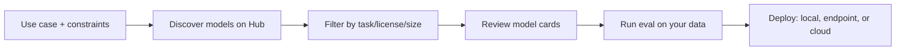

# Lesson 1-5: Using Open Weight Models and Introducing Hugging Face

> Student follow-along resources, key concepts, and references for this sublesson.

## Overview

Open-weight models give you direct access to model parameters, so you can run, fine-tune, and deploy AI systems with much more control than API-only proprietary models. In practice, most teams discover and evaluate these models through Hugging Face, which has become the central ecosystem for model repositories, model cards, dataset artifacts, leaderboards, and deployment pathways. This sublesson explains what "open weight" really means, how to work safely with licenses, and how to use Hugging Face Hub as a practical workflow from discovery to deployment.

## Learning objectives

By the end of this sublesson you should be able to:

- Explain the difference between open source AI, open weight models, and closed APIs.
- Find models on Hugging Face using filters for task, license, framework, and hardware fit.
- Read model cards to assess suitability, risks, and deployment constraints.
- Identify common open-weight deployment paths (local, cloud endpoint, self-hosted inference).
- Avoid common legal and operational mistakes when choosing open-weight models.

## Key concepts

### 1. Open weight does not always mean fully open source

- **Open weight** means model parameters are available for download and local use.
- **Fully open source AI** is stricter: weights, code, and (ideally) training data/procedure transparency.
- Some "open" models still include restricted licenses (for example, non-commercial clauses or usage limitations).
- Treat licensing as a production requirement, not an afterthought.

### 2. Hugging Face as the model operating system

Hugging Face Hub is where many teams do all of the following:

- Discover checkpoints and model families.
- Review model cards and usage snippets.
- Compare leaderboard signals.
- Host internal derivatives and fine-tuned adapters.
- Deploy via Inference Endpoints or provider integrations.

### 3. A practical selection checklist

When evaluating an open-weight model, check:

1. **License fit** for commercial usage and redistribution.
2. **Hardware fit** (VRAM, precision, quantized variants).
3. **Task fit** (reasoning, coding, multilingual, multimodal).
4. **Operational fit** (latency, throughput, observability, guardrails).
5. **Safety and known limits** documented in the model card.

### 4. Common mistakes to avoid

- Choosing by hype or benchmark headlines only.
- Ignoring tokenizer/context differences across model families.
- Skipping evaluation on your own prompts and datasets.
- Assuming larger parameter count always means better outcomes.

## Why it matters / What's next

Open-weight literacy gives you leverage: better portability, lower lock-in, and more deployment flexibility. Once you can reliably choose and run open models, the next step is improving knowledge freshness and factual grounding. That is the focus of **Lesson 1-6: Retrieval Augmented Generation (RAG), Embeddings, and Vector Databases**.

## Glossary

- **Open weight model** — A model with downloadable parameters (weights), usually runnable outside a vendor API.
- **Model card** — Structured documentation describing intended use, limitations, evaluation, and licensing.
- **Inference endpoint** — Hosted API serving a chosen model.
- **Quantization** — Lower-precision representation (for example INT8/INT4) used to reduce memory and cost.
- **Checkpoint** — Saved model state that can be loaded for inference or further fine-tuning.

## Quick self-check

1. Why is "open weight" not always equal to "fully open source AI"?
2. Which three fields in a model card should you read before downloading a model?
3. What are two deployment options for a Hugging Face model besides running it on your laptop?
4. Why can a smaller quantized model be better than a larger model for some workloads?

## References and further reading

- [Hugging Face Hub Documentation](https://huggingface.co/docs/hub/index)
- [Hugging Face Model Hub](https://huggingface.co/docs/hub/models-the-hub)
- [Hugging Face Model Cards](https://huggingface.co/docs/hub/model-cards)
- [Hugging Face Inference Endpoints](https://huggingface.co/docs/inference-endpoints/index)
- [State of Open Source on Hugging Face (Spring 2026)](https://huggingface.co/blog/huggingface/state-of-os-hf-spring-2026)
- [Open Source AI Collection (Hugging Face)](https://huggingface.co/collections/mindchain/open-source-ai-fully-open-weights-and-training-data)
