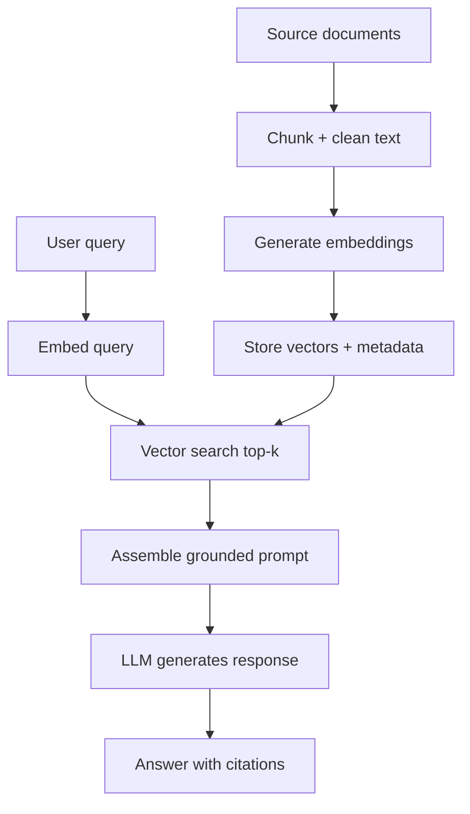

# Lesson 1-6: Retrieval Augmented Generation (RAG), Embeddings, and Vector Databases

> Student follow-along resources, key concepts, and references for this sublesson.

## Overview

Retrieval Augmented Generation (RAG) is the most common way to make LLM applications grounded in your own current knowledge. Instead of relying only on model pretraining, RAG retrieves relevant chunks from your documents at query time and injects them into the prompt. This sublesson covers the three core building blocks: embeddings, vector search, and generation with cited context.

## Learning objectives

By the end of this sublesson you should be able to:

- Explain the end-to-end RAG workflow from ingestion to answer generation.
- Describe how embeddings convert text into vectors for semantic retrieval.
- Compare vector database choices and why approximate nearest-neighbor indexing matters.
- Identify where hallucinations and retrieval misses happen in RAG systems.
- Design a basic RAG pipeline with chunking, top-k retrieval, and answer synthesis.

## Key concepts

### 1. The RAG pipeline at a glance

### 2. Embeddings are the retrieval interface

- Embeddings map text to dense numeric vectors so semantically similar content is nearby in vector space.
- You must use the same embedding model family for indexing and querying.
- Embedding quality drives retrieval quality more than prompt wording does in many RAG systems.
- Dimension size, language coverage, and domain fit directly impact accuracy and cost.

### 3. Vector databases: speed and recall trade-offs

Vector databases optimize nearest-neighbor search over high-dimensional vectors using ANN indexes such as HNSW or IVF variants.

Key capabilities to evaluate:

- Metadata filtering (tenant, product, date, ACL).
- Hybrid retrieval (keyword + vector) for better precision.
- Update behavior and reindex cost.
- Recall/latency behavior at your expected scale.

### 4. Failure modes and mitigations

- **Bad chunking** -> retrieved context is incomplete or fragmented.
- **Embedding mismatch** -> semantically relevant chunks are not surfaced.
- **Over-retrieval** -> noisy context lowers answer quality.
- **No grounding policy** -> model invents unsupported claims.

Common mitigations:

- Chunk by semantic boundaries with overlap.
- Use top-k + reranking.
- Force citation-required output format.
- Evaluate retrieval and generation separately.

## Why it matters / What's next

RAG is the bridge between static model knowledge and dynamic business knowledge. If your use case depends on internal docs, changing policies, product catalogs, or incident history, RAG is often mandatory. In the next sublesson, **Lesson 1-7: Understanding Agentic RAG**, you will extend this pattern with planning and tool-using retrieval agents.

## Glossary

- **RAG** — Retrieval Augmented Generation; retrieve relevant context first, then generate.
- **Embedding** — Dense vector representation of text semantics.
- **Vector database** — System optimized for storing and searching embeddings.
- **ANN search** — Approximate nearest-neighbor methods for fast semantic retrieval.
- **Top-k retrieval** — Returning the k most similar chunks for a query.
- **Reranker** — A second-stage model that reorders retrieved results for relevance.

## Quick self-check

1. Why should indexing and query embeddings usually come from the same model family?
2. What is the difference between vector retrieval and reranking?
3. Give two reasons a RAG system can hallucinate even when using retrieval.
4. When would hybrid search (keyword + vector) outperform vector-only search?

## References and further reading
- [Amazing resources related to AI and Cybersecurity](https://hackertraining.org/)
- [OpenAI Embeddings Guide](https://developers.openai.com/api/docs/guides/embeddings)
- [OpenAI Retrieval Guide](https://developers.openai.com/api/docs/guides/retrieval)
- [Microsoft Learn: Generate Embeddings for RAG](https://learn.microsoft.com/en-us/azure/architecture/ai-ml/guide/rag/rag-generate-embeddings)
- [Pinecone: What is Retrieval Augmented Generation?](https://www.pinecone.io/learn/retrieval-augmented-generation/)
- [NVIDIA: What is a Vector Database?](https://www.nvidia.com/en-us/glossary/vector-database/)
- [MTEB Benchmark (GitHub)](https://github.com/embeddings-benchmark/mteb)
