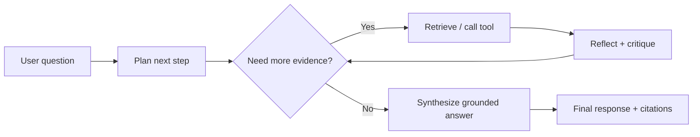

# Lesson 1-7: Understanding Agentic RAG

> Student follow-along resources, key concepts, and references for this sublesson.

## Overview

Agentic RAG extends classic retrieval pipelines by adding an agent loop that can plan, decide which tools to call, iterate retrieval, critique intermediate outputs, and stop when confidence is sufficient. Instead of a single "retrieve then generate" pass, agentic systems can decompose complex questions, gather evidence from multiple sources, and verify their answers before returning results.

## Learning objectives

By the end of this sublesson you should be able to:

- Explain how agentic RAG differs from standard one-pass RAG.
- Describe planner, retriever, tool-caller, and verifier roles in an agentic workflow.
- Identify cases where multi-step retrieval materially improves answer quality.
- Recognize risks such as runaway loops, tool misuse, and prompt-injection propagation.
- Define guardrails for reliable and auditable agentic retrieval.

## Key concepts

### 1. Standard RAG vs agentic RAG

In standard RAG, retrieval usually happens once. In agentic RAG, retrieval can be iterative and conditional.

### 2. Core components in an agentic loop

- **Planner** — breaks the task into sub-questions.
- **Retriever/tool router** — decides which index, source, or API to query.
- **Reasoner** — integrates evidence and tracks what is still unknown.
- **Verifier/reflection step** — checks evidence quality and consistency before final output.

### 3. When agentic RAG is worth the complexity

Good use cases:

- Multi-hop questions spanning many documents.
- Incident response and operations triage with evolving evidence.
- Enterprise assistants that must combine policies, tickets, and live system signals.

Less suitable:

- Simple FAQ retrieval where one-shot RAG is already accurate.
- Strict low-latency workloads where iterative loops are too expensive.

### 4. Risks and controls

Main risks:

- Infinite or long loops with little quality gain.
- Prompt injection from retrieved content.
- Tool overreach (querying systems beyond intended scope).
- Unverifiable final answers.

Baseline controls:

- Max iterations / timeout budgets.
- Tool allow-lists and schema-validated function calls.
- Retrieval sanitization and content trust labels.
- Mandatory citations plus confidence/uncertainty signaling.

## Why it matters / What's next

Agentic RAG is how teams handle harder questions that require planning, not just lookup. It can dramatically improve coverage on complex tasks, but only when paired with strict controls and evaluation. Next, **Lesson 1-8: Vector Databases and Embedding Models** dives deeper into the retrieval substrate that both standard and agentic RAG depend on.

## Glossary

- **Agentic RAG** — RAG with an autonomous planning-and-tool-use loop.
- **Multi-hop retrieval** — Retrieving and connecting evidence across multiple steps or sources.
- **Tool calling** — Structured invocation of external tools/APIs by an LLM.
- **Reflection** — Self-critique or verification pass before final answer.
- **Guardrail** — Runtime constraint that limits unsafe or unreliable model behavior.

## Quick self-check

1. What is one concrete benefit of agentic RAG over one-pass RAG?
2. Which guardrails prevent agent loops from becoming expensive or unsafe?
3. Why can prompt injection be more dangerous in agentic pipelines?
4. When should you deliberately choose non-agentic RAG instead?

## References and further reading

- [LlamaIndex: Agentic RAG With LlamaIndex](https://www.llamaindex.ai/blog/agentic-rag-with-llamaindex-2721b8a49ff6)
- [LlamaIndex: Agentic Retrieval Guide](https://www.llamaindex.ai/blog/rag-is-dead-long-live-agentic-retrieval)
- [Agentic Retrieval-Augmented Generation: Survey (arXiv)](https://arxiv.org/abs/2501.09136)
- [Google Cloud: Design Patterns for Agentic AI Systems](https://cloud.google.com/architecture/choose-design-pattern-agentic-ai-system)
- [LangGraph Documentation](https://langchain-ai.github.io/langgraph/)
