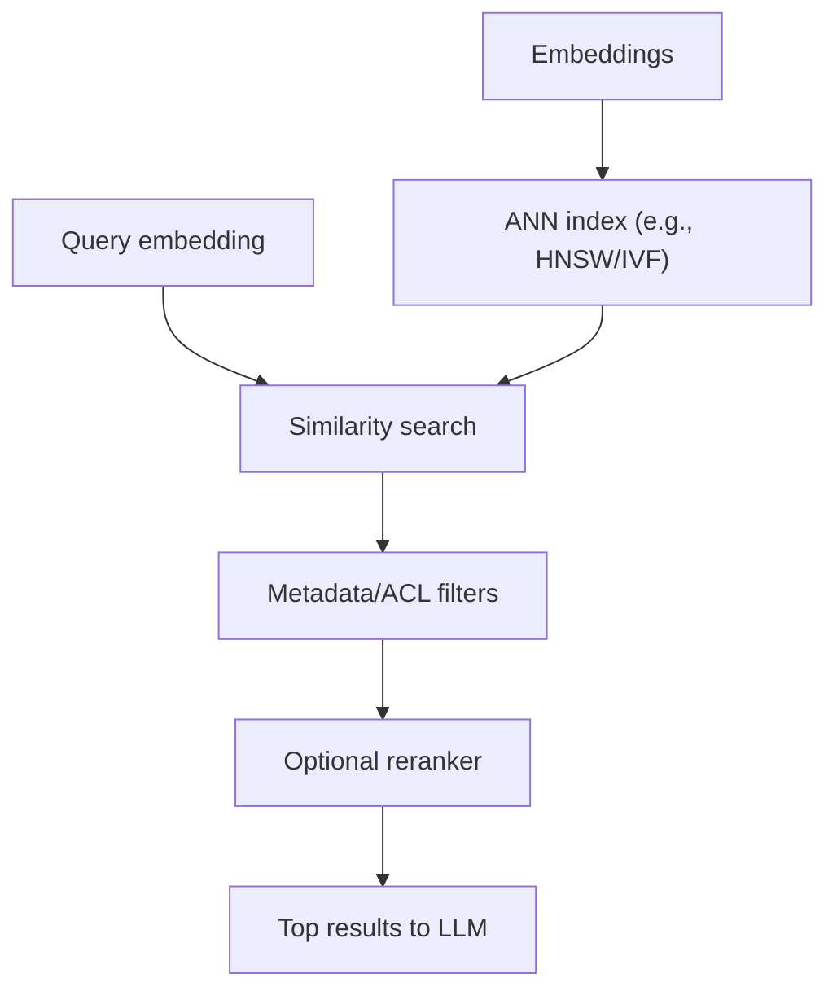

# Lesson 1-8: Vector Databases and Embedding Models

> Student follow-along resources, key concepts, and references for this sublesson.

## Overview

Embedding models and vector databases form the retrieval backbone of modern AI applications. Embeddings convert unstructured content into vectors; vector databases index those vectors for fast semantic search. This sublesson focuses on how to choose embedding models, how vector index design affects quality and latency, and what to measure when operating retrieval in production.

## Learning objectives

By the end of this sublesson you should be able to:

- Explain how embedding model quality influences downstream retrieval accuracy.
- Compare cosine similarity, dot product, and Euclidean distance in practical retrieval.
- Describe common vector indexing approaches (for example HNSW) and their trade-offs.
- Choose an embedding/vector stack based on data scale, latency, and filtering needs.
- Define an evaluation workflow for retrieval quality and system performance.

## Key concepts

### 1. Embedding model selection

Selection criteria should include:

- **Task fit** (semantic search, clustering, reranking pipeline compatibility).
- **Domain/language fit** (general text vs legal, medical, code, multilingual corpora).
- **Dimension and storage footprint** (higher dimensions can improve signal but raise cost).
- **Serving constraints** (throughput, batching, latency, and provider lock-in concerns).

Use public benchmarks as a starting point, then validate on your own dataset.

### 2. Vector database internals that matter in practice

Practical concerns:

- ANN parameters tune recall vs latency.
- Metadata filters are critical for multi-tenant and policy-safe retrieval.
- Reindex strategies affect freshness and ingestion cost.

### 3. Similarity metrics and consistency

- **Cosine similarity** is common for normalized semantic vectors.
- **Dot product** is often used with provider defaults and large-scale ANN engines.
- **L2/Euclidean** can work well depending on model training objective.

Whichever metric you choose, maintain consistency across indexing, querying, and benchmarking.

### 4. Evaluation and observability

Evaluate two layers separately:

1. **Retrieval quality** (recall@k, precision@k, nDCG, hit rate on gold passages).
2. **System performance** (p95 latency, QPS throughput, index memory, ingestion lag).

In production, monitor retrieval drift when documents, user behavior, or embedding models change.

## Why it matters / What's next

Even the best LLM cannot answer correctly if retrieval surfaces weak context. Choosing the right embedding model and vector database is therefore a first-order product decision, not just infrastructure plumbing. This closes Lesson 1's foundational path from model basics to practical AI system design.

## Glossary

- **Embedding model** — Model that maps text (or other modalities) into dense vectors.
- **Vector index** — Data structure optimized for nearest-neighbor lookup.
- **HNSW** — Graph-based ANN indexing method widely used for fast high-recall search.
- **Recall@k** — Fraction of relevant items found in top-k retrieved results.
- **nDCG** — Ranking quality metric that rewards relevant items appearing higher in results.
- **Retrieval drift** — Gradual retrieval quality degradation as data/distribution changes.

## Quick self-check

1. Why can a strong embedding model still perform poorly with the wrong index settings?
2. What is the practical difference between recall@k and latency metrics?
3. When would metadata filtering be mandatory, not optional?
4. Why should benchmark winners still be tested on your own corpus before adoption?

## References and further reading

- [MTEB Benchmark Repository](https://github.com/embeddings-benchmark/mteb)
- [MTEB Leaderboard (Hugging Face)](https://huggingface.co/spaces/mteb/leaderboard)
- [OpenAI Embeddings Guide](https://developers.openai.com/api/docs/guides/embeddings)
- [NVIDIA: What is a Vector Database?](https://www.nvidia.com/en-us/glossary/vector-database/)
- [Milvus: What Is a Vector Database?](https://milvus.io/blog/what-is-a-vector-database.md)
- [Qdrant Documentation](https://qdrant.tech/documentation/)
