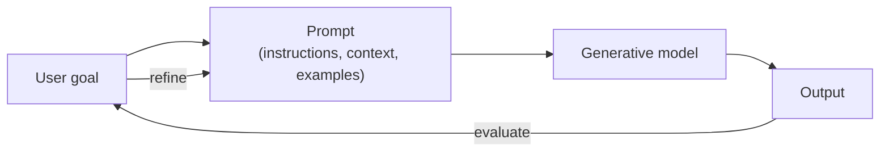

# Lesson 2-1: Introduction to Prompt Engineering

> Student follow-along resources, key concepts, and references for this sublesson.

## Overview

Prompt engineering is the art and science of crafting inputs to a generative AI system so that the system reliably produces the outputs you actually want. The same model can give you a vague, generic answer or a precise, useful one depending on how you ask. As of 2025–2026, the field has matured from "magic phrases" into a disciplined practice in which prompts are treated like small programs: written, versioned, tested, and iterated against measurable criteria. This sublesson sets the foundation for the rest of Lesson 2 by defining prompt engineering, explaining why it matters, and previewing the principles, techniques, and security topics that follow.

## Learning objectives

By the end of this sublesson you should be able to:

- Define prompt engineering and explain why prompt quality drives output quality.
- Distinguish a good prompt from a poor one in terms of clarity, context, structure, and examples.
- Identify the four key dimensions practitioners use to judge prompts: accuracy/faithfulness, reasoning/robustness, cost/latency, and controllability.
- Describe why prompt engineering has become a core professional skill across business workflows.
- Outline the topics that the rest of Lesson 2 will cover: principles and patterns, techniques, prompt injection attacks, and defensive prompting.

## Key concepts

### 1. What prompt engineering actually is

A "prompt" is the instruction (and any supporting context, examples, or data) that you send to a generative model. "Prompt engineering" is the deliberate, repeatable process of designing those inputs so the model's outputs are useful, correct, and on-brand.

Concretely, a well-engineered prompt usually does four things:

- States the **goal** clearly (what task, for whom, in what format, at what length).
- Provides **context** the model would not otherwise know (background, constraints, audience, source material).
- Imposes **structure** the model should follow (sections, JSON schema, bullet list, tone).
- When useful, shows **examples** of the desired input/output pattern (few-shot).

In 2025–2026, vendor documentation from OpenAI, Anthropic, Google, and IBM increasingly frames prompts as **specifications** or **contracts** with the model — written assets that define the task, success criteria, constraints, and output format precisely enough to be tested.

### 2. Why prompt quality drives output quality

Generative models do not "understand" intent the way a human colleague does. They predict the most likely continuation of the text you give them, conditioned on everything in their context window. Small changes in wording, ordering, or framing therefore produce large changes in output. This is why two practitioners using the same model can get dramatically different quality from the same use case.

The loop matters as much as the prompt. Modern practice is iterative: draft a prompt, run it on representative inputs, evaluate the output against your criteria, refine, and retest.

### 3. The four dimensions of prompt quality

When teams evaluate prompts in production, they typically score them along four axes:

| Dimension | What it measures | Example questions |
| --- | --- | --- |
| Accuracy / faithfulness | Does the output match the intended task and ground truth? | Is it factually correct? Did it follow the instructions? |
| Reasoning / robustness | Does the prompt hold up across edge cases and adversarial inputs? | Does it still work on long, messy, or hostile inputs? |
| Cost / latency | How many tokens does it consume and how fast does it respond? | Can the same result be achieved with a shorter prompt or smaller model? |
| Controllability | How reliably can you steer tone, format, and scope? | Can you guarantee JSON, a 200-word limit, or a specific persona? |

Treating prompts as engineered artifacts means tracking these dimensions, not just judging "feel."

### 4. Prompt engineering as a professional skill

As generative AI is embedded in business workflows — drafting documents, summarizing meetings, classifying tickets, generating code, querying data — the ability to write effective prompts is now a core practitioner skill, not a niche specialty. It is increasingly expected of analysts, engineers, designers, marketers, and security professionals, not just AI specialists.

The remainder of Lesson 2 builds on this foundation:

- **Lesson 2-2:** Principles and patterns — roles, instructions, and constraints.
- **Lesson 2-3:** Techniques — iterative, sequential, chained, few-shot, and chain-of-thought prompting, plus image and audio prompting.
- **Lesson 2-4:** Prompt injection attack types — direct and indirect attacks against LLM applications.
- **Lesson 2-5:** Defensive prompting and error mitigation — hardening prompts and reducing hallucinations.
- **Lessons 2-6 through 2-8:** Industry resources — OWASP GenAI Security Project, Coalition for Secure AI (CoSAI), and MITRE ATLAS.

## Why it matters / What's next

Prompt engineering is the practical bridge between a powerful model and a trustworthy product. Without it, you get inconsistent, hard-to-control outputs that are unsafe to ship. With it, you can build assistants, copilots, and pipelines that behave predictably and can be audited and improved. Lesson 2-2 will move from "what is prompt engineering" into the three patterns you will use most often in real prompts: roles, instructions, and constraints.

## Glossary

- **Prompt** — The text (and optional context, examples, or data) sent to a generative model to elicit an output.
- **Prompt engineering** — The disciplined practice of designing, testing, and iterating prompts so that a model's outputs are accurate, robust, and controllable.
- **Context window** — The total amount of text (measured in tokens) that a model can attend to at once, including system prompt, user input, retrieved data, and prior turns.
- **System prompt** — The trusted instruction set placed at the start of a conversation that governs the model's role and behavior.
- **Iterative refinement** — The practice of running a prompt, inspecting the output, and adjusting the prompt repeatedly until quality is acceptable.
- **Controllability** — The degree to which a prompt reliably produces outputs in the desired format, tone, and scope.
- **Hallucination** — A confidently stated but false or unsupported claim produced by a generative model. Covered in detail in Lesson 2-5.
- **Prompt injection** — An attack in which malicious instructions are inserted into the model's input to override the developer's instructions. Covered in Lesson 2-4.

## Quick self-check

1. In one sentence, define prompt engineering in your own words.
2. Name three things a well-engineered prompt typically contains.
3. Why can the same model produce very different quality of output for two different practitioners?
4. List the four dimensions teams use to evaluate prompt quality.
5. Which Lesson 2 sublesson would you go to if you wanted to learn about indirect prompt injection?

## References and further reading

- OpenAI — *Prompt engineering (API guide).* https://platform.openai.com/docs/guides/prompt-engineering
- OpenAI Help Center — *Best practices for prompt engineering with the OpenAI API.* https://help.openai.com/en/articles/6654000-best-practices-for-prompt-engineering-with-the-openai-api
- OpenAI Help Center — *Prompt engineering best practices for ChatGPT.* https://help.openai.com/en/articles/10032626-prompt-engineering-best-practices-for-chatgpt
- Anthropic — *Prompt engineering overview (Claude documentation).* https://docs.anthropic.com/en/docs/build-with-claude/prompt-engineering/overview
- Google Cloud — *Introduction to prompt design (Vertex AI).* https://cloud.google.com/vertex-ai/generative-ai/docs/learn/introduction-prompt-design
- Google Cloud — *Prompt engineering for AI guide.* https://cloud.google.com/discover/what-is-prompt-engineering
- IBM — *What is prompt engineering?* https://www.ibm.com/think/topics/prompt-engineering
- IBM — *The 2026 guide to prompt engineering.* https://www.ibm.com/think/prompt-engineering
- Lakera — *The ultimate guide to prompt engineering in 2026.* https://www.lakera.ai/blog/prompt-engineering-guide
- Coursera — *What is prompt engineering? And how to write effective prompts.* https://www.coursera.org/articles/what-is-prompt-engineering
- OWASP GenAI Security Project — *Home (LLM01:2025 Prompt Injection and related resources).* https://genai.owasp.org/

### Omar's resources and references (course-wide)

#### Foundational cybersecurity resources in O'Reilly

This section provides a curated list of resources that delve into foundational cybersecurity concepts, frequently explored in O'Reilly training sessions and other educational offerings.

##### Live training

- **Upcoming Live Cybersecurity and AI Training in O'Reilly:** [Register before it is too late](https://learning.oreilly.com/search/?q=omar%20santos&type=live-course&rows=100&language_with_transcripts=en) (free with O'Reilly Subscription)

##### Reading list

Despite the rapidly evolving landscape of AI and technology, these books offer a comprehensive roadmap for understanding the intersection of these technologies with cybersecurity:

- **[NEW: Agentic AI for Cybersecurity: Building Autonomous Defenders and Adversaries](https://www.oreilly.com/library/view/agentic-ai-for/9780135589861/).** Unlock the power of next generation AI agents to transform cybersecurity, business operations, and productivity. [Available on O'Reilly](https://www.oreilly.com/library/view/agentic-ai-for/9780135589861/)

- **[Redefining Hacking](https://learning.oreilly.com/library/view/redefining-hacking-a/9780138363635/)** — A Comprehensive Guide to Red Teaming and Bug Bounty Hunting in an AI-driven World. [Available on O'Reilly](https://learning.oreilly.com/library/view/redefining-hacking-a/9780138363635/)

- **[AI-Powered Digital Cyber Resilience](https://www.oreilly.com/library/view/ai-powered-digital-cyber/9780135408599/)** — A practical guide to building intelligent, AI-powered cyber defenses in today's fast-evolving threat landscape. [Available on O'Reilly](https://www.oreilly.com/library/view/ai-powered-digital-cyber/9780135408599/)

- **[Developing Cybersecurity Programs and Policies in an AI-Driven World](https://learning.oreilly.com/library/view/developing-cybersecurity-programs/9780138073992)** — Explore strategies for creating robust cybersecurity frameworks in an AI-centric environment. [Available on O'Reilly](https://learning.oreilly.com/library/view/developing-cybersecurity-programs/9780138073992)

- **[Beyond the Algorithm: AI, Security, Privacy, and Ethics](https://learning.oreilly.com/library/view/beyond-the-algorithm/9780138268442)** — Gain insights into the ethical and security challenges posed by AI technologies. [Available on O'Reilly](https://learning.oreilly.com/library/view/beyond-the-algorithm/9780138268442)

- **[The AI Revolution in Networking, Cybersecurity, and Emerging Technologies](https://learning.oreilly.com/library/view/the-ai-revolution/9780138293703)** — Understand how AI is transforming networking and cybersecurity landscape. [Available on O'Reilly](https://learning.oreilly.com/library/view/the-ai-revolution/9780138293703)

##### Video courses

Enhance your practical skills with these video courses designed to deepen your understanding of cybersecurity:

- **[Building the Ultimate Cybersecurity Lab and Cyber Range](https://learning.oreilly.com/course/building-the-ultimate/9780138319090/)** (video). [Available on O'Reilly](https://learning.oreilly.com/course/building-the-ultimate/9780138319090/)

- **[Build Your Own AI Lab](https://learning.oreilly.com/course/build-your-own/9780135439616)** (video) — Hands-on guide to home and cloud-based AI labs. Learn to set up and optimize labs to research and experiment in a secure environment. [Available on O'Reilly](https://learning.oreilly.com/course/build-your-own/9780135439616)

- **[Defending and Deploying AI](https://www.oreilly.com/videos/defending-and-deploying/9780135463727/)** (video) — Comprehensive, hands-on journey into modern AI applications for technology and security professionals, covering AI-enabled programming, networking, and cybersecurity; securing generative AI (LLM security, prompt injection, red-teaming); secure AI labs; AI agents and agentic RAG for cybersecurity. [Available on O'Reilly](https://www.oreilly.com/videos/defending-and-deploying/9780135463727/)

- **[AI-Enabled Programming, Networking, and Cybersecurity](https://learning.oreilly.com/course/ai-enabled-programming-networking/9780135402696/)** — Learn to use AI for cybersecurity, networking, and programming tasks with practical, hands-on activities. [Available on O'Reilly](https://learning.oreilly.com/course/ai-enabled-programming-networking/9780135402696/)

- **[Securing Generative AI](https://learning.oreilly.com/course/securing-generative-ai/9780135401804/)** — Security for deploying and developing AI applications, RAG, agents, and other AI implementations; incorporate security at every stage of AI development, deployment, and operation. [Available on O'Reilly](https://learning.oreilly.com/course/securing-generative-ai/9780135401804/)

- **[Practical Cybersecurity Fundamentals](https://learning.oreilly.com/course/practical-cybersecurity-fundamentals/9780138037550/)** — Essential cybersecurity principles. [Available on O'Reilly](https://learning.oreilly.com/course/practical-cybersecurity-fundamentals/9780138037550/)

- **[The Art of Hacking](https://theartofhacking.org)** — Over 26 hours of training in ethical hacking and penetration testing (e.g., OSCP or CEH prep). [Visit The Art of Hacking](https://theartofhacking.org)

##### Certification related

- **CompTIA PenTest+ PT0-002 Cert Guide, 2nd Edition** — [Available on O'Reilly](https://learning.oreilly.com/library/view/comptia-pentest-pt0-002/9780137566204/)

- **Certified Ethical Hacker (CEH), Latest Edition** — Very comprehensive (19+ hours). [Available on O'Reilly](https://learning.oreilly.com/course/certified-ethical-hacker/9780135395646/)

- **Certified in Cybersecurity - CC (ISC)²** — [Available on O'Reilly](https://learning.oreilly.com/course/certified-in-cybersecurity/9780138230364/)

- **CCNP and CCIE Security Core SCOR 350-701 Official Cert Guide, 2nd Edition** — [Available on O'Reilly](https://learning.oreilly.com/library/view/ccnp-and-ccie/9780138221287/)

- **CEH Certified Ethical Hacker Cert Guide** — [Available on O'Reilly](https://learning.oreilly.com/library/view/ceh-certified-ethical/9780137489930/)

##### Additional resources

- **Hacking Scenarios (Labs) on O'Reilly** — Cloud-based labs; no local install. [https://hackingscenarios.com](https://hackingscenarios.com)

- **Personal blog** — [becomingahacker.org](https://becomingahacker.org)

- **Cisco blog** — [blogs.cisco.com/author/omarsantos](https://blogs.cisco.com/author/omarsantos)

- **GitHub repository** — [hackerrepo.org](https://hackerrepo.org)

- **WebSploit Labs** — [websploit.org](https://websploit.org)

- **NetAcad Ethical Hacker Free Course** — [NetAcad Skills for All](https://www.netacad.com/courses/ethical-hacker?courseLang=en-US)
