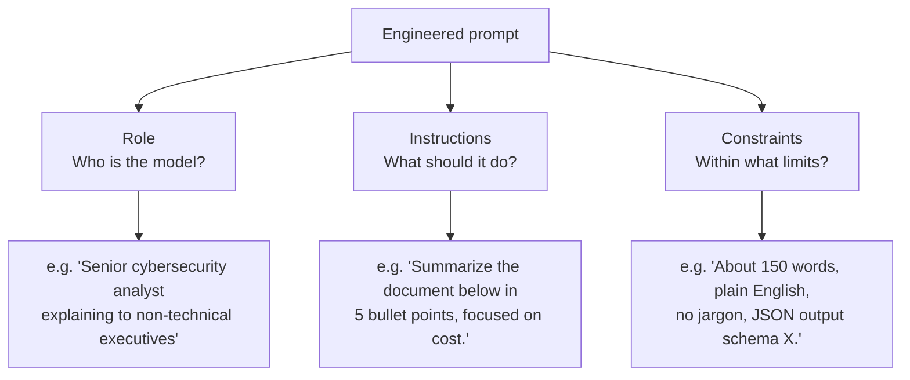

# Lesson 2-2: Prompt Engineering Principles and Patterns

> Student follow-along resources, key concepts, and references for this sublesson.

## Overview

Once you accept that prompts are engineered artifacts, the next question is what to put in them. Across vendor documentation from OpenAI, Anthropic, Google, and IBM, three patterns appear repeatedly: **roles** (who the model should act as), **instructions** (what it should do), and **constraints** (the limits within which it should do it). This sublesson explains each pattern, shows how to combine them, and introduces a structured prompt template (the GOLDEN framework) that practitioners use to make prompts self-contained, repeatable, and verifiable.

## Learning objectives

By the end of this sublesson you should be able to:

- Apply role-based prompting to give a model a consistent voice and domain expertise.
- Write clear, specific instructions and place them where the model will follow them best.
- Use delimiters to separate instructions from context or user-supplied data.
- Express constraints positively (what to do) rather than negatively (what not to do).
- Use a structured template such as GOLDEN to make prompts self-contained and easier to evaluate.

## Key concepts

### 1. The three core patterns



These three patterns are largely independent and stack well: a single high-quality prompt typically uses all three.

### 2. Role-based prompting

Telling the model **who it is** shapes its tone, vocabulary, and what it emphasizes — without fine-tuning. A role can be a job title, an expertise area, a personality, or a perspective.

Examples:

- "You are an experienced cybersecurity analyst explaining concepts to non-technical executives."
- "You are a strict copy editor enforcing the AP Stylebook."
- "You are a senior backend engineer reviewing a pull request for correctness and security."

Role prompting is most useful when you need:

- **A consistent voice** across many outputs (e.g., a brand or product persona).
- **Domain framing** that pulls the model toward the right vocabulary and concerns.
- **Audience calibration** so the model adjusts depth and language for the reader.

In API usage, the role typically lives in the **system message**, which is the most trusted slot in the prompt and the one models are trained to follow most strongly.

### 3. Clear instructions

Vague prompts get vague answers. Compare:

- Weak: "Write something about cloud computing."
- Strong: "Write a 300-word summary of how cloud computing has changed enterprise data storage, focusing on cost and scalability, for a business audience."

Three rules consistently improve instruction quality:

1. **Be specific about task, audience, format, and length.** Specify the verb (summarize, classify, extract, draft), the audience, the output format (Markdown, JSON, table, bullets), and a length target.
2. **Put main instructions early.** OpenAI and other vendors note that models attend more strongly to instructions placed near the beginning of the prompt; long prompts that bury the ask at the end are less reliable.
3. **Use delimiters.** Separate instructions from data (user content, retrieved documents, examples) using clearly distinguishable markers. This both helps the model parse the prompt and reduces susceptibility to prompt injection (see Lesson 2-4).

Common delimiter conventions:

| Delimiter | Typical use |
| --- | --- |
| Triple backticks ```` ``` ```` | Code blocks or large text payloads |
| Triple quotes `"""` | Pasted user content or document text |
| Triple hashes `###` | Section headers (e.g., `### Instructions`, `### Context`) |
| XML-style tags (`<context>...</context>`) | Anthropic-style structured prompts; works well across vendors |

### 4. Constraints — say what to do, not just what to avoid

Models follow positive constraints more reliably than negative ones. "Use simple, everyday language" outperforms "Don't use jargon." "Provide a response of about 150 words" outperforms "Don't write too much."

Useful constraint dimensions to specify explicitly:

- **Length** (word count, bullet count, paragraph count, JSON object size).
- **Format** (Markdown, JSON schema, table, headed sections, plain text).
- **Tone and audience** (formal, casual, executive, technical, beginner-friendly).
- **Scope** (topics in scope and explicitly out of scope; what to do if a question is out of scope).
- **Behavioral guardrails** (when to refuse, when to ask a clarifying question, when to defer).

In production systems, constraints also enforce **safety boundaries** — what the assistant can and cannot do, when to escalate, what data it must not reveal.

### 5. A structured template: the GOLDEN framework

Rather than writing prompts free-form, many 2025–2026 practitioners use a template that names each section. One common template is **GOLDEN**:

| Letter | Section | What it specifies |
| --- | --- | --- |
| G | **Goal** | The single, concrete task the model is being asked to perform. |
| O | **Output format** | The exact shape of the response (Markdown, JSON schema, table, bullet list, length). |
| L | **Limits** | Constraints on tone, scope, audience, and forbidden behaviors. |
| D | **Data / context** | The source material, retrieved documents, or background facts the model needs. |
| E | **Evaluation criteria** | How a good response will be judged (correctness, faithfulness, clarity). |
| N | **Next steps / alternatives** | What the model should do if it cannot complete the task or needs clarification. |

GOLDEN is one of several similar frameworks (others include CRISPE and the OpenAI "Goal / Format / Examples" pattern). The exact letters matter less than the discipline: name the slots, fill them in, and treat the resulting prompt as a versioned artifact.

### 6. Putting it together

A prompt that uses all three patterns plus a structured template might look like:

```text
### Role
You are an experienced cybersecurity analyst explaining technical findings to
non-technical executives.

### Goal
Summarize the penetration-test report below into a one-page executive briefing.

### Output format
- A 3-sentence "What happened" paragraph.
- A bulleted "Top 3 risks" list, each with a 1-sentence business impact.
- A bulleted "Recommended next steps" list, each starting with an action verb.

### Limits
- About 250 words total.
- Plain English; no security jargon without a 1-line definition.
- Do not mention vendors or pricing.

### Data
"""
<paste of the report here>
"""

### If you cannot complete the task
Return the single line: NEEDS_MORE_CONTEXT.
```

This kind of prompt is easier to test, reuse, and improve than a free-form paragraph.

## Why it matters / What's next

Roles, instructions, and constraints are the "load-bearing walls" of every effective prompt — they apply to chatbots, RAG pipelines, agentic workflows, and image/audio generation alike. Lesson 2-3 will build on these patterns by introducing **techniques** that change how the model thinks about the task: iterative and sequential prompting, chaining, few-shot, and chain-of-thought.

## Glossary

- **Role / persona** — A statement of who the model is acting as, used to shape tone and expertise.
- **System message / system prompt** — The trusted, top-of-context instruction slot that governs model behavior.
- **Instruction** — A directive telling the model what to do (the verb, audience, format, and length of the output).
- **Constraint** — A limit on tone, scope, length, format, or behavior; ideally phrased positively.
- **Delimiter** — A marker (triple backticks, triple quotes, XML tags) that separates instructions from data.
- **Few-shot example** — An input/output pair included in the prompt to demonstrate the desired pattern.
- **GOLDEN framework** — A structured prompt template covering Goal, Output format, Limits, Data/context, Evaluation criteria, and Next steps.
- **Spotlighting / input isolation** — A defensive technique (covered in Lesson 2-5) that uses delimiters and explicit instructions to keep the model from treating user data as commands.

## Quick self-check

1. Write a one-sentence role statement that would steer a model to act as a "patient diabetes educator for newly diagnosed adults."
2. Rewrite "Don't be too long and don't use jargon" as two positive constraints.
3. Where in the prompt should the most important instructions usually go, and why?
4. Name two delimiter conventions and one reason delimiters matter beyond formatting.
5. List the six slots in the GOLDEN framework.

## References and further reading

- OpenAI — *Prompt engineering (API guide).* https://platform.openai.com/docs/guides/prompt-engineering
- OpenAI Help Center — *Best practices for prompt engineering with the OpenAI API.* https://help.openai.com/en/articles/6654000-best-practices-for-prompt-engineering-with-the-openai-api
- OpenAI Developers — *GPT-4.1 prompting guide (cookbook).* https://cookbook.openai.com/examples/gpt4-1_prompting_guide
- Anthropic — *Prompt engineering overview (Claude docs).* https://docs.anthropic.com/en/docs/build-with-claude/prompt-engineering/overview
- Anthropic — *Use XML tags to structure your prompts.* https://docs.anthropic.com/en/docs/build-with-claude/prompt-engineering/use-xml-tags
- Google Cloud — *Introduction to prompting (Vertex AI).* https://cloud.google.com/vertex-ai/generative-ai/docs/learn/prompts/introduction-prompt-design
- IBM — *The 2026 guide to prompt engineering.* https://www.ibm.com/think/prompt-engineering
- LaunchDarkly — *Prompt engineering best practices: tutorial and examples.* https://launchdarkly.com/blog/prompt-engineering-best-practices/
- Lakera — *The ultimate guide to prompt engineering in 2026.* https://www.lakera.ai/blog/prompt-engineering-guide
- Jon Bishop — *An entire post about delimiters in AI prompts.* https://jonbishop.com/an-entire-post-about-delimiters-in-ai-prompts/

### Omar's resources and references (course-wide)

#### Foundational cybersecurity resources in O'Reilly

This section provides a curated list of resources that delve into foundational cybersecurity concepts, frequently explored in O'Reilly training sessions and other educational offerings.

##### Live training

- **Upcoming Live Cybersecurity and AI Training in O'Reilly:** [Register before it is too late](https://learning.oreilly.com/search/?q=omar%20santos&type=live-course&rows=100&language_with_transcripts=en) (free with O'Reilly Subscription)

##### Reading list

Despite the rapidly evolving landscape of AI and technology, these books offer a comprehensive roadmap for understanding the intersection of these technologies with cybersecurity:

- **[NEW: Agentic AI for Cybersecurity: Building Autonomous Defenders and Adversaries](https://www.oreilly.com/library/view/agentic-ai-for/9780135589861/).** Unlock the power of next generation AI agents to transform cybersecurity, business operations, and productivity. [Available on O'Reilly](https://www.oreilly.com/library/view/agentic-ai-for/9780135589861/)

- **[Redefining Hacking](https://learning.oreilly.com/library/view/redefining-hacking-a/9780138363635/)** — A Comprehensive Guide to Red Teaming and Bug Bounty Hunting in an AI-driven World. [Available on O'Reilly](https://learning.oreilly.com/library/view/redefining-hacking-a/9780138363635/)

- **[AI-Powered Digital Cyber Resilience](https://www.oreilly.com/library/view/ai-powered-digital-cyber/9780135408599/)** — A practical guide to building intelligent, AI-powered cyber defenses in today's fast-evolving threat landscape. [Available on O'Reilly](https://www.oreilly.com/library/view/ai-powered-digital-cyber/9780135408599/)

- **[Developing Cybersecurity Programs and Policies in an AI-Driven World](https://learning.oreilly.com/library/view/developing-cybersecurity-programs/9780138073992)** — Explore strategies for creating robust cybersecurity frameworks in an AI-centric environment. [Available on O'Reilly](https://learning.oreilly.com/library/view/developing-cybersecurity-programs/9780138073992)

- **[Beyond the Algorithm: AI, Security, Privacy, and Ethics](https://learning.oreilly.com/library/view/beyond-the-algorithm/9780138268442)** — Gain insights into the ethical and security challenges posed by AI technologies. [Available on O'Reilly](https://learning.oreilly.com/library/view/beyond-the-algorithm/9780138268442)

- **[The AI Revolution in Networking, Cybersecurity, and Emerging Technologies](https://learning.oreilly.com/library/view/the-ai-revolution/9780138293703)** — Understand how AI is transforming networking and cybersecurity landscape. [Available on O'Reilly](https://learning.oreilly.com/library/view/the-ai-revolution/9780138293703)

##### Video courses

Enhance your practical skills with these video courses designed to deepen your understanding of cybersecurity:

- **[Building the Ultimate Cybersecurity Lab and Cyber Range](https://learning.oreilly.com/course/building-the-ultimate/9780138319090/)** (video). [Available on O'Reilly](https://learning.oreilly.com/course/building-the-ultimate/9780138319090/)

- **[Build Your Own AI Lab](https://learning.oreilly.com/course/build-your-own/9780135439616)** (video) — Hands-on guide to home and cloud-based AI labs. Learn to set up and optimize labs to research and experiment in a secure environment. [Available on O'Reilly](https://learning.oreilly.com/course/build-your-own/9780135439616)

- **[Defending and Deploying AI](https://www.oreilly.com/videos/defending-and-deploying/9780135463727/)** (video) — Comprehensive, hands-on journey into modern AI applications for technology and security professionals, covering AI-enabled programming, networking, and cybersecurity; securing generative AI (LLM security, prompt injection, red-teaming); secure AI labs; AI agents and agentic RAG for cybersecurity. [Available on O'Reilly](https://www.oreilly.com/videos/defending-and-deploying/9780135463727/)

- **[AI-Enabled Programming, Networking, and Cybersecurity](https://learning.oreilly.com/course/ai-enabled-programming-networking/9780135402696/)** — Learn to use AI for cybersecurity, networking, and programming tasks with practical, hands-on activities. [Available on O'Reilly](https://learning.oreilly.com/course/ai-enabled-programming-networking/9780135402696/)

- **[Securing Generative AI](https://learning.oreilly.com/course/securing-generative-ai/9780135401804/)** — Security for deploying and developing AI applications, RAG, agents, and other AI implementations; incorporate security at every stage of AI development, deployment, and operation. [Available on O'Reilly](https://learning.oreilly.com/course/securing-generative-ai/9780135401804/)

- **[Practical Cybersecurity Fundamentals](https://learning.oreilly.com/course/practical-cybersecurity-fundamentals/9780138037550/)** — Essential cybersecurity principles. [Available on O'Reilly](https://learning.oreilly.com/course/practical-cybersecurity-fundamentals/9780138037550/)

- **[The Art of Hacking](https://theartofhacking.org)** — Over 26 hours of training in ethical hacking and penetration testing (e.g., OSCP or CEH prep). [Visit The Art of Hacking](https://theartofhacking.org)

##### Certification related

- **CompTIA PenTest+ PT0-002 Cert Guide, 2nd Edition** — [Available on O'Reilly](https://learning.oreilly.com/library/view/comptia-pentest-pt0-002/9780137566204/)

- **Certified Ethical Hacker (CEH), Latest Edition** — Very comprehensive (19+ hours). [Available on O'Reilly](https://learning.oreilly.com/course/certified-ethical-hacker/9780135395646/)

- **Certified in Cybersecurity - CC (ISC)²** — [Available on O'Reilly](https://learning.oreilly.com/course/certified-in-cybersecurity/9780138230364/)

- **CCNP and CCIE Security Core SCOR 350-701 Official Cert Guide, 2nd Edition** — [Available on O'Reilly](https://learning.oreilly.com/library/view/ccnp-and-ccie/9780138221287/)

- **CEH Certified Ethical Hacker Cert Guide** — [Available on O'Reilly](https://learning.oreilly.com/library/view/ceh-certified-ethical/9780137489930/)

##### Additional resources

- **Hacking Scenarios (Labs) on O'Reilly** — Cloud-based labs; no local install. [https://hackingscenarios.com](https://hackingscenarios.com)

- **Personal blog** — [becomingahacker.org](https://becomingahacker.org)

- **Cisco blog** — [blogs.cisco.com/author/omarsantos](https://blogs.cisco.com/author/omarsantos)

- **GitHub repository** — [hackerrepo.org](https://hackerrepo.org)

- **WebSploit Labs** — [websploit.org](https://websploit.org)

- **NetAcad Ethical Hacker Free Course** — [NetAcad Skills for All](https://www.netacad.com/courses/ethical-hacker?courseLang=en-US)
