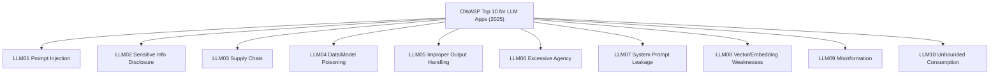

# Lesson 2-6: Exploring the OWASP Generative AI Security Resources

> Student follow-along resources, key concepts, and references for this sublesson.

## Overview

The Open Web Application Security Project (OWASP) is a globally recognized non-profit community that produces freely available resources on application security — most famously the OWASP Top 10 for web applications. In response to the rapid adoption of generative AI, OWASP launched the **OWASP GenAI Security Project** at **genai.owasp.org**. This sublesson introduces the project, walks through the **OWASP Top 10 for LLM Applications (2025)**, and highlights the additional resources (agentic Top 10, AIBOM, COMPASS, FinBot, solutions landscapes) that practitioners use to secure GenAI systems.

## Learning objectives

By the end of this sublesson you should be able to:

- Describe what OWASP is and what the OWASP GenAI Security Project produces.
- Recite the OWASP Top 10 for LLM Applications (2025) and explain why each risk made the list.
- Locate authoritative OWASP resources (project home, individual risk pages, resource archive).
- Compare the LLM Top 10 with newer agentic-AI guidance and explain when to use each.
- Map specific risks in your own systems to OWASP categories and mitigations.

## Key concepts

### 1. What OWASP is

The Open Web Application Security Project (OWASP) is an international non-profit dedicated to improving the security of software. OWASP publishes free, vendor-neutral articles, methodologies, documentation, tools, and standards. Its **Top 10** lists are widely used as baseline security checklists by engineering, security, and audit teams around the world.

### 2. The OWASP GenAI Security Project

The **OWASP GenAI Security Project** is OWASP's umbrella initiative for generative-AI security. Its home page at **https://genai.owasp.org/** aggregates:

- The **OWASP Top 10 for LLM Applications** (the original 2023 list, the v1.1 update, and the **2025** version).
- Newer Top 10s and frameworks for **agentic** AI applications.
- Practitioner guides, cheat sheets, vendor-neutral landscapes, and open-source tools.
- Working groups, mailing lists, and Slack channels open to contributors.

Like all OWASP projects, the resources are **free**, **community-maintained**, and **vendor-neutral**.

### 3. The OWASP Top 10 for LLM Applications (2025)

The 2025 list reflects two major shifts since the original release: more deployments are now in **production** rather than experimentation, and many of those deployments are **agentic** (the LLM uses tools, browses, retrieves, and acts).

| ID | Risk | One-line summary |
| --- | --- | --- |
| LLM01:2025 | Prompt Injection | Untrusted input alters the model's behavior or output (covered in Lesson 2-4). |
| LLM02:2025 | Sensitive Information Disclosure | The model leaks PII, secrets, or proprietary data via training, prompts, or retrieval. |
| LLM03:2025 | Supply Chain Vulnerabilities | Risks introduced by third-party models, datasets, fine-tunes, plugins, and dependencies. |
| LLM04:2025 | Data and Model Poisoning | Attackers corrupt training, fine-tuning, or retrieval data so the model behaves badly. |
| LLM05:2025 | Improper Output Handling | Application code blindly trusts model output, enabling XSS, SSRF, code injection, etc. |
| LLM06:2025 | Excessive Agency | The system grants the LLM more tools, permissions, or autonomy than the task requires. |
| LLM07:2025 | System Prompt Leakage | The confidential system prompt is exposed via injection, errors, or side channels. |
| LLM08:2025 | Vector and Embedding Weaknesses | Vulnerabilities in RAG pipelines: poisoned vectors, embedding inversion, retrieval abuse. |
| LLM09:2025 | Misinformation | Hallucinations, fabricated citations, and confidently wrong outputs that mislead users. |
| LLM10:2025 | Unbounded Consumption | Lack of cost, rate, or resource limits, enabling denial-of-wallet and DoS attacks. |

Each risk has its own dedicated page on **genai.owasp.org/llmrisk/** with a description, common examples, attack scenarios, and recommended mitigations. Treat these pages as the single most useful free reference for LLM application security.

### 4. Beyond the LLM Top 10

The OWASP GenAI Security Project also publishes targeted resources for the kinds of systems that go beyond a single chatbot:

- **OWASP Top 10 for Agentic Applications.** A separate Top 10 focused on the new risks that appear when models plan, call tools, and act autonomously — for example, agent goal hijacking, tool abuse, MCP risks, and identity/authorization issues.
- **AI Security Solutions Landscape.** Quarterly maps of the GenAI/agentic security tooling ecosystem, useful when choosing vendors or building an internal stack.
- **State of Agentic AI Security and Governance.** A report on emerging governance practices.
- **Threat Defense COMPASS.** A dashboard / runbook for consolidating threats, vulnerabilities, and mitigations across an organization.
- **AIBOM (AI Bill of Materials).** Open-source tooling and guidance to inventory the models, datasets, and components that make up an AI system, supporting LLM03 supply-chain controls.
- **FinBot.** A capture-the-flag style application for hands-on practice with agentic-AI risks.
- **Cheat sheets, exam vouchers, and educational programs.**

These resources sit on the project's **Resources Archive** at https://genai.owasp.org/resources/.

### 5. How to use OWASP resources in practice

Three concrete ways teams adopt OWASP GenAI guidance:

1. **As a checklist.** Map every component of your LLM application to the LLM01–LLM10 risks and document the controls you have in place for each.
2. **As a shared vocabulary.** Reference OWASP IDs (e.g., "LLM01," "LLM06") in design docs, threat models, and security reviews so engineers, security, and compliance teams use the same terms.
3. **As a procurement and audit baseline.** Ask vendors and internal teams how they address each OWASP category; require evidence (controls, evaluations, runbooks).

## Why it matters / What's next

OWASP gives you a free, widely understood baseline for LLM application security. It is the simplest place to start building a secure-AI program and the easiest way to align your engineering, security, and compliance teams around the same risks. Lesson 2-7 introduces a complementary initiative — the **Coalition for Secure AI (CoSAI)** — which provides open-source frameworks, design patterns, and tools for building secure AI systems by design.

## Glossary

- **OWASP** — The Open Web Application Security Project, an international non-profit publishing free application security guidance.
- **OWASP Top 10** — A periodically updated list of the most critical security risks in a given domain.
- **OWASP GenAI Security Project** — OWASP's umbrella project for generative-AI security; home at https://genai.owasp.org/.
- **OWASP Top 10 for LLM Applications (2025)** — The current top-ten list of risks specific to applications built with LLMs.
- **Agentic AI** — AI systems where a model plans, calls tools, retrieves data, and takes actions, often across multiple steps.
- **Excessive Agency (LLM06:2025)** — Granting an LLM more tools, scopes, or autonomy than the task requires.
- **Vector and Embedding Weaknesses (LLM08:2025)** — Security risks specific to retrieval and embedding pipelines, such as poisoned vectors and inversion attacks.
- **AIBOM** — An AI Bill of Materials, listing the models, datasets, fine-tunes, and components of an AI system for supply-chain transparency.
- **MCP (Model Context Protocol)** — A protocol for connecting LLMs to external tools and data sources; brings new risks tracked in OWASP agentic guidance.

## Quick self-check

1. Where is the OWASP GenAI Security Project's home page, and what kinds of resources does it host?
2. List the OWASP Top 10 for LLM Applications (2025) IDs and a one-line description of each.
3. Which OWASP risks would you cite in a review of a RAG-based customer support assistant that calls internal APIs?
4. What is the difference between the LLM Top 10 and the agentic-AI Top 10, and when would you use each?
5. Name two OWASP GenAI resources besides the Top 10 and describe how a team might use them.

## References and further reading

- OWASP GenAI Security Project — *Home.* https://genai.owasp.org/
- OWASP Foundation — *OWASP Top 10 for Large Language Model Applications.* https://owasp.org/www-project-top-10-for-large-language-model-applications/
- OWASP GenAI Security Project — *2025 Top 10 Risks & Mitigations for LLMs and Gen AI Apps.* https://genai.owasp.org/llm-top-10/
- OWASP GenAI Security Project — *LLM01:2025 Prompt Injection.* https://genai.owasp.org/llmrisk/llm01-prompt-injection/
- OWASP GenAI Security Project — *LLM06:2025 Excessive Agency.* https://genai.owasp.org/llmrisk/llm06-excessive-agency/
- OWASP GenAI Security Project — *LLM07:2025 System Prompt Leakage.* https://genai.owasp.org/llmrisk/llm07-system-prompt-leakage/
- OWASP GenAI Security Project — *LLM08:2025 Vector and Embedding Weaknesses.* https://genai.owasp.org/llmrisk/llm08-vector-and-embedding-weaknesses/
- OWASP GenAI Security Project — *LLM09:2025 Misinformation.* https://genai.owasp.org/llmrisk/llm09-misinformation/
- OWASP GenAI Security Project — *Resources archive (frameworks, landscapes, AIBOM, COMPASS, FinBot).* https://genai.owasp.org/resources/
- OWASP GenAI Security Project — *Top 10 for Agentic Applications.* https://genai.owasp.org/2025/12/09/owasp-genai-security-project-releases-top-10-risks-and-mitigations-for-agentic-ai-security/
- OWASP — *About OWASP.* https://owasp.org/about/

### Omar's resources and references (course-wide)

#### Foundational cybersecurity resources in O'Reilly

This section provides a curated list of resources that delve into foundational cybersecurity concepts, frequently explored in O'Reilly training sessions and other educational offerings.

##### Live training

- **Upcoming Live Cybersecurity and AI Training in O'Reilly:** [Register before it is too late](https://learning.oreilly.com/search/?q=omar%20santos&type=live-course&rows=100&language_with_transcripts=en) (free with O'Reilly Subscription)

##### Reading list

Despite the rapidly evolving landscape of AI and technology, these books offer a comprehensive roadmap for understanding the intersection of these technologies with cybersecurity:

- **[NEW: Agentic AI for Cybersecurity: Building Autonomous Defenders and Adversaries](https://www.oreilly.com/library/view/agentic-ai-for/9780135589861/).** Unlock the power of next generation AI agents to transform cybersecurity, business operations, and productivity. [Available on O'Reilly](https://www.oreilly.com/library/view/agentic-ai-for/9780135589861/)

- **[Redefining Hacking](https://learning.oreilly.com/library/view/redefining-hacking-a/9780138363635/)** — A Comprehensive Guide to Red Teaming and Bug Bounty Hunting in an AI-driven World. [Available on O'Reilly](https://learning.oreilly.com/library/view/redefining-hacking-a/9780138363635/)

- **[AI-Powered Digital Cyber Resilience](https://www.oreilly.com/library/view/ai-powered-digital-cyber/9780135408599/)** — A practical guide to building intelligent, AI-powered cyber defenses in today's fast-evolving threat landscape. [Available on O'Reilly](https://www.oreilly.com/library/view/ai-powered-digital-cyber/9780135408599/)

- **[Developing Cybersecurity Programs and Policies in an AI-Driven World](https://learning.oreilly.com/library/view/developing-cybersecurity-programs/9780138073992)** — Explore strategies for creating robust cybersecurity frameworks in an AI-centric environment. [Available on O'Reilly](https://learning.oreilly.com/library/view/developing-cybersecurity-programs/9780138073992)

- **[Beyond the Algorithm: AI, Security, Privacy, and Ethics](https://learning.oreilly.com/library/view/beyond-the-algorithm/9780138268442)** — Gain insights into the ethical and security challenges posed by AI technologies. [Available on O'Reilly](https://learning.oreilly.com/library/view/beyond-the-algorithm/9780138268442)

- **[The AI Revolution in Networking, Cybersecurity, and Emerging Technologies](https://learning.oreilly.com/library/view/the-ai-revolution/9780138293703)** — Understand how AI is transforming networking and cybersecurity landscape. [Available on O'Reilly](https://learning.oreilly.com/library/view/the-ai-revolution/9780138293703)

##### Video courses

Enhance your practical skills with these video courses designed to deepen your understanding of cybersecurity:

- **[Building the Ultimate Cybersecurity Lab and Cyber Range](https://learning.oreilly.com/course/building-the-ultimate/9780138319090/)** (video). [Available on O'Reilly](https://learning.oreilly.com/course/building-the-ultimate/9780138319090/)

- **[Build Your Own AI Lab](https://learning.oreilly.com/course/build-your-own/9780135439616)** (video) — Hands-on guide to home and cloud-based AI labs. Learn to set up and optimize labs to research and experiment in a secure environment. [Available on O'Reilly](https://learning.oreilly.com/course/build-your-own/9780135439616)

- **[Defending and Deploying AI](https://www.oreilly.com/videos/defending-and-deploying/9780135463727/)** (video) — Comprehensive, hands-on journey into modern AI applications for technology and security professionals, covering AI-enabled programming, networking, and cybersecurity; securing generative AI (LLM security, prompt injection, red-teaming); secure AI labs; AI agents and agentic RAG for cybersecurity. [Available on O'Reilly](https://www.oreilly.com/videos/defending-and-deploying/9780135463727/)

- **[AI-Enabled Programming, Networking, and Cybersecurity](https://learning.oreilly.com/course/ai-enabled-programming-networking/9780135402696/)** — Learn to use AI for cybersecurity, networking, and programming tasks with practical, hands-on activities. [Available on O'Reilly](https://learning.oreilly.com/course/ai-enabled-programming-networking/9780135402696/)

- **[Securing Generative AI](https://learning.oreilly.com/course/securing-generative-ai/9780135401804/)** — Security for deploying and developing AI applications, RAG, agents, and other AI implementations; incorporate security at every stage of AI development, deployment, and operation. [Available on O'Reilly](https://learning.oreilly.com/course/securing-generative-ai/9780135401804/)

- **[Practical Cybersecurity Fundamentals](https://learning.oreilly.com/course/practical-cybersecurity-fundamentals/9780138037550/)** — Essential cybersecurity principles. [Available on O'Reilly](https://learning.oreilly.com/course/practical-cybersecurity-fundamentals/9780138037550/)

- **[The Art of Hacking](https://theartofhacking.org)** — Over 26 hours of training in ethical hacking and penetration testing (e.g., OSCP or CEH prep). [Visit The Art of Hacking](https://theartofhacking.org)

##### Certification related

- **CompTIA PenTest+ PT0-002 Cert Guide, 2nd Edition** — [Available on O'Reilly](https://learning.oreilly.com/library/view/comptia-pentest-pt0-002/9780137566204/)

- **Certified Ethical Hacker (CEH), Latest Edition** — Very comprehensive (19+ hours). [Available on O'Reilly](https://learning.oreilly.com/course/certified-ethical-hacker/9780135395646/)

- **Certified in Cybersecurity - CC (ISC)²** — [Available on O'Reilly](https://learning.oreilly.com/course/certified-in-cybersecurity/9780138230364/)

- **CCNP and CCIE Security Core SCOR 350-701 Official Cert Guide, 2nd Edition** — [Available on O'Reilly](https://learning.oreilly.com/library/view/ccnp-and-ccie/9780138221287/)

- **CEH Certified Ethical Hacker Cert Guide** — [Available on O'Reilly](https://learning.oreilly.com/library/view/ceh-certified-ethical/9780137489930/)

##### Additional resources

- **Hacking Scenarios (Labs) on O'Reilly** — Cloud-based labs; no local install. [https://hackingscenarios.com](https://hackingscenarios.com)

- **Personal blog** — [becomingahacker.org](https://becomingahacker.org)

- **Cisco blog** — [blogs.cisco.com/author/omarsantos](https://blogs.cisco.com/author/omarsantos)

- **GitHub repository** — [hackerrepo.org](https://hackerrepo.org)

- **WebSploit Labs** — [websploit.org](https://websploit.org)

- **NetAcad Ethical Hacker Free Course** — [NetAcad Skills for All](https://www.netacad.com/courses/ethical-hacker?courseLang=en-US)
