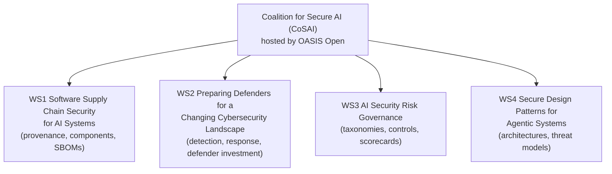

# Lesson 2-7: Introducing the Coalition for Secure AI (CoSAI)

> Student follow-along resources, key concepts, and references for this sublesson.

## Overview

The **Coalition for Secure AI (CoSAI)** is a global, vendor-neutral, open-source initiative dedicated to making AI systems **secure by design**. Launched in **July 2024** at the **Aspen Security Forum** and hosted by **OASIS Open**, CoSAI brings industry leaders, academics, and security practitioners together to share methodologies, frameworks, and tools — so that organizations are not each reinventing AI security on their own. This sublesson explains what CoSAI is, how it is organized into workstreams, what it has shipped through 2025–2026, and how you can use (and contribute to) its open-source artifacts.

## Learning objectives

By the end of this sublesson you should be able to:

- Describe what CoSAI is, who hosts it, and why it exists.
- Identify CoSAI's four core workstreams and the kind of risks each addresses.
- Recognize key CoSAI deliverables (Risk Map, Project CodeGuard, agentic and MCP guidance, model-signing and incident-response frameworks).
- Locate CoSAI's home page and GitHub organization and explain how to participate as an individual.
- Place CoSAI alongside OWASP and MITRE ATLAS in a complete AI-security tooling map.

## Key concepts

### 1. What CoSAI is and why it exists

The AI security landscape in 2024 was fragmented: every vendor and every government had their own taxonomy, threat model, and best-practice list. CoSAI was created to give practitioners and developers **a single, open, neutral place** to share and build on guidance.

Three guiding ideas:

- **Secure by design.** AI systems should be designed, built, deployed, and operated with security baked in from the start, not added at the end.
- **Collective action.** Securing AI is too big a problem for any single company; the coalition pools effort across competitors.
- **Open by default.** Methodologies, frameworks, and tools are open-source and available to everyone, not gated by sponsorship.

CoSAI is hosted by **OASIS Open**, the international standards and open-source consortium, which provides governance, neutrality, and IP processes.

### 2. Sponsors and participation

**Founding Premier Sponsors** include **Google, IBM, Intel, Microsoft, NVIDIA, and PayPal**. Additional sponsors and members include **Amazon, Anthropic, Cisco, Chainguard, Cohere, GenLab, OpenAI, Wiz**, and **Meta** (which has joined as a Premier Sponsor). The roster has continued to expand as the coalition has matured.

Crucially, **technical participation is free and open** to any developer or researcher. You do not need to be a sponsor to:

- Join mailing lists or the public discussion channels.
- Contribute to workstream documents and code.
- Use any of the coalition's open-source artifacts in your own systems.

### 3. The four workstreams

CoSAI's work is organized into focused workstreams, each producing concrete deliverables.

A short tour:

- **Workstream 1 — Software Supply Chain Security for AI Systems.** Extends existing supply-chain frameworks (SBOM, SLSA, SSDF) to AI-specific artifacts: models, fine-tunes, datasets, embeddings, and the tools that produce them. Outputs include guidance on **signing ML artifacts** to verify model authenticity and integrity.
- **Workstream 2 — Preparing Defenders for a Changing Cybersecurity Landscape.** Focuses on what blue teams need: detection patterns, incident response for AI-specific threats, and recommended investments. Outputs include the **AI Incident Response Framework V1.0** released in late 2025.
- **Workstream 3 — AI Security Risk Governance.** Develops risk and controls taxonomies, readiness checklists, and scorecards that organizations can adopt directly. Aligns with NIST AI RMF and other governance frameworks.
- **Workstream 4 — Secure Design Patterns for Agentic Systems.** Develops architecture patterns and threat models for systems where models plan, call tools, and act autonomously, including the **Principles for Secure-by-Design Agentic Systems** and **Model Context Protocol (MCP) Security** guidance.

All workstream outputs are hosted on GitHub under the **`cosai-oasis`** organization at https://github.com/cosai-oasis.

### 4. Notable deliverables (2024–2026)

A non-exhaustive list of artifacts CoSAI has shipped or kicked off:

| Deliverable | Workstream | What it is |
| --- | --- | --- |
| **CoSAI Risk Map** | Cross-WS | A framework for identifying, analyzing, and mitigating AI-specific security risks across the lifecycle. |
| **Signing ML Artifacts** | WS1 | A maturity model and guidance for cryptographically signing models and AI artifacts. |
| **AI Incident Response Framework V1.0** | WS2 | Guidance for detecting and remediating AI-specific incidents (poisoning, prompt injection, data leakage). |
| **Principles for Secure-by-Design Agentic Systems** | WS4 | Foundational design principles for agentic AI security. |
| **Agentic Identity and Access Management** | WS4 | A paper on identity, authorization, and delegation in agent-based systems. |
| **Model Context Protocol (MCP) Security** | WS4 | Guidance on securing the protocol many AI agents use to talk to tools and data. |
| **Project CodeGuard** | Cross-WS | An open-source, model-agnostic security framework donated by Cisco that embeds security rules into AI coding agent workflows. |

These artifacts are designed to **complement** other resources: many CoSAI documents reference NIST, OWASP GenAI, and MITRE ATLAS rather than replacing them.

### 5. How to use CoSAI

Three practical entry points for individual practitioners and teams:

1. **Adopt artifacts directly.** Use the CoSAI Risk Map and Incident Response Framework as a baseline; use Project CodeGuard for AI-coding-agent guardrails.
2. **Align governance.** Map your internal AI security controls against CoSAI's risk and governance taxonomies (and harmonize with NIST AI RMF and ISO/IEC 42001).
3. **Contribute.** Join a workstream mailing list, comment on draft documents, file issues on the GitHub repos, and bring real-world incident learnings to the broader community.

### 6. Where CoSAI fits with OWASP and MITRE ATLAS

The three resources are complementary, not redundant:

| Resource | Primary lens |
| --- | --- |
| OWASP GenAI Security Project (Lesson 2-6) | Application security risks, top-10 lists, mitigations, security tooling landscape. |
| **CoSAI** (this lesson) | Open-source frameworks, design patterns, supply-chain and incident-response guidance, governance. |
| MITRE ATLAS (Lesson 2-8) | Adversary tactics, techniques, and case studies (the "ATT&CK for AI" view). |

A mature program uses all three.

## Why it matters / What's next

If OWASP gives you the *risks*, CoSAI gives you the *open-source frameworks and patterns* to engineer against those risks. Lesson 2-8 will introduce **MITRE ATLAS**, which provides the third leg of the stool: a structured knowledge base of **adversary tactics and techniques** specifically for AI systems.

## Glossary

- **CoSAI (Coalition for Secure AI)** — A global open-source initiative for secure-by-design AI, hosted by OASIS Open.
- **OASIS Open** — An international standards and open-source consortium that hosts and governs CoSAI.
- **Secure by design** — The principle that security should be designed into systems from the start rather than added later.
- **Workstream** — A focused working group within CoSAI producing specific deliverables.
- **Software supply chain security for AI** — Practices for verifying the provenance, integrity, and components of models, datasets, and AI artifacts.
- **AI Incident Response Framework** — CoSAI guidance for detecting and remediating AI-specific incidents.
- **CoSAI Risk Map** — A framework for identifying, analyzing, and mitigating AI-specific security risks across the lifecycle.
- **Project CodeGuard** — An open-source security framework for AI coding agents, donated to CoSAI by Cisco.
- **Model Context Protocol (MCP)** — A protocol used by many AI agents to connect to external tools and data; CoSAI publishes guidance on securing it.
- **Signing ML artifacts** — Cryptographic signing of models and related artifacts to verify authenticity and integrity.

## Quick self-check

1. Where is CoSAI hosted, and roughly when was it launched?
2. Name CoSAI's four core workstreams and one type of risk each addresses.
3. Give two examples of CoSAI deliverables published through 2025 and what each is for.
4. How can an individual developer participate in CoSAI without being a sponsor?
5. Briefly explain how OWASP, CoSAI, and MITRE ATLAS complement each other.

## References and further reading

- Coalition for Secure AI — *Home.* https://www.coalitionforsecureai.org/
- Coalition for Secure AI — *About / workstreams.* https://www.coalitionforsecureai.org/about/
- Coalition for Secure AI — *Strategic update September 2025.* https://www.coalitionforsecureai.org/cosai-strategic-update-september-2025/
- OASIS Open — *Introducing the Coalition for Secure AI (launch announcement, July 2024).* https://www.oasis-open.org/2024/07/18/introducing-cosai/
- OASIS Open — *Coalition for Secure AI releases two actionable frameworks for AI model signing and incident response (November 2025).* https://www.oasis-open.org/2025/11/18/coalition-for-secure-ai-releases-two-actionable-frameworks-for-ai-model-signing-and-incident-response/
- CoSAI on GitHub — *cosai-oasis organization (workstream repos and artifacts).* https://github.com/cosai-oasis
- CoSAI on GitHub — *WS3 AI Risk Governance.* https://github.com/cosai-oasis/ws3-ai-risk-governance
- CoSAI on GitHub — *WS4 Secure Design Patterns for Agentic Systems.* https://github.com/cosai-oasis/ws4-secure-design-patterns-agentic-systems
- OASIS Open — *About OASIS Open.* https://www.oasis-open.org/about/
- Cisco Newsroom — *Cisco donates Project CodeGuard to the Coalition for Secure AI.* https://newsroom.cisco.com/c/r/newsroom/en/us/a/y2025/m04/cisco-donates-project-codeguard-to-coalition-for-secure-ai.html

### Omar's resources and references (course-wide)

#### Foundational cybersecurity resources in O'Reilly

This section provides a curated list of resources that delve into foundational cybersecurity concepts, frequently explored in O'Reilly training sessions and other educational offerings.

##### Live training

- **Upcoming Live Cybersecurity and AI Training in O'Reilly:** [Register before it is too late](https://learning.oreilly.com/search/?q=omar%20santos&type=live-course&rows=100&language_with_transcripts=en) (free with O'Reilly Subscription)

##### Reading list

Despite the rapidly evolving landscape of AI and technology, these books offer a comprehensive roadmap for understanding the intersection of these technologies with cybersecurity:

- **[NEW: Agentic AI for Cybersecurity: Building Autonomous Defenders and Adversaries](https://www.oreilly.com/library/view/agentic-ai-for/9780135589861/).** Unlock the power of next generation AI agents to transform cybersecurity, business operations, and productivity. [Available on O'Reilly](https://www.oreilly.com/library/view/agentic-ai-for/9780135589861/)

- **[Redefining Hacking](https://learning.oreilly.com/library/view/redefining-hacking-a/9780138363635/)** — A Comprehensive Guide to Red Teaming and Bug Bounty Hunting in an AI-driven World. [Available on O'Reilly](https://learning.oreilly.com/library/view/redefining-hacking-a/9780138363635/)

- **[AI-Powered Digital Cyber Resilience](https://www.oreilly.com/library/view/ai-powered-digital-cyber/9780135408599/)** — A practical guide to building intelligent, AI-powered cyber defenses in today's fast-evolving threat landscape. [Available on O'Reilly](https://www.oreilly.com/library/view/ai-powered-digital-cyber/9780135408599/)

- **[Developing Cybersecurity Programs and Policies in an AI-Driven World](https://learning.oreilly.com/library/view/developing-cybersecurity-programs/9780138073992)** — Explore strategies for creating robust cybersecurity frameworks in an AI-centric environment. [Available on O'Reilly](https://learning.oreilly.com/library/view/developing-cybersecurity-programs/9780138073992)

- **[Beyond the Algorithm: AI, Security, Privacy, and Ethics](https://learning.oreilly.com/library/view/beyond-the-algorithm/9780138268442)** — Gain insights into the ethical and security challenges posed by AI technologies. [Available on O'Reilly](https://learning.oreilly.com/library/view/beyond-the-algorithm/9780138268442)

- **[The AI Revolution in Networking, Cybersecurity, and Emerging Technologies](https://learning.oreilly.com/library/view/the-ai-revolution/9780138293703)** — Understand how AI is transforming networking and cybersecurity landscape. [Available on O'Reilly](https://learning.oreilly.com/library/view/the-ai-revolution/9780138293703)

##### Video courses

Enhance your practical skills with these video courses designed to deepen your understanding of cybersecurity:

- **[Building the Ultimate Cybersecurity Lab and Cyber Range](https://learning.oreilly.com/course/building-the-ultimate/9780138319090/)** (video). [Available on O'Reilly](https://learning.oreilly.com/course/building-the-ultimate/9780138319090/)

- **[Build Your Own AI Lab](https://learning.oreilly.com/course/build-your-own/9780135439616)** (video) — Hands-on guide to home and cloud-based AI labs. Learn to set up and optimize labs to research and experiment in a secure environment. [Available on O'Reilly](https://learning.oreilly.com/course/build-your-own/9780135439616)

- **[Defending and Deploying AI](https://www.oreilly.com/videos/defending-and-deploying/9780135463727/)** (video) — Comprehensive, hands-on journey into modern AI applications for technology and security professionals, covering AI-enabled programming, networking, and cybersecurity; securing generative AI (LLM security, prompt injection, red-teaming); secure AI labs; AI agents and agentic RAG for cybersecurity. [Available on O'Reilly](https://www.oreilly.com/videos/defending-and-deploying/9780135463727/)

- **[AI-Enabled Programming, Networking, and Cybersecurity](https://learning.oreilly.com/course/ai-enabled-programming-networking/9780135402696/)** — Learn to use AI for cybersecurity, networking, and programming tasks with practical, hands-on activities. [Available on O'Reilly](https://learning.oreilly.com/course/ai-enabled-programming-networking/9780135402696/)

- **[Securing Generative AI](https://learning.oreilly.com/course/securing-generative-ai/9780135401804/)** — Security for deploying and developing AI applications, RAG, agents, and other AI implementations; incorporate security at every stage of AI development, deployment, and operation. [Available on O'Reilly](https://learning.oreilly.com/course/securing-generative-ai/9780135401804/)

- **[Practical Cybersecurity Fundamentals](https://learning.oreilly.com/course/practical-cybersecurity-fundamentals/9780138037550/)** — Essential cybersecurity principles. [Available on O'Reilly](https://learning.oreilly.com/course/practical-cybersecurity-fundamentals/9780138037550/)

- **[The Art of Hacking](https://theartofhacking.org)** — Over 26 hours of training in ethical hacking and penetration testing (e.g., OSCP or CEH prep). [Visit The Art of Hacking](https://theartofhacking.org)

##### Certification related

- **CompTIA PenTest+ PT0-002 Cert Guide, 2nd Edition** — [Available on O'Reilly](https://learning.oreilly.com/library/view/comptia-pentest-pt0-002/9780137566204/)

- **Certified Ethical Hacker (CEH), Latest Edition** — Very comprehensive (19+ hours). [Available on O'Reilly](https://learning.oreilly.com/course/certified-ethical-hacker/9780135395646/)

- **Certified in Cybersecurity - CC (ISC)²** — [Available on O'Reilly](https://learning.oreilly.com/course/certified-in-cybersecurity/9780138230364/)

- **CCNP and CCIE Security Core SCOR 350-701 Official Cert Guide, 2nd Edition** — [Available on O'Reilly](https://learning.oreilly.com/library/view/ccnp-and-ccie/9780138221287/)

- **CEH Certified Ethical Hacker Cert Guide** — [Available on O'Reilly](https://learning.oreilly.com/library/view/ceh-certified-ethical/9780137489930/)

##### Additional resources

- **Hacking Scenarios (Labs) on O'Reilly** — Cloud-based labs; no local install. [https://hackingscenarios.com](https://hackingscenarios.com)

- **Personal blog** — [becomingahacker.org](https://becomingahacker.org)

- **Cisco blog** — [blogs.cisco.com/author/omarsantos](https://blogs.cisco.com/author/omarsantos)

- **GitHub repository** — [hackerrepo.org](https://hackerrepo.org)

- **WebSploit Labs** — [websploit.org](https://websploit.org)

- **NetAcad Ethical Hacker Free Course** — [NetAcad Skills for All](https://www.netacad.com/courses/ethical-hacker?courseLang=en-US)
