# Lesson 2-8: Introducing the MITRE ATLAS

> Student follow-along resources, key concepts, and references for this sublesson.

## Overview

**MITRE ATLAS** — short for **Adversarial Threat Landscape for Artificial-Intelligence Systems** — is a globally accessible, community-validated knowledge base that documents adversary **tactics, techniques, and procedures (TTPs)** specifically targeting AI and machine-learning systems. Hosted at **atlas.mitre.org**, ATLAS fills a gap that traditional frameworks like MITRE ATT&CK do not: ATT&CK focuses on IT and networks, while ATLAS covers attacks that exploit how ML and AI systems **learn, infer, and are deployed**. This sublesson introduces ATLAS, walks through its structure and tools, and shows how it maps to the lessons we have already covered on prompt injection, data poisoning, and AI-system defenses.

## Learning objectives

By the end of this sublesson you should be able to:

- Explain what MITRE ATLAS is, who created it, and how it relates to MITRE ATT&CK.
- Describe the ATLAS matrix structure: tactics, techniques, sub-techniques, mitigations, and case studies.
- Identify the four broad categories of adversarial ML attacks (evasion, poisoning, privacy, abuse) and place prompt injection within them.
- Use the ATLAS Navigator and Arsenal tools for threat modeling and adversary emulation.
- Combine ATLAS with the OWASP GenAI Top 10 and the NIST AI RMF for end-to-end AI risk coverage.

## Key concepts

### 1. What ATLAS is

ATLAS is a freely available knowledge base that catalogs **how attackers actually go after AI systems** — based on real-world case studies and red-team research. It was created by **MITRE** in collaboration with **Microsoft** and more than sixteen other organizations, first released as the **Adversarial ML Threat Matrix** in **2020**, and **renamed ATLAS in 2021** with version 2.0. The framework is **community-validated**: practitioners contribute new techniques, sub-techniques, mitigations, and case studies via MITRE's GitHub repository.

ATLAS is designed to be **used alongside MITRE ATT&CK**, not in place of it. ATT&CK covers traditional cyberattack TTPs (initial access, persistence, lateral movement, etc.); ATLAS adds the AI-specific TTPs that ATT&CK does not cover — for example, attacks that target the model's training data, learning process, inference behavior, or deployed inference APIs.

### 2. Matrix structure

ATLAS follows the same matrix layout as ATT&CK, with **tactics** as columns (the attacker's goal) and **techniques** under each tactic (the means used to achieve that goal). As of late 2025 / early 2026, ATLAS has grown to roughly:

- **15–16 tactics**
- **80+ techniques**
- **50+ sub-techniques**
- **30+ mitigations**
- **40+ real-world case studies**

ATLAS contains two tactics unique to AI systems and not found in ATT&CK: **ML Model Access** and **ML Attack Staging**, both of which capture stages of an AI-specific kill chain.

```mermaid
flowchart LR
    Recon["Reconnaissance"] --> ResDev["Resource Development"]
    ResDev --> InitAcc["Initial Access"]
    InitAcc --> MLAcc["ML Model Access"]
    MLAcc --> Exec["Execution"]
    Exec --> Persist["Persistence"]
    Persist --> Discovery["Discovery"]
    Discovery --> Coll["Collection"]
    Coll --> Stage["ML Attack Staging"]
    Stage --> Exfil["Exfiltration"]
    Exfil --> Impact["Impact"]
```

The diagram shows a representative slice of the ATLAS tactic flow; the actual matrix is interactive at atlas.mitre.org.

### 3. The four adversarial ML attack categories

ATLAS techniques fall into four broad categories that you should be able to recognize and place within your own systems:

| Category | What the attacker is trying to do | Examples |
| --- | --- | --- |
| **Evasion** | Fool the model at inference time so it misclassifies or fails to detect. | Adversarial perturbations that bypass image classifiers; jailbreaks of safety classifiers. |
| **Poisoning** | Corrupt training or fine-tuning data, or the learning process itself. | Backdoor data, malicious labels, RAG content poisoning, model-update poisoning. |
| **Privacy** | Extract confidential information from the model or its data. | Membership inference, training-data extraction, model-inversion, embedding inversion. |
| **Abuse** | Misuse a working AI system to cause harm. | Prompt injection (LLM01), agent goal hijacking, content laundering, social engineering with deepfakes. |

The risks Lesson 2 has emphasized — prompt injection, data poisoning, system-prompt leakage — all map directly onto ATLAS techniques in these categories, giving security teams a shared vocabulary for threat modeling and defense.

### 4. Mapping to the ML lifecycle

ATLAS also maps adversary tactics to the **machine-learning lifecycle** so you can plan defenses phase-by-phase:

- **Reconnaissance and resource development** align with administrative setup and data collection.
- **Discovery** ties to model development, validation, and approval workflows.
- **Collection and impact** relate to deployment, monitoring, and operations.

This lets you do **phase-specific threat modeling** — for example, treating poisoning controls during data collection separately from prompt-injection controls during deployment.

### 5. Tools: ATLAS Navigator and Arsenal

MITRE provides free open-source tools that make ATLAS practically usable:

- **ATLAS Navigator.** A web-based, interactive view of the matrix that lets you select techniques, score coverage, layer multiple analyses (red team vs. blue team), and export results — modeled on the popular ATT&CK Navigator. Use it for tabletop exercises, threat-modeling sessions, and gap analyses.
- **Arsenal.** A plugin for **MITRE CALDERA** that supports **adversary emulation** of ATLAS techniques — i.e., automated red-teaming against AI systems. Useful for security and ML teams that want to test their detections against realistic adversarial behavior.

Recent updates have added more than a dozen techniques specifically for **agentic AI** — autonomous agents, multi-step AI systems, and tool-using models — through collaboration with partners such as Zenity Labs.

### 6. Real-world case studies

ATLAS is grounded in real incidents. The case-study library documents publicly known attacks on production AI systems — for example, prompt-injection-based worms targeting AI assistants, attacks on ML APIs, model-extraction campaigns, and data-poisoning compromises. Reading the case studies helps analysts see how tactics and techniques play out in practice rather than only as abstract categories.

### 7. Using ATLAS with OWASP and NIST

ATLAS pairs well with the resources from earlier in this lesson:

| Question | Best fit |
| --- | --- |
| "What are the top *risks* in my LLM application?" | OWASP GenAI Top 10 (Lesson 2-6) |
| "What *open-source frameworks* exist for secure-by-design AI?" | CoSAI (Lesson 2-7) |
| "What *adversary tactics and techniques* should I model and detect?" | **MITRE ATLAS** (this lesson) |
| "How should we *govern AI risk* at the organizational level?" | NIST AI RMF and the GenAI profile (NIST AI 600-1) |

Using the four together gives you **risks, frameworks, attacker behaviors, and governance** in one consistent picture.

## Why it matters / What's next

ATLAS gives you the operational, attacker-centric view that complements OWASP's vulnerability view and CoSAI's design-pattern view. Together, they let you reason about AI security the same way mature cybersecurity programs reason about traditional security: through threat models, detection coverage, and defensive depth. This concludes Lesson 2 on **Prompt Engineering**. In **Lesson 3** we move from the prompt and system level to the **organizational** level — AI ethics and AI security as a discipline, including governance, policy, and people.

## Glossary

- **MITRE ATLAS** — Adversarial Threat Landscape for Artificial-Intelligence Systems; a knowledge base of adversary TTPs targeting AI/ML systems.
- **MITRE ATT&CK** — A separate MITRE knowledge base of adversary TTPs for traditional IT and networks; ATLAS is designed to be used alongside it.
- **Tactic** — The high-level goal of an attacker step (e.g., reconnaissance, ML model access, impact).
- **Technique / sub-technique** — A specific way an attacker achieves a tactic.
- **Mitigation** — A control or practice that reduces the risk of a technique succeeding.
- **Case study** — A documented real-world incident illustrating ATLAS tactics and techniques in practice.
- **Evasion attack** — Inference-time manipulation that causes a model to misclassify or fail.
- **Poisoning attack** — Corruption of training, fine-tuning, or retrieval data.
- **Privacy attack** — Extraction of confidential information from a model or its data.
- **Abuse attack** — Misuse of a functioning AI system to cause harm (includes prompt injection).
- **ATLAS Navigator** — An interactive matrix tool for visualization, threat modeling, and coverage tracking.
- **Arsenal** — A CALDERA plugin for adversary emulation of ATLAS techniques.

## Quick self-check

1. What does the acronym ATLAS stand for, and how is it different from MITRE ATT&CK?
2. Name the four broad categories of adversarial ML attacks and give one example of each.
3. Which two tactics are unique to ATLAS (and not present in ATT&CK)?
4. What are the ATLAS Navigator and Arsenal, and what is each used for?
5. How would you combine OWASP GenAI Top 10, CoSAI, MITRE ATLAS, and NIST AI RMF in a single AI-security program?

## References and further reading

- MITRE — *MITRE ATLAS™ home.* https://atlas.mitre.org/
- MITRE — *ATLAS Matrix (interactive).* https://atlas.mitre.org/matrices/ATLAS
- MITRE — *ATLAS case studies.* https://atlas.mitre.org/studies
- MITRE — *ATLAS mitigations.* https://atlas.mitre.org/mitigations
- MITRE / CSRC — *MITRE ATLAS overview presentation, NIST CSRC, September 2025 (PDF).* https://csrc.nist.gov/csrc/media/Presentations/2025/mitre-atlas/TuePM2.1-MITRE%20ATLAS%20Overview%20Sept%202025.pdf
- MITRE on GitHub — *mitre-atlas / atlas-data (data and contribution).* https://github.com/mitre-atlas/atlas-data
- MITRE on GitHub — *mitre-atlas / atlas-navigator (visualization tool).* https://github.com/mitre-atlas/atlas-navigator
- MITRE on GitHub — *mitre-atlas / arsenal (adversary emulation plugin for CALDERA).* https://github.com/mitre-atlas/arsenal
- Microsoft Security blog — *MITRE ATLAS and Microsoft: securing AI from the ground up.* https://www.microsoft.com/en-us/security/blog/2024/01/18/announcing-microsofts-open-automation-framework-to-red-team-generative-ai-systems/
- NIST — *AI Risk Management Framework: Generative AI profile (NIST AI 600-1).* https://nvlpubs.nist.gov/nistpubs/ai/NIST.AI.600-1.pdf
- NIST — *Adversarial machine learning taxonomy (NIST AI 100-2 E2025).* https://nvlpubs.nist.gov/nistpubs/ai/NIST.AI.100-2e2025.pdf
- OWASP GenAI Security Project — *Home.* https://genai.owasp.org/

### Omar's resources and references (course-wide)

#### Foundational cybersecurity resources in O'Reilly

This section provides a curated list of resources that delve into foundational cybersecurity concepts, frequently explored in O'Reilly training sessions and other educational offerings.

##### Live training

- **Upcoming Live Cybersecurity and AI Training in O'Reilly:** [Register before it is too late](https://learning.oreilly.com/search/?q=omar%20santos&type=live-course&rows=100&language_with_transcripts=en) (free with O'Reilly Subscription)

##### Reading list

Despite the rapidly evolving landscape of AI and technology, these books offer a comprehensive roadmap for understanding the intersection of these technologies with cybersecurity:

- **[NEW: Agentic AI for Cybersecurity: Building Autonomous Defenders and Adversaries](https://www.oreilly.com/library/view/agentic-ai-for/9780135589861/).** Unlock the power of next generation AI agents to transform cybersecurity, business operations, and productivity. [Available on O'Reilly](https://www.oreilly.com/library/view/agentic-ai-for/9780135589861/)

- **[Redefining Hacking](https://learning.oreilly.com/library/view/redefining-hacking-a/9780138363635/)** — A Comprehensive Guide to Red Teaming and Bug Bounty Hunting in an AI-driven World. [Available on O'Reilly](https://learning.oreilly.com/library/view/redefining-hacking-a/9780138363635/)

- **[AI-Powered Digital Cyber Resilience](https://www.oreilly.com/library/view/ai-powered-digital-cyber/9780135408599/)** — A practical guide to building intelligent, AI-powered cyber defenses in today's fast-evolving threat landscape. [Available on O'Reilly](https://www.oreilly.com/library/view/ai-powered-digital-cyber/9780135408599/)

- **[Developing Cybersecurity Programs and Policies in an AI-Driven World](https://learning.oreilly.com/library/view/developing-cybersecurity-programs/9780138073992)** — Explore strategies for creating robust cybersecurity frameworks in an AI-centric environment. [Available on O'Reilly](https://learning.oreilly.com/library/view/developing-cybersecurity-programs/9780138073992)

- **[Beyond the Algorithm: AI, Security, Privacy, and Ethics](https://learning.oreilly.com/library/view/beyond-the-algorithm/9780138268442)** — Gain insights into the ethical and security challenges posed by AI technologies. [Available on O'Reilly](https://learning.oreilly.com/library/view/beyond-the-algorithm/9780138268442)

- **[The AI Revolution in Networking, Cybersecurity, and Emerging Technologies](https://learning.oreilly.com/library/view/the-ai-revolution/9780138293703)** — Understand how AI is transforming networking and cybersecurity landscape. [Available on O'Reilly](https://learning.oreilly.com/library/view/the-ai-revolution/9780138293703)

##### Video courses

Enhance your practical skills with these video courses designed to deepen your understanding of cybersecurity:

- **[Building the Ultimate Cybersecurity Lab and Cyber Range](https://learning.oreilly.com/course/building-the-ultimate/9780138319090/)** (video). [Available on O'Reilly](https://learning.oreilly.com/course/building-the-ultimate/9780138319090/)

- **[Build Your Own AI Lab](https://learning.oreilly.com/course/build-your-own/9780135439616)** (video) — Hands-on guide to home and cloud-based AI labs. Learn to set up and optimize labs to research and experiment in a secure environment. [Available on O'Reilly](https://learning.oreilly.com/course/build-your-own/9780135439616)

- **[Defending and Deploying AI](https://www.oreilly.com/videos/defending-and-deploying/9780135463727/)** (video) — Comprehensive, hands-on journey into modern AI applications for technology and security professionals, covering AI-enabled programming, networking, and cybersecurity; securing generative AI (LLM security, prompt injection, red-teaming); secure AI labs; AI agents and agentic RAG for cybersecurity. [Available on O'Reilly](https://www.oreilly.com/videos/defending-and-deploying/9780135463727/)

- **[AI-Enabled Programming, Networking, and Cybersecurity](https://learning.oreilly.com/course/ai-enabled-programming-networking/9780135402696/)** — Learn to use AI for cybersecurity, networking, and programming tasks with practical, hands-on activities. [Available on O'Reilly](https://learning.oreilly.com/course/ai-enabled-programming-networking/9780135402696/)

- **[Securing Generative AI](https://learning.oreilly.com/course/securing-generative-ai/9780135401804/)** — Security for deploying and developing AI applications, RAG, agents, and other AI implementations; incorporate security at every stage of AI development, deployment, and operation. [Available on O'Reilly](https://learning.oreilly.com/course/securing-generative-ai/9780135401804/)

- **[Practical Cybersecurity Fundamentals](https://learning.oreilly.com/course/practical-cybersecurity-fundamentals/9780138037550/)** — Essential cybersecurity principles. [Available on O'Reilly](https://learning.oreilly.com/course/practical-cybersecurity-fundamentals/9780138037550/)

- **[The Art of Hacking](https://theartofhacking.org)** — Over 26 hours of training in ethical hacking and penetration testing (e.g., OSCP or CEH prep). [Visit The Art of Hacking](https://theartofhacking.org)

##### Certification related

- **CompTIA PenTest+ PT0-002 Cert Guide, 2nd Edition** — [Available on O'Reilly](https://learning.oreilly.com/library/view/comptia-pentest-pt0-002/9780137566204/)

- **Certified Ethical Hacker (CEH), Latest Edition** — Very comprehensive (19+ hours). [Available on O'Reilly](https://learning.oreilly.com/course/certified-ethical-hacker/9780135395646/)

- **Certified in Cybersecurity - CC (ISC)²** — [Available on O'Reilly](https://learning.oreilly.com/course/certified-in-cybersecurity/9780138230364/)

- **CCNP and CCIE Security Core SCOR 350-701 Official Cert Guide, 2nd Edition** — [Available on O'Reilly](https://learning.oreilly.com/library/view/ccnp-and-ccie/9780138221287/)

- **CEH Certified Ethical Hacker Cert Guide** — [Available on O'Reilly](https://learning.oreilly.com/library/view/ceh-certified-ethical/9780137489930/)

##### Additional resources

- **Hacking Scenarios (Labs) on O'Reilly** — Cloud-based labs; no local install. [https://hackingscenarios.com](https://hackingscenarios.com)

- **Personal blog** — [becomingahacker.org](https://becomingahacker.org)

- **Cisco blog** — [blogs.cisco.com/author/omarsantos](https://blogs.cisco.com/author/omarsantos)

- **GitHub repository** — [hackerrepo.org](https://hackerrepo.org)

- **WebSploit Labs** — [websploit.org](https://websploit.org)

- **NetAcad Ethical Hacker Free Course** — [NetAcad Skills for All](https://www.netacad.com/courses/ethical-hacker?courseLang=en-US)
