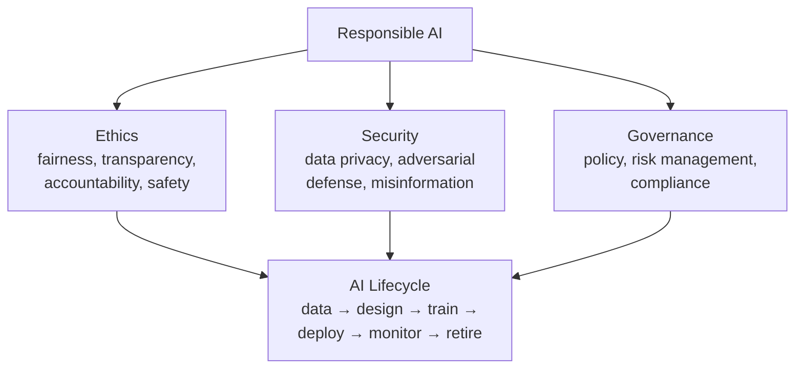

# Lesson 3-1: Introduction to AI Ethics and Security

> Student follow-along resources, key concepts, and references for this sublesson.

## Overview

AI ethics and security are no longer optional, end-of-project concerns — they are first-class engineering and management disciplines that span the entire AI lifecycle. This sublesson sets the frame for Lesson 3 by separating three closely related topics that are easy to confuse: **ethics** (the principles by which AI should behave), **security** (the controls that protect data, models, and users from harm and attack), and **governance** (the policies, accountability, and risk management that operationalize ethics and security across an organization). It also introduces the major frameworks shaping responsible AI in 2025–2026 — the NIST AI Risk Management Framework, ISO/IEC 42001, the EU AI Act, and the OECD AI Principles — so later sublessons can reference them by name.

## Learning objectives

By the end of this sublesson you should be able to:

- Distinguish AI ethics, AI security, and AI governance and explain how each one supports the others.
- Identify the major principles inside "responsible AI" (fairness, transparency, accountability, bias mitigation, safety, human oversight) and the major AI-specific security risks (privacy, prompt injection, adversarial inputs, deepfakes).
- Map ethics, security, and governance activities onto the AI lifecycle (data, design, train, deploy, monitor, decommission).
- Recognize the four leading reference frameworks in 2025–2026: NIST AI RMF, ISO/IEC 42001, the EU AI Act, and the OECD AI Principles.
- Justify, in business terms, why regulators, customers, and employees now expect organizations to manage AI risk explicitly.

## Key concepts

### 1. Ethics, security, and governance — three different jobs

These three words are often used interchangeably, but they answer different questions:

| Pillar | Question it answers | Typical artifacts |
| --- | --- | --- |
| Ethics | *Should* the system behave this way? Is it fair, transparent, safe, accountable? | Principles, fairness tests, model cards, impact assessments |
| Security | *Can* it be attacked, leaked, or misused — and what stops that? | Threat models, encryption, access controls, red-team reports, incident response plans |
| Governance | *Who* decides, *who* is accountable, *how* is it documented? | AI policy, risk register, AI use-case inventory, audit logs, board reporting |

A mature program treats all three as continuous activities tied to the **AI lifecycle**, not one-time checks before launch.

### 2. The AI lifecycle is the unit of risk

Risk in an AI system is not a single moment; it accumulates and changes shape across the lifecycle:

- **Data collection & curation** — consent, lawful basis, sensitive attributes, supply-chain trust.
- **Design & training** — model choice, fine-tuning data, evaluation for bias and safety.
- **Deployment** — access control, prompt hardening, secrets management, output filtering.
- **Operation & monitoring** — drift, abuse, incident detection, user feedback loops.
- **Decommissioning** — secure deletion, model and data retention, traceability.

This is why frameworks like the NIST AI RMF and ISO/IEC 42001 are organized around lifecycle activities rather than single sign-off gates.

### 3. The 2025–2026 framework landscape

You do not need to memorize the texts, but you should recognize what each one *is* and what role it plays:

| Framework | Type | Origin | What it gives you |
| --- | --- | --- | --- |
| **NIST AI Risk Management Framework (AI RMF 1.0)** + **GenAI Profile (AI 600-1)** | Voluntary, sector-agnostic | US (NIST) | Four core functions — Govern, Map, Measure, Manage — plus a profile specific to generative AI. |
| **ISO/IEC 42001:2023** | Voluntary, certifiable | International (ISO/IEC) | Requirements for an Artificial Intelligence Management System (AIMS), similar in shape to ISO 27001 for security. |
| **EU AI Act (Regulation (EU) 2024/1689)** | Mandatory, risk-tiered | European Union | Legal obligations on providers and deployers of AI based on risk class (unacceptable, high, limited, minimal). Phased application 2025–2027. |
| **OECD AI Principles (2019, updated 2024)** | Soft law, foundational | OECD / G20 | Five principles for trustworthy AI that influence national strategies worldwide. |

Industry frameworks from Microsoft, Google, and IBM converge on a similar set of principles and are frequently used as internal reference points.

### 4. Why ethics, security, and governance now sit on the same agenda

Several pressures collapsed these once-separate functions into one program:

- **Regulation.** The EU AI Act, US state laws (e.g., Colorado AI Act, California ADMT rules), and sectoral rules all attach legal consequences to AI behavior.
- **Adversaries.** Generative AI introduced *new* attack surfaces — prompt injection, training-data poisoning, model extraction — that traditional security teams had not seen before.
- **Public trust.** Customers and employees increasingly ask whether an organization can explain, audit, and stand behind its AI decisions.
- **Lifecycle coupling.** Ethics violations (e.g., biased outputs) and security incidents (e.g., leaked prompts) often share the same root cause: poor data and model governance.

## Why it matters / What's next

Every later sublesson in Lesson 3 zooms in on one slice of this picture:

- **Lesson 3-2** unpacks the responsible AI **principles** — fairness, transparency, accountability, bias mitigation, safety, and human oversight.
- **Lesson 3-3** focuses on **corporate data privacy and security** — what data goes into AI systems and how to protect it.
- **Lesson 3-4** examines AI-specific **security threats** — adversarial attacks, prompt injection, data poisoning, model extraction, deepfakes.
- **Lesson 3-5** ties everything to **governance** — policy, risk management, and compliance with frameworks like the NIST AI RMF and the EU AI Act.

If you take only one thing from this sublesson, take this: ethics, security, and governance are not three different teams' problems. They are three views of the same system, and a competent AI practitioner is expected to think about all three from day one.

## Glossary

- **Responsible AI** — Umbrella term for developing and using AI in ways that are ethical, safe, lawful, and accountable.
- **AI ethics** — Principles (fairness, transparency, accountability, etc.) that govern how AI *should* behave.
- **AI security** — Protection of AI systems and their data from attack, leakage, abuse, and misuse.
- **AI governance** — Organizational policies, roles, and processes that operationalize ethics and security and enforce compliance.
- **AI lifecycle** — The phases an AI system passes through: data, design, training, deployment, monitoring, and decommissioning.
- **NIST AI RMF** — Voluntary US framework with four core functions (Govern, Map, Measure, Manage) for managing AI risk.
- **ISO/IEC 42001** — International standard specifying requirements for an AI Management System (AIMS).
- **EU AI Act** — EU regulation classifying AI systems by risk and imposing obligations on providers and deployers.
- **OECD AI Principles** — International soft-law principles for trustworthy AI adopted by OECD and G20 countries.
- **Trustworthy AI** — A NIST term covering AI that is valid, reliable, safe, secure, accountable, transparent, explainable, privacy-enhanced, and fair.

## Quick self-check

1. In one sentence each, define AI ethics, AI security, and AI governance and explain how they differ.
2. Why is the AI *lifecycle*, rather than a single launch review, the right unit of risk management?
3. Which framework would you point a colleague to for a *voluntary, US, lifecycle-based* approach to AI risk?
4. Which framework is *legally binding*, classifies AI systems by risk, and is being phased in across 2025–2027?
5. Give two examples of pressures (regulatory, technical, or social) that have pushed organizations to combine ethics, security, and governance into a single AI program.

## References and further reading

- NIST — *AI Risk Management Framework.* https://www.nist.gov/itl/ai-risk-management-framework
- NIST — *AI RMF Generative AI Profile (NIST AI 600-1).* https://www.nist.gov/publications/artificial-intelligence-risk-management-framework-generative-artificial-intelligence
- ISO — *ISO/IEC 42001:2023 — AI management systems.* https://www.iso.org/standard/42001
- ISO — *ISO/IEC 42001 explained: what it is.* https://www.iso.org/home/insights-news/resources/iso-42001-explained-what-it-is.html
- European Commission — *EU AI Act (Regulation (EU) 2024/1689).* https://artificialintelligenceact.eu/
- EU AI Act — *Implementation timeline.* https://artificialintelligenceact.eu/implementation-timeline/
- OECD — *OECD AI Principles.* https://oecd.ai/en/ai-principles
- Microsoft — *Responsible AI: principles and approach.* https://www.microsoft.com/en-us/ai/principles-and-approach
- IBM — *AI ethics.* https://www.ibm.com/topics/ai-ethics
- CISA — *Best practices for securing AI data (2025).* https://www.cisa.gov/news-events/alerts/2025/05/22/new-best-practices-guide-securing-ai-data-released
- OWASP — *Top 10 for Large Language Model applications (2025).* https://genai.owasp.org/llm-top-10/
- MITRE — *ATLAS: adversarial threat landscape for AI systems.* https://atlas.mitre.org/

### Omar's resources and references (course-wide)

For Omar's shared cybersecurity and AI resources, use the centralized AITECH course-wide reference page instead of maintaining a duplicated copy in each Lesson 3 resource file:

- [Omar's course-wide resources and references](../Omar-course-wide-resources.md)

This keeps the reading list and training references consistent across sublessons and makes future updates easier to maintain.

- **[Redefining Hacking](https://learning.oreilly.com/library/view/redefining-hacking-a/9780138363635/)** — A Comprehensive Guide to Red Teaming and Bug Bounty Hunting in an AI-driven World. [Available on O'Reilly](https://learning.oreilly.com/library/view/redefining-hacking-a/9780138363635/)

- **[AI-Powered Digital Cyber Resilience](https://www.oreilly.com/library/view/ai-powered-digital-cyber/9780135408599/)** — A practical guide to building intelligent, AI-powered cyber defenses in today's fast-evolving threat landscape. [Available on O'Reilly](https://www.oreilly.com/library/view/ai-powered-digital-cyber/9780135408599/)

- **[Developing Cybersecurity Programs and Policies in an AI-Driven World](https://learning.oreilly.com/library/view/developing-cybersecurity-programs/9780138073992)** — Explore strategies for creating robust cybersecurity frameworks in an AI-centric environment. [Available on O'Reilly](https://learning.oreilly.com/library/view/developing-cybersecurity-programs/9780138073992)

- **[Beyond the Algorithm: AI, Security, Privacy, and Ethics](https://learning.oreilly.com/library/view/beyond-the-algorithm/9780138268442)** — Gain insights into the ethical and security challenges posed by AI technologies. [Available on O'Reilly](https://learning.oreilly.com/library/view/beyond-the-algorithm/9780138268442)

- **[The AI Revolution in Networking, Cybersecurity, and Emerging Technologies](https://learning.oreilly.com/library/view/the-ai-revolution/9780138293703)** — Understand how AI is transforming networking and cybersecurity landscape. [Available on O'Reilly](https://learning.oreilly.com/library/view/the-ai-revolution/9780138293703)

##### Video courses

Enhance your practical skills with these video courses designed to deepen your understanding of cybersecurity:

- **[Building the Ultimate Cybersecurity Lab and Cyber Range](https://learning.oreilly.com/course/building-the-ultimate/9780138319090/)** (video). [Available on O'Reilly](https://learning.oreilly.com/course/building-the-ultimate/9780138319090/)

- **[Build Your Own AI Lab](https://learning.oreilly.com/course/build-your-own/9780135439616)** (video) — Hands-on guide to home and cloud-based AI labs. Learn to set up and optimize labs to research and experiment in a secure environment. [Available on O'Reilly](https://learning.oreilly.com/course/build-your-own/9780135439616)

- **[Defending and Deploying AI](https://www.oreilly.com/videos/defending-and-deploying/9780135463727/)** (video) — Comprehensive, hands-on journey into modern AI applications for technology and security professionals, covering AI-enabled programming, networking, and cybersecurity; securing generative AI (LLM security, prompt injection, red-teaming); secure AI labs; AI agents and agentic RAG for cybersecurity. [Available on O'Reilly](https://www.oreilly.com/videos/defending-and-deploying/9780135463727/)

- **[AI-Enabled Programming, Networking, and Cybersecurity](https://learning.oreilly.com/course/ai-enabled-programming-networking/9780135402696/)** — Learn to use AI for cybersecurity, networking, and programming tasks with practical, hands-on activities. [Available on O'Reilly](https://learning.oreilly.com/course/ai-enabled-programming-networking/9780135402696/)

- **[Securing Generative AI](https://learning.oreilly.com/course/securing-generative-ai/9780135401804/)** — Security for deploying and developing AI applications, RAG, agents, and other AI implementations; incorporate security at every stage of AI development, deployment, and operation. [Available on O'Reilly](https://learning.oreilly.com/course/securing-generative-ai/9780135401804/)

- **[Practical Cybersecurity Fundamentals](https://learning.oreilly.com/course/practical-cybersecurity-fundamentals/9780138037550/)** — Essential cybersecurity principles. [Available on O'Reilly](https://learning.oreilly.com/course/practical-cybersecurity-fundamentals/9780138037550/)

- **[The Art of Hacking](https://theartofhacking.org)** — Over 26 hours of training in ethical hacking and penetration testing (e.g., OSCP or CEH prep). [Visit The Art of Hacking](https://theartofhacking.org)

##### Certification related

- **CompTIA PenTest+ PT0-002 Cert Guide, 2nd Edition** — [Available on O'Reilly](https://learning.oreilly.com/library/view/comptia-pentest-pt0-002/9780137566204/)

- **Certified Ethical Hacker (CEH), Latest Edition** — Very comprehensive (19+ hours). [Available on O'Reilly](https://learning.oreilly.com/course/certified-ethical-hacker/9780135395646/)

- **Certified in Cybersecurity - CC (ISC)²** — [Available on O'Reilly](https://learning.oreilly.com/course/certified-in-cybersecurity/9780138230364/)

- **CCNP and CCIE Security Core SCOR 350-701 Official Cert Guide, 2nd Edition** — [Available on O'Reilly](https://learning.oreilly.com/library/view/ccnp-and-ccie/9780138221287/)

- **CEH Certified Ethical Hacker Cert Guide** — [Available on O'Reilly](https://learning.oreilly.com/library/view/ceh-certified-ethical/9780137489930/)

##### Additional resources

- **Hacking Scenarios (Labs) on O'Reilly** — Cloud-based labs; no local install. [https://hackingscenarios.com](https://hackingscenarios.com)

- **Personal blog** — [becomingahacker.org](https://becomingahacker.org)

- **Cisco blog** — [blogs.cisco.com/author/omarsantos](https://blogs.cisco.com/author/omarsantos)

- **GitHub repository** — [hackerrepo.org](https://hackerrepo.org)

- **WebSploit Labs** — [websploit.org](https://websploit.org)

- **NetAcad Ethical Hacker Free Course** — [NetAcad Skills for All](https://www.netacad.com/courses/ethical-hacker?courseLang=en-US)
