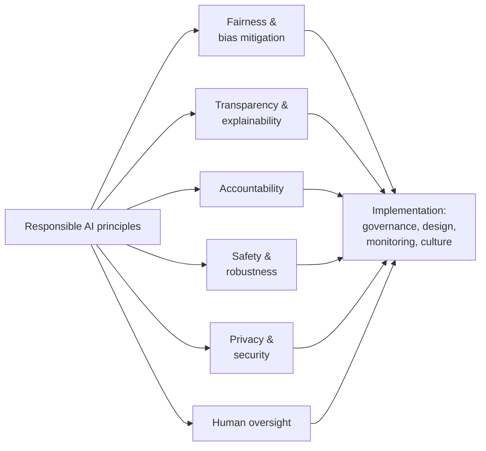

# Lesson 3-2: Responsible AI Principles

> Student follow-along resources, key concepts, and references for this sublesson.

## Overview

"Responsible AI" is the practical engineering and management discipline that turns abstract values into concrete design choices, controls, and review processes. By 2025–2026 the major industry and standards bodies have largely converged on the same short list of principles: **fairness, transparency and explainability, accountability, bias mitigation, safety, and human oversight**. This sublesson walks through each principle, shows how they map to the major published frameworks (Microsoft Responsible AI, Google AI Principles, IBM AI ethics, OECD AI Principles, NIST trustworthy-AI characteristics), and connects them to the techniques you will actually use — fairness metrics, explainability tools, model cards, and human-in-the-loop review.

## Learning objectives

By the end of this sublesson you should be able to:

- Name and define the core responsible-AI principles that recur across major frameworks.
- Compare how Microsoft, Google, IBM, OECD, and NIST organize those principles.
- Apply fairness, transparency, and accountability concepts to a realistic AI use case.
- Identify common bias-mitigation and explainability techniques and when each is appropriate.
- Explain why human oversight is treated as a first-class principle for high-risk AI systems.

## Key concepts

### 1. The converged set of principles

Different organizations use slightly different wording, but the substance lines up:

| Principle | Microsoft Responsible AI | Google AI Principles | OECD | NIST trustworthy AI |
| --- | --- | --- | --- | --- |
| Fairness / non-discrimination | Fairness, Inclusiveness | Avoid creating or reinforcing unfair bias | Human-centered values & fairness | Fair – with harmful bias managed |
| Transparency / explainability | Transparency | Be accountable to people | Transparency & explainability | Explainable & interpretable; Transparent |
| Accountability | Accountability | Be accountable to people | Accountability | Accountable & responsible |
| Safety & robustness | Reliability and safety | Built and tested for safety | Robustness, security & safety | Safe; Secure & resilient |
| Privacy | Privacy and security | Incorporate privacy design principles | (within Robustness) | Privacy-enhanced |
| Human oversight | (within Accountability) | Be accountable to people | Human-centered values | Valid & reliable; Accountable |

### 2. Fairness and bias mitigation

A model can inherit bias from its training data, from how features are constructed, from labeling processes, or from how it is deployed and used. Fairness is therefore an *ongoing* property, not a one-time checkbox.

**Common fairness metrics** (you will see all three in audits):

- **Demographic parity** — outcomes are distributed equally across protected groups.
- **Equal opportunity** — true-positive rates are equal across groups.
- **Equalized odds** — both true-positive and false-positive rates are equal across groups.

These metrics can conflict; choosing among them is a *contextual* decision tied to the harm being prevented.

**Common mitigation techniques:**

- **Pre-processing** — clean, rebalance, or reweight training data; remove or transform proxies for protected attributes.
- **In-processing** — fairness constraints, adversarial debiasing, regularization terms during training.
- **Post-processing** — calibrate scores or thresholds per group after training.
- **Operational** — monitor outcomes in production, set alerting on drift, run periodic audits.

For LLMs specifically, fairness work also includes evaluating outputs on bias benchmarks and red-teaming for stereotype amplification, refusal asymmetries, and disparate quality across languages or dialects.

### 3. Transparency, explainability, and accountability

These three principles are related but distinct:

- **Transparency** is *system-level* visibility — what data was used, how the model was trained, what its known limitations are. Typical artifacts: **model cards**, **system cards**, **data sheets for datasets**, AI use-case inventories.
- **Explainability** is *decision-level* visibility — why the model produced *this* output for *this* input. Typical techniques: interpretable models (e.g., GAMs, decision trees), feature-attribution methods (SHAP, LIME, integrated gradients), counterfactual and example-based explanations, and natural-language explanations from the model itself.
- **Accountability** is *organizational* — who is responsible if something goes wrong. Modern governance assigns accountability at multiple layers: technical owners (model and pipeline), product owners (use case), and senior leadership (policy, risk acceptance).

A practical rule of thumb: transparency tells a regulator or customer *what* the system is; explainability tells the affected user *why* it decided what it did; accountability tells everyone *who* answers for it.

### 4. Safety, robustness, and human oversight

"Safety" in responsible-AI frameworks is a broad category: it covers **physical** harm (e.g., autonomous systems), **psychological** harm (e.g., manipulative outputs), **societal** harm (e.g., misinformation), and **economic** harm (e.g., automated denials of service or credit). Safety work normally includes:

- **Pre-deployment evals and red-teaming** for harmful, unsafe, or out-of-policy behavior.
- **Robustness testing** against distribution shift, adversarial inputs, and edge cases.
- **Safeguards in production** — content filters, refusal policies, output validation, rate limits.
- **Human oversight** — review of high-risk decisions, escalation paths, and the ability for a human to pause, override, or roll back the system.

Frameworks like the EU AI Act and NIST AI RMF treat **human oversight** as non-negotiable for high-risk AI: a person, not a model, must remain accountable for consequential outcomes.

### 5. From principles to practice

Principles are operationalized through four reinforcing layers:

- **Governance** — written policies, an AI use-case inventory, an internal review board for sensitive uses, sign-off gates.
- **Design choices** — choice of model, choice of data, choice of architecture (e.g., RAG over training to reduce memorization), choice of fallback behavior.
- **Monitoring** — bias and drift dashboards, abuse detection, incident reporting, customer feedback channels.
- **Culture** — training for builders, escalation norms, blameless post-mortems, and leadership tone.

If only one of these layers exists, principles tend to stay on a poster in the lobby.

## Why it matters / What's next

Responsible-AI principles are the *vocabulary* you will use for the rest of Lesson 3 and for the rest of your career as an AI practitioner. Lesson 3-3 dives into one specific principle — privacy and security of corporate data — and what it looks like in real deployments. Lesson 3-4 examines the security threats that put safety and accountability at risk. Lesson 3-5 closes the loop by showing how governance turns these principles into auditable, repeatable practices.

## Glossary

- **Responsible AI** — The practice of developing and using AI consistent with a defined set of ethical principles.
- **Fairness** — Treating individuals and groups equitably; not producing unjustified disparate outcomes.
- **Bias mitigation** — Techniques to identify and reduce unfair bias in data, models, and use.
- **Demographic parity / equal opportunity / equalized odds** — Common quantitative fairness criteria.
- **Transparency** — Disclosure of how a system was built, trained, and intended to behave.
- **Explainability** — Ability to explain individual model decisions to humans.
- **Model card / system card** — Standardized document describing a model's intended use, performance, and limitations.
- **Accountability** — Clear assignment of responsibility for AI outcomes.
- **Robustness** — A system's ability to maintain performance under noisy, shifted, or adversarial inputs.
- **Human-in-the-loop (HITL)** — A pattern where a human reviews, approves, or can override AI decisions.

## Quick self-check

1. Name the six responsible-AI principles that recur across Microsoft, Google, OECD, and NIST.
2. Give one fairness metric and one situation where it is the right choice.
3. What is the difference between *transparency* and *explainability*?
4. Why can demographic parity and equal opportunity not always be satisfied at the same time?
5. For a high-risk AI system (e.g., loan decisioning), describe one human-oversight control you would require.

## References and further reading

- Microsoft — *Responsible AI: principles and approach.* https://www.microsoft.com/en-us/ai/principles-and-approach
- Microsoft — *Responsible AI Transparency Report (2025).* https://www.microsoft.com/en-us/corporate-responsibility/responsible-ai-transparency-report/
- Google — *Our AI Principles.* https://ai.google/principles/
- Google — *AI at Google: our principles (2025 update).* https://blog.google/innovation-and-ai/products/ai-principles/
- IBM — *AI ethics.* https://www.ibm.com/topics/ai-ethics
- OECD — *OECD AI Principles.* https://oecd.ai/en/ai-principles
- NIST — *AI Risk Management Framework (and trustworthy-AI characteristics).* https://www.nist.gov/itl/ai-risk-management-framework
- NIST — *AI RMF Generative AI Profile (NIST AI 600-1).* https://www.nist.gov/publications/artificial-intelligence-risk-management-framework-generative-artificial-intelligence
- European Commission — *EU AI Act (Regulation (EU) 2024/1689) — high-risk obligations and human oversight.* https://artificialintelligenceact.eu/
- ISO — *ISO/IEC 42001 explained.* https://www.iso.org/home/insights-news/resources/iso-42001-explained-what-it-is.html
- Google — *People + AI Research: Model Cards.* https://modelcards.withgoogle.com/about
- Microsoft Learn — *What is Responsible AI (Azure ML).* https://learn.microsoft.com/en-us/azure/machine-learning/concept-responsible-ai

### Omar's resources and references (course-wide)

#### Foundational cybersecurity resources in O'Reilly

This section provides a curated list of resources that delve into foundational cybersecurity concepts, frequently explored in O'Reilly training sessions and other educational offerings.

##### Live training

- **Upcoming Live Cybersecurity and AI Training in O'Reilly:** [Register before it is too late](https://learning.oreilly.com/search/?q=omar%20santos&type=live-course&rows=100&language_with_transcripts=en) (free with O'Reilly Subscription)

##### Reading list

Despite the rapidly evolving landscape of AI and technology, these books offer a comprehensive roadmap for understanding the intersection of these technologies with cybersecurity:

- **[NEW: Agentic AI for Cybersecurity: Building Autonomous Defenders and Adversaries](https://www.oreilly.com/library/view/agentic-ai-for/9780135589861/).** Unlock the power of next generation AI agents to transform cybersecurity, business operations, and productivity. [Available on O'Reilly](https://www.oreilly.com/library/view/agentic-ai-for/9780135589861/)

- **[Redefining Hacking](https://learning.oreilly.com/library/view/redefining-hacking-a/9780138363635/)** — A Comprehensive Guide to Red Teaming and Bug Bounty Hunting in an AI-driven World. [Available on O'Reilly](https://learning.oreilly.com/library/view/redefining-hacking-a/9780138363635/)

- **[AI-Powered Digital Cyber Resilience](https://www.oreilly.com/library/view/ai-powered-digital-cyber/9780135408599/)** — A practical guide to building intelligent, AI-powered cyber defenses in today's fast-evolving threat landscape. [Available on O'Reilly](https://www.oreilly.com/library/view/ai-powered-digital-cyber/9780135408599/)

- **[Developing Cybersecurity Programs and Policies in an AI-Driven World](https://learning.oreilly.com/library/view/developing-cybersecurity-programs/9780138073992)** — Explore strategies for creating robust cybersecurity frameworks in an AI-centric environment. [Available on O'Reilly](https://learning.oreilly.com/library/view/developing-cybersecurity-programs/9780138073992)

- **[Beyond the Algorithm: AI, Security, Privacy, and Ethics](https://learning.oreilly.com/library/view/beyond-the-algorithm/9780138268442)** — Gain insights into the ethical and security challenges posed by AI technologies. [Available on O'Reilly](https://learning.oreilly.com/library/view/beyond-the-algorithm/9780138268442)

- **[The AI Revolution in Networking, Cybersecurity, and Emerging Technologies](https://learning.oreilly.com/library/view/the-ai-revolution/9780138293703)** — Understand how AI is transforming networking and cybersecurity landscape. [Available on O'Reilly](https://learning.oreilly.com/library/view/the-ai-revolution/9780138293703)

##### Video courses

Enhance your practical skills with these video courses designed to deepen your understanding of cybersecurity:

- **[Building the Ultimate Cybersecurity Lab and Cyber Range](https://learning.oreilly.com/course/building-the-ultimate/9780138319090/)** (video). [Available on O'Reilly](https://learning.oreilly.com/course/building-the-ultimate/9780138319090/)

- **[Build Your Own AI Lab](https://learning.oreilly.com/course/build-your-own/9780135439616)** (video) — Hands-on guide to home and cloud-based AI labs. Learn to set up and optimize labs to research and experiment in a secure environment. [Available on O'Reilly](https://learning.oreilly.com/course/build-your-own/9780135439616)

- **[Defending and Deploying AI](https://www.oreilly.com/videos/defending-and-deploying/9780135463727/)** (video) — Comprehensive, hands-on journey into modern AI applications for technology and security professionals, covering AI-enabled programming, networking, and cybersecurity; securing generative AI (LLM security, prompt injection, red-teaming); secure AI labs; AI agents and agentic RAG for cybersecurity. [Available on O'Reilly](https://www.oreilly.com/videos/defending-and-deploying/9780135463727/)

- **[AI-Enabled Programming, Networking, and Cybersecurity](https://learning.oreilly.com/course/ai-enabled-programming-networking/9780135402696/)** — Learn to use AI for cybersecurity, networking, and programming tasks with practical, hands-on activities. [Available on O'Reilly](https://learning.oreilly.com/course/ai-enabled-programming-networking/9780135402696/)

- **[Securing Generative AI](https://learning.oreilly.com/course/securing-generative-ai/9780135401804/)** — Security for deploying and developing AI applications, RAG, agents, and other AI implementations; incorporate security at every stage of AI development, deployment, and operation. [Available on O'Reilly](https://learning.oreilly.com/course/securing-generative-ai/9780135401804/)

- **[Practical Cybersecurity Fundamentals](https://learning.oreilly.com/course/practical-cybersecurity-fundamentals/9780138037550/)** — Essential cybersecurity principles. [Available on O'Reilly](https://learning.oreilly.com/course/practical-cybersecurity-fundamentals/9780138037550/)

- **[The Art of Hacking](https://theartofhacking.org)** — Over 26 hours of training in ethical hacking and penetration testing (e.g., OSCP or CEH prep). [Visit The Art of Hacking](https://theartofhacking.org)

##### Certification related

- **CompTIA PenTest+ PT0-002 Cert Guide, 2nd Edition** — [Available on O'Reilly](https://learning.oreilly.com/library/view/comptia-pentest-pt0-002/9780137566204/)

- **Certified Ethical Hacker (CEH), Latest Edition** — Very comprehensive (19+ hours). [Available on O'Reilly](https://learning.oreilly.com/course/certified-ethical-hacker/9780135395646/)

- **Certified in Cybersecurity - CC (ISC)²** — [Available on O'Reilly](https://learning.oreilly.com/course/certified-in-cybersecurity/9780138230364/)

- **CCNP and CCIE Security Core SCOR 350-701 Official Cert Guide, 2nd Edition** — [Available on O'Reilly](https://learning.oreilly.com/library/view/ccnp-and-ccie/9780138221287/)

- **CEH Certified Ethical Hacker Cert Guide** — [Available on O'Reilly](https://learning.oreilly.com/library/view/ceh-certified-ethical/9780137489930/)

##### Additional resources

- **Hacking Scenarios (Labs) on O'Reilly** — Cloud-based labs; no local install. [https://hackingscenarios.com](https://hackingscenarios.com)

- **Personal blog** — [becomingahacker.org](https://becomingahacker.org)

- **Cisco blog** — [blogs.cisco.com/author/omarsantos](https://blogs.cisco.com/author/omarsantos)

- **GitHub repository** — [hackerrepo.org](https://hackerrepo.org)

- **WebSploit Labs** — [websploit.org](https://websploit.org)

- **NetAcad Ethical Hacker Free Course** — [NetAcad Skills for All](https://www.netacad.com/courses/ethical-hacker?courseLang=en-US)
