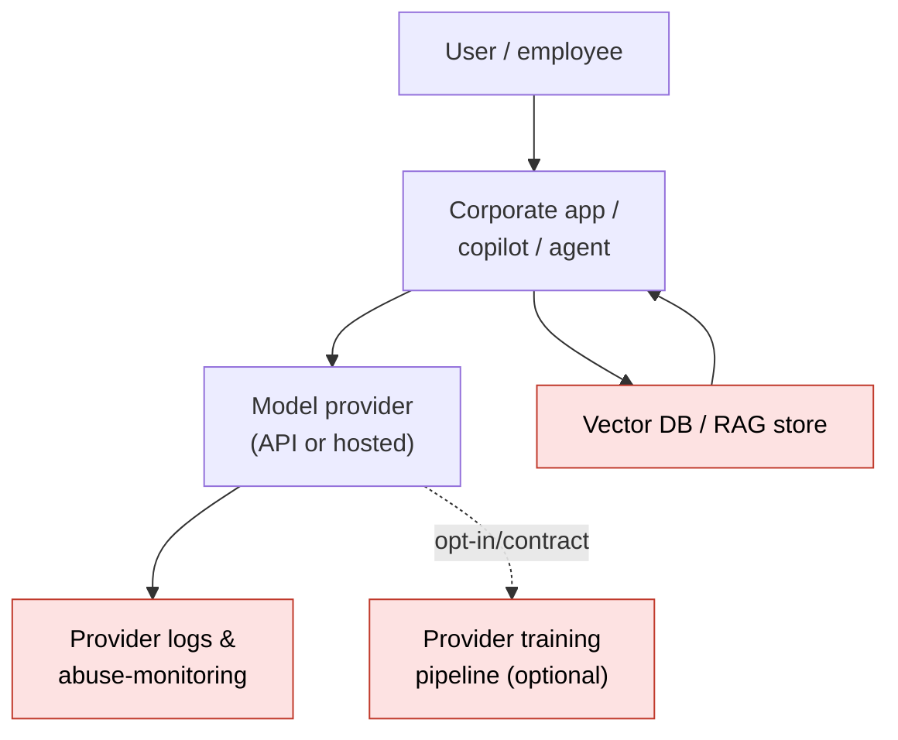

# Lesson 3-3: Corporate Data Privacy and Security Approaches

> Student follow-along resources, key concepts, and references for this sublesson.

## Overview

When AI systems start touching corporate or personal data, two long-standing disciplines — privacy and information security — merge with new, AI-specific risks. This sublesson explains what changes when you add LLMs and other generative models to the picture: data minimization becomes harder, **memorization** of training data and **leakage through prompts and logs** create new exposure paths, and the question "where is my data?" suddenly has to include the model provider, the inference endpoint, and any logs they keep. We map these risks against the current regulatory baseline (GDPR, CCPA, ICO, EDPB) and the 2025 CISA/NSA/FBI joint guidance on AI data security, and we walk through the practical controls a corporate AI program is expected to have in 2025–2026.

## Learning objectives

By the end of this sublesson you should be able to:

- Apply core data-protection principles (data minimization, purpose limitation, security proportionate to risk) to AI use cases.
- Identify LLM-specific privacy risks: training-data memorization, prompt and log leakage, and embedding/RAG exposure.
- Evaluate vendor deployment models (public API, zero-retention API, private/dedicated, on-prem/air-gapped) by data-handling profile.
- Outline the controls in the 2025 CISA/NSA/FBI *AI Data Security* best-practices guide across the AI lifecycle.
- Build a practical checklist for "what data is allowed to go to which AI system" in a corporate environment.

## Key concepts

### 1. The regulatory baseline still applies — and goes further for AI

AI does not get a privacy carve-out. The same laws that govern any processing of personal data also govern processing inside AI systems:

- **GDPR (EU) and UK GDPR.** Lawful basis, data minimization, purpose limitation, storage limitation, security, transparency, individual rights, and restrictions on **solely automated decision-making with significant effects** (Article 22).
- **CCPA / CPRA (California)** and a growing patchwork of US state privacy and AI laws.
- **EU AI Act.** Adds AI-specific obligations on top of GDPR for high-risk systems (data quality, documentation, logging, human oversight).
- **Sectoral rules** — HIPAA (US healthcare), GLBA (US financial), DORA (EU financial), and similar.

Regulators have begun publishing AI-specific guidance under existing law:

- The **UK ICO** maintains an AI and data-protection hub and is updating it in line with the 2025 Data (Use and Access) Act, including Data Protection Impact Assessments (DPIAs) tailored to AI.
- The **European Data Protection Board (EDPB)** has published opinions on personal data in AI training and on the lawful basis question for foundation models.

A useful mental model: **GDPR / CCPA tell you the rules for personal data; the EU AI Act tells you the additional rules when that data passes through a high-risk AI system; sectoral law tells you the extra rules in your industry.**

### 2. Data minimization in an AI world

Data minimization — *collect only what you need, keep it only as long as you need it* — is harder for AI because models tend to want *more* data. A practical version of the principle:

- **Define the purpose first**, then the data. If the purpose is "summarize internal policies," you do not need customer PII in the prompt.
- **Strip or tokenize before sending.** Redact direct identifiers, hash or pseudonymize where possible, and consider on-device pre-processing.
- **Limit what the model can retain.** Prefer **retrieval-augmented generation (RAG)** over fine-tuning when the goal is "the model should know our docs," because RAG keeps the data outside the model weights.
- **Separate training, evaluation, and inference data flows.** They have different sensitivities and different retention rules.

### 3. LLM-specific privacy risks

The four exposure paths to keep in mind:

- **Training-data memorization.** Large models can reproduce verbatim or near-verbatim training data when prompted in the right way. If sensitive data was in the training set — whether through web scraping, fine-tuning, or RLHF data — it can leak.
- **Prompt and output logging.** Many providers store prompts and responses for safety monitoring or debugging. Without an explicit no-retention or zero-retention contract, sensitive content may sit in their logs.
- **Use of customer data for model improvement.** Some providers, by default, train on customer prompts unless the customer opts out or has an enterprise agreement that says otherwise.
- **RAG and embedding stores.** Embeddings can be approximately inverted, and vector databases are often less hardened than primary data stores. They need the same access controls and encryption as the source documents.

### 4. Choosing a deployment model

Different deployment models give you different privacy profiles:

| Deployment model | Where data goes | Typical use |
| --- | --- | --- |
| **Public consumer chatbot** | Provider's cloud, often used to improve the service | Personal use only — never sensitive corporate data |
| **Enterprise / API tier with zero retention** | Provider's cloud, contractually no training and short or no logging | Most general business use |
| **Cloud-hosted private deployment** (e.g., dedicated capacity, customer-tenanted) | Provider's cloud, isolated to your tenant | Regulated industries, sensitive use cases |
| **On-prem / VPC / air-gapped** | Your own infrastructure | Top-secret, classified, or strictly regulated data |

The right choice is driven by **data classification** plus **impact of breach**, not by convenience or price.

### 5. The 2025 CISA/NSA/FBI AI Data Security guidance

In May 2025 CISA, the NSA, the FBI and international partners published *AI Data Security: Best Practices for Securing Data Used to Train and Operate AI Systems*. The headline ideas:

- Treat AI data security as a **lifecycle** problem — Plan & Design, Develop, Test & Evaluate, Deploy, Operate & Monitor.
- Manage the **data supply chain**: provenance checks, digital signatures, source authentication for third-party datasets.
- Defend against **data poisoning** (maliciously modified training data) and watch for **data drift** that can degrade model integrity.
- Apply standard cybersecurity hygiene: **encryption in transit and at rest, strong access control, audit logging, secure deletion** (including aligning with NIST SP 800-88 for media sanitization).

The same playbook used to harden any sensitive system applies — but AI extends it with provenance, supply-chain, and lifecycle-specific controls.

### 6. A practical corporate checklist

A workable starter checklist for a corporate AI program:

- **Classify data** (public / internal / confidential / restricted) and decide which classes can go to which AI systems.
- **Maintain an AI use-case inventory** so you know which systems exist and what data they touch.
- **Approve specific tools**, not "AI" in general. Each approval is tied to data class, contract terms, and deployment model.
- **Negotiate vendor contracts** that specify retention, training opt-out, sub-processors, encryption, breach notification, and audit rights.
- **Train staff** on what they may and may not paste into chatbots and copilots — this is now one of the largest sources of incidents.
- **Log and monitor** AI usage at the gateway level (e.g., AI proxies, DLP integration) and run periodic reviews.

## Why it matters / What's next

Most real-world AI incidents in the last two years have been privacy or data-handling failures, not exotic adversarial attacks: employees pasting source code into public chatbots, log files containing customer PII, fine-tuning datasets accidentally including secrets. Lesson 3-4 builds on this by covering the *adversarial* side of the picture — prompt injection, data poisoning, model extraction, and deepfakes — and Lesson 3-5 ties privacy and security back into a single governance program.

## Glossary

- **Data minimization** — Collect and keep only what is necessary for a defined purpose.
- **Purpose limitation** — Only use data for the purpose for which it was collected (or a compatible purpose).
- **DPIA (Data Protection Impact Assessment)** — Structured assessment of privacy risks before deploying high-risk processing.
- **Memorization** — A model's tendency to reproduce specific examples from its training data.
- **Training-data extraction attack** — Eliciting verbatim training data from a model through crafted prompts.
- **Zero-retention API** — A vendor commitment that prompts and outputs are not stored beyond what's needed to return a response.
- **Air-gapped deployment** — Running models on infrastructure with no external network connectivity.
- **Embedding** — A vector representation of text or other data used by RAG and search systems.
- **Vector database** — A store optimized for similarity search over embeddings; a frequent and underprotected target.
- **Data supply chain** — The full pipeline of datasets, sources, and transformations used to build or operate an AI system.

## Quick self-check

1. Why does GDPR Article 22 matter even if you have not deployed an "AI" system that you would call high-risk?
2. Name two LLM-specific privacy risks that traditional database security does not address.
3. When would you choose an on-prem or air-gapped deployment over an enterprise zero-retention API?
4. List three controls from the 2025 CISA AI Data Security guidance that every AI pipeline should implement.
5. Your colleague pastes a customer's full medical record into a public consumer chatbot to summarize it. What has gone wrong, and what controls should have prevented it?

## References and further reading

- CISA — *New best practices guide for securing AI data (May 2025).* https://www.cisa.gov/news-events/alerts/2025/05/22/new-best-practices-guide-securing-ai-data-released
- CISA / NSA / FBI / international partners — *AI Data Security: Best Practices (CSI, 2025).* https://media.defense.gov/2025/May/22/2003720601/-1/-1/0/CSI_AI_DATA_SECURITY.PDF
- ICO (UK) — *Guidance on AI and data protection.* https://ico.org.uk/for-organisations/uk-gdpr-guidance-and-resources/artificial-intelligence/guidance-on-ai-and-data-protection/
- ICO (UK) — *Artificial intelligence hub.* https://ico.org.uk/for-organisations/uk-gdpr-guidance-and-resources/artificial-intelligence/
- European Data Protection Board — *Opinion 28/2024 on personal data in AI models.* https://www.edpb.europa.eu/our-work-tools/our-documents/opinion-board-art-64/opinion-282024-certain-data-protection-aspects_en
- European Commission — *EU AI Act (Regulation (EU) 2024/1689).* https://artificialintelligenceact.eu/
- NIST — *AI RMF Generative AI Profile (NIST AI 600-1).* https://www.nist.gov/publications/artificial-intelligence-risk-management-framework-generative-artificial-intelligence
- NIST — *SP 800-88 Rev. 1: Guidelines for Media Sanitization.* https://csrc.nist.gov/publications/detail/sp/800-88/rev-1/final
- OWASP — *Top 10 for LLM applications: LLM02 Sensitive Information Disclosure.* https://genai.owasp.org/llm-top-10/
- California Privacy Protection Agency — *CCPA / CPRA hub.* https://cppa.ca.gov/
- IBM — *What is data privacy in AI?* https://www.ibm.com/think/topics/ai-privacy
- Microsoft Learn — *Data, privacy, and security for Azure OpenAI Service.* https://learn.microsoft.com/en-us/legal/cognitive-services/openai/data-privacy

### Omar's resources and references (course-wide)

#### Foundational cybersecurity resources in O'Reilly

This section provides a curated list of resources that delve into foundational cybersecurity concepts, frequently explored in O'Reilly training sessions and other educational offerings.

##### Live training

- **Upcoming Live Cybersecurity and AI Training in O'Reilly:** [Register before it is too late](https://learning.oreilly.com/search/?q=omar%20santos&type=live-course&rows=100&language_with_transcripts=en) (free with O'Reilly Subscription)

##### Reading list

Despite the rapidly evolving landscape of AI and technology, these books offer a comprehensive roadmap for understanding the intersection of these technologies with cybersecurity:

- **[NEW: Agentic AI for Cybersecurity: Building Autonomous Defenders and Adversaries](https://www.oreilly.com/library/view/agentic-ai-for/9780135589861/).** Unlock the power of next generation AI agents to transform cybersecurity, business operations, and productivity. [Available on O'Reilly](https://www.oreilly.com/library/view/agentic-ai-for/9780135589861/)

- **[Redefining Hacking](https://learning.oreilly.com/library/view/redefining-hacking-a/9780138363635/)** — A Comprehensive Guide to Red Teaming and Bug Bounty Hunting in an AI-driven World. [Available on O'Reilly](https://learning.oreilly.com/library/view/redefining-hacking-a/9780138363635/)

- **[AI-Powered Digital Cyber Resilience](https://www.oreilly.com/library/view/ai-powered-digital-cyber/9780135408599/)** — A practical guide to building intelligent, AI-powered cyber defenses in today's fast-evolving threat landscape. [Available on O'Reilly](https://www.oreilly.com/library/view/ai-powered-digital-cyber/9780135408599/)

- **[Developing Cybersecurity Programs and Policies in an AI-Driven World](https://learning.oreilly.com/library/view/developing-cybersecurity-programs/9780138073992)** — Explore strategies for creating robust cybersecurity frameworks in an AI-centric environment. [Available on O'Reilly](https://learning.oreilly.com/library/view/developing-cybersecurity-programs/9780138073992)

- **[Beyond the Algorithm: AI, Security, Privacy, and Ethics](https://learning.oreilly.com/library/view/beyond-the-algorithm/9780138268442)** — Gain insights into the ethical and security challenges posed by AI technologies. [Available on O'Reilly](https://learning.oreilly.com/library/view/beyond-the-algorithm/9780138268442)

- **[The AI Revolution in Networking, Cybersecurity, and Emerging Technologies](https://learning.oreilly.com/library/view/the-ai-revolution/9780138293703)** — Understand how AI is transforming networking and cybersecurity landscape. [Available on O'Reilly](https://learning.oreilly.com/library/view/the-ai-revolution/9780138293703)

##### Video courses

Enhance your practical skills with these video courses designed to deepen your understanding of cybersecurity:

- **[Building the Ultimate Cybersecurity Lab and Cyber Range](https://learning.oreilly.com/course/building-the-ultimate/9780138319090/)** (video). [Available on O'Reilly](https://learning.oreilly.com/course/building-the-ultimate/9780138319090/)

- **[Build Your Own AI Lab](https://learning.oreilly.com/course/build-your-own/9780135439616)** (video) — Hands-on guide to home and cloud-based AI labs. Learn to set up and optimize labs to research and experiment in a secure environment. [Available on O'Reilly](https://learning.oreilly.com/course/build-your-own/9780135439616)

- **[Defending and Deploying AI](https://www.oreilly.com/videos/defending-and-deploying/9780135463727/)** (video) — Comprehensive, hands-on journey into modern AI applications for technology and security professionals, covering AI-enabled programming, networking, and cybersecurity; securing generative AI (LLM security, prompt injection, red-teaming); secure AI labs; AI agents and agentic RAG for cybersecurity. [Available on O'Reilly](https://www.oreilly.com/videos/defending-and-deploying/9780135463727/)

- **[AI-Enabled Programming, Networking, and Cybersecurity](https://learning.oreilly.com/course/ai-enabled-programming-networking/9780135402696/)** — Learn to use AI for cybersecurity, networking, and programming tasks with practical, hands-on activities. [Available on O'Reilly](https://learning.oreilly.com/course/ai-enabled-programming-networking/9780135402696/)

- **[Securing Generative AI](https://learning.oreilly.com/course/securing-generative-ai/9780135401804/)** — Security for deploying and developing AI applications, RAG, agents, and other AI implementations; incorporate security at every stage of AI development, deployment, and operation. [Available on O'Reilly](https://learning.oreilly.com/course/securing-generative-ai/9780135401804/)

- **[Practical Cybersecurity Fundamentals](https://learning.oreilly.com/course/practical-cybersecurity-fundamentals/9780138037550/)** — Essential cybersecurity principles. [Available on O'Reilly](https://learning.oreilly.com/course/practical-cybersecurity-fundamentals/9780138037550/)

- **[The Art of Hacking](https://theartofhacking.org)** — Over 26 hours of training in ethical hacking and penetration testing (e.g., OSCP or CEH prep). [Visit The Art of Hacking](https://theartofhacking.org)

##### Certification related

- **CompTIA PenTest+ PT0-002 Cert Guide, 2nd Edition** — [Available on O'Reilly](https://learning.oreilly.com/library/view/comptia-pentest-pt0-002/9780137566204/)

- **Certified Ethical Hacker (CEH), Latest Edition** — Very comprehensive (19+ hours). [Available on O'Reilly](https://learning.oreilly.com/course/certified-ethical-hacker/9780135395646/)

- **Certified in Cybersecurity - CC (ISC)²** — [Available on O'Reilly](https://learning.oreilly.com/course/certified-in-cybersecurity/9780138230364/)

- **CCNP and CCIE Security Core SCOR 350-701 Official Cert Guide, 2nd Edition** — [Available on O'Reilly](https://learning.oreilly.com/library/view/ccnp-and-ccie/9780138221287/)

- **CEH Certified Ethical Hacker Cert Guide** — [Available on O'Reilly](https://learning.oreilly.com/library/view/ceh-certified-ethical/9780137489930/)

##### Additional resources

- **Hacking Scenarios (Labs) on O'Reilly** — Cloud-based labs; no local install. [https://hackingscenarios.com](https://hackingscenarios.com)

- **Personal blog** — [becomingahacker.org](https://becomingahacker.org)

- **Cisco blog** — [blogs.cisco.com/author/omarsantos](https://blogs.cisco.com/author/omarsantos)

- **GitHub repository** — [hackerrepo.org](https://hackerrepo.org)

- **WebSploit Labs** — [websploit.org](https://websploit.org)

- **NetAcad Ethical Hacker Free Course** — [NetAcad Skills for All](https://www.netacad.com/courses/ethical-hacker?courseLang=en-US)
