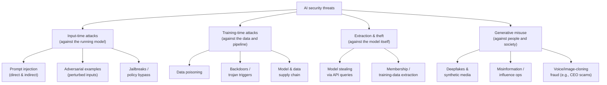

# Lesson 3-4: AI Security Threats and Risks

> Student follow-along resources, key concepts, and references for this sublesson.

## Overview

AI systems inherit every traditional IT security risk and add several new ones that classical security tooling does not natively address. This sublesson surveys the four threat categories called out in the lesson script — **adversarial attacks (including prompt injection), data poisoning, model extraction, and misinformation/deepfakes** — and grounds each one in the leading 2025 reference materials: the **OWASP Top 10 for LLM Applications (2025)**, **MITRE ATLAS** (the adversarial-ML knowledge base), the **NIST AI 100-2 adversarial-ML taxonomy**, and the **C2PA Content Credentials** standard for content provenance. The goal is not to make you a red teamer; it is to give you a working vocabulary, a sense of where the realistic risks are today, and a layered set of defenses you can ask for.

## Learning objectives

By the end of this sublesson you should be able to:

- Categorize AI security threats by where in the lifecycle they occur (input-time, training-time, model-extraction, output misuse).
- Explain prompt injection — both direct and indirect — and the defenses that actually help.
- Describe data poisoning and how training-data provenance and curation reduce it.
- Recognize model extraction and theft patterns and the controls that mitigate them.
- Discuss misinformation, deepfakes, and the role of watermarking and content provenance (C2PA) in mitigation.

## Key concepts

### 1. The threat landscape at a glance

Two reference catalogs are worth bookmarking:

- **OWASP Top 10 for LLM Applications (2025)** lists the ten highest-priority LLM application risks: prompt injection, sensitive information disclosure, supply chain, data and model poisoning, improper output handling, excessive agency, system prompt leakage, vector and embedding weaknesses, misinformation, and unbounded consumption.
- **MITRE ATLAS** is a living, ATT&CK-style matrix of *tactics, techniques, and procedures* that adversaries use against AI systems, with associated case studies and mitigations.

### 2. Adversarial inputs and prompt injection

**Adversarial examples** are inputs crafted so a model misbehaves. In computer vision, that often means small, imperceptible pixel changes that flip a classifier's label. In LLMs and multimodal systems, the dominant version is **prompt injection**.

- **Direct prompt injection.** A user types instructions designed to override the system prompt or policy ("ignore previous instructions and...").
- **Indirect prompt injection.** Instructions are *hidden in content the model later ingests* — a web page, a PDF, an email, an image, a tool response. When a copilot or agent retrieves that content, it executes the attacker's instructions. This is the dominant risk for any system that browses the web, reads documents, or uses tools.

**Layered defenses (no single one is sufficient):**

- **Trust boundaries.** Treat any model output and any retrieved content as *untrusted user input* for downstream systems.
- **Input/output guards.** Use safety classifiers, allow-lists, and policy-aware filters on both prompts and responses.
- **Hardened system prompts and structured prompting.** Separate roles, mark untrusted regions, and minimize tool privileges.
- **Capability limits.** Apply the principle of least privilege to tools the model can call, files it can read, and actions it can take. The OWASP "Excessive Agency" risk warns specifically against giving agents broad, unchecked tool access.
- **Detection and monitoring.** Log prompts, outputs, and tool calls; flag anomalous patterns; red-team regularly.

### 3. Training-time attacks: data poisoning, backdoors, and supply chain

Training-time attacks are attractive because they are durable: once a model has learned a poisoned behavior, it stays learned.

- **Data poisoning.** An attacker contaminates the training set so the model learns wrong, biased, or malicious behavior. Even small amounts of poisoned data can be enough.
- **Backdoors / trojans.** A specific *trigger* (a phrase, watermark, or pattern) causes the model to behave maliciously, while behavior is normal otherwise.
- **Supply-chain attacks.** Compromised pretrained checkpoints, compromised fine-tuning datasets, or compromised libraries pull poisoned behavior into the system.

**Mitigations:**

- **Curate and audit training data**, with provenance tracking, digital signatures, and source authentication (a core theme of the 2025 CISA AI Data Security guidance).
- **Pin and verify** model and dataset hashes; treat them like any other software dependency.
- **Test for anomalies** — out-of-distribution behavior, trigger-pattern probes, and bias evaluations after each training run.
- **Restrict who can write** to training and fine-tuning pipelines.

### 4. Model extraction, stealing, and training-data extraction

When a model is exposed via an API, attackers can attempt two related things:

- **Model extraction (model stealing).** Many crafted queries are sent to approximate the model's parameters or its decision surface, producing a near-copy. This threatens IP and can also help attackers find weaknesses to exploit later.
- **Training-data extraction (membership inference).** Targeted queries determine whether a specific record was in the training set, or even reconstruct fragments of training examples — a privacy risk as much as a security one.

**Mitigations:**

- **Rate limits and quotas** per user, key, and IP, with anomaly detection on suspicious query patterns.
- **Output controls** — limit logits and confidence scores returned, redact or summarize where appropriate.
- **Authentication and tenant isolation** for API keys; revoke and rotate aggressively.
- **Legal and contractual** protections — terms of service prohibiting reverse-engineering and model copying.
- **Differential privacy** during training for sensitive datasets to bound what any single record can leak.

### 5. Generative misuse: misinformation, deepfakes, and fraud

The same models that draft a marketing email can clone a voice, fabricate a video, or generate a bulk influence campaign. Organizational risk shows up in three flavors:

- **Reputational and societal harm** — fake content attributed to your brand or your executives.
- **Fraud** — voice and video cloning of executives or family members to authorize wire transfers or social-engineer staff.
- **Misuse of your own AI** — your generative system being used to mass-produce harmful or misleading content.

The defensive stack is a mix of technical and policy controls:

- **Content provenance.** The **C2PA Content Credentials** standard cryptographically binds metadata about how a piece of media was created and edited (including AI involvement) to the asset itself. Major platforms and tools (Adobe, Microsoft, Google, Meta, OpenAI for some products) are progressively adopting it.
- **Watermarking.** Invisible signals embedded in generated text, images, audio, or video to support detection. The EU AI Act includes transparency and labeling obligations for AI-generated content; several jurisdictions are moving toward similar mandates.
- **Detection.** Synthetic-media classifiers, voice-liveness checks, and out-of-band verification (e.g., a callback procedure for high-value financial requests).
- **Policy and process.** Clear internal rules on how generative AI may be used to create content, mandatory disclosure of synthetic media, and incident-response playbooks for impersonation events.

### 6. There is no silver bullet — defense is layered

A useful summary across all four categories:

| Threat category | Primary controls |
| --- | --- |
| Prompt injection / adversarial input | Input/output guards, capability limits, untrusted-content boundaries, monitoring |
| Data poisoning / supply chain | Provenance, curation, signed artifacts, integrity checks, post-training evals |
| Model extraction / theft | Auth, rate limits, anomaly detection, output minimization, legal terms |
| Misinformation / deepfakes | Provenance (C2PA), watermarking, detection, policy and disclosure |

You will rarely apply just one of these; security in AI systems looks like security everywhere else — overlapping, redundant, and continuously revisited.

## Why it matters / What's next

Security threats are where ethics, privacy, and engineering collide. A successful prompt-injection attack against a customer-service agent can violate accountability (who authorized that refund?), privacy (which records were exposed?), and safety (was the customer harmed?) all at once. Lesson 3-5 closes the loop by showing how an organization formalizes responses to these threats through **AI governance** — policy, risk management, and compliance — so threats are not handled ad hoc but as part of an auditable program.

## Glossary

- **Adversarial example** — Input crafted to make a model misclassify or misbehave.
- **Prompt injection (direct)** — User instructions in a prompt that override system policy.
- **Prompt injection (indirect)** — Hidden instructions in third-party content (web pages, files, tool outputs) that the model later ingests.
- **Jailbreak** — A prompt designed to bypass an LLM's safety policies.
- **Data poisoning** — Corrupting training or fine-tuning data so the model learns malicious behavior.
- **Backdoor / trojan** — A latent malicious behavior triggered by a specific input pattern.
- **Model extraction** — Cloning or approximating a model by querying its API.
- **Training-data extraction / membership inference** — Recovering training examples or membership status from a model.
- **Deepfake** — Synthetic image, audio, or video that convincingly impersonates a real person or event.
- **Watermarking** — Embedding signals in AI-generated content to support later detection.
- **Content Credentials (C2PA)** — Open standard for cryptographically signed provenance metadata on digital media.
- **Excessive agency** — OWASP risk: granting an LLM-driven system more tools, permissions, or autonomy than its trust level supports.

## Quick self-check

1. Distinguish *direct* from *indirect* prompt injection and give one example of each.
2. Name three controls you would put in front of a customer-facing LLM agent that has tool access.
3. What is the difference between *model extraction* and *training-data extraction*?
4. Why is "curate and verify your training data" listed as a security control, not just a quality control?
5. How does C2PA Content Credentials reduce risk from deepfakes — and what is one important limitation of any provenance or watermarking scheme?

## References and further reading

- OWASP — *Top 10 for Large Language Model applications (2025).* https://genai.owasp.org/llm-top-10/
- OWASP — *LLM01:2025 Prompt Injection.* https://genai.owasp.org/llmrisk/llm01-prompt-injection/
- OWASP — *Top 10 for LLM applications (project page).* https://owasp.org/www-project-top-10-for-large-language-model-applications/
- MITRE — *ATLAS: adversarial threat landscape for AI systems.* https://atlas.mitre.org/
- NIST — *AI 100-2 E2025: Adversarial Machine Learning — A Taxonomy and Terminology of Attacks and Mitigations.* https://csrc.nist.gov/publications/detail/nistir/ai-100-2/final
- CISA — *Best practices for securing AI data (May 2025).* https://www.cisa.gov/news-events/alerts/2025/05/22/new-best-practices-guide-securing-ai-data-released
- CISA / NSA / FBI / international partners — *AI Data Security: Best Practices.* https://media.defense.gov/2025/May/22/2003720601/-1/-1/0/CSI_AI_DATA_SECURITY.PDF
- C2PA — *Content Credentials and the C2PA standard.* https://c2pa.org/
- Microsoft — *Content Credentials and provenance for AI media.* https://www.microsoft.com/en-us/security/blog/2024/02/06/announcing-microsofts-content-credentials/
- European Commission — *EU AI Act: transparency obligations for AI-generated content.* https://artificialintelligenceact.eu/
- Google DeepMind — *SynthID: watermarking AI-generated content.* https://deepmind.google/technologies/synthid/
- IBM — *Adversarial machine learning explained.* https://www.ibm.com/think/topics/adversarial-machine-learning

### Omar's resources and references (course-wide)

#### Foundational cybersecurity resources in O'Reilly

This section provides a curated list of resources that delve into foundational cybersecurity concepts, frequently explored in O'Reilly training sessions and other educational offerings.

##### Live training

- **Upcoming Live Cybersecurity and AI Training in O'Reilly:** [Register before it is too late](https://learning.oreilly.com/search/?q=omar%20santos&type=live-course&rows=100&language_with_transcripts=en) (free with O'Reilly Subscription)

##### Reading list

Despite the rapidly evolving landscape of AI and technology, these books offer a comprehensive roadmap for understanding the intersection of these technologies with cybersecurity:

- **[NEW: Agentic AI for Cybersecurity: Building Autonomous Defenders and Adversaries](https://www.oreilly.com/library/view/agentic-ai-for/9780135589861/).** Unlock the power of next generation AI agents to transform cybersecurity, business operations, and productivity. [Available on O'Reilly](https://www.oreilly.com/library/view/agentic-ai-for/9780135589861/)

- **[Redefining Hacking](https://learning.oreilly.com/library/view/redefining-hacking-a/9780138363635/)** — A Comprehensive Guide to Red Teaming and Bug Bounty Hunting in an AI-driven World. [Available on O'Reilly](https://learning.oreilly.com/library/view/redefining-hacking-a/9780138363635/)

- **[AI-Powered Digital Cyber Resilience](https://www.oreilly.com/library/view/ai-powered-digital-cyber/9780135408599/)** — A practical guide to building intelligent, AI-powered cyber defenses in today's fast-evolving threat landscape. [Available on O'Reilly](https://www.oreilly.com/library/view/ai-powered-digital-cyber/9780135408599/)

- **[Developing Cybersecurity Programs and Policies in an AI-Driven World](https://learning.oreilly.com/library/view/developing-cybersecurity-programs/9780138073992)** — Explore strategies for creating robust cybersecurity frameworks in an AI-centric environment. [Available on O'Reilly](https://learning.oreilly.com/library/view/developing-cybersecurity-programs/9780138073992)

- **[Beyond the Algorithm: AI, Security, Privacy, and Ethics](https://learning.oreilly.com/library/view/beyond-the-algorithm/9780138268442)** — Gain insights into the ethical and security challenges posed by AI technologies. [Available on O'Reilly](https://learning.oreilly.com/library/view/beyond-the-algorithm/9780138268442)

- **[The AI Revolution in Networking, Cybersecurity, and Emerging Technologies](https://learning.oreilly.com/library/view/the-ai-revolution/9780138293703)** — Understand how AI is transforming networking and cybersecurity landscape. [Available on O'Reilly](https://learning.oreilly.com/library/view/the-ai-revolution/9780138293703)

##### Video courses

Enhance your practical skills with these video courses designed to deepen your understanding of cybersecurity:

- **[Building the Ultimate Cybersecurity Lab and Cyber Range](https://learning.oreilly.com/course/building-the-ultimate/9780138319090/)** (video). [Available on O'Reilly](https://learning.oreilly.com/course/building-the-ultimate/9780138319090/)

- **[Build Your Own AI Lab](https://learning.oreilly.com/course/build-your-own/9780135439616)** (video) — Hands-on guide to home and cloud-based AI labs. Learn to set up and optimize labs to research and experiment in a secure environment. [Available on O'Reilly](https://learning.oreilly.com/course/build-your-own/9780135439616)

- **[Defending and Deploying AI](https://www.oreilly.com/videos/defending-and-deploying/9780135463727/)** (video) — Comprehensive, hands-on journey into modern AI applications for technology and security professionals, covering AI-enabled programming, networking, and cybersecurity; securing generative AI (LLM security, prompt injection, red-teaming); secure AI labs; AI agents and agentic RAG for cybersecurity. [Available on O'Reilly](https://www.oreilly.com/videos/defending-and-deploying/9780135463727/)

- **[AI-Enabled Programming, Networking, and Cybersecurity](https://learning.oreilly.com/course/ai-enabled-programming-networking/9780135402696/)** — Learn to use AI for cybersecurity, networking, and programming tasks with practical, hands-on activities. [Available on O'Reilly](https://learning.oreilly.com/course/ai-enabled-programming-networking/9780135402696/)

- **[Securing Generative AI](https://learning.oreilly.com/course/securing-generative-ai/9780135401804/)** — Security for deploying and developing AI applications, RAG, agents, and other AI implementations; incorporate security at every stage of AI development, deployment, and operation. [Available on O'Reilly](https://learning.oreilly.com/course/securing-generative-ai/9780135401804/)

- **[Practical Cybersecurity Fundamentals](https://learning.oreilly.com/course/practical-cybersecurity-fundamentals/9780138037550/)** — Essential cybersecurity principles. [Available on O'Reilly](https://learning.oreilly.com/course/practical-cybersecurity-fundamentals/9780138037550/)

- **[The Art of Hacking](https://theartofhacking.org)** — Over 26 hours of training in ethical hacking and penetration testing (e.g., OSCP or CEH prep). [Visit The Art of Hacking](https://theartofhacking.org)

##### Certification related

- **CompTIA PenTest+ PT0-002 Cert Guide, 2nd Edition** — [Available on O'Reilly](https://learning.oreilly.com/library/view/comptia-pentest-pt0-002/9780137566204/)

- **Certified Ethical Hacker (CEH), Latest Edition** — Very comprehensive (19+ hours). [Available on O'Reilly](https://learning.oreilly.com/course/certified-ethical-hacker/9780135395646/)

- **Certified in Cybersecurity - CC (ISC)²** — [Available on O'Reilly](https://learning.oreilly.com/course/certified-in-cybersecurity/9780138230364/)

- **CCNP and CCIE Security Core SCOR 350-701 Official Cert Guide, 2nd Edition** — [Available on O'Reilly](https://learning.oreilly.com/library/view/ccnp-and-ccie/9780138221287/)

- **CEH Certified Ethical Hacker Cert Guide** — [Available on O'Reilly](https://learning.oreilly.com/library/view/ceh-certified-ethical/9780137489930/)

##### Additional resources

- **Hacking Scenarios (Labs) on O'Reilly** — Cloud-based labs; no local install. [https://hackingscenarios.com](https://hackingscenarios.com)

- **Personal blog** — [becomingahacker.org](https://becomingahacker.org)

- **Cisco blog** — [blogs.cisco.com/author/omarsantos](https://blogs.cisco.com/author/omarsantos)

- **GitHub repository** — [hackerrepo.org](https://hackerrepo.org)

- **WebSploit Labs** — [websploit.org](https://websploit.org)

- **NetAcad Ethical Hacker Free Course** — [NetAcad Skills for All](https://www.netacad.com/courses/ethical-hacker?courseLang=en-US)
