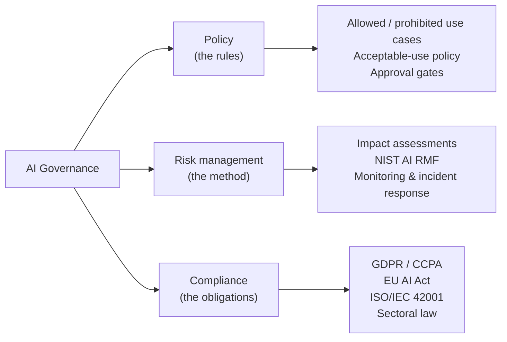

# Lesson 3-5: AI Governance Considerations

> Student follow-along resources, key concepts, and references for this sublesson.

## Overview

AI governance is what turns the principles, privacy controls, and security defenses from earlier sublessons into an **auditable, repeatable program** that an organization can stand behind. It has three reinforcing parts: **policy** (the rules), **risk management** (a structured way to identify, assess, and mitigate risks), and **compliance** (meeting legal, regulatory, and contractual obligations). This sublesson explains each part in concrete terms, walks through the **NIST AI Risk Management Framework's** four core functions — *Govern, Map, Measure, Manage* — and then maps the major regulatory landmarks of 2025–2026: the EU AI Act, ISO/IEC 42001, OECD principles, and US federal AI guidance (OMB memos and the Chief AI Officer role).

## Learning objectives

By the end of this sublesson you should be able to:

- Define AI governance and explain how it relates to policy, risk management, and compliance.
- Describe the four NIST AI RMF core functions (Govern, Map, Measure, Manage) and what each one produces.
- Distinguish the EU AI Act's risk tiers and recall the broad timeline of obligations.
- Explain how ISO/IEC 42001 and the NIST AI RMF complement each other in practice.
- Identify common governance roles and artifacts (Chief AI Officer, AI ethics committee, model owners, AI use-case inventories, model and system cards).

## Key concepts

### 1. The three pillars of AI governance

- **Policy** answers *what is allowed*. Typical artifacts: an enterprise AI policy, an acceptable-use policy for AI tools, a list of approved tools, a process for sensitive-use review, and incident reporting rules.
- **Risk management** answers *how we decide what's safe enough*. The dominant framework is the NIST AI RMF.
- **Compliance** answers *what we must do by law or contract*. This includes data-protection law, sector regulation, the EU AI Act, contractual commitments to customers, and certification standards like ISO/IEC 42001.

Policy without risk management becomes a poster on the wall; risk management without compliance ignores the legal floor; compliance without policy is brittle and reactive. Mature programs do all three.

### 2. The NIST AI Risk Management Framework

The **NIST AI RMF 1.0** (with the **Generative AI Profile, NIST AI 600-1** as a companion) organizes AI risk management into four core functions:

| Function | What it covers | Representative outputs |
| --- | --- | --- |
| **Govern** | Culture, accountability, policies, roles, training, vendor management, escalation. | AI policy, RACI, training program, AI ethics committee, AI use-case inventory. |
| **Map** | Context for the system: purpose, stakeholders, data flows, dependencies, assumptions, intended impact. | Use-case description, data flow diagrams, stakeholder analysis, risk register entries. |
| **Measure** | Evaluating the system: bias, accuracy, robustness, security, safety, environmental and social impact. | Test plans, fairness and safety evaluations, red-team reports, monitoring metrics. |
| **Manage** | Acting on what you measured: prioritizing, mitigating, accepting, transferring, or avoiding risk. | Mitigation plans, incident response, change management, end-of-life and decommissioning. |

The framework treats these as **continuous and overlapping**, not a one-time waterfall. The companion **NIST AI 600-1 GenAI Profile** adds specific guidance for generative AI risks (e.g., confabulation, harmful content, data leakage, value-chain risks).

### 3. The regulatory landscape in 2025–2026

You do not need to be a lawyer, but you should recognize the major instruments your governance program is mapping to:

- **EU AI Act (Regulation (EU) 2024/1689).** Risk-based regulation that classifies AI systems into four tiers:
  - **Unacceptable risk** — banned (e.g., social scoring by governments, certain biometric categorization).
  - **High risk** — strict obligations (risk management, data quality, technical documentation, logging, human oversight, accuracy/robustness/cybersecurity, post-market monitoring).
  - **Limited risk** — transparency obligations (e.g., labeling AI-generated content, disclosing chatbots).
  - **Minimal risk** — voluntary measures.
  
  Headline timeline: in force **August 2024**; prohibitions and AI-literacy obligations from **February 2025**; obligations for general-purpose AI models, governance, and penalties from **August 2025**; main obligations for high-risk systems from **August 2026**; remaining provisions through **2027**.
- **ISO/IEC 42001:2023.** The first international, certifiable standard for an **Artificial Intelligence Management System (AIMS)**. It provides clauses on context, leadership, planning, support, operation, performance evaluation, and improvement — much like ISO 27001 for information security. Many enterprises pursue ISO/IEC 42001 certification as evidence of due diligence.
- **OECD AI Principles** (2019, updated 2024). Foundational soft-law principles on inclusive growth, human-centered values and fairness, transparency, robustness and safety, and accountability. They underpin many national strategies.
- **US federal guidance.** OMB Memorandum **M-24-10** ("Advancing Governance, Innovation, and Risk Management for Agency Use of AI") required federal agencies to designate a **Chief AI Officer (CAIO)**, maintain an **AI use-case inventory**, and apply additional safeguards for **rights- and safety-impacting AI**. In 2025 OMB issued updated guidance (M-25-21 and M-25-22) that retains the CAIO role and the use-case inventory while adjusting other requirements; expect this area to keep evolving.
- **Sectoral and state law.** Financial regulators (e.g., model-risk guidance like SR 11-7 in the US, DORA in the EU), health regulators, and US state AI laws (e.g., Colorado AI Act, California ADMT regulations) layer additional obligations on top.

A pragmatic crosswalk used by many organizations: **NIST AI RMF** for the *operating model*, **ISO/IEC 42001** for the *management system and certification*, **EU AI Act** (and equivalents) for the *legal requirements*. Done well, the same controls satisfy all three.

### 4. Operationalizing governance

Governance becomes real through specific roles, artifacts, and rhythms:

- **Roles.** A Chief AI Officer or equivalent executive owner; an AI ethics or AI risk committee; named *model owners* and *use-case owners*; involvement from Legal, Privacy, Security, and the business.
- **Artifacts.** AI policy and acceptable-use policy; **AI use-case inventory**; **model cards** and **system cards**; **DPIAs / AI impact assessments** for high-risk uses; risk register; vendor / third-party model assessments; incident response playbooks.
- **Gates.** Pre-deployment review for sensitive uses; sign-off on data sources, evaluations, and human-oversight design; periodic re-review for live systems.
- **Monitoring.** Performance, fairness, drift, abuse, incidents — fed back into the risk register and into Manage.
- **Culture and training.** AI literacy across the organization (a specific obligation under the EU AI Act), tailored training for developers and approvers, and clear channels to raise concerns.

### 5. Governance is a living practice

Two recurring failure modes in AI governance:

1. **One-time approval, then silence.** A model is reviewed before launch and never again. Drift, abuse, and changing law are missed.
2. **Paper governance.** Policies exist but are not connected to actual development pipelines, vendor procurement, or incident response.

The fix in both cases is the same: tie governance artifacts directly to the engineering and procurement workflows that build, buy, and operate AI, and treat the program itself as something that is *measured and improved* (the Manage and Govern functions of NIST RMF, and Clauses 9–10 of ISO/IEC 42001).

## Why it matters / What's next

Lesson 3 has moved from a high-level introduction (3-1) through principles (3-2), data privacy and security (3-3), and AI-specific threats (3-4) to governance as the framework that holds it all together (3-5). A practitioner who understands these five sublessons together can speak credibly to engineers, lawyers, regulators, and executives — which is increasingly the baseline expected of anyone deploying AI in 2026.

In **Lesson 4** the course turns to a different topic — **Data Research and Analysis** — where AI helps with exploratory analysis, automated data preparation, and research workflows. Many of the ethics and privacy ideas introduced in Lesson 3 will reappear there, especially when the data being analyzed is personal or sensitive.

## Glossary

- **AI governance** — Policies, processes, and structures that ensure AI is developed and used responsibly and lawfully.
- **AI policy** — Internal rules defining acceptable, prohibited, and review-gated AI uses.
- **Risk management** — Structured identification, assessment, and treatment of risks.
- **Compliance** — Meeting legal, regulatory, and contractual obligations and being able to demonstrate it.
- **NIST AI RMF** — Voluntary US framework with four core functions: Govern, Map, Measure, Manage.
- **NIST AI 600-1** — Generative AI Profile companion to the AI RMF.
- **ISO/IEC 42001** — International standard for an AI Management System (AIMS).
- **EU AI Act** — EU regulation classifying AI by risk tier and imposing obligations on providers and deployers.
- **High-risk AI system** — Under the EU AI Act, AI used in defined sensitive contexts, subject to strict obligations.
- **Chief AI Officer (CAIO)** — Senior accountable executive for AI governance, required for US federal agencies and increasingly common in industry.
- **AI use-case inventory** — Authoritative list of where AI is used in an organization, with risk classification and ownership.
- **AI impact assessment** — Structured assessment of risks and harms of an AI use case before and during deployment.

## Quick self-check

1. In one sentence each, define the three pillars of AI governance: policy, risk management, compliance.
2. Name and briefly describe the four core functions of the NIST AI RMF.
3. Which EU AI Act risk tier carries the strictest obligations, and name two of those obligations.
4. How do ISO/IEC 42001 and the NIST AI RMF complement rather than compete with each other?
5. List four artifacts you would expect to see in a credible enterprise AI governance program.

## References and further reading

- NIST — *AI Risk Management Framework.* https://www.nist.gov/itl/ai-risk-management-framework
- NIST — *AI RMF Core (Govern, Map, Measure, Manage).* https://airc.nist.gov/airmf-resources/airmf/5-sec-core/
- NIST — *AI RMF Playbook.* https://www.nist.gov/itl/ai-risk-management-framework/nist-ai-rmf-playbook
- NIST — *AI RMF Generative AI Profile (NIST AI 600-1).* https://www.nist.gov/publications/artificial-intelligence-risk-management-framework-generative-artificial-intelligence
- European Commission — *EU AI Act (Regulation (EU) 2024/1689).* https://artificialintelligenceact.eu/
- EU AI Act — *Implementation timeline.* https://artificialintelligenceact.eu/implementation-timeline/
- ISO — *ISO/IEC 42001:2023 — AI management systems.* https://www.iso.org/standard/42001
- ISO — *ISO/IEC 42001 explained.* https://www.iso.org/home/insights-news/resources/iso-42001-explained-what-it-is.html
- OECD — *OECD AI Principles.* https://oecd.ai/en/ai-principles
- White House / OMB — *Memorandum M-24-10: Advancing governance, innovation, and risk management for agency use of AI.* https://www.whitehouse.gov/wp-content/uploads/2024/03/M-24-10-Advancing-Governance-Innovation-and-Risk-Management-for-Agency-Use-of-Artificial-Intelligence.pdf
- Cloud Security Alliance — *Using ISO/IEC 42001 and NIST AI RMF to help comply with the EU AI Act.* https://cloudsecurityalliance.org/blog/2025/01/29/how-can-iso-iec-42001-nist-ai-rmf-help-comply-with-the-eu-ai-act
- European Data Protection Supervisor — *Guidance on AI and data protection.* https://www.edps.europa.eu/data-protection/our-work/subjects/artificial-intelligence_en

### Omar's resources and references (course-wide)

#### Foundational cybersecurity resources in O'Reilly

This section provides a curated list of resources that delve into foundational cybersecurity concepts, frequently explored in O'Reilly training sessions and other educational offerings.

##### Live training

- **Upcoming Live Cybersecurity and AI Training in O'Reilly:** [Register before it is too late](https://learning.oreilly.com/search/?q=omar%20santos&type=live-course&rows=100&language_with_transcripts=en) (free with O'Reilly Subscription)

##### Reading list

Despite the rapidly evolving landscape of AI and technology, these books offer a comprehensive roadmap for understanding the intersection of these technologies with cybersecurity:

- **[NEW: Agentic AI for Cybersecurity: Building Autonomous Defenders and Adversaries](https://www.oreilly.com/library/view/agentic-ai-for/9780135589861/).** Unlock the power of next generation AI agents to transform cybersecurity, business operations, and productivity. [Available on O'Reilly](https://www.oreilly.com/library/view/agentic-ai-for/9780135589861/)

- **[Redefining Hacking](https://learning.oreilly.com/library/view/redefining-hacking-a/9780138363635/)** — A Comprehensive Guide to Red Teaming and Bug Bounty Hunting in an AI-driven World. [Available on O'Reilly](https://learning.oreilly.com/library/view/redefining-hacking-a/9780138363635/)

- **[AI-Powered Digital Cyber Resilience](https://www.oreilly.com/library/view/ai-powered-digital-cyber/9780135408599/)** — A practical guide to building intelligent, AI-powered cyber defenses in today's fast-evolving threat landscape. [Available on O'Reilly](https://www.oreilly.com/library/view/ai-powered-digital-cyber/9780135408599/)

- **[Developing Cybersecurity Programs and Policies in an AI-Driven World](https://learning.oreilly.com/library/view/developing-cybersecurity-programs/9780138073992)** — Explore strategies for creating robust cybersecurity frameworks in an AI-centric environment. [Available on O'Reilly](https://learning.oreilly.com/library/view/developing-cybersecurity-programs/9780138073992)

- **[Beyond the Algorithm: AI, Security, Privacy, and Ethics](https://learning.oreilly.com/library/view/beyond-the-algorithm/9780138268442)** — Gain insights into the ethical and security challenges posed by AI technologies. [Available on O'Reilly](https://learning.oreilly.com/library/view/beyond-the-algorithm/9780138268442)

- **[The AI Revolution in Networking, Cybersecurity, and Emerging Technologies](https://learning.oreilly.com/library/view/the-ai-revolution/9780138293703)** — Understand how AI is transforming networking and cybersecurity landscape. [Available on O'Reilly](https://learning.oreilly.com/library/view/the-ai-revolution/9780138293703)

##### Video courses

Enhance your practical skills with these video courses designed to deepen your understanding of cybersecurity:

- **[Building the Ultimate Cybersecurity Lab and Cyber Range](https://learning.oreilly.com/course/building-the-ultimate/9780138319090/)** (video). [Available on O'Reilly](https://learning.oreilly.com/course/building-the-ultimate/9780138319090/)

- **[Build Your Own AI Lab](https://learning.oreilly.com/course/build-your-own/9780135439616)** (video) — Hands-on guide to home and cloud-based AI labs. Learn to set up and optimize labs to research and experiment in a secure environment. [Available on O'Reilly](https://learning.oreilly.com/course/build-your-own/9780135439616)

- **[Defending and Deploying AI](https://www.oreilly.com/videos/defending-and-deploying/9780135463727/)** (video) — Comprehensive, hands-on journey into modern AI applications for technology and security professionals, covering AI-enabled programming, networking, and cybersecurity; securing generative AI (LLM security, prompt injection, red-teaming); secure AI labs; AI agents and agentic RAG for cybersecurity. [Available on O'Reilly](https://www.oreilly.com/videos/defending-and-deploying/9780135463727/)

- **[AI-Enabled Programming, Networking, and Cybersecurity](https://learning.oreilly.com/course/ai-enabled-programming-networking/9780135402696/)** — Learn to use AI for cybersecurity, networking, and programming tasks with practical, hands-on activities. [Available on O'Reilly](https://learning.oreilly.com/course/ai-enabled-programming-networking/9780135402696/)

- **[Securing Generative AI](https://learning.oreilly.com/course/securing-generative-ai/9780135401804/)** — Security for deploying and developing AI applications, RAG, agents, and other AI implementations; incorporate security at every stage of AI development, deployment, and operation. [Available on O'Reilly](https://learning.oreilly.com/course/securing-generative-ai/9780135401804/)

- **[Practical Cybersecurity Fundamentals](https://learning.oreilly.com/course/practical-cybersecurity-fundamentals/9780138037550/)** — Essential cybersecurity principles. [Available on O'Reilly](https://learning.oreilly.com/course/practical-cybersecurity-fundamentals/9780138037550/)

- **[The Art of Hacking](https://theartofhacking.org)** — Over 26 hours of training in ethical hacking and penetration testing (e.g., OSCP or CEH prep). [Visit The Art of Hacking](https://theartofhacking.org)

##### Certification related

- **CompTIA PenTest+ PT0-002 Cert Guide, 2nd Edition** — [Available on O'Reilly](https://learning.oreilly.com/library/view/comptia-pentest-pt0-002/9780137566204/)

- **Certified Ethical Hacker (CEH), Latest Edition** — Very comprehensive (19+ hours). [Available on O'Reilly](https://learning.oreilly.com/course/certified-ethical-hacker/9780135395646/)

- **Certified in Cybersecurity - CC (ISC)²** — [Available on O'Reilly](https://learning.oreilly.com/course/certified-in-cybersecurity/9780138230364/)

- **CCNP and CCIE Security Core SCOR 350-701 Official Cert Guide, 2nd Edition** — [Available on O'Reilly](https://learning.oreilly.com/library/view/ccnp-and-ccie/9780138221287/)

- **CEH Certified Ethical Hacker Cert Guide** — [Available on O'Reilly](https://learning.oreilly.com/library/view/ceh-certified-ethical/9780137489930/)

##### Additional resources

- **Hacking Scenarios (Labs) on O'Reilly** — Cloud-based labs; no local install. [https://hackingscenarios.com](https://hackingscenarios.com)

- **Personal blog** — [becomingahacker.org](https://becomingahacker.org)

- **Cisco blog** — [blogs.cisco.com/author/omarsantos](https://blogs.cisco.com/author/omarsantos)

- **GitHub repository** — [hackerrepo.org](https://hackerrepo.org)

- **WebSploit Labs** — [websploit.org](https://websploit.org)

- **NetAcad Ethical Hacker Free Course** — [NetAcad Skills for All](https://www.netacad.com/courses/ethical-hacker?courseLang=en-US)
