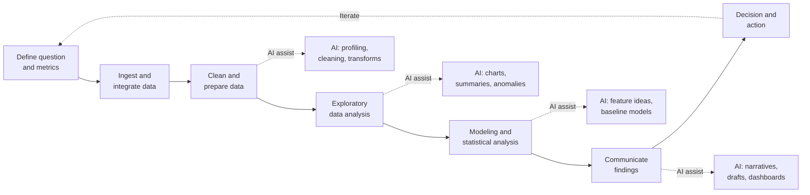

# Lesson 4-1: Introduction to Data Research and Analysis

> Student follow-along resources, key concepts, and references for this sublesson.

## Overview

Data only has value when it is turned into insight, decisions, and action. This sublesson opens Lesson 4 by framing how generative and agentic AI now sit inside the data research and analysis workflow — speeding up the slow, manual parts (profiling, cleaning, charting, drafting), while keeping humans responsible for what to ask, what to trust, and what to ship. The next four sublessons drill into the four main areas where AI changes day-to-day analytical work: exploratory data analysis (EDA), data preparation, ethics and privacy, and AI-assisted research and content drafting.

## Learning objectives

By the end of this sublesson you should be able to:

- Describe the end-to-end data analysis lifecycle and where AI now provides leverage.
- Distinguish "AI as a tool" from "AI as a collaborator" in modern analytics workflows.
- Explain why exploratory data analysis and data preparation are the largest time sinks in analytics.
- Identify the four focus areas covered in Lesson 4 and how they connect.
- Recognize key 2025–2026 trends in augmented analytics and agentic data workflows.

## Key concepts

### 1. The data analysis lifecycle and where AI fits

Modern data work follows a recognizable lifecycle. AI does not replace any single stage; it accelerates the slow stages and lowers the barrier to entry for non-specialists.

A common rule of thumb in industry is that **70–90 percent of analytics effort** is spent on preparation, exploration, and communication rather than on modeling. AI's biggest practical wins are concentrated in exactly those stages.

### 2. The four areas covered in Lesson 4

| Sublesson | Focus | Why it matters |
| --- | --- | --- |
| 4-2 EDA | Profiling, visualization, anomaly detection, hypothesis generation | Compresses the "what do we have?" phase from hours to minutes. |
| 4-3 Data preparation | Quality checks, formatting, transformation, cleaning | Removes the largest bottleneck in real analytics work. |
| 4-4 Ethics and privacy | Anonymization, controls, GDPR/CCPA, NIST guidance | Keeps AI use lawful, safe, and trusted. |
| 4-5 Research and drafting | Literature search, ideation, content drafting | Speeds knowledge work without giving up accuracy. |

### 3. From "AI as a tool" to "AI as a collaborator"

Through 2024 most teams used AI in narrow, single-shot ways: ask a chatbot for a snippet, paste it into a notebook. Through 2025 and into 2026 the dominant pattern is **agentic, conversational analytics** — the AI writes code, runs it, reads the output, and reports findings back, in a loop, while the analyst supervises.

Concretely, this shows up as:

- **Conversational analytics** in platforms such as Microsoft Fabric Copilot, Google BigQuery Conversational Analytics, Tableau Pulse, and Tellius — natural-language questions translated into governed SQL with audit trails.
- **AI-native notebooks** such as Hex, Deepnote, and Posit's Positron with the Databot agent, where the assistant has live access to the kernel and data.
- **General-purpose code execution** environments such as ChatGPT Advanced Data Analysis (formerly Code Interpreter) and Claude analysis tools that can ingest files, run Python, and return charts and narratives.
- **Embedded AI** in enterprise stacks (Salesforce Agentforce, SAP Joule, Databricks Genie) so that business users get analytic answers without leaving their system of record.

Two principles run through all of this:

1. **Human-in-the-loop is the default.** The analyst sets the question, validates assumptions, and decides what to trust.
2. **Governance-first is rising.** Audit trails, data lineage, and a semantic layer (canonical metric definitions) are increasingly considered table stakes so AI outputs can be verified and reproduced.

## Why it matters / What's next

If you only remember one thing from Lesson 4-1, remember that AI's value in analytics comes from **collapsing the cycle time** between a business question and a defensible answer — not from removing the human. The rest of Lesson 4 makes that concrete:

- **Lesson 4-2** shows how AI accelerates exploratory data analysis without replacing analyst judgment.
- **Lesson 4-3** covers automated data preparation — quality, formatting, transformation, and cleaning.
- **Lesson 4-4** covers the ethical and privacy guardrails you must apply when AI touches real data.
- **Lesson 4-5** covers AI-assisted research, ideation, and content drafting, where the same human-in-the-loop pattern applies to knowledge work.

## Glossary

- **Data analysis lifecycle** — The end-to-end sequence from question definition through ingestion, preparation, EDA, modeling, communication, and decision.
- **Augmented analytics** — Analytics workflows where AI/ML automates preparation, insight discovery, and explanation, with humans guiding and verifying.
- **Agentic analytics** — A workflow in which AI agents plan and execute multi-step analyses (write code, run it, read output, refine) under human oversight.
- **EDA (Exploratory Data Analysis)** — The phase of getting to know the data: distributions, missing values, outliers, and relationships.
- **Data preparation** — Cleaning, formatting, transforming, and joining raw data so it is fit for analysis.
- **Semantic layer** — A governed mapping between raw data and business concepts (metrics, dimensions) so AI and BI tools share the same definitions.
- **Conversational analytics** — Analytics tools that translate natural-language questions into queries against governed data.
- **Human-in-the-loop (HITL)** — A pattern where a human reviews, corrects, or approves AI-generated steps and outputs.
- **Governance-first AI** — A design stance that treats lineage, audit, access control, and policy as preconditions, not afterthoughts.

## Quick self-check

1. Roughly what fraction of analytics effort is spent on preparation and exploration rather than modeling, and why does that matter for AI's ROI?
2. Name the seven stages of the data analysis lifecycle shown in the diagram above.
3. Give one example of "AI as a collaborator" (not just "AI as a tool") in a modern data workflow.
4. What are the four focus areas covered in the rest of Lesson 4?
5. Why is a semantic layer important when business users query data through an AI assistant?

## References and further reading

- Microsoft — *Microsoft Fabric Copilot overview.* https://learn.microsoft.com/en-us/fabric/fundamentals/copilot-overview
- Google Cloud — *BigQuery Conversational Analytics (Predictive analytics reimagined).* https://medium.com/google-cloud/predictive-analytics-reimagined-with-bigquery-conversational-analytics-e8049a2c6173
- Tellius — *Augmented Analytics: Definition, Benefits, Use Cases.* https://www.tellius.com/resources/blog/augmented-analytics-in-2025-the-definitive-guide
- Domo — *Top AI Tools for Data Analysis in 2026.* https://www.domo.com/learn/article/ai-data-analysis-tools
- Hex — *What is exploratory data analysis? A practical guide.* https://hex.tech/blog/exploratory-data-analysis/
- Anomaly AI — *AI Data Analysis Trends 2026.* https://www.findanomaly.ai/ai-data-analysis-trends-2026
- Databricks — *Databricks AI/BI Genie (conversational analytics).* https://www.databricks.com/product/ai-bi
- Salesforce — *Agentforce for analytics.* https://www.salesforce.com/agentforce/
- Tellius — *AI Analytics Platforms 2026: 12 Tools Compared.* https://www.tellius.com/resources/blog/best-ai-analytics-platforms-in-2026-12-tools-compared-by-capability-governance-and-depth-of-insight

### Omar's resources and references (course-wide)

#### Foundational cybersecurity resources in O'Reilly

This section provides a curated list of resources that delve into foundational cybersecurity concepts, frequently explored in O'Reilly training sessions and other educational offerings.

##### Live training

- **Upcoming Live Cybersecurity and AI Training in O'Reilly:** [Register before it is too late](https://learning.oreilly.com/search/?q=omar%20santos&type=live-course&rows=100&language_with_transcripts=en) (free with O'Reilly Subscription)

##### Reading list

Despite the rapidly evolving landscape of AI and technology, these books offer a comprehensive roadmap for understanding the intersection of these technologies with cybersecurity:

- **[NEW: Agentic AI for Cybersecurity: Building Autonomous Defenders and Adversaries](https://www.oreilly.com/library/view/agentic-ai-for/9780135589861/).** Unlock the power of next generation AI agents to transform cybersecurity, business operations, and productivity. [Available on O'Reilly](https://www.oreilly.com/library/view/agentic-ai-for/9780135589861/)

- **[Redefining Hacking](https://learning.oreilly.com/library/view/redefining-hacking-a/9780138363635/)** — A Comprehensive Guide to Red Teaming and Bug Bounty Hunting in an AI-driven World. [Available on O'Reilly](https://learning.oreilly.com/library/view/redefining-hacking-a/9780138363635/)

- **[AI-Powered Digital Cyber Resilience](https://www.oreilly.com/library/view/ai-powered-digital-cyber/9780135408599/)** — A practical guide to building intelligent, AI-powered cyber defenses in today's fast-evolving threat landscape. [Available on O'Reilly](https://www.oreilly.com/library/view/ai-powered-digital-cyber/9780135408599/)

- **[Developing Cybersecurity Programs and Policies in an AI-Driven World](https://learning.oreilly.com/library/view/developing-cybersecurity-programs/9780138073992)** — Explore strategies for creating robust cybersecurity frameworks in an AI-centric environment. [Available on O'Reilly](https://learning.oreilly.com/library/view/developing-cybersecurity-programs/9780138073992)

- **[Beyond the Algorithm: AI, Security, Privacy, and Ethics](https://learning.oreilly.com/library/view/beyond-the-algorithm/9780138268442)** — Gain insights into the ethical and security challenges posed by AI technologies. [Available on O'Reilly](https://learning.oreilly.com/library/view/beyond-the-algorithm/9780138268442)

- **[The AI Revolution in Networking, Cybersecurity, and Emerging Technologies](https://learning.oreilly.com/library/view/the-ai-revolution/9780138293703)** — Understand how AI is transforming networking and cybersecurity landscape. [Available on O'Reilly](https://learning.oreilly.com/library/view/the-ai-revolution/9780138293703)

##### Video courses

Enhance your practical skills with these video courses designed to deepen your understanding of cybersecurity:

- **[Building the Ultimate Cybersecurity Lab and Cyber Range](https://learning.oreilly.com/course/building-the-ultimate/9780138319090/)** (video). [Available on O'Reilly](https://learning.oreilly.com/course/building-the-ultimate/9780138319090/)

- **[Build Your Own AI Lab](https://learning.oreilly.com/course/build-your-own/9780135439616)** (video) — Hands-on guide to home and cloud-based AI labs. Learn to set up and optimize labs to research and experiment in a secure environment. [Available on O'Reilly](https://learning.oreilly.com/course/build-your-own/9780135439616)

- **[Defending and Deploying AI](https://www.oreilly.com/videos/defending-and-deploying/9780135463727/)** (video) — Comprehensive, hands-on journey into modern AI applications for technology and security professionals, covering AI-enabled programming, networking, and cybersecurity; securing generative AI (LLM security, prompt injection, red-teaming); secure AI labs; AI agents and agentic RAG for cybersecurity. [Available on O'Reilly](https://www.oreilly.com/videos/defending-and-deploying/9780135463727/)

- **[AI-Enabled Programming, Networking, and Cybersecurity](https://learning.oreilly.com/course/ai-enabled-programming-networking/9780135402696/)** — Learn to use AI for cybersecurity, networking, and programming tasks with practical, hands-on activities. [Available on O'Reilly](https://learning.oreilly.com/course/ai-enabled-programming-networking/9780135402696/)

- **[Securing Generative AI](https://learning.oreilly.com/course/securing-generative-ai/9780135401804/)** — Security for deploying and developing AI applications, RAG, agents, and other AI implementations; incorporate security at every stage of AI development, deployment, and operation. [Available on O'Reilly](https://learning.oreilly.com/course/securing-generative-ai/9780135401804/)

- **[Practical Cybersecurity Fundamentals](https://learning.oreilly.com/course/practical-cybersecurity-fundamentals/9780138037550/)** — Essential cybersecurity principles. [Available on O'Reilly](https://learning.oreilly.com/course/practical-cybersecurity-fundamentals/9780138037550/)

- **[The Art of Hacking](https://theartofhacking.org)** — Over 26 hours of training in ethical hacking and penetration testing (e.g., OSCP or CEH prep). [Visit The Art of Hacking](https://theartofhacking.org)

##### Certification related

- **CompTIA PenTest+ PT0-002 Cert Guide, 2nd Edition** — [Available on O'Reilly](https://learning.oreilly.com/library/view/comptia-pentest-pt0-002/9780137566204/)

- **Certified Ethical Hacker (CEH), Latest Edition** — Very comprehensive (19+ hours). [Available on O'Reilly](https://learning.oreilly.com/course/certified-ethical-hacker/9780135395646/)

- **Certified in Cybersecurity - CC (ISC)²** — [Available on O'Reilly](https://learning.oreilly.com/course/certified-in-cybersecurity/9780138230364/)

- **CCNP and CCIE Security Core SCOR 350-701 Official Cert Guide, 2nd Edition** — [Available on O'Reilly](https://learning.oreilly.com/library/view/ccnp-and-ccie/9780138221287/)

- **CEH Certified Ethical Hacker Cert Guide** — [Available on O'Reilly](https://learning.oreilly.com/library/view/ceh-certified-ethical/9780137489930/)

##### Additional resources

- **Hacking Scenarios (Labs) on O'Reilly** — Cloud-based labs; no local install. [https://hackingscenarios.com](https://hackingscenarios.com)

- **Personal blog** — [becomingahacker.org](https://becomingahacker.org)

- **Cisco blog** — [blogs.cisco.com/author/omarsantos](https://blogs.cisco.com/author/omarsantos)

- **GitHub repository** — [hackerrepo.org](https://hackerrepo.org)

- **WebSploit Labs** — [websploit.org](https://websploit.org)

- **NetAcad Ethical Hacker Free Course** — [NetAcad Skills for All](https://www.netacad.com/courses/ethical-hacker?courseLang=en-US)
