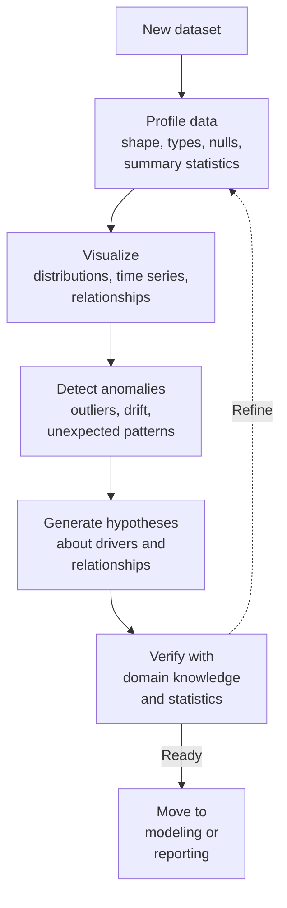
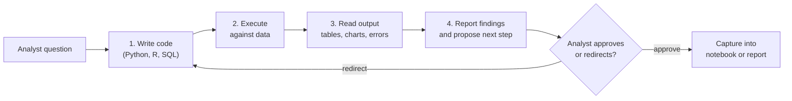

# Lesson 4-2: AI's Role in Exploratory Data Analysis (EDA)

> Student follow-along resources, key concepts, and references for this sublesson.

## Overview

Exploratory data analysis (EDA) is the phase where analysts and data scientists "get to know" a dataset — its distributions, missing values, outliers, and relationships — before any modeling begins. EDA traditionally consumes a large share of a project's time. Modern AI assistants compress that time by writing and running code in Python, R, or SQL, generating profile reports and visualizations, surfacing anomalies, and proposing hypotheses. The crucial constraint is that the analyst still drives: AI handles execution and suggestion; the human decides what to explore and what to trust.

## Learning objectives

By the end of this sublesson you should be able to:

- Define exploratory data analysis and list its core activities.
- Explain how AI accelerates each EDA activity (profiling, visualization, anomaly detection, hypothesis generation).
- Describe the "write, execute, analyze, report" loop used by modern EDA agents such as Posit's Databot.
- Identify common AI-assisted EDA tools available in 2025–2026 (ChatGPT Advanced Data Analysis, Hex, Deepnote, Julius AI, ydata-profiling).
- Apply human-in-the-loop verification to AI-generated EDA outputs.

## Key concepts

### 1. What EDA actually involves

EDA is the work of building intuition about a dataset before committing to a model or a conclusion. It typically loops through these activities:

EDA is iterative: each finding refines the next question. AI shortens each loop.

### 2. Where AI helps in EDA

| EDA activity | What AI does well | Watch out for |
| --- | --- | --- |
| Profiling | Generate summary statistics, dtype checks, missingness reports, cardinality, correlations from a one-line prompt or a tool such as `ydata-profiling`. | Profile reports are descriptive, not causal. They flag *what* is unusual, not *why*. |
| Visualization | Suggest appropriate chart types from column types and the question; produce histograms, boxplots, scatterplots, time-series, and faceted views. | Default chart choices can mislead (truncated axes, log scales, dual-axis tricks). |
| Anomaly detection | Highlight outliers, structural breaks, sudden distribution shifts, surprising correlations. | "Anomaly" is context-dependent — a real seasonal spike can look anomalous. |
| Hypothesis generation | Propose plausible drivers and segmentations to test next. | LLMs can confidently propose spurious relationships; treat suggestions as starting points. |
| Code authoring | Write pandas, R `tidyverse`, or SQL snippets for the steps above and re-run them on edits. | Read every line before trusting the output, especially joins and filters. |

### 3. The agentic EDA loop

Modern AI-native data tools execute a tight feedback loop rather than just emitting a single answer. Posit calls this **write, execute, analyze, report** in their Databot agent for the Positron IDE; ChatGPT's **Advanced Data Analysis** (formerly Code Interpreter) follows the same shape inside a sandboxed Python environment; Hex's **Notebook Agent** and Deepnote's AI do this directly in collaborative notebooks.

Useful properties of this loop:

- **Reproducibility:** the code, not just the answer, is preserved.
- **Verifiability:** the analyst can read and edit each step.
- **Iteration speed:** the agent re-runs everything when assumptions change.

### 4. Tools landscape (2025–2026)

- **Notebook agents:** Posit Databot in Positron, Hex Notebook Agent, Deepnote AI, JetBrains DataSpell AI, Jupyter AI.
- **Conversational EDA on uploaded files:** ChatGPT Advanced Data Analysis, Claude file analysis, Julius AI, Rows.com.
- **Conversational analytics over warehouses:** BigQuery Conversational Analytics with Gemini, Microsoft Fabric Copilot, Tableau Pulse, Tellius, Databricks Genie.
- **Open-source profiling:** `ydata-profiling` (formerly pandas-profiling), `sweetviz`, `AutoViz`, `D-Tale`. Often combined with an AI assistant that explains the report.

A practical, pragmatic stack for an individual analyst in 2026 looks like: a Jupyter or Positron-style notebook with an AI agent attached, `pandas` plus `ydata-profiling` for the first pass, and a chat-style assistant for ad-hoc questions on the same data.

### 5. Human-in-the-loop verification

Treat AI-generated EDA output the same way you would treat output from a junior analyst:

- **Read the code.** Confirm the join keys, filters, and aggregations match your intent.
- **Check the assumptions.** Ask the assistant to state its assumptions explicitly (units, time zone, fiscal calendar, definition of "active user").
- **Sanity-check the numbers.** Reproduce one or two key figures by hand or with a different query.
- **Watch for hallucinated columns or values.** AI agents occasionally invent column names or fabricate sample rows; always validate against the schema.
- **Document.** Keep the prompt, the generated code, and the result together in the notebook so the work is reproducible.

## Why it matters / What's next

EDA is where most analytical mistakes are seeded — wrong joins, missed nulls, misinterpreted distributions — and also where the most time disappears. AI compresses that work without removing the analyst's responsibility. The next sublesson, **Lesson 4-3: Automated Data Preparation**, applies the same pattern one stage upstream: AI helps with quality checks, formatting, transformation, and cleaning, and the same human-in-the-loop discipline applies even more strongly because prep mistakes propagate through every downstream chart and model.

## Glossary

- **EDA (Exploratory Data Analysis)** — Iterative process of profiling, visualizing, and questioning a dataset before formal modeling.
- **Data profiling** — Automated description of a dataset's structure and quality (types, nulls, uniqueness, distributions, correlations).
- **Notebook agent** — An AI assistant embedded in a notebook (Jupyter, Positron, Hex, Deepnote) with live access to the kernel and data.
- **Advanced Data Analysis** — OpenAI's renamed Code Interpreter; a sandboxed Python environment inside ChatGPT for file analysis.
- **Databot** — Posit's AI agent built into the Positron IDE that follows a write-execute-analyze-report loop.
- **Anomaly detection** — Statistical or ML methods (and now LLM-driven heuristics) for flagging unusual records, segments, or patterns.
- **Hypothesis generation** — Producing candidate explanations or relationships to test, often suggested by an AI assistant.
- **`ydata-profiling`** — Open-source Python library that generates a one-line, comprehensive HTML profile report from a pandas DataFrame.

## Quick self-check

1. List four core activities that make up exploratory data analysis.
2. Describe the "write, execute, analyze, report" loop in your own words.
3. Give one example of how AI can mislead during EDA, and one specific check you would run to catch it.
4. Name two AI-native notebook environments and one open-source profiling library.
5. Why is reading the AI's generated code (not just the result) important for trustworthy EDA?

## References and further reading

- Posit — *Positron IDE and Databot.* https://positron.posit.co
- OpenAI — *ChatGPT Advanced Data Analysis (Code Interpreter).* https://help.openai.com/en/articles/8554407-advanced-data-analysis
- MIT Sloan EdTech — *How to Use ChatGPT's Advanced Data Analysis Feature.* https://mitsloanedtech.mit.edu/ai/tools/how-to-use-chatgpts-advanced-data-analysis-feature/
- Hex — *What is exploratory data analysis? A practical guide.* https://hex.tech/blog/exploratory-data-analysis/
- Deepnote — *Hex vs Deepnote: a side-by-side comparison for 2026.* https://deepnote.com/compare/hex-vs-deepnote
- YData — *YData Profiling documentation.* https://ydata-profiling.ydata.ai/
- Towards Data Science — *5 Powerful Python Libraries for EDA.* https://towardsdatascience.com/5-powerful-python-libraries-you-need-to-know-to-enhance-your-eda-process-f0100d563c16/
- Atlan — *Top Data Profiling Tools in 2025.* https://atlan.com/know/data-profiling-tools/
- Google Cloud — *Predictive analytics reimagined with BigQuery Conversational Analytics.* https://medium.com/google-cloud/predictive-analytics-reimagined-with-bigquery-conversational-analytics-e8049a2c6173
- Pluralsight — *ChatGPT's Code Interpreter is now Advanced Data Analysis.* https://www.pluralsight.com/resources/blog/ai-and-data/ChatGPT-Advanced-Data-Analytics
- Pandas documentation — *Getting started: descriptive statistics and EDA.* https://pandas.pydata.org/docs/getting_started/intro_tutorials/06_calculate_statistics.html

### Omar's resources and references (course-wide)

#### Foundational cybersecurity resources in O'Reilly

This section provides a curated list of resources that delve into foundational cybersecurity concepts, frequently explored in O'Reilly training sessions and other educational offerings.

##### Live training

- **Upcoming Live Cybersecurity and AI Training in O'Reilly:** [Register before it is too late](https://learning.oreilly.com/search/?q=omar%20santos&type=live-course&rows=100&language_with_transcripts=en) (free with O'Reilly Subscription)

##### Reading list

Despite the rapidly evolving landscape of AI and technology, these books offer a comprehensive roadmap for understanding the intersection of these technologies with cybersecurity:

- **[NEW: Agentic AI for Cybersecurity: Building Autonomous Defenders and Adversaries](https://www.oreilly.com/library/view/agentic-ai-for/9780135589861/).** Unlock the power of next generation AI agents to transform cybersecurity, business operations, and productivity. [Available on O'Reilly](https://www.oreilly.com/library/view/agentic-ai-for/9780135589861/)

- **[Redefining Hacking](https://learning.oreilly.com/library/view/redefining-hacking-a/9780138363635/)** — A Comprehensive Guide to Red Teaming and Bug Bounty Hunting in an AI-driven World. [Available on O'Reilly](https://learning.oreilly.com/library/view/redefining-hacking-a/9780138363635/)

- **[AI-Powered Digital Cyber Resilience](https://www.oreilly.com/library/view/ai-powered-digital-cyber/9780135408599/)** — A practical guide to building intelligent, AI-powered cyber defenses in today's fast-evolving threat landscape. [Available on O'Reilly](https://www.oreilly.com/library/view/ai-powered-digital-cyber/9780135408599/)

- **[Developing Cybersecurity Programs and Policies in an AI-Driven World](https://learning.oreilly.com/library/view/developing-cybersecurity-programs/9780138073992)** — Explore strategies for creating robust cybersecurity frameworks in an AI-centric environment. [Available on O'Reilly](https://learning.oreilly.com/library/view/developing-cybersecurity-programs/9780138073992)

- **[Beyond the Algorithm: AI, Security, Privacy, and Ethics](https://learning.oreilly.com/library/view/beyond-the-algorithm/9780138268442)** — Gain insights into the ethical and security challenges posed by AI technologies. [Available on O'Reilly](https://learning.oreilly.com/library/view/beyond-the-algorithm/9780138268442)

- **[The AI Revolution in Networking, Cybersecurity, and Emerging Technologies](https://learning.oreilly.com/library/view/the-ai-revolution/9780138293703)** — Understand how AI is transforming networking and cybersecurity landscape. [Available on O'Reilly](https://learning.oreilly.com/library/view/the-ai-revolution/9780138293703)

##### Video courses

Enhance your practical skills with these video courses designed to deepen your understanding of cybersecurity:

- **[Building the Ultimate Cybersecurity Lab and Cyber Range](https://learning.oreilly.com/course/building-the-ultimate/9780138319090/)** (video). [Available on O'Reilly](https://learning.oreilly.com/course/building-the-ultimate/9780138319090/)

- **[Build Your Own AI Lab](https://learning.oreilly.com/course/build-your-own/9780135439616)** (video) — Hands-on guide to home and cloud-based AI labs. Learn to set up and optimize labs to research and experiment in a secure environment. [Available on O'Reilly](https://learning.oreilly.com/course/build-your-own/9780135439616)

- **[Defending and Deploying AI](https://www.oreilly.com/videos/defending-and-deploying/9780135463727/)** (video) — Comprehensive, hands-on journey into modern AI applications for technology and security professionals, covering AI-enabled programming, networking, and cybersecurity; securing generative AI (LLM security, prompt injection, red-teaming); secure AI labs; AI agents and agentic RAG for cybersecurity. [Available on O'Reilly](https://www.oreilly.com/videos/defending-and-deploying/9780135463727/)

- **[AI-Enabled Programming, Networking, and Cybersecurity](https://learning.oreilly.com/course/ai-enabled-programming-networking/9780135402696/)** — Learn to use AI for cybersecurity, networking, and programming tasks with practical, hands-on activities. [Available on O'Reilly](https://learning.oreilly.com/course/ai-enabled-programming-networking/9780135402696/)

- **[Securing Generative AI](https://learning.oreilly.com/course/securing-generative-ai/9780135401804/)** — Security for deploying and developing AI applications, RAG, agents, and other AI implementations; incorporate security at every stage of AI development, deployment, and operation. [Available on O'Reilly](https://learning.oreilly.com/course/securing-generative-ai/9780135401804/)

- **[Practical Cybersecurity Fundamentals](https://learning.oreilly.com/course/practical-cybersecurity-fundamentals/9780138037550/)** — Essential cybersecurity principles. [Available on O'Reilly](https://learning.oreilly.com/course/practical-cybersecurity-fundamentals/9780138037550/)

- **[The Art of Hacking](https://theartofhacking.org)** — Over 26 hours of training in ethical hacking and penetration testing (e.g., OSCP or CEH prep). [Visit The Art of Hacking](https://theartofhacking.org)

##### Certification related

- **CompTIA PenTest+ PT0-002 Cert Guide, 2nd Edition** — [Available on O'Reilly](https://learning.oreilly.com/library/view/comptia-pentest-pt0-002/9780137566204/)

- **Certified Ethical Hacker (CEH), Latest Edition** — Very comprehensive (19+ hours). [Available on O'Reilly](https://learning.oreilly.com/course/certified-ethical-hacker/9780135395646/)

- **Certified in Cybersecurity - CC (ISC)²** — [Available on O'Reilly](https://learning.oreilly.com/course/certified-in-cybersecurity/9780138230364/)

- **CCNP and CCIE Security Core SCOR 350-701 Official Cert Guide, 2nd Edition** — [Available on O'Reilly](https://learning.oreilly.com/library/view/ccnp-and-ccie/9780138221287/)

- **CEH Certified Ethical Hacker Cert Guide** — [Available on O'Reilly](https://learning.oreilly.com/library/view/ceh-certified-ethical/9780137489930/)

##### Additional resources

- **Hacking Scenarios (Labs) on O'Reilly** — Cloud-based labs; no local install. [https://hackingscenarios.com](https://hackingscenarios.com)

- **Personal blog** — [becomingahacker.org](https://becomingahacker.org)

- **Cisco blog** — [blogs.cisco.com/author/omarsantos](https://blogs.cisco.com/author/omarsantos)

- **GitHub repository** — [hackerrepo.org](https://hackerrepo.org)

- **WebSploit Labs** — [websploit.org](https://websploit.org)

- **NetAcad Ethical Hacker Free Course** — [NetAcad Skills for All](https://www.netacad.com/courses/ethical-hacker?courseLang=en-US)
