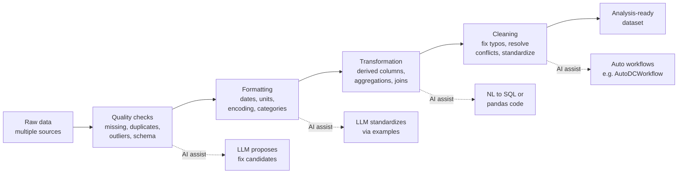

# Lesson 4-3: Automated Data Preparation

> Student follow-along resources, key concepts, and references for this sublesson.

## Overview

Data preparation — cleaning, formatting, transforming, and joining data so it is ready for analysis — is the largest time sink in analytics. Industry surveys consistently put it at well over half, and often closer to 80–90 percent, of the total effort on a project. AI now automates or assists with most of these tasks: it can profile a dataset for quality issues, propose fixes, generate transformation pipelines from natural language, and execute them against a warehouse. This sublesson maps out the categories of automated preparation, current 2025–2026 tools and frameworks, and the human oversight required to use them responsibly.

## Learning objectives

By the end of this sublesson you should be able to:

- Explain why data preparation is the biggest bottleneck in real analytics work.
- Distinguish the four main categories of automated preparation: quality checks, formatting, transformation, and cleaning.
- Describe how LLM-based agents and AI-assisted preparation tools generate executable pipelines from natural language.
- Evaluate when AI-generated preparation steps are safe to apply automatically versus when human review is required.
- Identify representative tools and frameworks (BigQuery AI data preparation, AutoDCWorkflow, DataFlow, dbt Copilot, Microsoft Fabric Data Wrangler).

## Key concepts

### 1. Why preparation dominates the work

Raw data almost never matches the analytical question. Common problems include:

- Missing values, duplicates, and inconsistent encodings.
- Different date formats, time zones, currencies, and unit systems across sources.
- Free-text fields with typos, casing differences, and inconsistent categories.
- Joins that look obvious but fail silently because of key mismatches or many-to-many relationships.
- Schema drift between sources and over time.

Each of these is mechanical, repetitive, and well-suited to AI assistance — but each also has long-tail edge cases where blind automation produces wrong answers downstream.

### 2. The four categories of automated preparation

| Category | Typical tasks | What AI adds |
| --- | --- | --- |
| Quality checks | Detect missing values, duplicates, type mismatches, schema breaks, outliers. | Generate and run profile reports; summarize the issues in plain language; rank severity. |
| Formatting | Standardize date formats, units, currencies, casing, categorical values. | Infer the canonical format from examples; rewrite values consistently. |
| Transformation | Derive new columns, aggregate, pivot, join across sources. | Translate natural-language goals (e.g., "revenue per active user per week") into SQL or pandas. |
| Cleaning | Fix typos, deduplicate, reconcile conflicting values, resolve identifiers. | Propose multi-step cleaning workflows (e.g., AutoDCWorkflow) and apply OpenRefine-style operators. |

### 3. Tools and frameworks in 2025–2026

The landscape splits into three layers:

- **In-warehouse AI preparation:**
  - **Google BigQuery AI-assisted data preparation** uses Gemini to suggest schema mappings, join keys, standardizations, and transformations directly inside the warehouse.
  - **Microsoft Fabric Data Wrangler / Copilot** provides natural-language data prep over OneLake.
  - **Snowflake Cortex** offers LLM functions for cleaning, classification, and entity resolution as SQL functions.
  - **Databricks AI/BI Genie and Data Intelligence Platform** layer AI assistance over notebooks, jobs, and Unity Catalog–governed data.
- **Pipeline frameworks and dbt-style tools:**
  - **dbt Copilot** generates and reviews dbt models in natural language.
  - **DataFlow** and similar agentic frameworks turn natural-language specifications into executable, reusable preparation pipelines using libraries of operators.
  - **Airflow / Dagster** integrations now ship with AI assistants that draft DAGs and detect schema drift.
- **Local / notebook preparation:**
  - **`pandas`**, **`polars`**, and **`scikit-learn`** preprocessing remain the workhorses for code-first prep.
  - **`ydata-profiling`** generates the quality report; an LLM assistant then proposes targeted fixes.
  - Research systems such as **AutoDCWorkflow** (EMNLP 2025 Findings) auto-generate multi-step OpenRefine-style cleaning workflows from a natural-language goal.

### 4. The natural-language to pipeline pattern

A recurring pattern across these tools:

1. The user states an outcome in natural language ("Standardize all dates to ISO 8601, deduplicate by email, and create a `revenue_per_unit` column").
2. The AI inspects the schema and a sample of the data.
3. The AI emits a sequence of operators or generated code (SQL, dbt, pandas, OpenRefine).
4. The system shows a preview before applying changes.
5. The user approves, edits, or rejects each step.

This makes prep **explicit, reviewable, and reproducible** — closer to a code review than a black-box transform.

### 5. Human oversight is non-negotiable

AI-generated preparation is fast, but the cost of an undetected mistake is high because every downstream chart and model inherits it. Practical guardrails:

- **Validate against domain knowledge.** A product manager or subject-matter expert should sign off on category collapses ("Is `Mobile - iOS` and `iOS - Mobile` really the same bucket?").
- **Test on a sample first.** Apply the proposed pipeline to a small sample and diff the output before running it on the full dataset.
- **Lock in unit tests.** Use frameworks like `dbt tests`, **Great Expectations**, or **Soda** to assert invariants (row counts, null rates, key uniqueness) so AI-generated changes do not silently break them.
- **Record provenance.** Capture the prompt, the generated steps, and the version of the dataset; treat preparation as code under version control.
- **Prefer reversible operations.** Add columns rather than overwriting them when feasible, so a bad cleaning step can be rolled back.

## Why it matters / What's next

Automated data preparation is where AI delivers the most measurable productivity gains in analytics today, but it is also where errors are most damaging because they propagate. Treat AI as a fast, reviewable junior data engineer: it drafts pipelines, you approve them. The next sublesson, **Lesson 4-4: Ethical and Privacy Considerations**, looks at the constraints that apply when the data being prepared and analyzed contains personal or sensitive information — including what to send (and not send) to a cloud LLM in the first place.

## Glossary

- **Data preparation** — All work that turns raw, multi-source data into an analysis-ready dataset.
- **Quality checks** — Tests for missing values, duplicates, type mismatches, outliers, and schema integrity.
- **Formatting** — Standardizing representations (dates, units, casing, categorical values) across sources.
- **Transformation** — Deriving new columns, aggregating, pivoting, and joining data.
- **Cleaning** — Resolving typos, conflicting values, and identifier mismatches.
- **Pipeline** — A reproducible, ordered sequence of preparation steps, usually expressed as code or a DAG.
- **AutoDCWorkflow** — A 2024–2025 research framework that uses LLMs to auto-generate data-cleaning workflows from natural-language goals.
- **dbt** — A widely used SQL transformation framework for the modern data warehouse, increasingly paired with AI copilots.
- **Great Expectations / Soda** — Data quality testing frameworks that codify and run assertions against datasets.
- **Schema drift** — Changes in the structure or types of source data over time, often a major cause of pipeline failures.

## Quick self-check

1. Why is data preparation typically a larger time sink than modeling?
2. Name the four categories of automated preparation and give an example task in each.
3. Describe the natural-language-to-pipeline pattern in five steps.
4. Name two in-warehouse AI prep tools and two open-source / notebook tools.
5. List three concrete guardrails you would put in place before letting an AI agent run a preparation pipeline against production data.

## References and further reading

- Google Cloud — *Prepare data with Gemini in BigQuery (AI-assisted data preparation).* https://cloud.google.com/bigquery/docs/data-preparation-overview
- Google Cloud — *Predictive analytics reimagined with BigQuery Conversational Analytics.* https://medium.com/google-cloud/predictive-analytics-reimagined-with-bigquery-conversational-analytics-e8049a2c6173
- Microsoft — *Data Wrangler and Copilot in Microsoft Fabric.* https://learn.microsoft.com/en-us/fabric/data-science/data-wrangler
- Snowflake — *Cortex AI functions for data preparation.* https://docs.snowflake.com/en/user-guide/snowflake-cortex/llm-functions
- Databricks — *Databricks AI/BI and Data Intelligence Platform.* https://www.databricks.com/product/ai-bi
- dbt Labs — *dbt Copilot.* https://docs.getdbt.com/docs/cloud/dbt-copilot
- ACL Anthology — *AutoDCWorkflow: LLM-based Data Cleaning Workflow Auto-Generation and Benchmark (EMNLP 2025 Findings).* https://aclanthology.org/2025.findings-emnlp.410/
- arXiv — *AutoDCWorkflow paper preprint.* https://arxiv.org/abs/2412.06724
- pandas — *Working with missing data.* https://pandas.pydata.org/docs/user_guide/missing_data.html
- scikit-learn — *Preprocessing data.* https://scikit-learn.org/stable/modules/preprocessing.html
- Great Expectations — *Documentation.* https://docs.greatexpectations.io/docs/
- Soda — *Data quality testing.* https://docs.soda.io/

### Omar's resources and references (course-wide)

#### Foundational cybersecurity resources in O'Reilly

This section provides a curated list of resources that delve into foundational cybersecurity concepts, frequently explored in O'Reilly training sessions and other educational offerings.

##### Live training

- **Upcoming Live Cybersecurity and AI Training in O'Reilly:** [Register before it is too late](https://learning.oreilly.com/search/?q=omar%20santos&type=live-course&rows=100&language_with_transcripts=en) (free with O'Reilly Subscription)

##### Reading list

Despite the rapidly evolving landscape of AI and technology, these books offer a comprehensive roadmap for understanding the intersection of these technologies with cybersecurity:

- **[NEW: Agentic AI for Cybersecurity: Building Autonomous Defenders and Adversaries](https://www.oreilly.com/library/view/agentic-ai-for/9780135589861/).** Unlock the power of next generation AI agents to transform cybersecurity, business operations, and productivity. [Available on O'Reilly](https://www.oreilly.com/library/view/agentic-ai-for/9780135589861/)

- **[Redefining Hacking](https://learning.oreilly.com/library/view/redefining-hacking-a/9780138363635/)** — A Comprehensive Guide to Red Teaming and Bug Bounty Hunting in an AI-driven World. [Available on O'Reilly](https://learning.oreilly.com/library/view/redefining-hacking-a/9780138363635/)

- **[AI-Powered Digital Cyber Resilience](https://www.oreilly.com/library/view/ai-powered-digital-cyber/9780135408599/)** — A practical guide to building intelligent, AI-powered cyber defenses in today's fast-evolving threat landscape. [Available on O'Reilly](https://www.oreilly.com/library/view/ai-powered-digital-cyber/9780135408599/)

- **[Developing Cybersecurity Programs and Policies in an AI-Driven World](https://learning.oreilly.com/library/view/developing-cybersecurity-programs/9780138073992)** — Explore strategies for creating robust cybersecurity frameworks in an AI-centric environment. [Available on O'Reilly](https://learning.oreilly.com/library/view/developing-cybersecurity-programs/9780138073992)

- **[Beyond the Algorithm: AI, Security, Privacy, and Ethics](https://learning.oreilly.com/library/view/beyond-the-algorithm/9780138268442)** — Gain insights into the ethical and security challenges posed by AI technologies. [Available on O'Reilly](https://learning.oreilly.com/library/view/beyond-the-algorithm/9780138268442)

- **[The AI Revolution in Networking, Cybersecurity, and Emerging Technologies](https://learning.oreilly.com/library/view/the-ai-revolution/9780138293703)** — Understand how AI is transforming networking and cybersecurity landscape. [Available on O'Reilly](https://learning.oreilly.com/library/view/the-ai-revolution/9780138293703)

##### Video courses

Enhance your practical skills with these video courses designed to deepen your understanding of cybersecurity:

- **[Building the Ultimate Cybersecurity Lab and Cyber Range](https://learning.oreilly.com/course/building-the-ultimate/9780138319090/)** (video). [Available on O'Reilly](https://learning.oreilly.com/course/building-the-ultimate/9780138319090/)

- **[Build Your Own AI Lab](https://learning.oreilly.com/course/build-your-own/9780135439616)** (video) — Hands-on guide to home and cloud-based AI labs. Learn to set up and optimize labs to research and experiment in a secure environment. [Available on O'Reilly](https://learning.oreilly.com/course/build-your-own/9780135439616)

- **[Defending and Deploying AI](https://www.oreilly.com/videos/defending-and-deploying/9780135463727/)** (video) — Comprehensive, hands-on journey into modern AI applications for technology and security professionals, covering AI-enabled programming, networking, and cybersecurity; securing generative AI (LLM security, prompt injection, red-teaming); secure AI labs; AI agents and agentic RAG for cybersecurity. [Available on O'Reilly](https://www.oreilly.com/videos/defending-and-deploying/9780135463727/)

- **[AI-Enabled Programming, Networking, and Cybersecurity](https://learning.oreilly.com/course/ai-enabled-programming-networking/9780135402696/)** — Learn to use AI for cybersecurity, networking, and programming tasks with practical, hands-on activities. [Available on O'Reilly](https://learning.oreilly.com/course/ai-enabled-programming-networking/9780135402696/)

- **[Securing Generative AI](https://learning.oreilly.com/course/securing-generative-ai/9780135401804/)** — Security for deploying and developing AI applications, RAG, agents, and other AI implementations; incorporate security at every stage of AI development, deployment, and operation. [Available on O'Reilly](https://learning.oreilly.com/course/securing-generative-ai/9780135401804/)

- **[Practical Cybersecurity Fundamentals](https://learning.oreilly.com/course/practical-cybersecurity-fundamentals/9780138037550/)** — Essential cybersecurity principles. [Available on O'Reilly](https://learning.oreilly.com/course/practical-cybersecurity-fundamentals/9780138037550/)

- **[The Art of Hacking](https://theartofhacking.org)** — Over 26 hours of training in ethical hacking and penetration testing (e.g., OSCP or CEH prep). [Visit The Art of Hacking](https://theartofhacking.org)

##### Certification related

- **CompTIA PenTest+ PT0-002 Cert Guide, 2nd Edition** — [Available on O'Reilly](https://learning.oreilly.com/library/view/comptia-pentest-pt0-002/9780137566204/)

- **Certified Ethical Hacker (CEH), Latest Edition** — Very comprehensive (19+ hours). [Available on O'Reilly](https://learning.oreilly.com/course/certified-ethical-hacker/9780135395646/)

- **Certified in Cybersecurity - CC (ISC)²** — [Available on O'Reilly](https://learning.oreilly.com/course/certified-in-cybersecurity/9780138230364/)

- **CCNP and CCIE Security Core SCOR 350-701 Official Cert Guide, 2nd Edition** — [Available on O'Reilly](https://learning.oreilly.com/library/view/ccnp-and-ccie/9780138221287/)

- **CEH Certified Ethical Hacker Cert Guide** — [Available on O'Reilly](https://learning.oreilly.com/library/view/ceh-certified-ethical/9780137489930/)

##### Additional resources

- **Hacking Scenarios (Labs) on O'Reilly** — Cloud-based labs; no local install. [https://hackingscenarios.com](https://hackingscenarios.com)

- **Personal blog** — [becomingahacker.org](https://becomingahacker.org)

- **Cisco blog** — [blogs.cisco.com/author/omarsantos](https://blogs.cisco.com/author/omarsantos)

- **GitHub repository** — [hackerrepo.org](https://hackerrepo.org)

- **WebSploit Labs** — [websploit.org](https://websploit.org)

- **NetAcad Ethical Hacker Free Course** — [NetAcad Skills for All](https://www.netacad.com/courses/ethical-hacker?courseLang=en-US)
