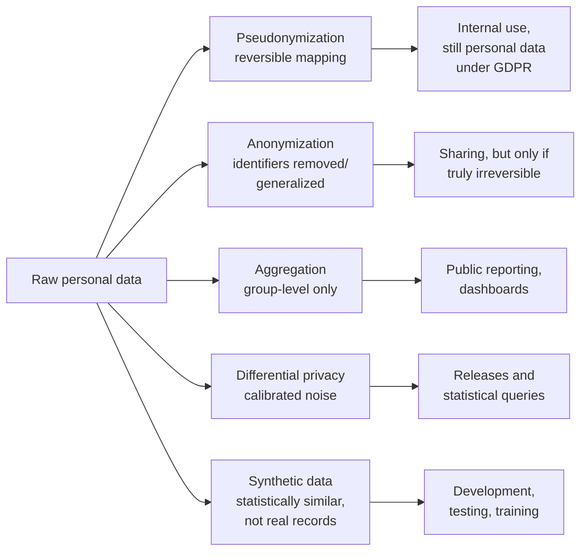

# Lesson 4-4: Ethical and Privacy Considerations

> Student follow-along resources, key concepts, and references for this sublesson.

## Overview

When AI is used on data — especially personal or sensitive data — ethics and privacy must be designed into the workflow rather than bolted on at the end. This sublesson covers the three things you need to get right: privacy-preserving techniques (anonymization, aggregation, differential privacy, synthetic data), controls that prevent data exposure (access control, data minimization, choice of cloud vs. local AI, logging), and compliance with applicable regulations (GDPR, CCPA, the EU AI Act, and the NIST AI Risk Management Framework). The unifying theme is to use AI to augment human judgment, not to replace it in high-stakes decisions.

## Learning objectives

By the end of this sublesson you should be able to:

- Distinguish anonymization, pseudonymization, aggregation, differential privacy, and synthetic data, and pick an appropriate technique for a use case.
- Describe practical controls that prevent sensitive data from leaking into AI systems.
- Summarize the obligations GDPR and CCPA place on AI-assisted data analysis, and how the EU AI Act and the NIST AI RMF complement them.
- Decide when cloud AI is appropriate and when on-device or air-gapped AI is required.
- Apply ethical principles — transparency, oversight, and human review — to AI-driven analysis.

## Key concepts

### 1. Privacy-preserving techniques

The goal is to extract value from data without exposing individuals. There is a spectrum of techniques with different trade-offs between privacy strength and analytical utility.

Key distinctions:

- **Anonymization** removes or generalizes identifiers irreversibly. Under GDPR, *truly anonymous* data falls outside scope — but courts and regulators have repeatedly ruled that data is rarely as anonymous as practitioners assume. Treat any record with rich behavioral attributes as potentially re-identifiable.
- **Pseudonymization** replaces direct identifiers with a token (e.g., a hashed user ID) but keeps a mapping somewhere. Under GDPR, pseudonymized data is **still personal data**.
- **Aggregation** reports group-level statistics only (e.g., counts, means by region). Simple but vulnerable to small-cell disclosure.
- **Differential privacy (DP)** adds calibrated random noise so that the presence or absence of any single record cannot be inferred from outputs, with a quantified privacy budget (epsilon). NIST SP 800-226 (March 2025) is now the authoritative guidance for evaluating DP guarantees.
- **Synthetic data** generates artificial records that match the statistical structure of real data. Useful for development and testing, but non-DP synthetic data can leak information about the training set; NIST recommends generating synthetic data with differential privacy when used for sensitive releases.

### 2. Controls to prevent data exposure

Privacy techniques only matter if the data actually flows through systems you control. Apply these controls from the start:

- **Data minimization.** Send only the columns and rows the AI actually needs. Drop direct identifiers wherever feasible.
- **Access control.** Restrict who can read which datasets, and apply the same restrictions to AI tools that act on a user's behalf.
- **Choose the right deployment.**
  - *Cloud AI* (e.g., a frontier LLM via API): convenient and capable, but verify that your contract — DPA, BAA where relevant, residency, retention, "no-train" guarantees, audit rights — actually covers your data.
  - *Tenant-isolated cloud* (e.g., enterprise tiers of major LLM vendors, Azure OpenAI in your tenant): often a workable middle ground.
  - *On-device or air-gapped AI* (e.g., local Llama, Mistral, Phi, or DeepSeek models on your own hardware): preferred for the most sensitive data, regulated environments, or restricted networks.
- **Prompt and output filtering.** Detect and redact PII (names, emails, ID numbers, payment data) before it reaches the model, and scan outputs before they are surfaced to users.
- **Logging and monitoring.** Log who asked what, against which dataset, with which prompts and outputs, so you can detect, investigate, and respond to incidents.
- **Retention and deletion.** Enforce retention limits and make sure deletion propagates to backups, vector stores, and any model fine-tuning data.

### 3. Compliance: GDPR, CCPA, EU AI Act, NIST

AI-assisted analysis does not exempt you from existing privacy law. The most important obligations to understand:

| Regime | Scope | Key implications for AI analysis |
| --- | --- | --- |
| GDPR (EU/EEA) | Any processing of EU/EEA residents' personal data. | Lawful basis required; transparency; data subject rights (access, deletion, portability); DPIAs for high-risk processing; pseudonymization is still personal data; restrictions on cross-border transfers. |
| EU AI Act | AI systems placed on the EU market or used in the EU. | Risk-tiered obligations; transparency for generative AI; bans on certain practices; conformity assessments for high-risk systems; layered on top of GDPR. |
| CCPA / CPRA (California) | California residents' personal information. | Notice at collection; right to know, delete, correct, and opt out of sale or sharing; specific rules for "automated decisionmaking technology". |
| Other US state laws | Colorado, Virginia, Connecticut, Texas, and a growing list. | Generally similar individual rights, often with sensitive-data and profiling requirements. |
| NIST AI RMF + NIST SP 800-226 | Voluntary US guidance, increasingly cited as a baseline. | Risk management lifecycle for AI; rigorous framework for evaluating differential privacy guarantees. |
| Sectoral rules | HIPAA (US health), GLBA (US finance), PCI DSS (payments), FERPA (US education), and more. | Sector-specific data handling, audit, and breach-notification rules apply on top of general privacy law. |

Practical compliance checklist for any new AI-assisted analysis:

1. Identify the data and classify its sensitivity.
2. Confirm a lawful basis (or analogous legal grounds) for the processing.
3. Document the purpose, retention, and recipients.
4. Run a DPIA / impact assessment for high-risk processing.
5. Confirm cross-border transfer safeguards if applicable (SCCs, adequacy decisions).
6. Apply privacy-preserving techniques and exposure controls before any data hits an AI system.
7. Maintain transparency: tell users when AI is part of the workflow, especially for decisions affecting them.
8. Keep human review in the loop for consequential decisions.

### 4. Ethical use beyond bare compliance

Compliance is the floor, not the ceiling. The widely accepted ethical principles for AI in analysis:

- **Augment, do not replace, human judgment** in high-stakes decisions (employment, credit, healthcare, criminal justice, immigration, education).
- **Transparency.** Disclose when AI is used and what it was used for.
- **Contestability.** Let affected people request human review and correction.
- **Fairness.** Test for disparate impact across protected groups; document mitigations.
- **Accountability.** Assign clear ownership for AI-influenced outputs.

These mirror the cross-cutting categories in the NIST AI RMF (govern, map, measure, manage) and the principles cited in the EU AI Act and most corporate Responsible AI policies.

## Why it matters / What's next

Privacy and ethics are not a separate workstream — they are constraints that shape every earlier decision in Lesson 4: which dataset you load, what you send to a cloud model, what you let an agent execute, and what you publish. Get this layer right and the rest of the pipeline is defensible. The next sublesson, **Lesson 4-5: AI-Assisted Research, Ideation, and Content Drafting**, looks at how to apply the same human-in-the-loop discipline to AI-supported knowledge work, where the main risks shift from privacy to accuracy, attribution, and intellectual integrity.

## Glossary

- **PII (Personally Identifiable Information)** — Data that identifies a specific person directly or in combination with other data.
- **Anonymization** — Irreversible removal or generalization of identifiers; under GDPR, falls outside scope only if truly irreversible.
- **Pseudonymization** — Replacing identifiers with a token while retaining a mapping; still personal data under GDPR.
- **Aggregation** — Reporting only group-level statistics rather than individual records.
- **Differential privacy (DP)** — A mathematical privacy guarantee using calibrated noise, with a quantified privacy budget (epsilon).
- **Synthetic data** — Artificial records that mimic real data's statistical properties; safest when generated with differential privacy.
- **Data minimization** — Collecting and processing only the data actually needed for a stated purpose.
- **DPIA (Data Protection Impact Assessment)** — A formal risk assessment required by GDPR for high-risk processing.
- **NIST AI RMF** — The US National Institute of Standards and Technology's voluntary AI Risk Management Framework.
- **NIST SP 800-226** — NIST's 2025 guidelines for evaluating differential privacy guarantees.
- **EU AI Act** — Risk-tiered EU regulation of AI systems, layered on top of GDPR.

## Quick self-check

1. Which is *still* personal data under GDPR: anonymized data, pseudonymized data, or both?
2. Briefly describe differential privacy and what the parameter epsilon controls.
3. Name three controls you would put in place before sending data to a cloud LLM.
4. When would you choose on-device or air-gapped AI over a cloud LLM?
5. Give two reasons that synthetic data alone is not always sufficient privacy protection.

## References and further reading

- NIST — *Guidelines for Evaluating Differential Privacy Guarantees (SP 800-226).* https://www.nist.gov/publications/guidelines-evaluating-differential-privacy-guarantees
- NIST — *NIST Finalizes Differential Privacy Guidelines (news, 2025).* https://www.nist.gov/news-events/news/2025/03/nist-finalizes-guidelines-evaluating-differential-privacy-guarantees-de
- NIST — *AI Risk Management Framework (AI RMF 1.0).* https://www.nist.gov/itl/ai-risk-management-framework
- European Commission — *EU AI Act overview.* https://digital-strategy.ec.europa.eu/en/policies/regulatory-framework-ai
- European Data Protection Board — *Guidelines and AI/GDPR guidance.* https://www.edpb.europa.eu/our-work-tools/general-guidance_en
- ICO (UK) — *Guidance on AI and data protection.* https://ico.org.uk/for-organisations/uk-gdpr-guidance-and-resources/artificial-intelligence/
- California Privacy Protection Agency — *CCPA / CPRA regulations on automated decisionmaking.* https://cppa.ca.gov/regulations/
- Dentons — *AI and GDPR Monthly Update (2026).* https://www.dentons.com/en/insights/newsletters/2026/march/2/eu-ai-and-gdpr-key-trends-and-insights/ai-and-gdpr-monthly-update-february-edition-2026/ai-and-gdpr-update-february-eng
- McDonald Hopkins — *US and International Data Privacy Developments in 2025 and Compliance Considerations for 2026.* https://www.mcdonaldhopkins.com/insights/news/u-s-and-international-data-privacy-developments-in-2025-and-compliance-considerations-for-2026
- DPO Centre — *Data protection and AI governance 2025–2026.* https://www.dpocentre.com/blog/data-protection-ai-governance-2025-2026/
- OpenDP — *Open-source differential privacy library.* https://opendp.org/
- Microsoft — *SmartNoise differential privacy toolkit.* https://github.com/opendp/smartnoise-sdk

### Omar's resources and references (course-wide)

#### Foundational cybersecurity resources in O'Reilly

This section provides a curated list of resources that delve into foundational cybersecurity concepts, frequently explored in O'Reilly training sessions and other educational offerings.

##### Live training

- **Upcoming Live Cybersecurity and AI Training in O'Reilly:** [Register before it is too late](https://learning.oreilly.com/search/?q=omar%20santos&type=live-course&rows=100&language_with_transcripts=en) (free with O'Reilly Subscription)

##### Reading list

Despite the rapidly evolving landscape of AI and technology, these books offer a comprehensive roadmap for understanding the intersection of these technologies with cybersecurity:

- **[NEW: Agentic AI for Cybersecurity: Building Autonomous Defenders and Adversaries](https://www.oreilly.com/library/view/agentic-ai-for/9780135589861/).** Unlock the power of next generation AI agents to transform cybersecurity, business operations, and productivity. [Available on O'Reilly](https://www.oreilly.com/library/view/agentic-ai-for/9780135589861/)

- **[Redefining Hacking](https://learning.oreilly.com/library/view/redefining-hacking-a/9780138363635/)** — A Comprehensive Guide to Red Teaming and Bug Bounty Hunting in an AI-driven World. [Available on O'Reilly](https://learning.oreilly.com/library/view/redefining-hacking-a/9780138363635/)

- **[AI-Powered Digital Cyber Resilience](https://www.oreilly.com/library/view/ai-powered-digital-cyber/9780135408599/)** — A practical guide to building intelligent, AI-powered cyber defenses in today's fast-evolving threat landscape. [Available on O'Reilly](https://www.oreilly.com/library/view/ai-powered-digital-cyber/9780135408599/)

- **[Developing Cybersecurity Programs and Policies in an AI-Driven World](https://learning.oreilly.com/library/view/developing-cybersecurity-programs/9780138073992)** — Explore strategies for creating robust cybersecurity frameworks in an AI-centric environment. [Available on O'Reilly](https://learning.oreilly.com/library/view/developing-cybersecurity-programs/9780138073992)

- **[Beyond the Algorithm: AI, Security, Privacy, and Ethics](https://learning.oreilly.com/library/view/beyond-the-algorithm/9780138268442)** — Gain insights into the ethical and security challenges posed by AI technologies. [Available on O'Reilly](https://learning.oreilly.com/library/view/beyond-the-algorithm/9780138268442)

- **[The AI Revolution in Networking, Cybersecurity, and Emerging Technologies](https://learning.oreilly.com/library/view/the-ai-revolution/9780138293703)** — Understand how AI is transforming networking and cybersecurity landscape. [Available on O'Reilly](https://learning.oreilly.com/library/view/the-ai-revolution/9780138293703)

##### Video courses

Enhance your practical skills with these video courses designed to deepen your understanding of cybersecurity:

- **[Building the Ultimate Cybersecurity Lab and Cyber Range](https://learning.oreilly.com/course/building-the-ultimate/9780138319090/)** (video). [Available on O'Reilly](https://learning.oreilly.com/course/building-the-ultimate/9780138319090/)

- **[Build Your Own AI Lab](https://learning.oreilly.com/course/build-your-own/9780135439616)** (video) — Hands-on guide to home and cloud-based AI labs. Learn to set up and optimize labs to research and experiment in a secure environment. [Available on O'Reilly](https://learning.oreilly.com/course/build-your-own/9780135439616)

- **[Defending and Deploying AI](https://www.oreilly.com/videos/defending-and-deploying/9780135463727/)** (video) — Comprehensive, hands-on journey into modern AI applications for technology and security professionals, covering AI-enabled programming, networking, and cybersecurity; securing generative AI (LLM security, prompt injection, red-teaming); secure AI labs; AI agents and agentic RAG for cybersecurity. [Available on O'Reilly](https://www.oreilly.com/videos/defending-and-deploying/9780135463727/)

- **[AI-Enabled Programming, Networking, and Cybersecurity](https://learning.oreilly.com/course/ai-enabled-programming-networking/9780135402696/)** — Learn to use AI for cybersecurity, networking, and programming tasks with practical, hands-on activities. [Available on O'Reilly](https://learning.oreilly.com/course/ai-enabled-programming-networking/9780135402696/)

- **[Securing Generative AI](https://learning.oreilly.com/course/securing-generative-ai/9780135401804/)** — Security for deploying and developing AI applications, RAG, agents, and other AI implementations; incorporate security at every stage of AI development, deployment, and operation. [Available on O'Reilly](https://learning.oreilly.com/course/securing-generative-ai/9780135401804/)

- **[Practical Cybersecurity Fundamentals](https://learning.oreilly.com/course/practical-cybersecurity-fundamentals/9780138037550/)** — Essential cybersecurity principles. [Available on O'Reilly](https://learning.oreilly.com/course/practical-cybersecurity-fundamentals/9780138037550/)

- **[The Art of Hacking](https://theartofhacking.org)** — Over 26 hours of training in ethical hacking and penetration testing (e.g., OSCP or CEH prep). [Visit The Art of Hacking](https://theartofhacking.org)

##### Certification related

- **CompTIA PenTest+ PT0-002 Cert Guide, 2nd Edition** — [Available on O'Reilly](https://learning.oreilly.com/library/view/comptia-pentest-pt0-002/9780137566204/)

- **Certified Ethical Hacker (CEH), Latest Edition** — Very comprehensive (19+ hours). [Available on O'Reilly](https://learning.oreilly.com/course/certified-ethical-hacker/9780135395646/)

- **Certified in Cybersecurity - CC (ISC)²** — [Available on O'Reilly](https://learning.oreilly.com/course/certified-in-cybersecurity/9780138230364/)

- **CCNP and CCIE Security Core SCOR 350-701 Official Cert Guide, 2nd Edition** — [Available on O'Reilly](https://learning.oreilly.com/library/view/ccnp-and-ccie/9780138221287/)

- **CEH Certified Ethical Hacker Cert Guide** — [Available on O'Reilly](https://learning.oreilly.com/library/view/ceh-certified-ethical/9780137489930/)

##### Additional resources

- **Hacking Scenarios (Labs) on O'Reilly** — Cloud-based labs; no local install. [https://hackingscenarios.com](https://hackingscenarios.com)

- **Personal blog** — [becomingahacker.org](https://becomingahacker.org)

- **Cisco blog** — [blogs.cisco.com/author/omarsantos](https://blogs.cisco.com/author/omarsantos)

- **GitHub repository** — [hackerrepo.org](https://hackerrepo.org)

- **WebSploit Labs** — [websploit.org](https://websploit.org)

- **NetAcad Ethical Hacker Free Course** — [NetAcad Skills for All](https://www.netacad.com/courses/ethical-hacker?courseLang=en-US)
