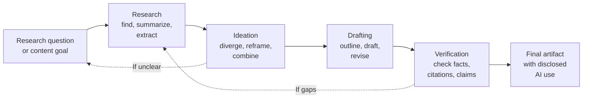

# Lesson 4-5: AI-Assisted Research, Ideation, and Content Drafting

> Student follow-along resources, key concepts, and references for this sublesson.

## Overview

AI now supports knowledge work at every stage: literature search and synthesis, brainstorming and idea generation, and drafting and revising written content. Used well, it compresses time without giving up quality. Used carelessly, it produces confidently wrong summaries, fabricated citations, and bland or misleading drafts. This sublesson covers what AI does well at each stage, the design principles for keeping humans firmly in control, and the practices — verification, transparency, documentation — that protect intellectual integrity.

## Learning objectives

By the end of this sublesson you should be able to:

- Identify three stages of knowledge work where AI provides leverage: research, ideation, and drafting.
- Distinguish AI tools that ground their output in retrieved sources from those that do not, and explain why this matters.
- Apply divergent versus convergent thinking patterns when using AI for ideation.
- Recognize and prevent common failure modes (hallucinated citations, plagiarism, bias amplification, over-reliance).
- Describe transparent disclosure and documentation practices for AI-assisted work.

## Key concepts

### 1. The three stages of AI-assisted knowledge work

Each stage benefits from AI in different ways, and each requires its own human-in-the-loop pattern.

### 2. Research and synthesis

The best AI research tools combine LLMs with **retrieval** — they search a real corpus of papers or documents, return citations, and ground their summaries in retrieved passages (a pattern often called retrieval-augmented generation, or RAG).

Useful capabilities:

- Search across millions of papers semantically (not just keyword matching).
- Summarize a paper, a paragraph, or a comparison across papers.
- Extract structured fields (sample size, method, outcome) into a table.
- Suggest related papers, contradicting findings, and research gaps.

Representative tools (2025–2026):

- **Elicit** — automated literature reviews and side-by-side paper comparison.
- **Consensus** — evidence-grounded answers with linked citations from peer-reviewed papers.
- **Semantic Scholar** — semantic search and TLDR summaries over a very large open corpus.
- **NotebookLM (Google)** — conversational Q&A and synthesis over your own uploaded documents.
- **Scite** — citation-aware analysis (supporting vs. contrasting citations).
- **Perplexity** — citation-style web search and synthesis.
- **ChatGPT, Claude, Gemini** with file upload or web browsing — capable generalists, but verify citations.

Research systems such as **ResearchAgent** and **Agent Laboratory** explore the next step: multi-agent loops that propose research problems, refine them through simulated peer-review style critique, and iterate. These are still primarily research artifacts, useful for inspiration rather than as a turnkey replacement for scholarship.

### 3. Ideation: divergent then convergent

Good ideation alternates between two modes, and AI helps in different ways for each:

| Mode | Goal | Where AI helps | What humans do |
| --- | --- | --- | --- |
| Divergent | Generate many options | Brainstorm alternatives, reframe the problem, recombine concepts, propose analogies, suggest unfamiliar angles. | Choose what to take seriously and what to ignore. |
| Convergent | Narrow to the best option | Compare options against criteria, surface trade-offs, simulate critiques. | Make the actual decision and own it. |

Design principles for AI-supported ideation, drawn from recent HCI and design research:

- **Preserve user agency.** The user must be able to steer, correct, and reject suggestions easily.
- **Separate divergent and convergent support.** Generating options and choosing among them are different tasks; mixing them collapses the value of each.
- **Avoid premature anchoring.** Generate many options before settling on one, so the AI's first suggestion does not become the default.
- **Bring in evidence early.** Where possible, attach real sources or data to each option so it is grounded, not just plausible-sounding.

### 4. Content drafting

For drafting, AI is most useful for:

- Outlines and structure.
- First drafts you will rewrite.
- Variants for tone, audience, or length.
- Editing for clarity, grammar, and voice consistency.
- Summaries and abstracts of longer work.

Principles to keep the work yours:

- **Treat AI output as a draft, not a deliverable.** The voice, facts, and final argument are your responsibility.
- **Verify every factual claim and every citation.** LLMs hallucinate references, misattribute quotes, and confidently state outdated facts. Tools that ground generation in retrieval reduce but do not eliminate this risk.
- **Watch for plagiarism and copyright issues.** Especially when generating long-form text or code from a model trained on copyrighted material.
- **Mind the homogenization effect.** Heavy AI editing can flatten distinctive voice; revise specifically to keep your own.
- **Disclose appropriately.** Many publishers, employers, journals, and academic institutions now require disclosure of AI use; some prohibit specific uses. Check the rules that apply to you.

### 5. Common failure modes and how to avoid them

| Failure mode | What it looks like | Counter-measure |
| --- | --- | --- |
| Hallucinated citations | Confident references to papers, authors, page numbers, or URLs that do not exist. | Use retrieval-grounded tools; verify every citation against the original source. |
| Misattribution | Quotes attributed to the wrong person or work. | Manually confirm quotes; prefer tools that link to source passages. |
| Bias amplification | Output reflects skewed training data (gender, geography, prestige bias). | Diverse search prompts; consult primary sources beyond the AI's first results. |
| Stale knowledge | Cutoffs miss recent developments. | Use tools with current web access; corroborate with recent primary sources. |
| Over-reliance | Skipping critical reading because the summary "looks fine". | Read the actual source for any claim you will rely on. |
| Confidentiality leaks | Pasting private drafts or sensitive data into a public AI tool. | Use enterprise/private deployments; redact or paraphrase sensitive material first. |

### 6. Documentation and transparency

Treat AI use the way you treat any tool that materially affects your output:

- **Document the prompt, the tool, and the version.** Future you and your collaborators will thank you.
- **Note what was AI-generated and what was human-written.** Either inline (for code or technical writing) or in a methods section (for research).
- **Be transparent with collaborators and audiences.** Especially in research, journalism, and educational contexts.
- **Follow institutional rules.** Journal policies, employer policies, and course or degree program rules differ; check them.

## Why it matters / What's next

AI-assisted research and drafting have the same shape as the rest of Lesson 4: AI is fast, broad, and tireless; humans are responsible for accuracy, judgment, and integrity. Pair AI with retrieval-grounded sources, verify everything that matters, and disclose your use. That mindset closes Lesson 4 and carries directly into **Lesson 5: AI for Code and Workflow Optimization**, where the same human-in-the-loop discipline applies to code generation, software workflows, and developer productivity.

## Glossary

- **Retrieval-Augmented Generation (RAG)** — A pattern where an AI tool retrieves real source passages from a corpus and grounds its answer in them, with citations.
- **Hallucination** — Plausible-looking but fabricated content from an LLM (false facts, invented citations, made-up code).
- **Divergent thinking** — Generating many options or reframings of a problem.
- **Convergent thinking** — Narrowing options down to a chosen approach using criteria.
- **ResearchAgent** — A research framework that iteratively generates and refines research ideas using LLMs and peer-review-style critique.
- **NotebookLM** — Google's tool for grounded Q&A and synthesis over user-uploaded sources.
- **Elicit / Consensus / Semantic Scholar / Scite / Perplexity** — Major AI literature and research tools used in 2025–2026.
- **Disclosure** — Stating clearly when, where, and how AI was used in producing a deliverable.
- **Anchoring** — A cognitive bias where the first suggestion (often the AI's) over-influences the final outcome.

## Quick self-check

1. Why is retrieval-augmented generation (RAG) important for AI research tools?
2. Distinguish divergent from convergent thinking, and explain how AI helps in each mode.
3. Give two examples of failure modes when AI is used for drafting, and a concrete counter-measure for each.
4. Name three AI research tools and what each is best at.
5. What information should you record when AI was a meaningful part of producing a deliverable?

## References and further reading

- Elicit — *AI research assistant for literature reviews.* https://elicit.com/
- Consensus — *Evidence-based AI search engine.* https://consensus.app/
- Semantic Scholar — *AI-powered scientific literature search.* https://www.semanticscholar.org/
- Google — *NotebookLM.* https://notebooklm.google/
- Scite — *Smart citations for research.* https://scite.ai/
- Perplexity — *AI answer engine with citations.* https://www.perplexity.ai/
- arXiv — *ResearchAgent: Iterative research idea generation with LLMs.* https://arxiv.org/abs/2404.07738
- alphaXiv — *Agent Laboratory: Using LLM Agents as Research Assistants.* https://alphaxiv.org/overview/2501.04227v2
- arXiv — *A Vision for Auto Research with LLM Agents.* https://arxiv.org/html/2504.18765v1
- ICML / Findings — *Chain of Ideas: Revolutionizing Research via Novel Idea Development with LLM Agents.* https://www.researchgate.net/publication/385009965_Chain_of_Ideas_Revolutionizing_Research_in_Novel_Idea_Development_with_LLM_Agents
- IntuitionLabs — *How AI Literature Review Tools Work: RAG and Semantic Search.* https://intuitionlabs.ai/articles/how-ai-literature-review-tools-work
- Nature — *AI and the future of scientific writing and disclosure policies.* https://www.nature.com/nature-portfolio/editorial-policies/ai
- COPE — *Authorship and AI tools (Committee on Publication Ethics).* https://publicationethics.org/cope-position-statements/ai-author

### Omar's resources and references (course-wide)

#### Foundational cybersecurity resources in O'Reilly

This section provides a curated list of resources that delve into foundational cybersecurity concepts, frequently explored in O'Reilly training sessions and other educational offerings.

##### Live training

- **Upcoming Live Cybersecurity and AI Training in O'Reilly:** [Register before it is too late](https://learning.oreilly.com/search/?q=omar%20santos&type=live-course&rows=100&language_with_transcripts=en) (free with O'Reilly Subscription)

##### Reading list

Despite the rapidly evolving landscape of AI and technology, these books offer a comprehensive roadmap for understanding the intersection of these technologies with cybersecurity:

- **[NEW: Agentic AI for Cybersecurity: Building Autonomous Defenders and Adversaries](https://www.oreilly.com/library/view/agentic-ai-for/9780135589861/).** Unlock the power of next generation AI agents to transform cybersecurity, business operations, and productivity. [Available on O'Reilly](https://www.oreilly.com/library/view/agentic-ai-for/9780135589861/)

- **[Redefining Hacking](https://learning.oreilly.com/library/view/redefining-hacking-a/9780138363635/)** — A Comprehensive Guide to Red Teaming and Bug Bounty Hunting in an AI-driven World. [Available on O'Reilly](https://learning.oreilly.com/library/view/redefining-hacking-a/9780138363635/)

- **[AI-Powered Digital Cyber Resilience](https://www.oreilly.com/library/view/ai-powered-digital-cyber/9780135408599/)** — A practical guide to building intelligent, AI-powered cyber defenses in today's fast-evolving threat landscape. [Available on O'Reilly](https://www.oreilly.com/library/view/ai-powered-digital-cyber/9780135408599/)

- **[Developing Cybersecurity Programs and Policies in an AI-Driven World](https://learning.oreilly.com/library/view/developing-cybersecurity-programs/9780138073992)** — Explore strategies for creating robust cybersecurity frameworks in an AI-centric environment. [Available on O'Reilly](https://learning.oreilly.com/library/view/developing-cybersecurity-programs/9780138073992)

- **[Beyond the Algorithm: AI, Security, Privacy, and Ethics](https://learning.oreilly.com/library/view/beyond-the-algorithm/9780138268442)** — Gain insights into the ethical and security challenges posed by AI technologies. [Available on O'Reilly](https://learning.oreilly.com/library/view/beyond-the-algorithm/9780138268442)

- **[The AI Revolution in Networking, Cybersecurity, and Emerging Technologies](https://learning.oreilly.com/library/view/the-ai-revolution/9780138293703)** — Understand how AI is transforming networking and cybersecurity landscape. [Available on O'Reilly](https://learning.oreilly.com/library/view/the-ai-revolution/9780138293703)

##### Video courses

Enhance your practical skills with these video courses designed to deepen your understanding of cybersecurity:

- **[Building the Ultimate Cybersecurity Lab and Cyber Range](https://learning.oreilly.com/course/building-the-ultimate/9780138319090/)** (video). [Available on O'Reilly](https://learning.oreilly.com/course/building-the-ultimate/9780138319090/)

- **[Build Your Own AI Lab](https://learning.oreilly.com/course/build-your-own/9780135439616)** (video) — Hands-on guide to home and cloud-based AI labs. Learn to set up and optimize labs to research and experiment in a secure environment. [Available on O'Reilly](https://learning.oreilly.com/course/build-your-own/9780135439616)

- **[Defending and Deploying AI](https://www.oreilly.com/videos/defending-and-deploying/9780135463727/)** (video) — Comprehensive, hands-on journey into modern AI applications for technology and security professionals, covering AI-enabled programming, networking, and cybersecurity; securing generative AI (LLM security, prompt injection, red-teaming); secure AI labs; AI agents and agentic RAG for cybersecurity. [Available on O'Reilly](https://www.oreilly.com/videos/defending-and-deploying/9780135463727/)

- **[AI-Enabled Programming, Networking, and Cybersecurity](https://learning.oreilly.com/course/ai-enabled-programming-networking/9780135402696/)** — Learn to use AI for cybersecurity, networking, and programming tasks with practical, hands-on activities. [Available on O'Reilly](https://learning.oreilly.com/course/ai-enabled-programming-networking/9780135402696/)

- **[Securing Generative AI](https://learning.oreilly.com/course/securing-generative-ai/9780135401804/)** — Security for deploying and developing AI applications, RAG, agents, and other AI implementations; incorporate security at every stage of AI development, deployment, and operation. [Available on O'Reilly](https://learning.oreilly.com/course/securing-generative-ai/9780135401804/)

- **[Practical Cybersecurity Fundamentals](https://learning.oreilly.com/course/practical-cybersecurity-fundamentals/9780138037550/)** — Essential cybersecurity principles. [Available on O'Reilly](https://learning.oreilly.com/course/practical-cybersecurity-fundamentals/9780138037550/)

- **[The Art of Hacking](https://theartofhacking.org)** — Over 26 hours of training in ethical hacking and penetration testing (e.g., OSCP or CEH prep). [Visit The Art of Hacking](https://theartofhacking.org)

##### Certification related

- **CompTIA PenTest+ PT0-002 Cert Guide, 2nd Edition** — [Available on O'Reilly](https://learning.oreilly.com/library/view/comptia-pentest-pt0-002/9780137566204/)

- **Certified Ethical Hacker (CEH), Latest Edition** — Very comprehensive (19+ hours). [Available on O'Reilly](https://learning.oreilly.com/course/certified-ethical-hacker/9780135395646/)

- **Certified in Cybersecurity - CC (ISC)²** — [Available on O'Reilly](https://learning.oreilly.com/course/certified-in-cybersecurity/9780138230364/)

- **CCNP and CCIE Security Core SCOR 350-701 Official Cert Guide, 2nd Edition** — [Available on O'Reilly](https://learning.oreilly.com/library/view/ccnp-and-ccie/9780138221287/)

- **CEH Certified Ethical Hacker Cert Guide** — [Available on O'Reilly](https://learning.oreilly.com/library/view/ceh-certified-ethical/9780137489930/)

##### Additional resources

- **Hacking Scenarios (Labs) on O'Reilly** — Cloud-based labs; no local install. [https://hackingscenarios.com](https://hackingscenarios.com)

- **Personal blog** — [becomingahacker.org](https://becomingahacker.org)

- **Cisco blog** — [blogs.cisco.com/author/omarsantos](https://blogs.cisco.com/author/omarsantos)

- **GitHub repository** — [hackerrepo.org](https://hackerrepo.org)

- **WebSploit Labs** — [websploit.org](https://websploit.org)

- **NetAcad Ethical Hacker Free Course** — [NetAcad Skills for All](https://www.netacad.com/courses/ethical-hacker?courseLang=en-US)
