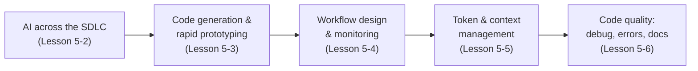

# Lesson 5-1: Introduction to AI for Code and Workflow Optimization

> Student follow-along resources, key concepts, and references for this sublesson.

## Overview

Generative AI has moved from a novelty to a core part of how software is built. By 2025–2026, a large majority of professional developers report using AI tools daily, and AI-assisted workflows touch every phase of the software development lifecycle (SDLC). This sublesson sets the stage for Lesson 5 by framing what "AI for code and workflow optimization" actually means, where the productivity gains and pitfalls show up, and what you will learn across the next five sublessons.

## Learning objectives

By the end of this sublesson you should be able to:

- Describe what it means to use AI across the SDLC, from requirements through deployment and maintenance.
- Summarize the productivity, quality, and cost effects of AI-assisted development reported in 2025–2026 industry research.
- Recognize the major categories of AI tools used in modern engineering workflows (assistants, agents, reviewers, observability).
- Explain why non-determinism in generative AI raises the importance of evaluation and monitoring.
- Map the topics of Lesson 5-2 through Lesson 5-13 to the workflow concerns they address.

## Key concepts

### 1. AI as a developer collaborator, not a replacement

AI coding assistants like GitHub Copilot, Cursor, and Claude Code do not replace engineers — they shift the bottleneck. Surveys from the 2025 DORA *State of AI-assisted Software Development* report and JetBrains' developer survey show roughly 84–90% of professional developers using or planning to use AI tools, and many save several hours of coding time per week. At the same time, the dominant work shifts from "writing code" to "reviewing, validating, and integrating code that an assistant or agent produced." DORA explicitly frames AI as an *amplifier*: it magnifies the existing strengths and weaknesses of an engineering organization, rather than fixing weak processes by itself.

### 2. The four big workflow concerns this lesson addresses

| Concern | What you optimize | Tools you typically use |
| --- | --- | --- |
| Lifecycle integration | Where AI plugs into requirements, design, build, test, deploy, operate | Spec-driven tools, IDE assistants, AIOps |
| Code generation | Speed of producing first-draft code, prototypes, scaffolds | GitHub Copilot, Cursor, Claude Code, Codex |
| Workflow design & monitoring | Reliability, observability, and human oversight of AI steps | LangGraph / agent frameworks, LangSmith, OpenTelemetry GenAI |
| Token & context management | Cost, latency, and quality of LLM calls | Provider dashboards, prompt caching, RAG |
| Code quality | Bugs caught, error handling, documentation | AI code review (CodeRabbit, Qodo), SAST (Snyk Code, CodeQL) |

### 3. The productivity paradox you should know about

Independent 2025 research highlights a real tension. Industry surveys report 30–50% faster individual task completion and several hours of weekly time savings, but some controlled studies (notably the METR study of experienced open-source developers) find that AI tools can actually *increase* completion time on complex tasks by ~19%. Faros AI's 2025 *Productivity Paradox* analysis describes downstream effects: more pull requests merged but pull-request review times rising sharply, more rework, and the accumulation of "AI-generated technical debt." The practical takeaway for this lesson is simple — **speed without guardrails creates new costs.** Lessons 5-4 (workflow and monitoring), 5-5 (token and context discipline), and 5-6 (quality and review) directly address those guardrails.

### 4. Non-determinism is a first-class engineering concern

Traditional software is largely deterministic: given the same input, you get the same output. Generative AI is not. The same prompt can yield different code, different bug fixes, and different documentation on different runs. That has three direct consequences:

- **Evaluation matters.** You need offline evals (test suites, golden examples) and online evals (production sampling) to know if quality is moving in the right direction.
- **Observability matters.** You need to log prompts, responses, tokens, latency, and tool calls so failures are debuggable.
- **Human-in-the-loop matters.** Critical or irreversible actions (deployments, deletions, financial transactions) should require human approval, not just an LLM's confidence.

These themes are revisited in detail in Lesson 5-4.

## Why it matters / What's next

Knowing how to use AI tools is increasingly part of the baseline skill set for any technologist — engineers, data professionals, PMs, and operators alike. The rest of Lesson 5 takes you from a high-level view (where AI fits in the lifecycle, in 5-2) into concrete tooling (Copilot and Cursor, in 5-3), into the engineering discipline needed to run AI reliably (workflow and monitoring in 5-4, token and context management in 5-5), into AI-assisted code quality (debugging, error handling, documentation, and review in 5-6), then through focused tool and practice modules (5-7 through 5-13: Cursor depth, Windsurf, skills and rules, Codex, Claude Code, secure review, and additional tools). After Lesson 5 you'll be ready for Lesson 6, which moves from AI-assisted development into autonomous agentic AI.

## Glossary

- **SDLC (Software Development Lifecycle)** — The full process of building software: requirements, design, implementation, testing, deployment, and maintenance.
- **AI coding assistant** — An IDE-integrated tool that suggests, completes, refactors, or explains code (e.g., GitHub Copilot, Cursor).
- **Coding agent** — An AI system that goes beyond suggestions and autonomously performs multi-step coding tasks across files, branches, or environments.
- **Non-determinism** — The property that the same input can produce different outputs across runs; characteristic of generative models.
- **AI-generated technical debt** — Code accepted from AI without sufficient review that later imposes maintenance, security, or correctness costs.
- **Productivity paradox** — The 2025 observation that individual coding speedups from AI do not always translate to team or organizational throughput gains.
- **Amplifier effect (DORA)** — The finding that AI magnifies an organization's existing engineering strengths or weaknesses rather than overriding them.
- **AIOps** — AI-driven operations: using ML/LLMs to detect anomalies, correlate logs and traces, and automate incident response.
- **Eval** — A structured evaluation (offline or online) used to judge whether a generative system is producing acceptable outputs.
- **Human-in-the-loop (HITL)** — A design pattern in which a human reviews or approves AI actions, especially for high-impact decisions.

## Quick self-check

1. Why does the 2025 DORA report describe AI as an "amplifier" rather than a fix?
2. Name two productivity findings from 2025 research that pull in opposite directions.
3. Give one example of a workflow concern that is *unique* to generative AI compared to traditional software.
4. List three categories of AI tooling that you'll see used together in a modern engineering org.
5. Which sublesson in Lesson 5 directly addresses cost and latency control for LLM calls?

## References and further reading

- DORA — *State of AI-assisted Software Development 2025.* https://dora.dev/dora-report-2025/
- Google Cloud — *2025 DORA State of AI-assisted Software Development report.* https://cloud.google.com/resources/content/2025-dora-ai-assisted-software-development-report
- DORA — *Balancing AI tensions: moving from AI adoption to effective SDLC use.* https://dora.dev/insights/balancing-ai-tensions/
- Stanford HAI — *2025 AI Index Report.* https://hai.stanford.edu/ai-index/2025-ai-index-report
- Faros AI — *The AI Productivity Paradox Research Report.* https://www.faros.ai/blog/ai-software-engineering
- METR — *Measuring the impact of early-2025 AI on experienced open-source developer productivity.* https://metr.org/blog/2025-07-10-early-2025-ai-experienced-os-dev-study/
- Hivel — *Impact of AI on software development: a system-level guide.* https://www.hivel.ai/sei/ai-impact-on-software-development
- Snyk — *AI in SDLC: a complete guide to AI-powered software development.* https://snyk.io/articles/complete-guide-ai-powered-software-development/
- AWS Partner Network — *Transforming the SDLC with generative AI.* https://aws.amazon.com/blogs/apn/transforming-the-software-development-lifecycle-sdlc-with-generative-ai/
- Checkmarx — *Top 12 AI developer tools in 2026: coding assistants, agents and security tools.* https://checkmarx.com/learn/ai-security/top-12-ai-developer-tools-in-2026-for-security-coding-and-quality/
- CodeRabbit — *2025: The year of the AI dev tool tech stack.* https://coderabbit.ai/blog/2025-the-year-of-the-ai-dev-tool-tech-stack

### Omar's resources and references (course-wide)

#### Foundational cybersecurity resources in O'Reilly

This section provides a curated list of resources that delve into foundational cybersecurity concepts, frequently explored in O'Reilly training sessions and other educational offerings.

##### Live training

- **Upcoming Live Cybersecurity and AI Training in O'Reilly:** [Register before it is too late](https://learning.oreilly.com/search/?q=omar%20santos&type=live-course&rows=100&language_with_transcripts=en) (free with O'Reilly Subscription)

##### Reading list

Despite the rapidly evolving landscape of AI and technology, these books offer a comprehensive roadmap for understanding the intersection of these technologies with cybersecurity:

- **[NEW: Agentic AI for Cybersecurity: Building Autonomous Defenders and Adversaries](https://www.oreilly.com/library/view/agentic-ai-for/9780135589861/).** Unlock the power of next generation AI agents to transform cybersecurity, business operations, and productivity. [Available on O'Reilly](https://www.oreilly.com/library/view/agentic-ai-for/9780135589861/)

- **[Redefining Hacking](https://learning.oreilly.com/library/view/redefining-hacking-a/9780138363635/)** — A Comprehensive Guide to Red Teaming and Bug Bounty Hunting in an AI-driven World. [Available on O'Reilly](https://learning.oreilly.com/library/view/redefining-hacking-a/9780138363635/)

- **[AI-Powered Digital Cyber Resilience](https://www.oreilly.com/library/view/ai-powered-digital-cyber/9780135408599/)** — A practical guide to building intelligent, AI-powered cyber defenses in today's fast-evolving threat landscape. [Available on O'Reilly](https://www.oreilly.com/library/view/ai-powered-digital-cyber/9780135408599/)

- **[Developing Cybersecurity Programs and Policies in an AI-Driven World](https://learning.oreilly.com/library/view/developing-cybersecurity-programs/9780138073992)** — Explore strategies for creating robust cybersecurity frameworks in an AI-centric environment. [Available on O'Reilly](https://learning.oreilly.com/library/view/developing-cybersecurity-programs/9780138073992)

- **[Beyond the Algorithm: AI, Security, Privacy, and Ethics](https://learning.oreilly.com/library/view/beyond-the-algorithm/9780138268442)** — Gain insights into the ethical and security challenges posed by AI technologies. [Available on O'Reilly](https://learning.oreilly.com/library/view/beyond-the-algorithm/9780138268442)

- **[The AI Revolution in Networking, Cybersecurity, and Emerging Technologies](https://learning.oreilly.com/library/view/the-ai-revolution/9780138293703)** — Understand how AI is transforming networking and cybersecurity landscape. [Available on O'Reilly](https://learning.oreilly.com/library/view/the-ai-revolution/9780138293703)

##### Video courses

Enhance your practical skills with these video courses designed to deepen your understanding of cybersecurity:

- **[Building the Ultimate Cybersecurity Lab and Cyber Range](https://learning.oreilly.com/course/building-the-ultimate/9780138319090/)** (video). [Available on O'Reilly](https://learning.oreilly.com/course/building-the-ultimate/9780138319090/)

- **[Build Your Own AI Lab](https://learning.oreilly.com/course/build-your-own/9780135439616)** (video) — Hands-on guide to home and cloud-based AI labs. Learn to set up and optimize labs to research and experiment in a secure environment. [Available on O'Reilly](https://learning.oreilly.com/course/build-your-own/9780135439616)

- **[Defending and Deploying AI](https://www.oreilly.com/videos/defending-and-deploying/9780135463727/)** (video) — Comprehensive, hands-on journey into modern AI applications for technology and security professionals, covering AI-enabled programming, networking, and cybersecurity; securing generative AI (LLM security, prompt injection, red-teaming); secure AI labs; AI agents and agentic RAG for cybersecurity. [Available on O'Reilly](https://www.oreilly.com/videos/defending-and-deploying/9780135463727/)

- **[AI-Enabled Programming, Networking, and Cybersecurity](https://learning.oreilly.com/course/ai-enabled-programming-networking/9780135402696/)** — Learn to use AI for cybersecurity, networking, and programming tasks with practical, hands-on activities. [Available on O'Reilly](https://learning.oreilly.com/course/ai-enabled-programming-networking/9780135402696/)

- **[Securing Generative AI](https://learning.oreilly.com/course/securing-generative-ai/9780135401804/)** — Security for deploying and developing AI applications, RAG, agents, and other AI implementations; incorporate security at every stage of AI development, deployment, and operation. [Available on O'Reilly](https://learning.oreilly.com/course/securing-generative-ai/9780135401804/)

- **[Practical Cybersecurity Fundamentals](https://learning.oreilly.com/course/practical-cybersecurity-fundamentals/9780138037550/)** — Essential cybersecurity principles. [Available on O'Reilly](https://learning.oreilly.com/course/practical-cybersecurity-fundamentals/9780138037550/)

- **[The Art of Hacking](https://theartofhacking.org)** — Over 26 hours of training in ethical hacking and penetration testing (e.g., OSCP or CEH prep). [Visit The Art of Hacking](https://theartofhacking.org)

##### Certification related

- **CompTIA PenTest+ PT0-002 Cert Guide, 2nd Edition** — [Available on O'Reilly](https://learning.oreilly.com/library/view/comptia-pentest-pt0-002/9780137566204/)

- **Certified Ethical Hacker (CEH), Latest Edition** — Very comprehensive (19+ hours). [Available on O'Reilly](https://learning.oreilly.com/course/certified-ethical-hacker/9780135395646/)

- **Certified in Cybersecurity - CC (ISC)²** — [Available on O'Reilly](https://learning.oreilly.com/course/certified-in-cybersecurity/9780138230364/)

- **CCNP and CCIE Security Core SCOR 350-701 Official Cert Guide, 2nd Edition** — [Available on O'Reilly](https://learning.oreilly.com/library/view/ccnp-and-ccie/9780138221287/)

- **CEH Certified Ethical Hacker Cert Guide** — [Available on O'Reilly](https://learning.oreilly.com/library/view/ceh-certified-ethical/9780137489930/)

##### Additional resources

- **Hacking Scenarios (Labs) on O'Reilly** — Cloud-based labs; no local install. [https://hackingscenarios.com](https://hackingscenarios.com)

- **Personal blog** — [becomingahacker.org](https://becomingahacker.org)

- **Cisco blog** — [blogs.cisco.com/author/omarsantos](https://blogs.cisco.com/author/omarsantos)

- **GitHub repository** — [hackerrepo.org](https://hackerrepo.org)

- **WebSploit Labs** — [websploit.org](https://websploit.org)

- **NetAcad Ethical Hacker Free Course** — [NetAcad Skills for All](https://www.netacad.com/courses/ethical-hacker?courseLang=en-US)
