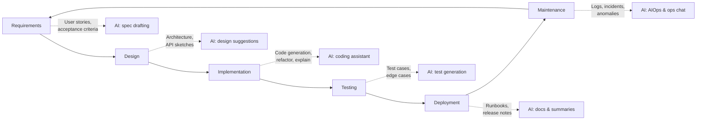
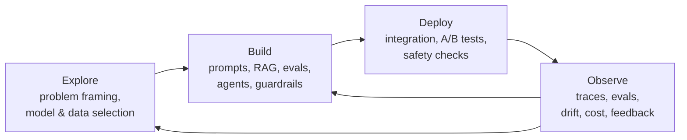

# Lesson 5-2: AI's Role Across the Software Development Lifecycle

> Student follow-along resources, key concepts, and references for this sublesson.

## Overview

The Software Development Lifecycle (SDLC) is the end-to-end process of turning an idea into running, maintained software: requirements, design, implementation, testing, deployment, and maintenance. AI now plays a meaningful role in every one of those phases, and a parallel "GenAI application lifecycle" — explore, build, deploy, observe — has emerged for products that are themselves powered by LLMs. This sublesson maps where AI fits, what it actually does at each stage, and where human judgment must stay in the loop.

## Learning objectives

By the end of this sublesson you should be able to:

- List the six classical SDLC phases and describe one concrete way AI accelerates each.
- Distinguish the traditional SDLC from the explore–build–deploy–observe lifecycle used for GenAI applications.
- Identify which SDLC steps require strong human review (especially deployment, security, and architectural decisions).
- Recognize the categories of AI tooling that show up at each phase (assistants, agents, test generators, AIOps).
- Explain why AI is best treated as a *collaborator* — accelerating execution while humans set direction and quality.

## Key concepts

### 1. The classical SDLC, augmented with AI

| SDLC phase | What AI does well | Where humans still own the call |
| --- | --- | --- |
| Requirements | Convert interview notes and tickets into user stories, acceptance criteria, and structured specs; surface gaps and ambiguities. | Stakeholder alignment, prioritization, regulatory/business constraints. |
| Design | Suggest architectures, design patterns, and API sketches; compare trade-offs. | System-level architecture, security boundaries, data ownership. |
| Implementation | Inline completion, function generation, refactoring, code explanation. | Correctness review, style/standards alignment, security review. |
| Testing | Generate unit and edge-case tests, suggest test data, draft test plans. | Defining what "good enough" coverage means; safety/security tests. |
| Deployment | Draft runbooks, release notes, and configuration; summarize PRs. | Production change approvals, rollback plans, compliance sign-off. |
| Maintenance | Triage logs, summarize incidents, propose patches, draft postmortems. | Root cause judgement, customer communication, blameless culture. |

This is consistent with how the 2025 AWS APN guidance, Snyk's *AI in SDLC* guide, and the 2025 DORA insights all describe AI: every phase benefits, but the critical-thinking and accountability steps stay human.

### 2. The GenAI application lifecycle: explore, build, deploy, observe

When the *product* itself uses generative AI (a chatbot, a copilot feature, a RAG system), traditional SDLC alone is not enough because outputs are non-deterministic. A complementary lifecycle has emerged:

- **Explore** — Define the problem, pick a foundation model, sketch prompts, and validate feasibility in a playground.
- **Build** — Engineer prompts, retrieval pipelines, and tool/function-calling logic; write offline evaluations.
- **Deploy** — Ship the integration with proper safety, A/B, and rollout controls; verify behavior end-to-end.
- **Observe** — Continuously monitor traces, costs, latency, drift, and user feedback; loop insights back into Build (or even back to Explore if the framing was wrong). Distributional and Google Cloud's GenAI architecture guidance both describe this loop in detail.

### 3. AI-led and "spec-driven" SDLC patterns

A 2025–2026 pattern increasingly visible in industry write-ups (Microsoft's GitHub Spec Kit, AWS guidance, internal docs at large engineering orgs) is the **spec-driven SDLC**, where:

1. A human writes a high-level spec or epic.
2. An AI agent expands it into structured requirements and a checklist.
3. A coding agent (e.g., GitHub Copilot's coding agent or Cursor's agent mode) implements pieces of the checklist.
4. AI quality and security agents review the changes.
5. A human approves the PR; CI/CD performs the deterministic deployment.
6. An SRE/observability agent watches the system and opens issues when problems appear.

This pattern preserves deterministic deployment while letting AI compress the slowest phases (drafting and verification).

### 4. Where AI helps least — and why

Even in 2026, AI is weaker at:

- **Cross-cutting architectural decisions** that depend on long-lived business context.
- **Security-sensitive design choices** (auth, secrets, data isolation), where wrong defaults are dangerous.
- **Production change management** with regulatory or financial consequences.
- **People work**: stakeholder alignment, prioritization conflicts, and team dynamics.

Treat AI as a fast junior collaborator: excellent at first drafts, mediocre at high-stakes judgment.

## Why it matters / What's next

Knowing where AI fits in the SDLC tells you *what to invest in next*. If your team is slow at drafting tickets and tests, you'll get more leverage from AI on the requirements and testing phases than from another autocomplete tool. The next sublesson, **Lesson 5-3**, drills into the implementation phase — the most visible AI use case today — covering GitHub Copilot, Cursor, and rapid prototyping practices. Lesson 5-4 then addresses the workflow design and monitoring needed when AI is doing real work in production.

## Glossary

- **SDLC** — The end-to-end process of building and maintaining software (requirements through maintenance).
- **GenAI lifecycle** — The complementary explore / build / deploy / observe loop used for LLM-powered applications.
- **Spec-driven development** — A workflow in which structured specs (often AI-expanded) drive coding agents and verification.
- **AI agent** — An LLM-based system that plans and executes multi-step tasks, possibly using tools, files, or the web.
- **Coding agent** — Specifically, an agent that performs software engineering tasks (creating PRs, running tests, refactoring).
- **AIOps** — AI for IT operations: anomaly detection, log/trace correlation, automated remediation suggestions.
- **Shift-left testing** — Pushing testing earlier in the lifecycle, often by having AI generate tests during implementation.
- **Drift** — Change over time in input distribution, prompt behavior, or model outputs that degrades quality.
- **Runbook** — A documented operational procedure for handling a known scenario (incident, deployment, recovery).
- **Postmortem** — A blameless review of an incident; AI can draft the timeline and contributing factors from logs.

## Quick self-check

1. Name one concrete way AI helps in *each* SDLC phase.
2. What's the difference between the traditional SDLC and the GenAI explore–build–deploy–observe lifecycle?
3. Why does deployment usually stay human-approved even with strong AI tooling?
4. In a spec-driven SDLC, what does the human still own?
5. List two SDLC areas where AI is currently weak and explain why.

## References and further reading

- Snyk — *AI in SDLC: a complete guide to AI-powered software development.* https://snyk.io/articles/complete-guide-ai-powered-software-development/
- AWS Partner Network — *Transforming the software development lifecycle (SDLC) with generative AI.* https://aws.amazon.com/blogs/apn/transforming-the-software-development-lifecycle-sdlc-with-generative-ai/
- Distributional — *The AI software development lifecycle: a practical framework for modern AI systems.* https://www.distributional.com/blog/the-ai-software-development-lifecycle-a-practical-framework-for-modern-ai-systems
- Google Cloud — *Deploy and operate generative AI applications.* https://docs.cloud.google.com/architecture/deploy-operate-generative-ai-applications
- Microsoft Tech Community — *An AI-led SDLC: building an end-to-end agentic software development lifecycle with Azure and GitHub.* https://techcommunity.microsoft.com/blog/appsonazureblog/an-ai-led-sdlc-building-an-end-to-end-agentic-software-development-lifecycle-wit/4491896
- DORA — *Balancing AI tensions: moving from AI adoption to effective SDLC use.* https://dora.dev/insights/balancing-ai-tensions/
- DORA — *State of AI-assisted Software Development 2025.* https://dora.dev/dora-report-2025/
- Synapt — *Top 10 SDLC tools for 2025 to boost project efficiency.* https://www.synapt.ai/resources-blogs/top-10-ai-sdlc-tools-of-2025/
- DX — *The best SDLC tools in 2025 and how to measure their impact.* https://getdx.com/blog/software-development-life-cycle-tools/
- Level Up Coding — *Building software in 2025: useful AI tools for every phase of software development.* https://medium.com/gitconnected/building-software-in-2025-useful-ai-tools-for-every-phase-of-software-development-753ebbdde4f1

### Omar's resources and references (course-wide)

#### Foundational cybersecurity resources in O'Reilly

This section provides a curated list of resources that delve into foundational cybersecurity concepts, frequently explored in O'Reilly training sessions and other educational offerings.

##### Live training

- **Upcoming Live Cybersecurity and AI Training in O'Reilly:** [Register before it is too late](https://learning.oreilly.com/search/?q=omar%20santos&type=live-course&rows=100&language_with_transcripts=en) (free with O'Reilly Subscription)

##### Reading list

Despite the rapidly evolving landscape of AI and technology, these books offer a comprehensive roadmap for understanding the intersection of these technologies with cybersecurity:

- **[NEW: Agentic AI for Cybersecurity: Building Autonomous Defenders and Adversaries](https://www.oreilly.com/library/view/agentic-ai-for/9780135589861/).** Unlock the power of next generation AI agents to transform cybersecurity, business operations, and productivity. [Available on O'Reilly](https://www.oreilly.com/library/view/agentic-ai-for/9780135589861/)

- **[Redefining Hacking](https://learning.oreilly.com/library/view/redefining-hacking-a/9780138363635/)** — A Comprehensive Guide to Red Teaming and Bug Bounty Hunting in an AI-driven World. [Available on O'Reilly](https://learning.oreilly.com/library/view/redefining-hacking-a/9780138363635/)

- **[AI-Powered Digital Cyber Resilience](https://www.oreilly.com/library/view/ai-powered-digital-cyber/9780135408599/)** — A practical guide to building intelligent, AI-powered cyber defenses in today's fast-evolving threat landscape. [Available on O'Reilly](https://www.oreilly.com/library/view/ai-powered-digital-cyber/9780135408599/)

- **[Developing Cybersecurity Programs and Policies in an AI-Driven World](https://learning.oreilly.com/library/view/developing-cybersecurity-programs/9780138073992)** — Explore strategies for creating robust cybersecurity frameworks in an AI-centric environment. [Available on O'Reilly](https://learning.oreilly.com/library/view/developing-cybersecurity-programs/9780138073992)

- **[Beyond the Algorithm: AI, Security, Privacy, and Ethics](https://learning.oreilly.com/library/view/beyond-the-algorithm/9780138268442)** — Gain insights into the ethical and security challenges posed by AI technologies. [Available on O'Reilly](https://learning.oreilly.com/library/view/beyond-the-algorithm/9780138268442)

- **[The AI Revolution in Networking, Cybersecurity, and Emerging Technologies](https://learning.oreilly.com/library/view/the-ai-revolution/9780138293703)** — Understand how AI is transforming networking and cybersecurity landscape. [Available on O'Reilly](https://learning.oreilly.com/library/view/the-ai-revolution/9780138293703)

##### Video courses

Enhance your practical skills with these video courses designed to deepen your understanding of cybersecurity:

- **[Building the Ultimate Cybersecurity Lab and Cyber Range](https://learning.oreilly.com/course/building-the-ultimate/9780138319090/)** (video). [Available on O'Reilly](https://learning.oreilly.com/course/building-the-ultimate/9780138319090/)

- **[Build Your Own AI Lab](https://learning.oreilly.com/course/build-your-own/9780135439616)** (video) — Hands-on guide to home and cloud-based AI labs. Learn to set up and optimize labs to research and experiment in a secure environment. [Available on O'Reilly](https://learning.oreilly.com/course/build-your-own/9780135439616)

- **[Defending and Deploying AI](https://www.oreilly.com/videos/defending-and-deploying/9780135463727/)** (video) — Comprehensive, hands-on journey into modern AI applications for technology and security professionals, covering AI-enabled programming, networking, and cybersecurity; securing generative AI (LLM security, prompt injection, red-teaming); secure AI labs; AI agents and agentic RAG for cybersecurity. [Available on O'Reilly](https://www.oreilly.com/videos/defending-and-deploying/9780135463727/)

- **[AI-Enabled Programming, Networking, and Cybersecurity](https://learning.oreilly.com/course/ai-enabled-programming-networking/9780135402696/)** — Learn to use AI for cybersecurity, networking, and programming tasks with practical, hands-on activities. [Available on O'Reilly](https://learning.oreilly.com/course/ai-enabled-programming-networking/9780135402696/)

- **[Securing Generative AI](https://learning.oreilly.com/course/securing-generative-ai/9780135401804/)** — Security for deploying and developing AI applications, RAG, agents, and other AI implementations; incorporate security at every stage of AI development, deployment, and operation. [Available on O'Reilly](https://learning.oreilly.com/course/securing-generative-ai/9780135401804/)

- **[Practical Cybersecurity Fundamentals](https://learning.oreilly.com/course/practical-cybersecurity-fundamentals/9780138037550/)** — Essential cybersecurity principles. [Available on O'Reilly](https://learning.oreilly.com/course/practical-cybersecurity-fundamentals/9780138037550/)

- **[The Art of Hacking](https://theartofhacking.org)** — Over 26 hours of training in ethical hacking and penetration testing (e.g., OSCP or CEH prep). [Visit The Art of Hacking](https://theartofhacking.org)

##### Certification related

- **CompTIA PenTest+ PT0-002 Cert Guide, 2nd Edition** — [Available on O'Reilly](https://learning.oreilly.com/library/view/comptia-pentest-pt0-002/9780137566204/)

- **Certified Ethical Hacker (CEH), Latest Edition** — Very comprehensive (19+ hours). [Available on O'Reilly](https://learning.oreilly.com/course/certified-ethical-hacker/9780135395646/)

- **Certified in Cybersecurity - CC (ISC)²** — [Available on O'Reilly](https://learning.oreilly.com/course/certified-in-cybersecurity/9780138230364/)

- **CCNP and CCIE Security Core SCOR 350-701 Official Cert Guide, 2nd Edition** — [Available on O'Reilly](https://learning.oreilly.com/library/view/ccnp-and-ccie/9780138221287/)

- **CEH Certified Ethical Hacker Cert Guide** — [Available on O'Reilly](https://learning.oreilly.com/library/view/ceh-certified-ethical/9780137489930/)

##### Additional resources

- **Hacking Scenarios (Labs) on O'Reilly** — Cloud-based labs; no local install. [https://hackingscenarios.com](https://hackingscenarios.com)

- **Personal blog** — [becomingahacker.org](https://becomingahacker.org)

- **Cisco blog** — [blogs.cisco.com/author/omarsantos](https://blogs.cisco.com/author/omarsantos)

- **GitHub repository** — [hackerrepo.org](https://hackerrepo.org)

- **WebSploit Labs** — [websploit.org](https://websploit.org)

- **NetAcad Ethical Hacker Free Course** — [NetAcad Skills for All](https://www.netacad.com/courses/ethical-hacker?courseLang=en-US)
