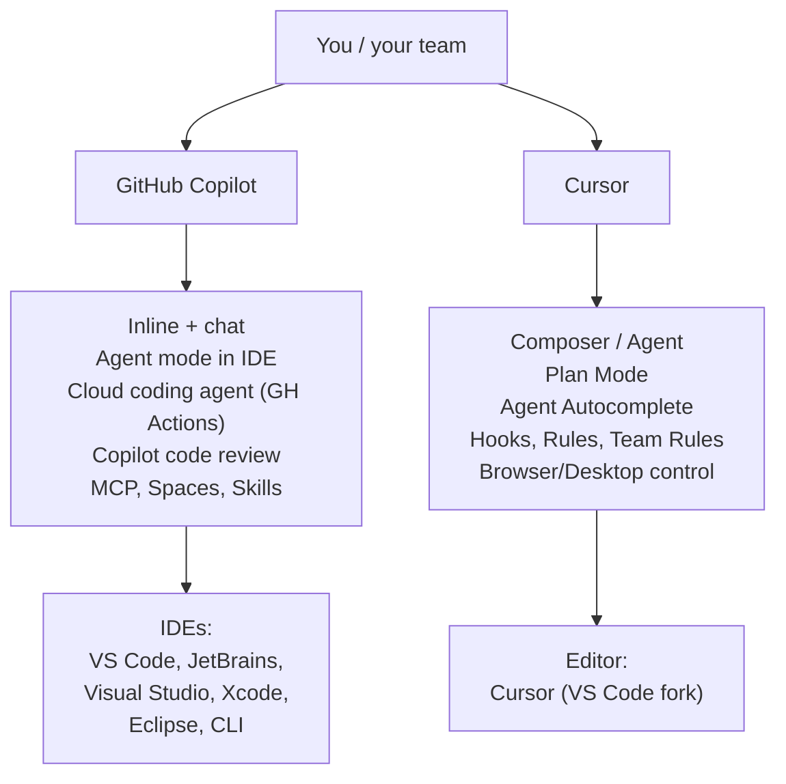
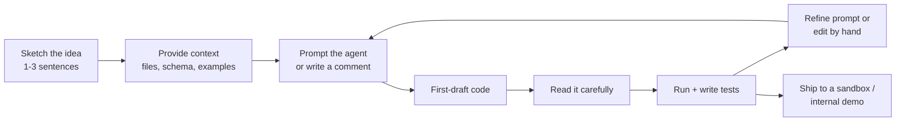

# Lesson 5-3: Code Generation and Rapid Prototyping

> Student follow-along resources, key concepts, and references for this sublesson.

## Overview

Code generation has become the most visible application of AI in software development. Two tools dominate practitioner conversations in 2025–2026: **GitHub Copilot**, an assistant that integrates into many existing IDEs and the GitHub platform, and **Cursor**, an AI-native editor (a fork of VS Code) built around chat, multi-file edits, and agents. This sublesson explains how each is positioned, what their newer agent capabilities do, and how to use them well for rapid prototyping without shipping low-quality code.

## Learning objectives

By the end of this sublesson you should be able to:

- Compare GitHub Copilot and Cursor along IDE integration, models, and agent capabilities.
- Describe how the GitHub Copilot coding agent works (issue assignment, GitHub Actions, MCP, PR review).
- Describe Cursor 1.7's Agent Autocomplete, Plan Mode, Hooks, and Team Rules and what each is for.
- Apply rapid-prototyping best practices: clear context, scoped prompts, review, and test before ship.
- Recognize when an AI-native editor (Cursor) is preferable to an IDE plugin (Copilot) and vice versa.

## Key concepts

### 1. GitHub Copilot — assistant + agent across the GitHub platform

GitHub Copilot is positioned as an "AI pair programmer" that integrates across the GitHub ecosystem (GitHub.com, the GitHub CLI, the mobile app) and across many IDEs (VS Code, Visual Studio, JetBrains IDEs, Xcode, Eclipse, Vim/Neovim). Its 2025–2026 capabilities include:

- **Inline suggestions and chat** in the IDE for completion, refactor, and explain workflows.
- **Agent mode in IDEs** for multi-file edits.
- **A Copilot coding agent** that runs asynchronously on a secure GitHub Actions–powered environment. You assign a GitHub issue to Copilot (or trigger it from Copilot Chat); the agent researches the repo, plans, opens a branch, makes changes, and opens a pull request for human review. Branch protections and required reviews still apply.
- **Model Context Protocol (MCP)** servers and **Agent Skills** to extend the agent with custom tools and specialized behaviors.
- **Copilot Spaces** to centralize project context (docs, specs, examples) for higher-quality suggestions.
- **Copilot code review** that comments on pull requests like a reviewer.

Copilot suits teams that already live in GitHub, use multiple IDEs, and want enterprise-grade governance (audit logs, content filtering, mandatory PR review for agent output).

### 2. Cursor — an AI-native IDE

Cursor is a standalone editor based on a fork of VS Code, designed around AI from the ground up. You can choose models from OpenAI, Anthropic, Google, and others. Its major capabilities include:

- **Composer / Agent mode** for multi-file edits driven by natural language.
- **Plan Mode** (Cursor 1.7, Sept 2025) where the agent generates a detailed plan first, lets you review or edit it, then executes — useful for longer, more complex tasks.
- **Agent Autocomplete** (1.7) that predicts the next likely *prompt* you'd send the agent, not just the next line of code.
- **Hooks (beta)** — custom scripts that observe and control the agent loop at runtime: log activity, block dangerous shell commands, redact secrets, enforce allowed tools.
- **Team Rules** — organization-wide rules (next to per-repo `.cursor/rules`) that apply to every agent run, helping enforce standards.
- **Browser and desktop control** for agents that need to view a UI to debug or fix bugs.

Cursor suits developers who want a single AI-native environment with maximum control over context, rules, and the agent loop.

### 3. Side-by-side comparison

| Dimension | GitHub Copilot | Cursor |
| --- | --- | --- |
| Form factor | Plugin across many IDEs + GitHub.com | Standalone AI-native editor |
| Models | GitHub-hosted set (e.g., GPT-class, Claude options) with admin control | User-selectable OpenAI, Anthropic, Google, others |
| Agent execution | Asynchronous in GitHub Actions environment | Local or remote VM, in-editor |
| Customization | MCP servers, Agent Skills, Copilot Spaces, prompt files | `.cursor/rules`, Team Rules, Hooks |
| Governance | Enterprise audit logs, branch protections, mandatory PR review | Hooks for runtime control, Team Rules dashboard |
| Best for | Heterogeneous teams already on GitHub | Engineers who want one AI-first environment |

Both work — most engineers in 2026 use *one of them as the daily driver* and may use the other for specific workflows (e.g., Cursor for solo prototyping, Copilot agent for issue-driven work).

### 4. Rapid prototyping with AI — a practical loop

Concrete best practices:

- **Be specific in the prompt.** State the language/framework, the inputs and outputs, the constraints, and what "done" looks like.
- **Give the model the right files.** In Cursor, attach files explicitly; in Copilot, use Copilot Spaces or open the relevant files. Don't rely on the model to guess.
- **Use comments as anchors.** A short docstring or `# TODO:` comment above an empty function steers the model better than a long prose prompt.
- **Treat output as a draft, not a deliverable.** Run it, lint it, test it. Especially for security-sensitive code — auth, deserialization, file uploads — assume a fresh AI draft has a vulnerability until proven otherwise.
- **Use the agent for boilerplate, you for design.** Schema migrations, CRUD endpoints, fixture data, basic test scaffolds — perfect agent work. System architecture and security-critical decisions are still on you.
- **Lock in standards via rules.** Use `.cursor/rules`, Cursor Team Rules, and/or Copilot prompt files to keep generated code consistent with your codebase's style and conventions.

### 5. Where AI-generated code goes wrong

Empirical 2025 studies (the *Debt Behind the AI Boom* arXiv study and Faros AI's *Productivity Paradox*) show that while AI-assisted development merges more PRs, those PRs are also reviewed for longer, contain more rework, and accumulate "AI-generated technical debt" — over 15% of AI-assisted commits introduce issues, and ~25% of those persist. Knowing this is *the* reason rapid prototyping practices matter: speed is real, but verification cost is also real.

## Why it matters / What's next

Code generation is the most leverageable everyday AI capability for a developer. The trade-offs above are why the next sublessons exist: **Lesson 5-4** covers how to *design* and *monitor* AI-driven workflows so they remain trustworthy at scale, **Lesson 5-5** covers controlling the cost and latency of those LLM calls through token and context discipline, and **Lesson 5-6** covers using AI to improve quality (debugging, error handling, documentation, review) — directly mitigating the technical-debt risks raised here.

## Glossary

- **Inline completion** — Code suggestions that appear as you type, accepted by tab/key.
- **Chat-style assistant** — A side-panel where you ask questions or instruct multi-file edits.
- **Coding agent** — An AI that autonomously plans and performs coding tasks, often producing a PR.
- **Plan Mode (Cursor)** — Generates a structured plan first, then executes after you review/edit it.
- **Agent Autocomplete (Cursor)** — Predicts your *next prompt* to the agent, accelerating long sessions.
- **Hooks (Cursor)** — Custom scripts that intercept the agent loop for logging, blocking, or redaction.
- **Team Rules (Cursor)** — Organization-wide rules applied across repos.
- **Copilot Spaces** — A way to bundle docs, specs, and examples as Copilot context.
- **Model Context Protocol (MCP)** — An open protocol that lets agents call external tools and data sources; supported by both Copilot and Cursor.
- **Rapid prototyping** — Quickly producing a working prototype to validate an idea before committing to a full build.
- **AI-generated technical debt** — Code accepted from AI without sufficient review that imposes future maintenance cost.

## Quick self-check

1. What are two key differences between GitHub Copilot and Cursor in form factor and customization?
2. How does the GitHub Copilot coding agent execute work safely?
3. What problem does Cursor's Plan Mode solve compared to plain agent execution?
4. List three best practices for rapid prototyping with AI.
5. Why is it dangerous to treat an AI's first draft as production-ready?

## References and further reading

- GitHub Docs — *GitHub Copilot features.* https://docs.github.com/en/copilot/get-started/features
- GitHub — *GitHub Copilot.* https://github.com/features/copilot
- GitHub Newsroom — *GitHub introduces coding agent for GitHub Copilot.* https://github.com/newsroom/press-releases/coding-agent-for-github-copilot
- GitHub Changelog — *GitHub Copilot coding agent in public preview.* https://github.blog/changelog/2025-05-19-github-copilot-coding-agent-in-public-preview/
- Cursor — *Cursor 1.7 changelog: Browser controls, Plan Mode, and Hooks.* https://cursor.com/changelog/1-7
- Cursor Forum — *Cursor 1.7 is here!* https://forum.cursor.com/t/cursor-1-7-is-here/135333
- Skywork — *Cursor 1.7 (2025): Agent Autocomplete, Hooks & Team Rules explained.* https://skywork.ai/blog/cursor-1-7-2025-agent-autocomplete-hooks-team-rules/
- Microsoft Tech Community — *An AI-led SDLC: building an end-to-end agentic software development lifecycle with Azure and GitHub.* https://techcommunity.microsoft.com/blog/appsonazureblog/an-ai-led-sdlc-building-an-end-to-end-agentic-software-development-lifecycle-wit/4491896
- arXiv — *Debt behind the AI boom: a large-scale empirical study of AI-generated code in the wild.* https://arxiv.org/html/2603.28592v1
- Faros AI — *The AI productivity paradox research report.* https://www.faros.ai/blog/ai-software-engineering
- Grokipedia — *Cursor (code editor).* https://grokipedia.com/page/cursor-code-editor

### Omar's resources and references (course-wide)

#### Foundational cybersecurity resources in O'Reilly

This section provides a curated list of resources that delve into foundational cybersecurity concepts, frequently explored in O'Reilly training sessions and other educational offerings.

##### Live training

- **Upcoming Live Cybersecurity and AI Training in O'Reilly:** [Register before it is too late](https://learning.oreilly.com/search/?q=omar%20santos&type=live-course&rows=100&language_with_transcripts=en) (free with O'Reilly Subscription)

##### Reading list

Despite the rapidly evolving landscape of AI and technology, these books offer a comprehensive roadmap for understanding the intersection of these technologies with cybersecurity:

- **[NEW: Agentic AI for Cybersecurity: Building Autonomous Defenders and Adversaries](https://www.oreilly.com/library/view/agentic-ai-for/9780135589861/).** Unlock the power of next generation AI agents to transform cybersecurity, business operations, and productivity. [Available on O'Reilly](https://www.oreilly.com/library/view/agentic-ai-for/9780135589861/)

- **[Redefining Hacking](https://learning.oreilly.com/library/view/redefining-hacking-a/9780138363635/)** — A Comprehensive Guide to Red Teaming and Bug Bounty Hunting in an AI-driven World. [Available on O'Reilly](https://learning.oreilly.com/library/view/redefining-hacking-a/9780138363635/)

- **[AI-Powered Digital Cyber Resilience](https://www.oreilly.com/library/view/ai-powered-digital-cyber/9780135408599/)** — A practical guide to building intelligent, AI-powered cyber defenses in today's fast-evolving threat landscape. [Available on O'Reilly](https://www.oreilly.com/library/view/ai-powered-digital-cyber/9780135408599/)

- **[Developing Cybersecurity Programs and Policies in an AI-Driven World](https://learning.oreilly.com/library/view/developing-cybersecurity-programs/9780138073992)** — Explore strategies for creating robust cybersecurity frameworks in an AI-centric environment. [Available on O'Reilly](https://learning.oreilly.com/library/view/developing-cybersecurity-programs/9780138073992)

- **[Beyond the Algorithm: AI, Security, Privacy, and Ethics](https://learning.oreilly.com/library/view/beyond-the-algorithm/9780138268442)** — Gain insights into the ethical and security challenges posed by AI technologies. [Available on O'Reilly](https://learning.oreilly.com/library/view/beyond-the-algorithm/9780138268442)

- **[The AI Revolution in Networking, Cybersecurity, and Emerging Technologies](https://learning.oreilly.com/library/view/the-ai-revolution/9780138293703)** — Understand how AI is transforming networking and cybersecurity landscape. [Available on O'Reilly](https://learning.oreilly.com/library/view/the-ai-revolution/9780138293703)

##### Video courses

Enhance your practical skills with these video courses designed to deepen your understanding of cybersecurity:

- **[Building the Ultimate Cybersecurity Lab and Cyber Range](https://learning.oreilly.com/course/building-the-ultimate/9780138319090/)** (video). [Available on O'Reilly](https://learning.oreilly.com/course/building-the-ultimate/9780138319090/)

- **[Build Your Own AI Lab](https://learning.oreilly.com/course/build-your-own/9780135439616)** (video) — Hands-on guide to home and cloud-based AI labs. Learn to set up and optimize labs to research and experiment in a secure environment. [Available on O'Reilly](https://learning.oreilly.com/course/build-your-own/9780135439616)

- **[Defending and Deploying AI](https://www.oreilly.com/videos/defending-and-deploying/9780135463727/)** (video) — Comprehensive, hands-on journey into modern AI applications for technology and security professionals, covering AI-enabled programming, networking, and cybersecurity; securing generative AI (LLM security, prompt injection, red-teaming); secure AI labs; AI agents and agentic RAG for cybersecurity. [Available on O'Reilly](https://www.oreilly.com/videos/defending-and-deploying/9780135463727/)

- **[AI-Enabled Programming, Networking, and Cybersecurity](https://learning.oreilly.com/course/ai-enabled-programming-networking/9780135402696/)** — Learn to use AI for cybersecurity, networking, and programming tasks with practical, hands-on activities. [Available on O'Reilly](https://learning.oreilly.com/course/ai-enabled-programming-networking/9780135402696/)

- **[Securing Generative AI](https://learning.oreilly.com/course/securing-generative-ai/9780135401804/)** — Security for deploying and developing AI applications, RAG, agents, and other AI implementations; incorporate security at every stage of AI development, deployment, and operation. [Available on O'Reilly](https://learning.oreilly.com/course/securing-generative-ai/9780135401804/)

- **[Practical Cybersecurity Fundamentals](https://learning.oreilly.com/course/practical-cybersecurity-fundamentals/9780138037550/)** — Essential cybersecurity principles. [Available on O'Reilly](https://learning.oreilly.com/course/practical-cybersecurity-fundamentals/9780138037550/)

- **[The Art of Hacking](https://theartofhacking.org)** — Over 26 hours of training in ethical hacking and penetration testing (e.g., OSCP or CEH prep). [Visit The Art of Hacking](https://theartofhacking.org)

##### Certification related

- **CompTIA PenTest+ PT0-002 Cert Guide, 2nd Edition** — [Available on O'Reilly](https://learning.oreilly.com/library/view/comptia-pentest-pt0-002/9780137566204/)

- **Certified Ethical Hacker (CEH), Latest Edition** — Very comprehensive (19+ hours). [Available on O'Reilly](https://learning.oreilly.com/course/certified-ethical-hacker/9780135395646/)

- **Certified in Cybersecurity - CC (ISC)²** — [Available on O'Reilly](https://learning.oreilly.com/course/certified-in-cybersecurity/9780138230364/)

- **CCNP and CCIE Security Core SCOR 350-701 Official Cert Guide, 2nd Edition** — [Available on O'Reilly](https://learning.oreilly.com/library/view/ccnp-and-ccie/9780138221287/)

- **CEH Certified Ethical Hacker Cert Guide** — [Available on O'Reilly](https://learning.oreilly.com/library/view/ceh-certified-ethical/9780137489930/)

##### Additional resources

- **Hacking Scenarios (Labs) on O'Reilly** — Cloud-based labs; no local install. [https://hackingscenarios.com](https://hackingscenarios.com)

- **Personal blog** — [becomingahacker.org](https://becomingahacker.org)

- **Cisco blog** — [blogs.cisco.com/author/omarsantos](https://blogs.cisco.com/author/omarsantos)

- **GitHub repository** — [hackerrepo.org](https://hackerrepo.org)

- **WebSploit Labs** — [websploit.org](https://websploit.org)

- **NetAcad Ethical Hacker Free Course** — [NetAcad Skills for All](https://www.netacad.com/courses/ethical-hacker?courseLang=en-US)
