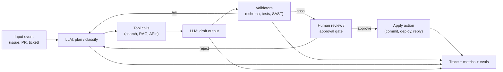

# Lesson 5-4: AI Workflow Design and Monitoring

> Student follow-along resources, key concepts, and references for this sublesson.

## Overview

Once AI moves out of the IDE and into a real process — generating code, reviewing PRs, triaging incidents, talking to customers — you are no longer "using a tool"; you are running a workflow. Workflows have inputs, outputs, dependencies, failure modes, and costs. This sublesson covers the two engineering disciplines that make AI workflows trustworthy at scale: **workflow design** (what runs where, who approves what, how errors are handled) and **monitoring** (how you observe, evaluate, and improve a non-deterministic system in production).

## Learning objectives

By the end of this sublesson you should be able to:

- Sketch a multi-step AI workflow with clear inputs, outputs, and human approval points.
- Apply the core orchestration patterns: idempotency, retries with backoff, circuit breakers, and the saga (compensation) pattern.
- Place human-in-the-loop checkpoints proportional to the "blast radius" of each action.
- Identify the key signals to monitor for an LLM workflow: prompt/response logs, latency, token cost, evaluation scores, drift.
- Recognize the role of OpenTelemetry GenAI semantic conventions and platforms like LangSmith for tracing and evals.

## Key concepts

### 1. A typical AI-augmented workflow

A real workflow rarely calls one model and stops. It interleaves AI steps, deterministic steps, tool calls, and human review. A common shape:

Design notes:

- **Single responsibility per step.** Each step has clear inputs, outputs, and a single job. This makes it debuggable and replaceable.
- **Deterministic glue around non-deterministic AI.** Validators, schemas, and tool wrappers keep the system predictable even when the LLM is not.
- **Human gates where the blast radius is high.** Reading data — usually no gate. Reversible writes — soft gate (logged, easy to roll back). Irreversible actions (deploys, deletions, payments) — hard gate.

### 2. Orchestration patterns you'll actually need

Treat AI workflows like distributed systems, because they are:

| Pattern | What it does | Why you need it |
| --- | --- | --- |
| **Idempotency keys** | Each step has a deterministic ID; re-running with the same key returns the cached result rather than calling the LLM again. | Prevents double-spend, double-deployment, duplicate emails, and runaway token bills on retries. |
| **Retries with exponential backoff** | Transient failures (timeouts, 5xx) are retried with growing delays. | LLM APIs occasionally fail; naive retries cascade load. |
| **Circuit breakers** | Stop calling a downstream service after too many failures or excessive latency. | Prevents one degraded model/provider from dragging down the whole system. |
| **Saga / compensation** | For multi-step writes, define a *compensating action* per step (e.g., "delete row" cancels "create row"). On failure, run compensations in reverse. | Avoids leaving the system in a half-applied state. |
| **State persistence + resumability** | Persist intermediate results (e.g., LangGraph checkpointers, a DB) so a workflow can resume from the last good step. | Lets you recover from crashes without re-running expensive steps. |
| **Tail-based sampling** | Always retain anomalous, failed, or slow traces; sample the happy path. | Keeps observability storage affordable while preserving the traces you actually want to debug. |

Frameworks that implement these patterns directly include **LangGraph** (stateful graphs with checkpointing and `interrupt`), **CrewAI** (role-based collaboration), and **AutoGen** (event-driven multi-agent). Pick one based on whether your workflow is more graph-shaped, role-shaped, or chat-shaped.

### 3. Human-in-the-loop, scoped by blast radius

Not every AI action deserves a human gate. A useful rubric:

- **Read-only / advisory** — no approval; log for audit (e.g., AI summarizes a log file).
- **Reversible writes** — soft approval; one-click rollback (e.g., AI opens a draft PR).
- **Irreversible / high-impact** — hard approval; explicit human sign-off (e.g., production deploy, data deletion, customer refund).

LangGraph's `interrupt` primitive is a good reference implementation: the workflow pauses, exposes its state to a human, and resumes via `Command(resume=...)`.

### 4. Monitoring an LLM workflow

You cannot improve what you cannot see. The minimum signals to capture:

- **Traces** — A full record of the workflow run: every prompt, every model response, every tool call, and the final outcome. This is your debugging substrate.
- **Token usage** — Input and output tokens per call and per workflow, attributed to a tenant/user/agent.
- **Latency** — Per call and end-to-end. Watch p50, p95, p99.
- **Cost** — Computed from token usage and provider pricing; tagged at the trace root and propagated to spans.
- **Quality / evaluation scores** — Did the generated code pass tests? Did the user accept the suggestion? Did an LLM-as-judge rate the output as acceptable?
- **Drift** — Replay a "golden" trace set against production periodically; alert when behavior diverges (after a model upgrade, prompt change, or tool schema change).

A practical three-layer eval model:

1. **Unit evals** — schema, routing, plumbing regressions.
2. **LLM-as-judge** — subjective quality, hallucination, safety.
3. **Production sampling** — continuous evaluation of real traces to catch distribution shift.

### 5. The OpenTelemetry GenAI standard, and LangSmith

To avoid vendor lock-in, instrument your workflow using **OpenTelemetry's GenAI semantic conventions**, which are in `Development` status as of 2025–2026. They define standard span/metric attributes such as `gen_ai.operation.name`, `gen_ai.provider.name`, `gen_ai.request.model`, `gen_ai.usage.input_tokens`, and `gen_ai.usage.output_tokens`. Major backends (Datadog, Honeycomb, etc.) ingest these natively, so the same instrumentation works across observability platforms.

**LangSmith** is one of the most widely used purpose-built platforms for tracing, debugging, and evaluating LLM applications, with first-class support for LangChain/LangGraph and OpenTelemetry. Alternatives include the open-source **Langfuse** and the eval-focused **Braintrust**. The choice is largely about ergonomics and ecosystem — the underlying telemetry can and should be portable.

## Why it matters / What's next

A coding assistant in your IDE is forgiving — you see every suggestion. A workflow running in production is not — failures and quality drift can hide for weeks if you aren't measuring. Designing for observability and human oversight is what separates an AI demo from an AI product. The next sublesson, **Lesson 5-5**, drills into one specific (and very expensive-when-ignored) part of monitoring and design: **token usage and context window management** — controlling how many tokens flow through your workflow and how that drives cost, latency, and quality.

## Glossary

- **Workflow** — A defined sequence of steps with inputs, outputs, and handoffs that produces a business outcome.
- **Orchestration** — Coordinating multiple steps (LLM calls, tools, human actions) reliably.
- **Idempotency** — Property where running a step twice with the same inputs has the same effect as running it once.
- **Saga / compensation** — A failure-recovery pattern in which each step has a compensating action that undoes its effect.
- **Circuit breaker** — A pattern that stops calling a failing service once a threshold is crossed, then probes for recovery.
- **Trace** — A structured record of a single workflow execution, made up of nested spans.
- **Span** — One operation within a trace (an LLM call, a tool call, a DB query).
- **Tail-based sampling** — Keeping the *full* trace for interesting executions (errors, slow runs) while sampling the rest.
- **LLM-as-judge** — Using an LLM to evaluate the output of another LLM against a rubric.
- **Drift** — Change over time in inputs, behavior, or outputs that degrades quality.
- **Human-in-the-loop (HITL)** — Including a human approval or correction step in an otherwise automated workflow.
- **OpenTelemetry GenAI** — The vendor-neutral semantic conventions for tracing and metrics in LLM workflows.

## Quick self-check

1. Why is idempotency especially important in a workflow that calls paid LLM APIs?
2. Give one example each of read-only, reversible, and irreversible AI actions, and the right level of human gating for each.
3. Name three signals you should always log for every LLM call in production.
4. What's the difference between a unit eval, an LLM-as-judge eval, and a production-sample eval?
5. Why do teams instrument with OpenTelemetry GenAI conventions instead of just their observability vendor's SDK?

## References and further reading

- OpenTelemetry — *Semantic conventions for generative AI systems.* https://opentelemetry.io/docs/specs/semconv/gen-ai/
- OpenTelemetry — *Semantic conventions for generative AI metrics.* https://opentelemetry.io/docs/specs/semconv/gen-ai/gen-ai-metrics/
- LangChain — *LangSmith: AI agent and LLM observability platform.* https://www.langchain.com/langsmith/observability
- LangChain — *Making it easier to build human-in-the-loop agents with `interrupt`.* https://www.langchain.com/blog/making-it-easier-to-build-human-in-the-loop-agents-with-interrupt
- Datadog — *Datadog LLM observability natively supports OpenTelemetry GenAI semantic conventions.* https://www.datadoghq.com/blog/llm-otel-semantic-convention/
- Digital Applied — *Agent observability 2026: evals, traces, cost guide.* https://www.digitalapplied.com/blog/agent-observability-2026-evals-traces-cost-guide
- Augment Code — *Agent observability for AI coding: how to trace what your agents actually did.* https://www.augmentcode.com/guides/agent-observability-for-ai-coding
- Digital Applied — *AI agent orchestration: multi-agent workflow guide.* https://www.digitalapplied.com/blog/ai-agent-orchestration-workflows-guide
- DEV.to — *AI agent failures are distributed systems failures: the complete mapping.* https://dev.to/arif/ai-agent-failures-are-distributed-systems-failures-heres-the-complete-mapping-216k
- Level Up Coding — *Building human-in-the-loop agentic workflows.* https://levelup.gitconnected.com/building-human-in-the-loop-agentic-workflows-b28c3ef45444
- UiPath — *10 best practices for building reliable AI agents in 2025.* https://www.uipath.com/blog/ai/agent-builder-best-practices
- Thoughtworks Technology Radar — *LangSmith.* https://www.thoughtworks.com/radar/platforms/langsmith

### Omar's resources and references (course-wide)

#### Foundational cybersecurity resources in O'Reilly

This section provides a curated list of resources that delve into foundational cybersecurity concepts, frequently explored in O'Reilly training sessions and other educational offerings.

##### Live training

- **Upcoming Live Cybersecurity and AI Training in O'Reilly:** [Register before it is too late](https://learning.oreilly.com/search/?q=omar%20santos&type=live-course&rows=100&language_with_transcripts=en) (free with O'Reilly Subscription)

##### Reading list

Despite the rapidly evolving landscape of AI and technology, these books offer a comprehensive roadmap for understanding the intersection of these technologies with cybersecurity:

- **[NEW: Agentic AI for Cybersecurity: Building Autonomous Defenders and Adversaries](https://www.oreilly.com/library/view/agentic-ai-for/9780135589861/).** Unlock the power of next generation AI agents to transform cybersecurity, business operations, and productivity. [Available on O'Reilly](https://www.oreilly.com/library/view/agentic-ai-for/9780135589861/)

- **[Redefining Hacking](https://learning.oreilly.com/library/view/redefining-hacking-a/9780138363635/)** — A Comprehensive Guide to Red Teaming and Bug Bounty Hunting in an AI-driven World. [Available on O'Reilly](https://learning.oreilly.com/library/view/redefining-hacking-a/9780138363635/)

- **[AI-Powered Digital Cyber Resilience](https://www.oreilly.com/library/view/ai-powered-digital-cyber/9780135408599/)** — A practical guide to building intelligent, AI-powered cyber defenses in today's fast-evolving threat landscape. [Available on O'Reilly](https://www.oreilly.com/library/view/ai-powered-digital-cyber/9780135408599/)

- **[Developing Cybersecurity Programs and Policies in an AI-Driven World](https://learning.oreilly.com/library/view/developing-cybersecurity-programs/9780138073992)** — Explore strategies for creating robust cybersecurity frameworks in an AI-centric environment. [Available on O'Reilly](https://learning.oreilly.com/library/view/developing-cybersecurity-programs/9780138073992)

- **[Beyond the Algorithm: AI, Security, Privacy, and Ethics](https://learning.oreilly.com/library/view/beyond-the-algorithm/9780138268442)** — Gain insights into the ethical and security challenges posed by AI technologies. [Available on O'Reilly](https://learning.oreilly.com/library/view/beyond-the-algorithm/9780138268442)

- **[The AI Revolution in Networking, Cybersecurity, and Emerging Technologies](https://learning.oreilly.com/library/view/the-ai-revolution/9780138293703)** — Understand how AI is transforming networking and cybersecurity landscape. [Available on O'Reilly](https://learning.oreilly.com/library/view/the-ai-revolution/9780138293703)

##### Video courses

Enhance your practical skills with these video courses designed to deepen your understanding of cybersecurity:

- **[Building the Ultimate Cybersecurity Lab and Cyber Range](https://learning.oreilly.com/course/building-the-ultimate/9780138319090/)** (video). [Available on O'Reilly](https://learning.oreilly.com/course/building-the-ultimate/9780138319090/)

- **[Build Your Own AI Lab](https://learning.oreilly.com/course/build-your-own/9780135439616)** (video) — Hands-on guide to home and cloud-based AI labs. Learn to set up and optimize labs to research and experiment in a secure environment. [Available on O'Reilly](https://learning.oreilly.com/course/build-your-own/9780135439616)

- **[Defending and Deploying AI](https://www.oreilly.com/videos/defending-and-deploying/9780135463727/)** (video) — Comprehensive, hands-on journey into modern AI applications for technology and security professionals, covering AI-enabled programming, networking, and cybersecurity; securing generative AI (LLM security, prompt injection, red-teaming); secure AI labs; AI agents and agentic RAG for cybersecurity. [Available on O'Reilly](https://www.oreilly.com/videos/defending-and-deploying/9780135463727/)

- **[AI-Enabled Programming, Networking, and Cybersecurity](https://learning.oreilly.com/course/ai-enabled-programming-networking/9780135402696/)** — Learn to use AI for cybersecurity, networking, and programming tasks with practical, hands-on activities. [Available on O'Reilly](https://learning.oreilly.com/course/ai-enabled-programming-networking/9780135402696/)

- **[Securing Generative AI](https://learning.oreilly.com/course/securing-generative-ai/9780135401804/)** — Security for deploying and developing AI applications, RAG, agents, and other AI implementations; incorporate security at every stage of AI development, deployment, and operation. [Available on O'Reilly](https://learning.oreilly.com/course/securing-generative-ai/9780135401804/)

- **[Practical Cybersecurity Fundamentals](https://learning.oreilly.com/course/practical-cybersecurity-fundamentals/9780138037550/)** — Essential cybersecurity principles. [Available on O'Reilly](https://learning.oreilly.com/course/practical-cybersecurity-fundamentals/9780138037550/)

- **[The Art of Hacking](https://theartofhacking.org)** — Over 26 hours of training in ethical hacking and penetration testing (e.g., OSCP or CEH prep). [Visit The Art of Hacking](https://theartofhacking.org)

##### Certification related

- **CompTIA PenTest+ PT0-002 Cert Guide, 2nd Edition** — [Available on O'Reilly](https://learning.oreilly.com/library/view/comptia-pentest-pt0-002/9780137566204/)

- **Certified Ethical Hacker (CEH), Latest Edition** — Very comprehensive (19+ hours). [Available on O'Reilly](https://learning.oreilly.com/course/certified-ethical-hacker/9780135395646/)

- **Certified in Cybersecurity - CC (ISC)²** — [Available on O'Reilly](https://learning.oreilly.com/course/certified-in-cybersecurity/9780138230364/)

- **CCNP and CCIE Security Core SCOR 350-701 Official Cert Guide, 2nd Edition** — [Available on O'Reilly](https://learning.oreilly.com/library/view/ccnp-and-ccie/9780138221287/)

- **CEH Certified Ethical Hacker Cert Guide** — [Available on O'Reilly](https://learning.oreilly.com/library/view/ceh-certified-ethical/9780137489930/)

##### Additional resources

- **Hacking Scenarios (Labs) on O'Reilly** — Cloud-based labs; no local install. [https://hackingscenarios.com](https://hackingscenarios.com)

- **Personal blog** — [becomingahacker.org](https://becomingahacker.org)

- **Cisco blog** — [blogs.cisco.com/author/omarsantos](https://blogs.cisco.com/author/omarsantos)

- **GitHub repository** — [hackerrepo.org](https://hackerrepo.org)

- **WebSploit Labs** — [websploit.org](https://websploit.org)

- **NetAcad Ethical Hacker Free Course** — [NetAcad Skills for All](https://www.netacad.com/courses/ethical-hacker?courseLang=en-US)
