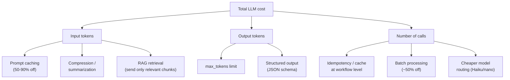

# Lesson 5-5: Token Usage and Context Window Management

> Student follow-along resources, key concepts, and references for this sublesson.

## Overview

Every LLM call you make is metered in **tokens** — the units a model reads (input) and produces (output). Tokens drive cost (you pay per token), latency (more tokens = slower responses), and quality (too much irrelevant context degrades reasoning). Managing tokens and the model's **context window** is therefore a core engineering skill, not an optimization detail. This sublesson covers the levers you actually have: prompt design, context selection, output limits, prompt caching, retrieval, and per-workflow budgeting.

## Learning objectives

By the end of this sublesson you should be able to:

- Define a token, the context window, and the input/output token budget of an LLM call.
- Compare context window sizes of current flagship models (GPT-5.x, Claude 4.x, Gemini 3.x).
- Apply prompt-caching and batch-processing strategies to reduce cost.
- Choose between cramming long context vs. RAG/indexing for very large codebases.
- Set sensible `max_tokens` (output) limits and explain how they affect cost, latency, and behavior.
- Recognize the "lost-in-the-middle" effect and the case for context engineering over context maximalism.

## Key concepts

### 1. Tokens, context windows, and the input/output split

An LLM doesn't see characters or words; it sees **tokens** — sub-word units produced by a tokenizer (roughly 1 token ≈ 4 characters of English, ≈ ¾ of a word). Two numbers shape every call:

- **Context window** — the maximum tokens the model can attend to in a single call (input + output combined, depending on provider semantics).
- **Output limit** (`max_tokens`, `max_completion_tokens`) — the cap on how many tokens the model can produce in its response.

Pricing is typically per-million-tokens, separated into input and output, and **output is usually 3–5× more expensive than input**. Specialized cached-input pricing is much cheaper than fresh input.

### 2. Current model context windows (early 2026)

| Model family | Standard context window | Notes |
| --- | --- | --- |
| OpenAI **GPT-5.x** (5 / 5.1 / 5.2) | 200K–400K tokens | Largest official window varies by variant; "compaction" used for long sessions. |
| Anthropic **Claude 4.x** (Sonnet, Opus, Haiku) | 200K standard, 1M in beta on some variants | Pricing varies by tier; Haiku for cheap/fast, Opus for hardest tasks. |
| Google **Gemini 3.x Pro** | 1,000,000 tokens | Native very-long-context model. |
| Open-source variants (Llama 4, DeepSeek-V3.x, etc.) | Often 128K–1M | Self-hosting reduces token cost but adds infrastructure cost. |

A key empirical finding: **bigger context is not always better.** Models exhibit a "lost-in-the-middle" effect, where information placed at the beginning or end of a long prompt gets attended to far more than information in the middle. Stuffing 800K tokens into Gemini does not guarantee the model uses all of them well.

### 3. The cost levers — and what each one is worth

Concrete strategies:

- **Prompt caching.** OpenAI applies prompt caching automatically for prompts ≥ ~1,024 tokens on supported models, with 50–90% discounts on cached input segments and a default ~5–10 minute TTL (extended retention available, with caveats). Anthropic requires explicit `cache_control` markers on up to four breakpoints, with up to ~90% savings and a default 5-minute TTL (1-hour extended TTL available at extra cost). Both providers refresh the cache on every hit.
- **Batch processing.** Anthropic and Google offer roughly 50% discounts for batch (asynchronous) jobs — great for evals, backfills, and offline tagging.
- **Model routing.** Send simple tasks to a small, cheap model (Claude Haiku, GPT-5 nano, small open-source models) and reserve flagship models for hard reasoning. This often saves more than any single prompt-engineering tweak.
- **Output limits.** Always set a sensible `max_tokens`. Not setting one is the single most common reason for surprise bills and rambling responses.
- **Structured outputs.** JSON-mode / structured outputs reduce post-processing churn and tend to produce shorter, more focused responses.

### 4. Context engineering vs. dumping the codebase

For large codebases, the wrong question is "how do I fit the whole repo in the context window?" The right question is "what is the *minimum* context needed for the model to do this task well?"

Use a layered approach:

1. **Task description** — short, specific, with success criteria.
2. **Schema / contracts** — type signatures, API contracts, DB schema.
3. **Targeted code** — the file(s) being changed plus *direct* dependencies.
4. **Retrieved snippets** — pulled from a code index or vector DB by similarity to the task.
5. **Examples / golden patterns** — 1–3 small examples demonstrating the desired style.

This is sometimes called **context engineering**, and it has largely replaced the 2024-era practice of stuffing prompts. Tools that support it directly include Cursor's `@`-references, Copilot Spaces, embedding-based code search, and RAG layers backed by vector stores like Redis, pgvector, or Pinecone.

### 5. Latency: the other thing tokens drive

Larger context and longer outputs both increase latency. For interactive use cases (inline completion, live chat) keep contexts and outputs *short* — sub-second responses matter more than maximal capability. For asynchronous use cases (overnight refactors, batch evaluations) larger contexts are fine and may be preferable.

A useful mental model: optimize input tokens for **cost**, optimize output tokens for **latency**, and optimize the number of calls for **everything**.

### 6. Token & cost budgets per workflow

For any workflow you put in production:

- **Measure** input + output tokens per run, broken down by step.
- **Set budgets** — a per-run hard cap (max tokens per workflow), a per-tenant daily soft alert, a per-day organizational hard cap.
- **Alert on anomalies** — sudden cost spikes usually mean a regression: an infinite agent loop, a prompt that grew, or a retry storm.
- **Tag traces** at the root with tenant/agent IDs and propagate to children so you can attribute cost in your observability tool.

These mechanics tie directly back to the monitoring discipline from Lesson 5-4.

## Why it matters / What's next

Token discipline is what turns AI features from "cool prototype" into "sustainable product." Teams that ignore it get blindsided by API bills, slow user experiences, and quality regressions when prompts silently grow. The next sublesson, **Lesson 5-6**, closes Lesson 5 by looking at the *quality* lever — how AI itself can improve debugging, error handling, documentation, and review, mitigating the technical debt that comes with high-volume code generation.

## Glossary

- **Token** — Sub-word unit consumed and produced by an LLM; pricing and context limits are measured in tokens.
- **Tokenizer** — The component that splits raw text into tokens; tokenization differs by model family.
- **Context window** — The maximum tokens (input + output) the model attends to in one call.
- **`max_tokens` / `max_completion_tokens`** — Output cap controlled by the developer.
- **Prompt caching** — Discounted re-use of a previously seen prompt prefix; large savings (50–90%) when used.
- **Batch API** — Asynchronous LLM job mode with ~50% discounts on supported providers.
- **Lost-in-the-middle** — The empirical finding that LLMs underweight information placed in the middle of long prompts.
- **Context engineering** — Curating only the most relevant context to send to a model rather than maximizing length.
- **Retrieval-Augmented Generation (RAG)** — Pulling relevant chunks from a vector store at query time instead of stuffing everything into the prompt.
- **Model routing** — Sending tasks to the cheapest model that can handle them; reserving flagship models for hard cases.
- **Compaction** — Provider-side compression of long conversations (e.g., GPT-5.1) to fit ongoing context.
- **TTL (time-to-live)** — How long a cached prompt remains eligible for the discount before being evicted.

## Quick self-check

1. What's the difference between the context window and `max_tokens`?
2. Roughly how much can prompt caching save on input tokens with major providers, and what's the typical default TTL?
3. Why is sending the entire codebase usually worse than RAG for large repos?
4. Give two reasons why output tokens matter more for latency than input tokens.
5. Describe one anomaly that token-cost monitoring would catch before your bill does.

## References and further reading

- OpenAI — *Prompt caching in the API.* https://openai.com/index/api-prompt-caching/
- OpenAI Developers — *Prompt caching.* https://developers.openai.com/api/docs/guides/prompt-caching
- OpenAI Cookbook — *Prompt caching 201.* https://developers.openai.com/cookbook/examples/prompt_caching_201
- Grokipedia — *Prompt caching (Anthropic).* https://grokipedia.com/page/Prompt_caching_Anthropic
- Anthropic — *Claude Haiku 4.5.* https://www.anthropic.com/claude/haiku
- Redis — *Context window management for LLM apps: developer guide.* https://redis.io/blog/context-window-management-llm-apps-developer-guide/
- aiSuperior — *LLM cost comparison 2026: pricing across 15+ models.* https://aisuperior.com/cost-comparison-of-llm-models/
- Passionfruit — *GPT 5.1 vs Claude 4.5 vs Gemini 3: 2025 AI comparison.* https://www.getpassionfruit.com/blog/gpt-5-1-vs-claude-4-5-sonnet-vs-gemini-3-pro-vs-deepseek-v3-2-the-definitive-2025-ai-model-comparison
- Cosmic — *Claude Opus 4.5 vs Gemini 3 Pro vs GPT 5.2.* https://www.cosmicjs.com/blog/claude-opus-vs-gemini-pro-vs-gpt-comparison-ai-content-generation
- JuheAPI — *Context window size comparison: GPT-5 vs Claude 4 vs Gemini 2.5 vs GLM-4.6.* https://www.juheapi.com/blog/context-window-size-comparison-gpt5-claude4-gemini25-glm46
- The AI Corner — *Context engineering guide 2026.* https://www.the-ai-corner.com/p/context-engineering-guide-2026
- OpenTelemetry — *Semantic conventions for generative AI metrics (token usage).* https://opentelemetry.io/docs/specs/semconv/gen-ai/gen-ai-metrics/

### Omar's resources and references (course-wide)

#### Foundational cybersecurity resources in O'Reilly

This section provides a curated list of resources that delve into foundational cybersecurity concepts, frequently explored in O'Reilly training sessions and other educational offerings.

##### Live training

- **Upcoming Live Cybersecurity and AI Training in O'Reilly:** [Register before it is too late](https://learning.oreilly.com/search/?q=omar%20santos&type=live-course&rows=100&language_with_transcripts=en) (free with O'Reilly Subscription)

##### Reading list

Despite the rapidly evolving landscape of AI and technology, these books offer a comprehensive roadmap for understanding the intersection of these technologies with cybersecurity:

- **[NEW: Agentic AI for Cybersecurity: Building Autonomous Defenders and Adversaries](https://www.oreilly.com/library/view/agentic-ai-for/9780135589861/).** Unlock the power of next generation AI agents to transform cybersecurity, business operations, and productivity. [Available on O'Reilly](https://www.oreilly.com/library/view/agentic-ai-for/9780135589861/)

- **[Redefining Hacking](https://learning.oreilly.com/library/view/redefining-hacking-a/9780138363635/)** — A Comprehensive Guide to Red Teaming and Bug Bounty Hunting in an AI-driven World. [Available on O'Reilly](https://learning.oreilly.com/library/view/redefining-hacking-a/9780138363635/)

- **[AI-Powered Digital Cyber Resilience](https://www.oreilly.com/library/view/ai-powered-digital-cyber/9780135408599/)** — A practical guide to building intelligent, AI-powered cyber defenses in today's fast-evolving threat landscape. [Available on O'Reilly](https://www.oreilly.com/library/view/ai-powered-digital-cyber/9780135408599/)

- **[Developing Cybersecurity Programs and Policies in an AI-Driven World](https://learning.oreilly.com/library/view/developing-cybersecurity-programs/9780138073992)** — Explore strategies for creating robust cybersecurity frameworks in an AI-centric environment. [Available on O'Reilly](https://learning.oreilly.com/library/view/developing-cybersecurity-programs/9780138073992)

- **[Beyond the Algorithm: AI, Security, Privacy, and Ethics](https://learning.oreilly.com/library/view/beyond-the-algorithm/9780138268442)** — Gain insights into the ethical and security challenges posed by AI technologies. [Available on O'Reilly](https://learning.oreilly.com/library/view/beyond-the-algorithm/9780138268442)

- **[The AI Revolution in Networking, Cybersecurity, and Emerging Technologies](https://learning.oreilly.com/library/view/the-ai-revolution/9780138293703)** — Understand how AI is transforming networking and cybersecurity landscape. [Available on O'Reilly](https://learning.oreilly.com/library/view/the-ai-revolution/9780138293703)

##### Video courses

Enhance your practical skills with these video courses designed to deepen your understanding of cybersecurity:

- **[Building the Ultimate Cybersecurity Lab and Cyber Range](https://learning.oreilly.com/course/building-the-ultimate/9780138319090/)** (video). [Available on O'Reilly](https://learning.oreilly.com/course/building-the-ultimate/9780138319090/)

- **[Build Your Own AI Lab](https://learning.oreilly.com/course/build-your-own/9780135439616)** (video) — Hands-on guide to home and cloud-based AI labs. Learn to set up and optimize labs to research and experiment in a secure environment. [Available on O'Reilly](https://learning.oreilly.com/course/build-your-own/9780135439616)

- **[Defending and Deploying AI](https://www.oreilly.com/videos/defending-and-deploying/9780135463727/)** (video) — Comprehensive, hands-on journey into modern AI applications for technology and security professionals, covering AI-enabled programming, networking, and cybersecurity; securing generative AI (LLM security, prompt injection, red-teaming); secure AI labs; AI agents and agentic RAG for cybersecurity. [Available on O'Reilly](https://www.oreilly.com/videos/defending-and-deploying/9780135463727/)

- **[AI-Enabled Programming, Networking, and Cybersecurity](https://learning.oreilly.com/course/ai-enabled-programming-networking/9780135402696/)** — Learn to use AI for cybersecurity, networking, and programming tasks with practical, hands-on activities. [Available on O'Reilly](https://learning.oreilly.com/course/ai-enabled-programming-networking/9780135402696/)

- **[Securing Generative AI](https://learning.oreilly.com/course/securing-generative-ai/9780135401804/)** — Security for deploying and developing AI applications, RAG, agents, and other AI implementations; incorporate security at every stage of AI development, deployment, and operation. [Available on O'Reilly](https://learning.oreilly.com/course/securing-generative-ai/9780135401804/)

- **[Practical Cybersecurity Fundamentals](https://learning.oreilly.com/course/practical-cybersecurity-fundamentals/9780138037550/)** — Essential cybersecurity principles. [Available on O'Reilly](https://learning.oreilly.com/course/practical-cybersecurity-fundamentals/9780138037550/)

- **[The Art of Hacking](https://theartofhacking.org)** — Over 26 hours of training in ethical hacking and penetration testing (e.g., OSCP or CEH prep). [Visit The Art of Hacking](https://theartofhacking.org)

##### Certification related

- **CompTIA PenTest+ PT0-002 Cert Guide, 2nd Edition** — [Available on O'Reilly](https://learning.oreilly.com/library/view/comptia-pentest-pt0-002/9780137566204/)

- **Certified Ethical Hacker (CEH), Latest Edition** — Very comprehensive (19+ hours). [Available on O'Reilly](https://learning.oreilly.com/course/certified-ethical-hacker/9780135395646/)

- **Certified in Cybersecurity - CC (ISC)²** — [Available on O'Reilly](https://learning.oreilly.com/course/certified-in-cybersecurity/9780138230364/)

- **CCNP and CCIE Security Core SCOR 350-701 Official Cert Guide, 2nd Edition** — [Available on O'Reilly](https://learning.oreilly.com/library/view/ccnp-and-ccie/9780138221287/)

- **CEH Certified Ethical Hacker Cert Guide** — [Available on O'Reilly](https://learning.oreilly.com/library/view/ceh-certified-ethical/9780137489930/)

##### Additional resources

- **Hacking Scenarios (Labs) on O'Reilly** — Cloud-based labs; no local install. [https://hackingscenarios.com](https://hackingscenarios.com)

- **Personal blog** — [becomingahacker.org](https://becomingahacker.org)

- **Cisco blog** — [blogs.cisco.com/author/omarsantos](https://blogs.cisco.com/author/omarsantos)

- **GitHub repository** — [hackerrepo.org](https://hackerrepo.org)

- **WebSploit Labs** — [websploit.org](https://websploit.org)

- **NetAcad Ethical Hacker Free Course** — [NetAcad Skills for All](https://www.netacad.com/courses/ethical-hacker?courseLang=en-US)
