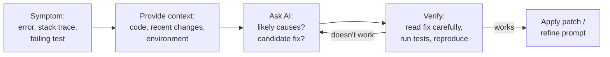
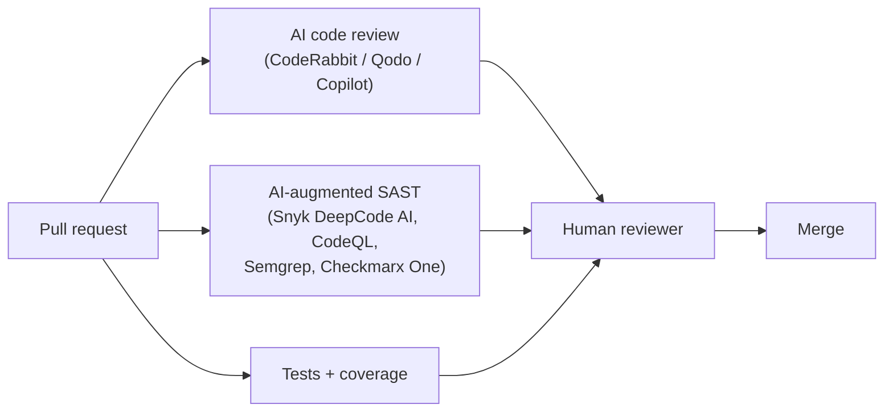

# Lesson 5-6: Code Quality Improvement with AI

> Student follow-along resources, key concepts, and references for this sublesson.

## Overview

AI does more than write new code — it also helps you fix, harden, and document existing code. Used well, it accelerates debugging, suggests robust error-handling patterns, drafts documentation, and acts as a fast first-pass reviewer. This sublesson covers four ways AI raises code quality (debugging, error handling, documentation, code review) and the modern tool ecosystem that supports each — including AI-powered code review platforms (CodeRabbit, Qodo, Greptile), AI-augmented security scanners (Snyk DeepCode AI, GitHub CodeQL, Semgrep), and documentation tools (Mintlify and the IDE assistants from Lesson 5-3).

## Learning objectives

By the end of this sublesson you should be able to:

- Use an AI assistant effectively to debug from an error message, stack trace, or failing test.
- Apply AI suggestions for error handling without leaking internal details to end users.
- Generate and maintain accurate docstrings, READMEs, and inline comments with AI.
- Place AI code review and AI security scanning correctly in the PR / CI/CD pipeline.
- Recognize the limits of AI-assisted quality work — where human review remains non-negotiable.

## Key concepts

### 1. AI-assisted debugging

The basic loop:

Effective practices:

- **Paste the actual error.** Stack traces, test failure messages, and observed-vs-expected behavior beat vague descriptions.
- **Include just-enough code.** The function or class involved plus its callers/tests. Resist pasting the whole repo (Lesson 5-5).
- **Ask for hypotheses, not just patches.** "What could cause this?" surfaces multiple candidates; "Fix this" gives one (often confidently wrong) answer.
- **Reproduce, then fix.** Confirm you can reproduce the bug locally before accepting any patch. Then re-run tests after the fix.
- **Own the diagnosis.** AI is excellent at narrowing the search space and bad at being authoritative about root cause. Final judgment is yours.

For complex or unfamiliar codebases, agent-mode tools (Cursor agent, GitHub Copilot coding agent) can search the repo, inspect git history, and propose multi-file fixes — but the same verification rule applies.

### 2. Error handling that doesn't leak

AI is good at suggesting structure: try/except patterns, retry policies with backoff and jitter, logging templates, and user-facing error messages. The traps to watch for:

- **Catch-all `except:` blocks** that swallow real bugs. Always catch specific exceptions or re-raise.
- **Logging sensitive data.** Stack traces and exception messages can include PII, secrets, or internal paths. Sanitize before logging.
- **Leaking internal details to users.** "Database `users_v2` query failed at line 412" is debugging info, not a user message. Generate two messages: a verbose one for logs, a generic one (with a correlation ID) for users.
- **Naive infinite retries.** Always include a max-attempts cap and exponential backoff with jitter.

A well-formed AI prompt for error handling looks like: *"Add error handling around this function. Treat NetworkError as transient (retry up to 3 times with backoff and jitter), treat ValidationError as permanent. Log the full exception with correlation ID; return a user-safe message."* Generic prompts ("add try/except") produce generic, often unsafe code.

### 3. Documentation: docstrings, READMEs, and inline comments

AI excels at first-draft documentation when given the code and the audience:

| Audience | What to ask for | What to verify |
| --- | --- | --- |
| Other developers (internal) | Purpose, parameters, return type, side effects, examples | That examples actually run, that side effects are correctly described |
| API consumers (external) | Endpoint description, request/response shape, error codes, auth | Schema accuracy, completeness of error codes |
| New hires / onboarding | "How does this module fit in the system?" overview | Architecture descriptions match reality, no hallucinated components |
| End users | Plain-language usage, common tasks | Tone, accuracy, no developer jargon |

Critical rule: **documentation must reflect actual behavior**. Re-generate or re-check docs whenever the code changes. AI documentation tools and IDE assistants (Cursor, Copilot, CodeRabbit's docstring generation) can be wired into pre-commit or CI to keep docs in sync, but a human still owns the source of truth.

### 4. AI code review as a first pass

Modern AI code review tools sit on the pull request and act like a fast first reviewer:

- **CodeRabbit** — PR summaries, architectural diagrams, line-level comments, "Fix with AI" patches; supports both Git and IDE workflows.
- **Qodo (formerly CodiumAI)** — IDE-first feedback and policy enforcement before commit, plus PR review.
- **Greptile** — repository-aware deep analysis, aggressive bug hunting (good for catching subtle issues, may need triage).
- **GitHub Copilot code review** — native PR review by Copilot inside GitHub.

A practical PR pipeline:

Use AI review as a *force multiplier* on the human reviewer, not a replacement. AI is good at: style nits, missed null/edge cases, obvious complexity, doc gaps, and many security smells. AI is weaker at: architectural fit, business-rule correctness, team conventions that aren't written down, and "what about that other system?" cross-cutting concerns.

### 5. AI-augmented security scanning

Several mature tools combine static analysis with generative AI for fixes:

- **Snyk Code (DeepCode AI)** — hybrid symbolic + generative analysis; security-focused autofixes; data-flow aware, designed to detect vulnerabilities in AI-generated code.
- **GitHub CodeQL** — semantic, dataflow-driven analysis with custom queries; the GitHub Advanced Security backbone.
- **Semgrep** — policy-as-code SAST with generative fix suggestions.
- **Checkmarx One** — agentic security platform that watches code in real time.
- **SonarQube** — long-running quality and security platform with growing AI features for AI-generated code review and remediation.

The 2025 lesson from these tools is clear: AI-generated code does not get a quality discount. Treat it with the *same or stronger* security review as hand-written code, because empirical studies show AI-assisted commits introduce issues at a non-trivial rate.

### 6. Where humans must stay

Even with all the tooling above, a human owns:

- The **final code review approval** for any non-trivial PR.
- **Architectural decisions** and team coding standards.
- **Security-critical changes** (auth, secrets, crypto, data isolation, deserialization).
- **Customer-facing language** in error messages, docs, and incident communications.
- **Judgment about whether AI suggestions match the team's conventions**, especially for prose-style code (DSLs, configs, infra-as-code).

## Why it matters / What's next

This sublesson closes the loop opened in 5-3: code generation is fast, but quality is what you ship. Used together, the practices in 5-3 (generate well), 5-4 (run AI as a real workflow), 5-5 (control tokens and context), and 5-6 (raise quality with AI) make AI a genuine multiplier rather than a debt-generator. **Lessons 5-7 through 5-13** survey concrete tools—Cursor, Windsurf, skills and rules, Codex, Claude Code, secure review patterns, and more—before **Lesson 6** steps up to **agentic AI** at the system level.

## Glossary

- **Stack trace** — The chain of function calls leading to an error, used as essential debugging context.
- **AI-assisted debugging** — Using an LLM to hypothesize causes and propose fixes from error/test evidence.
- **Correlation ID** — A unique identifier attached to logs, traces, and user-facing errors to link them.
- **Retry with backoff and jitter** — Retrying transient failures with growing, randomized delays to avoid thundering herds.
- **Docstring** — Inline structured documentation attached to a function/class/module.
- **AI code review** — Tools (CodeRabbit, Qodo, Copilot review) that comment on PRs like a human reviewer would.
- **SAST (Static Application Security Testing)** — Analysis of source code for vulnerabilities without executing it.
- **CodeQL** — GitHub's semantic, dataflow-aware static analysis engine for security queries.
- **DeepCode AI** — Snyk's hybrid symbolic + generative AI engine for code security and autofixes.
- **Autofix** — A tool-generated patch that proposes a remediation for a flagged issue.
- **Hallucinated documentation** — Docs generated by AI that describe behavior the code does not actually exhibit.
- **AI-generated technical debt** — Latent maintenance/security cost from accepting AI code without sufficient review.

## Quick self-check

1. What's the right way to ask an AI to debug a failing test, and what should you do *before* applying its fix?
2. Name three pitfalls of AI-suggested error handling and how to avoid each.
3. Why must documentation be re-checked whenever code changes?
4. List one strength and one weakness of AI code review compared with human review.
5. Which AI-augmented security tools would you typically run in CI on every PR, and why is that important for AI-generated code specifically?

## References and further reading

- Snyk — *DeepCode AI: AI code review and AI security for SAST.* https://snyk.io/platform/deepcode-ai/
- sanj.dev — *2025 AI code security benchmark: Snyk vs Semgrep vs CodeQL.* https://sanj.dev/post/ai-code-security-tools-comparison
- CodeRabbit — *AI code reviews.* https://coderabbit.ai/
- CodeRabbit — *Free AI code reviews for VS Code.* https://www.coderabbit.ai/ide
- CodeRabbit — *2025: The year of the AI dev tool tech stack.* https://coderabbit.ai/blog/2025-the-year-of-the-ai-dev-tool-tech-stack
- Axify — *AI code review tools: top picks and how to track their impact.* https://axify.io/blog/ai-code-review-tools
- Checkmarx — *Top 12 AI developer tools in 2026: coding assistants, agents and security tools.* https://checkmarx.com/learn/ai-security/top-12-ai-developer-tools-in-2026-for-security-coding-and-quality/
- Augment Code — *DeepCode AI alternatives: 12 enterprise-grade code analysis tools for 2025.* https://www.augmentcode.com/tools/deepcode-ai-alternatives-12-enterprise-grade-code-analysis-tools-for-2025
- Dextralabs — *Top 10 AI code review tools for developers (2026).* https://dextralabs.com/blog/top-ai-code-review-tools/
- Marcus Avangard / Medium — *Top 10 AI code review tools in 2025: a founder's honest ranking.* https://medium.com/@marcusavangard/top-10-ai-code-review-tools-in-2025-a-founders-honest-ranking-bc8b78053ba4
- arXiv — *Debt behind the AI boom: a large-scale empirical study of AI-generated code in the wild.* https://arxiv.org/html/2603.28592v1
- GitHub Docs — *GitHub Copilot features (including code review).* https://docs.github.com/en/copilot/get-started/features

### Omar's resources and references (course-wide)

#### Foundational cybersecurity resources in O'Reilly

This section provides a curated list of resources that delve into foundational cybersecurity concepts, frequently explored in O'Reilly training sessions and other educational offerings.

##### Live training

- **Upcoming Live Cybersecurity and AI Training in O'Reilly:** [Register before it is too late](https://learning.oreilly.com/search/?q=omar%20santos&type=live-course&rows=100&language_with_transcripts=en) (free with O'Reilly Subscription)

##### Reading list

Despite the rapidly evolving landscape of AI and technology, these books offer a comprehensive roadmap for understanding the intersection of these technologies with cybersecurity:

- **[NEW: Agentic AI for Cybersecurity: Building Autonomous Defenders and Adversaries](https://www.oreilly.com/library/view/agentic-ai-for/9780135589861/).** Unlock the power of next generation AI agents to transform cybersecurity, business operations, and productivity. [Available on O'Reilly](https://www.oreilly.com/library/view/agentic-ai-for/9780135589861/)

- **[Redefining Hacking](https://learning.oreilly.com/library/view/redefining-hacking-a/9780138363635/)** — A Comprehensive Guide to Red Teaming and Bug Bounty Hunting in an AI-driven World. [Available on O'Reilly](https://learning.oreilly.com/library/view/redefining-hacking-a/9780138363635/)

- **[AI-Powered Digital Cyber Resilience](https://www.oreilly.com/library/view/ai-powered-digital-cyber/9780135408599/)** — A practical guide to building intelligent, AI-powered cyber defenses in today's fast-evolving threat landscape. [Available on O'Reilly](https://www.oreilly.com/library/view/ai-powered-digital-cyber/9780135408599/)

- **[Developing Cybersecurity Programs and Policies in an AI-Driven World](https://learning.oreilly.com/library/view/developing-cybersecurity-programs/9780138073992)** — Explore strategies for creating robust cybersecurity frameworks in an AI-centric environment. [Available on O'Reilly](https://learning.oreilly.com/library/view/developing-cybersecurity-programs/9780138073992)

- **[Beyond the Algorithm: AI, Security, Privacy, and Ethics](https://learning.oreilly.com/library/view/beyond-the-algorithm/9780138268442)** — Gain insights into the ethical and security challenges posed by AI technologies. [Available on O'Reilly](https://learning.oreilly.com/library/view/beyond-the-algorithm/9780138268442)

- **[The AI Revolution in Networking, Cybersecurity, and Emerging Technologies](https://learning.oreilly.com/library/view/the-ai-revolution/9780138293703)** — Understand how AI is transforming networking and cybersecurity landscape. [Available on O'Reilly](https://learning.oreilly.com/library/view/the-ai-revolution/9780138293703)

##### Video courses

Enhance your practical skills with these video courses designed to deepen your understanding of cybersecurity:

- **[Building the Ultimate Cybersecurity Lab and Cyber Range](https://learning.oreilly.com/course/building-the-ultimate/9780138319090/)** (video). [Available on O'Reilly](https://learning.oreilly.com/course/building-the-ultimate/9780138319090/)

- **[Build Your Own AI Lab](https://learning.oreilly.com/course/build-your-own/9780135439616)** (video) — Hands-on guide to home and cloud-based AI labs. Learn to set up and optimize labs to research and experiment in a secure environment. [Available on O'Reilly](https://learning.oreilly.com/course/build-your-own/9780135439616)

- **[Defending and Deploying AI](https://www.oreilly.com/videos/defending-and-deploying/9780135463727/)** (video) — Comprehensive, hands-on journey into modern AI applications for technology and security professionals, covering AI-enabled programming, networking, and cybersecurity; securing generative AI (LLM security, prompt injection, red-teaming); secure AI labs; AI agents and agentic RAG for cybersecurity. [Available on O'Reilly](https://www.oreilly.com/videos/defending-and-deploying/9780135463727/)

- **[AI-Enabled Programming, Networking, and Cybersecurity](https://learning.oreilly.com/course/ai-enabled-programming-networking/9780135402696/)** — Learn to use AI for cybersecurity, networking, and programming tasks with practical, hands-on activities. [Available on O'Reilly](https://learning.oreilly.com/course/ai-enabled-programming-networking/9780135402696/)

- **[Securing Generative AI](https://learning.oreilly.com/course/securing-generative-ai/9780135401804/)** — Security for deploying and developing AI applications, RAG, agents, and other AI implementations; incorporate security at every stage of AI development, deployment, and operation. [Available on O'Reilly](https://learning.oreilly.com/course/securing-generative-ai/9780135401804/)

- **[Practical Cybersecurity Fundamentals](https://learning.oreilly.com/course/practical-cybersecurity-fundamentals/9780138037550/)** — Essential cybersecurity principles. [Available on O'Reilly](https://learning.oreilly.com/course/practical-cybersecurity-fundamentals/9780138037550/)

- **[The Art of Hacking](https://theartofhacking.org)** — Over 26 hours of training in ethical hacking and penetration testing (e.g., OSCP or CEH prep). [Visit The Art of Hacking](https://theartofhacking.org)

##### Certification related

- **CompTIA PenTest+ PT0-002 Cert Guide, 2nd Edition** — [Available on O'Reilly](https://learning.oreilly.com/library/view/comptia-pentest-pt0-002/9780137566204/)

- **Certified Ethical Hacker (CEH), Latest Edition** — Very comprehensive (19+ hours). [Available on O'Reilly](https://learning.oreilly.com/course/certified-ethical-hacker/9780135395646/)

- **Certified in Cybersecurity - CC (ISC)²** — [Available on O'Reilly](https://learning.oreilly.com/course/certified-in-cybersecurity/9780138230364/)

- **CCNP and CCIE Security Core SCOR 350-701 Official Cert Guide, 2nd Edition** — [Available on O'Reilly](https://learning.oreilly.com/library/view/ccnp-and-ccie/9780138221287/)

- **CEH Certified Ethical Hacker Cert Guide** — [Available on O'Reilly](https://learning.oreilly.com/library/view/ceh-certified-ethical/9780137489930/)

##### Additional resources

- **Hacking Scenarios (Labs) on O'Reilly** — Cloud-based labs; no local install. [https://hackingscenarios.com](https://hackingscenarios.com)

- **Personal blog** — [becomingahacker.org](https://becomingahacker.org)

- **Cisco blog** — [blogs.cisco.com/author/omarsantos](https://blogs.cisco.com/author/omarsantos)

- **GitHub repository** — [hackerrepo.org](https://hackerrepo.org)

- **WebSploit Labs** — [websploit.org](https://websploit.org)

- **NetAcad Ethical Hacker Free Course** — [NetAcad Skills for All](https://www.netacad.com/courses/ethical-hacker?courseLang=en-US)
