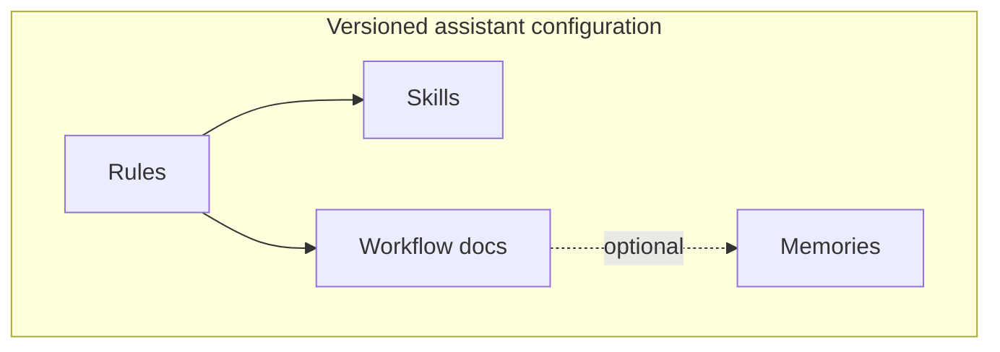

# Lesson 5-9: Understanding Agent Skills, Rules, Memories, and Workflow Files

> Student follow-along resources, key concepts, and references for this sublesson.

## Overview

Assistants stop being “just a model” when your repository carries **structured guidance**: **skills** (repeatable playbooks), **rules** (always-on policies), **memories** (durable preferences), and **workflow files** (how your team runs releases, reviews, or incidents). This sublesson names those layers, shows how they interact, and stresses **version control and ownership**—so configuration does not rot.

> **Note:** Exact filenames and folders depend on the product (Cursor, Claude Code, etc.). The concepts transfer even when paths differ.

## Learning objectives

By the end of this sublesson you should be able to:

- Distinguish skills (task playbooks) from rules (global/session constraints).
- Scope rules to teams, paths, or languages to avoid contradictory instructions.
- Explain when “memory” features help—and when they should be purged or rotated.
- Treat workflow docs as operational code: PR-reviewed, owned, and tested.

## Key concepts

### 1. Agent Skills

**Skills** package procedures: inputs, steps, output shape, and escalation paths. Examples: “generate API client from OpenAPI,” “run security checklist before merge,” “produce slide deck from sublesson markdown.” Keep each skill **single-purpose**; link skills from a small index rather than creating one mega file.

### 2. Rules

**Rules** apply broadly—style, testing commands, forbidden patterns. Good rules are **short, imperative, and scoped**. Long essays get ignored or conflict. Review rules when dependencies, compliance regimes, or frameworks change.

### 3. Memories

**Memories** persist preferences across sessions (e.g., “prefer Vitest,” “release on Tuesdays”). They reduce repetitive prompting but can **stale-out** when teams or projects change. Establish a habit: rotate memories on role transitions and major migrations.

### 4. Workflow files

Workflow files capture **repeatable team processes**: branching strategy, hotfix steps, incident commands. Store them in-repo when possible so agents and humans share one source of truth.

## Why it matters / What's next

Misconfigured guidance scales **bad habits** to every developer on the team. Getting this layer right is what makes Lessons 5-7 and 5-8 productive at org scale. **Lesson 5-10** shifts to **OpenAI Codex**—similar ideas, different runtime and sandbox model.

## Glossary

- **Agent Skill** — A packaged procedure an agent can invoke for a specialized task.
- **Rule** — A standing instruction applied automatically to eligible sessions or paths.
- **Memory (assistant)** — A persisted preference or fact the product recalls across chats.
- **Workflow file** — Documented steps for recurring engineering or operational processes.

## Quick self-check

1. Give one example of content that belongs in a skill vs a rule.
2. Why should rules be short and scoped?
3. When should you delete or rewrite a memory entry?
4. Where should workflow documentation live for best agent + human alignment?

## References and further reading

- Cursor — *Rules.* https://cursor.com/docs/context/rules
- Cursor — *Agent Skills (documentation).* https://cursor.com/docs
- Anthropic — *Claude Code documentation (configuration patterns).* https://docs.anthropic.com/en/docs/claude-code
- OpenAI — *Codex / developer platform documentation.* https://platform.openai.com/docs

### Omar's resources and references (course-wide)

#### Foundational cybersecurity resources in O'Reilly

This section provides a curated list of resources that delve into foundational cybersecurity concepts, frequently explored in O'Reilly training sessions and other educational offerings.

##### Live training

- **Upcoming Live Cybersecurity and AI Training in O'Reilly:** [Register before it is too late](https://learning.oreilly.com/search/?q=omar%20santos&type=live-course&rows=100&language_with_transcripts=en) (free with O'Reilly Subscription)

##### Reading list

Despite the rapidly evolving landscape of AI and technology, these books offer a comprehensive roadmap for understanding the intersection of these technologies with cybersecurity:

- **[NEW: Agentic AI for Cybersecurity: Building Autonomous Defenders and Adversaries](https://www.oreilly.com/library/view/agentic-ai-for/9780135589861/).** Unlock the power of next generation AI agents to transform cybersecurity, business operations, and productivity. [Available on O'Reilly](https://www.oreilly.com/library/view/agentic-ai-for/9780135589861/)

- **[Redefining Hacking](https://learning.oreilly.com/library/view/redefining-hacking-a/9780138363635/)** — A Comprehensive Guide to Red Teaming and Bug Bounty Hunting in an AI-driven World. [Available on O'Reilly](https://learning.oreilly.com/library/view/redefining-hacking-a/9780138363635/)

- **[AI-Powered Digital Cyber Resilience](https://www.oreilly.com/library/view/ai-powered-digital-cyber/9780135408599/)** — A practical guide to building intelligent, AI-powered cyber defenses in today's fast-evolving threat landscape. [Available on O'Reilly](https://www.oreilly.com/library/view/ai-powered-digital-cyber/9780135408599/)

- **[Developing Cybersecurity Programs and Policies in an AI-Driven World](https://learning.oreilly.com/library/view/developing-cybersecurity-programs/9780138073992)** — Explore strategies for creating robust cybersecurity frameworks in an AI-centric environment. [Available on O'Reilly](https://learning.oreilly.com/library/view/developing-cybersecurity-programs/9780138073992)

- **[Beyond the Algorithm: AI, Security, Privacy, and Ethics](https://learning.oreilly.com/library/view/beyond-the-algorithm/9780138268442)** — Gain insights into the ethical and security challenges posed by AI technologies. [Available on O'Reilly](https://learning.oreilly.com/library/view/beyond-the-algorithm/9780138268442)

- **[The AI Revolution in Networking, Cybersecurity, and Emerging Technologies](https://learning.oreilly.com/library/view/the-ai-revolution/9780138293703)** — Understand how AI is transforming networking and cybersecurity landscape. [Available on O'Reilly](https://learning.oreilly.com/library/view/the-ai-revolution/9780138293703)

##### Video courses

Enhance your practical skills with these video courses designed to deepen your understanding of cybersecurity:

- **[Building the Ultimate Cybersecurity Lab and Cyber Range](https://learning.oreilly.com/course/building-the-ultimate/9780138319090/)** (video). [Available on O'Reilly](https://learning.oreilly.com/course/building-the-ultimate/9780138319090/)

- **[Build Your Own AI Lab](https://learning.oreilly.com/course/build-your-own/9780135439616)** (video) — Hands-on guide to home and cloud-based AI labs. Learn to set up and optimize labs to research and experiment in a secure environment. [Available on O'Reilly](https://learning.oreilly.com/course/build-your-own/9780135439616)

- **[Defending and Deploying AI](https://www.oreilly.com/videos/defending-and-deploying/9780135463727/)** (video) — Comprehensive, hands-on journey into modern AI applications for technology and security professionals, covering AI-enabled programming, networking, and cybersecurity; securing generative AI (LLM security, prompt injection, red-teaming); secure AI labs; AI agents and agentic RAG for cybersecurity. [Available on O'Reilly](https://www.oreilly.com/videos/defending-and-deploying/9780135463727/)

- **[AI-Enabled Programming, Networking, and Cybersecurity](https://learning.oreilly.com/course/ai-enabled-programming-networking/9780135402696/)** — Learn to use AI for cybersecurity, networking, and programming tasks with practical, hands-on activities. [Available on O'Reilly](https://learning.oreilly.com/course/ai-enabled-programming-networking/9780135402696/)

- **[Securing Generative AI](https://learning.oreilly.com/course/securing-generative-ai/9780135401804/)** — Security for deploying and developing AI applications, RAG, agents, and other AI implementations; incorporate security at every stage of AI development, deployment, and operation. [Available on O'Reilly](https://learning.oreilly.com/course/securing-generative-ai/9780135401804/)

- **[Practical Cybersecurity Fundamentals](https://learning.oreilly.com/course/practical-cybersecurity-fundamentals/9780138037550/)** — Essential cybersecurity principles. [Available on O'Reilly](https://learning.oreilly.com/course/practical-cybersecurity-fundamentals/9780138037550/)

- **[The Art of Hacking](https://theartofhacking.org)** — Over 26 hours of training in ethical hacking and penetration testing (e.g., OSCP or CEH prep). [Visit The Art of Hacking](https://theartofhacking.org)

##### Certification related

- **CompTIA PenTest+ PT0-002 Cert Guide, 2nd Edition** — [Available on O'Reilly](https://learning.oreilly.com/library/view/comptia-pentest-pt0-002/9780137566204/)

- **Certified Ethical Hacker (CEH), Latest Edition** — Very comprehensive (19+ hours). [Available on O'Reilly](https://learning.oreilly.com/course/certified-ethical-hacker/9780135395646/)

- **Certified in Cybersecurity - CC (ISC)²** — [Available on O'Reilly](https://learning.oreilly.com/course/certified-in-cybersecurity/9780138230364/)

- **CCNP and CCIE Security Core SCOR 350-701 Official Cert Guide, 2nd Edition** — [Available on O'Reilly](https://learning.oreilly.com/library/view/ccnp-and-ccie/9780138221287/)

- **CEH Certified Ethical Hacker Cert Guide** — [Available on O'Reilly](https://learning.oreilly.com/library/view/ceh-certified-ethical/9780137489930/)

##### Additional resources

- **Hacking Scenarios (Labs) on O'Reilly** — Cloud-based labs; no local install. [https://hackingscenarios.com](https://hackingscenarios.com)

- **Personal blog** — [becomingahacker.org](https://becomingahacker.org)

- **Cisco blog** — [blogs.cisco.com/author/omarsantos](https://blogs.cisco.com/author/omarsantos)

- **GitHub repository** — [hackerrepo.org](https://hackerrepo.org)

- **WebSploit Labs** — [websploit.org](https://websploit.org)

- **NetAcad Ethical Hacker Free Course** — [NetAcad Skills for All](https://www.netacad.com/courses/ethical-hacker?courseLang=en-US)
