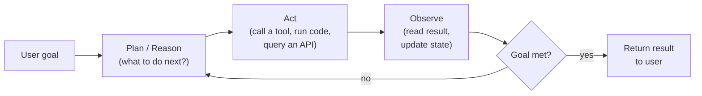

# Lesson 6-1: Introduction to Agentic AI

> Student follow-along resources, key concepts, and references for this sublesson.

## Overview

Agentic AI refers to AI systems that go beyond responding to a single prompt: given a goal, they plan, take actions, observe the results, and adapt — often using tools such as search, APIs, code execution, and file access. This sublesson sets the stage for the rest of Lesson 6 by defining what an "agent" is, contrasting it with single-shot generative AI, and introducing the topics you'll explore: design patterns, the Model Context Protocol (MCP), human-in-the-loop oversight, and data transformation.

## Learning objectives

By the end of this sublesson you should be able to:

- Define agentic AI and explain how it extends generative AI from single-turn responses to goal-directed behavior.
- Describe the core agent loop of plan, act, observe, adapt.
- Identify the practical capabilities that distinguish an agent (autonomy, tool use, memory, adaptation) from a chatbot.
- List representative agent use cases in customer service, research, software engineering, and workflow automation.
- Outline the topics covered across the rest of Lesson 6 and why each matters for building production agents.

## Key concepts

### 1. What "agentic" means

In the agentic AI literature, an **agent** is an AI system equipped with tools that allow it to take actions in some environment in pursuit of a goal. Two properties distinguish it from a plain chatbot:

- **Goal-directedness.** The user supplies an objective ("triage this support ticket," "fix this failing test") rather than a single isolated question.
- **Autonomy over the path.** The agent decides which intermediate steps to take, in what order, and when it is finished — within guardrails defined by the developer.

Anthropic, in *Building effective agents*, draws a useful line between two related architectures:

- **Workflows** — LLMs and tools orchestrated through *predefined* code paths (deterministic chains, routers, parallel fan-out, etc.).
- **Agents** — systems where the LLM *itself* dynamically directs the process and tool usage, retaining control over how to accomplish the task.

Agents are more flexible but harder to make reliable; many production systems are workflows with one or two agentic steps inside them.

### 2. The agent loop

Most modern agents follow a variant of the same control loop:

This loop — sometimes called *Reason–Act–Observe* — is the conceptual core of agentic AI. Lesson 6-3 expands it into concrete design patterns such as **ReAct** and **Reflexion**.

### 3. What an agent is made of

Beyond the loop, four building blocks recur in almost every agent design:

| Building block | What it does | Examples |
| --- | --- | --- |
| Reasoning model | Plans, decides next step, writes tool inputs | LLM such as Claude, GPT, Gemini, Llama |
| Tools | Let the agent affect the world or read fresh data | Web search, code execution, database query, email send, file I/O |
| Memory | Keeps state across turns and steps | Conversation history, scratchpad, vector store, structured task list |
| Guardrails | Constrain what the agent can and cannot do | Allowed tool list, iteration cap, approval gates, content filters |

Lesson 6-4 covers a standard way to expose tools and data — the **Model Context Protocol (MCP)**. Lesson 6-5 covers approval gates and other **human-in-the-loop** guardrails. Lesson 6-6 covers how data flowing through tools is **mapped and transformed** to fit each side of the system.

### 4. Where agents are showing up in 2025–2026

By 2026, most large enterprises are running agents in at least pilot, and often production. The most common categories you should be able to recognize:

- **Coding agents** that read repositories, run tests, and propose or commit changes (e.g., Cursor, Claude Code, GitHub Copilot agents).
- **Customer-service agents** that look up account data, take routine actions (issue a refund, reschedule a delivery), and escalate to humans on harder cases.
- **Research and analyst agents** that browse, retrieve, summarize, and write reports across many sources.
- **Workflow automation agents** that drive cross-system processes — onboarding, claims, fraud review, supply chain rerouting — using APIs and structured data.

The technology is no longer experimental, but it raises new questions of **governance**: who is accountable when the agent acts, how do you bound its blast radius, and how do you keep a human meaningfully in control? Those questions thread through the rest of Lesson 6.

## Why it matters / What's next

Agentic AI is the layer where generative models meet real systems. As a practitioner, your value increasingly lies not just in calling an LLM, but in designing the loop around it: which tools the agent has, what state it tracks, when it stops, and where humans intervene. The next sublessons build that picture step by step:

- **Lesson 6-2** — Agentic AI vs. generative AI: when to reach for each.
- **Lesson 6-3** — Agent design principles: ReAct, Reflexion, multi-agent, orchestration.
- **Lesson 6-4** — Model Context Protocol (MCP): a standard for connecting agents to data and tools.
- **Lesson 6-5** — Human-in-the-loop strategies: approval gates and oversight.
- **Lesson 6-6** — Data transformation in agents: how data flows in and out.

## Glossary

- **Agent** — An AI system equipped with tools that takes actions to accomplish a goal.
- **Agentic AI** — AI systems that pursue goals autonomously over multiple steps rather than answering a single prompt.
- **Agent loop** — The recurring cycle of plan, act, observe, adapt that drives an agent's behavior.
- **Tool** — An external capability (API call, search, code execution, file read) an agent can invoke.
- **Memory** — Stored state (conversation, scratchpad, retrieved documents) the agent uses across steps.
- **Guardrail** — A constraint that limits what the agent can do (allowed tools, iteration cap, approval requirement).
- **Workflow vs. agent** — A workflow follows a predefined code path; an agent dynamically decides its own path.
- **Autonomy** — The degree to which the agent acts without human approval at each step.
- **Orchestration** — The framework or runtime that coordinates the agent's prompts, tool calls, and state.
- **Human-in-the-loop (HITL)** — A design pattern in which humans review or approve specific agent actions.

## Quick self-check

1. In one sentence, what makes a system "agentic" rather than just generative?
2. Name the four steps of the canonical agent loop.
3. List the four building blocks of an agent and give one example of each.
4. According to Anthropic, what is the difference between a *workflow* and an *agent*?
5. Give one realistic agent use case in software engineering and one in customer service.

## References and further reading

- Anthropic — *Building effective agents.* https://www.anthropic.com/research/building-effective-agents
- Anthropic — *Measuring AI agent autonomy in practice.* https://www.anthropic.com/news/measuring-agent-autonomy
- AWS — *What is agentic AI?* https://aws.amazon.com/what-is/agentic-ai/
- MIT Sloan — *Agentic AI, explained.* https://mitsloan.mit.edu/ideas-made-to-matter/agentic-ai-explained
- Stanford HAI — *What is agentic AI?* https://hai.stanford.edu/ai-definitions/what-is-agentic-ai
- IBM — *What is a ReAct agent?* https://www.ibm.com/think/topics/react-agent
- Yao et al. (Princeton/Google) — *ReAct: Synergizing reasoning and acting in language models.* https://arxiv.org/abs/2210.03629
- OpenAI — *OpenAI Agents SDK.* https://openai.github.io/openai-agents-python/
- Model Context Protocol — *Introduction.* https://modelcontextprotocol.io/
- AppsTek — *Design patterns for agentic AI and multi-agent systems.* https://appstekcorp.com/blog/design-patterns-for-agentic-ai-and-multi-agent-systems/
- Cogitx — *AI agents: complete overview (2026).* https://cogitx.ai/blog/ai-agents-complete-overview-2026

### Omar's resources and references (course-wide)

#### Foundational cybersecurity resources in O'Reilly

This section provides a curated list of resources that delve into foundational cybersecurity concepts, frequently explored in O'Reilly training sessions and other educational offerings.

##### Live training

- **Upcoming Live Cybersecurity and AI Training in O'Reilly:** [Register before it is too late](https://learning.oreilly.com/search/?q=omar%20santos&type=live-course&rows=100&language_with_transcripts=en) (free with O'Reilly Subscription)

##### Reading list

Despite the rapidly evolving landscape of AI and technology, these books offer a comprehensive roadmap for understanding the intersection of these technologies with cybersecurity:

- **[NEW: Agentic AI for Cybersecurity: Building Autonomous Defenders and Adversaries](https://www.oreilly.com/library/view/agentic-ai-for/9780135589861/).** Unlock the power of next generation AI agents to transform cybersecurity, business operations, and productivity. [Available on O'Reilly](https://www.oreilly.com/library/view/agentic-ai-for/9780135589861/)

- **[Redefining Hacking](https://learning.oreilly.com/library/view/redefining-hacking-a/9780138363635/)** — A Comprehensive Guide to Red Teaming and Bug Bounty Hunting in an AI-driven World. [Available on O'Reilly](https://learning.oreilly.com/library/view/redefining-hacking-a/9780138363635/)

- **[AI-Powered Digital Cyber Resilience](https://www.oreilly.com/library/view/ai-powered-digital-cyber/9780135408599/)** — A practical guide to building intelligent, AI-powered cyber defenses in today's fast-evolving threat landscape. [Available on O'Reilly](https://www.oreilly.com/library/view/ai-powered-digital-cyber/9780135408599/)

- **[Developing Cybersecurity Programs and Policies in an AI-Driven World](https://learning.oreilly.com/library/view/developing-cybersecurity-programs/9780138073992)** — Explore strategies for creating robust cybersecurity frameworks in an AI-centric environment. [Available on O'Reilly](https://learning.oreilly.com/library/view/developing-cybersecurity-programs/9780138073992)

- **[Beyond the Algorithm: AI, Security, Privacy, and Ethics](https://learning.oreilly.com/library/view/beyond-the-algorithm/9780138268442)** — Gain insights into the ethical and security challenges posed by AI technologies. [Available on O'Reilly](https://learning.oreilly.com/library/view/beyond-the-algorithm/9780138268442)

- **[The AI Revolution in Networking, Cybersecurity, and Emerging Technologies](https://learning.oreilly.com/library/view/the-ai-revolution/9780138293703)** — Understand how AI is transforming networking and cybersecurity landscape. [Available on O'Reilly](https://learning.oreilly.com/library/view/the-ai-revolution/9780138293703)

##### Video courses

Enhance your practical skills with these video courses designed to deepen your understanding of cybersecurity:

- **[Building the Ultimate Cybersecurity Lab and Cyber Range](https://learning.oreilly.com/course/building-the-ultimate/9780138319090/)** (video). [Available on O'Reilly](https://learning.oreilly.com/course/building-the-ultimate/9780138319090/)

- **[Build Your Own AI Lab](https://learning.oreilly.com/course/build-your-own/9780135439616)** (video) — Hands-on guide to home and cloud-based AI labs. Learn to set up and optimize labs to research and experiment in a secure environment. [Available on O'Reilly](https://learning.oreilly.com/course/build-your-own/9780135439616)

- **[Defending and Deploying AI](https://www.oreilly.com/videos/defending-and-deploying/9780135463727/)** (video) — Comprehensive, hands-on journey into modern AI applications for technology and security professionals, covering AI-enabled programming, networking, and cybersecurity; securing generative AI (LLM security, prompt injection, red-teaming); secure AI labs; AI agents and agentic RAG for cybersecurity. [Available on O'Reilly](https://www.oreilly.com/videos/defending-and-deploying/9780135463727/)

- **[AI-Enabled Programming, Networking, and Cybersecurity](https://learning.oreilly.com/course/ai-enabled-programming-networking/9780135402696/)** — Learn to use AI for cybersecurity, networking, and programming tasks with practical, hands-on activities. [Available on O'Reilly](https://learning.oreilly.com/course/ai-enabled-programming-networking/9780135402696/)

- **[Securing Generative AI](https://learning.oreilly.com/course/securing-generative-ai/9780135401804/)** — Security for deploying and developing AI applications, RAG, agents, and other AI implementations; incorporate security at every stage of AI development, deployment, and operation. [Available on O'Reilly](https://learning.oreilly.com/course/securing-generative-ai/9780135401804/)

- **[Practical Cybersecurity Fundamentals](https://learning.oreilly.com/course/practical-cybersecurity-fundamentals/9780138037550/)** — Essential cybersecurity principles. [Available on O'Reilly](https://learning.oreilly.com/course/practical-cybersecurity-fundamentals/9780138037550/)

- **[The Art of Hacking](https://theartofhacking.org)** — Over 26 hours of training in ethical hacking and penetration testing (e.g., OSCP or CEH prep). [Visit The Art of Hacking](https://theartofhacking.org)

##### Certification related

- **CompTIA PenTest+ PT0-002 Cert Guide, 2nd Edition** — [Available on O'Reilly](https://learning.oreilly.com/library/view/comptia-pentest-pt0-002/9780137566204/)

- **Certified Ethical Hacker (CEH), Latest Edition** — Very comprehensive (19+ hours). [Available on O'Reilly](https://learning.oreilly.com/course/certified-ethical-hacker/9780135395646/)

- **Certified in Cybersecurity - CC (ISC)²** — [Available on O'Reilly](https://learning.oreilly.com/course/certified-in-cybersecurity/9780138230364/)

- **CCNP and CCIE Security Core SCOR 350-701 Official Cert Guide, 2nd Edition** — [Available on O'Reilly](https://learning.oreilly.com/library/view/ccnp-and-ccie/9780138221287/)

- **CEH Certified Ethical Hacker Cert Guide** — [Available on O'Reilly](https://learning.oreilly.com/library/view/ceh-certified-ethical/9780137489930/)

##### Additional resources

- **Hacking Scenarios (Labs) on O'Reilly** — Cloud-based labs; no local install. [https://hackingscenarios.com](https://hackingscenarios.com)

- **Personal blog** — [becomingahacker.org](https://becomingahacker.org)

- **Cisco blog** — [blogs.cisco.com/author/omarsantos](https://blogs.cisco.com/author/omarsantos)

- **GitHub repository** — [hackerrepo.org](https://hackerrepo.org)

- **WebSploit Labs** — [websploit.org](https://websploit.org)

- **NetAcad Ethical Hacker Free Course** — [NetAcad Skills for All](https://www.netacad.com/courses/ethical-hacker?courseLang=en-US)
