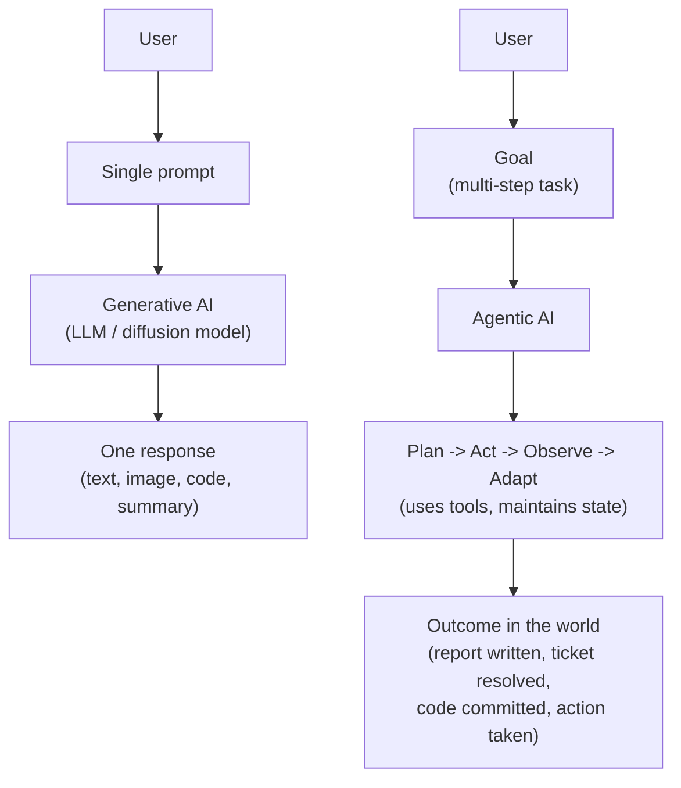

# Lesson 6-2: Agentic AI vs. Generative AI

> Student follow-along resources, key concepts, and references for this sublesson.

## Overview

Generative AI and agentic AI are closely related but solve different problems. Generative AI produces content — text, images, code — in response to a prompt. Agentic AI takes a goal and pursues it through multi-step planning, tool use, and adaptation. This sublesson sharpens the distinction so you can pick the right approach for a use case, and shows how the two are usually combined: an agent uses a generative model as its reasoning engine, then layers planning, tools, and feedback on top.

## Learning objectives

By the end of this sublesson you should be able to:

- Contrast generative AI and agentic AI on the dimensions of behavior, autonomy, decision-making, and integration.
- Decide whether a given task is better suited to a single generative call or to an agent.
- Recognize that an agent typically *uses* a generative model rather than replacing it.
- Identify the additional design and governance concerns that agents introduce.
- Apply a simple rubric for choosing between generative-only and agentic approaches.

## Key concepts

### 1. Two related but distinct paradigms

- **Generative AI** is *reactive* and *content-focused*: you prompt, it produces.
- **Agentic AI** is *proactive* and *action-oriented*: you set a goal, it decides what to do and does it, often calling tools many times.

### 2. A side-by-side comparison

| Dimension | Generative AI | Agentic AI |
| --- | --- | --- |
| Primary purpose | Create content from a prompt | Achieve a goal through actions |
| Behavior | Reactive — waits for input | Proactive — plans and pursues steps |
| Autonomy | Low; one response per call | High; many tool calls per task |
| Decision-making | Statistical pattern completion | Reasoning, planning, tool selection |
| Interaction with the world | Usually none (pure inference) | Calls APIs, runs code, reads/writes data |
| State across turns | Limited to the conversation | Explicit memory, scratchpad, plan state |
| Failure modes | Hallucinations, formatting drift | Hallucinations *plus* wrong tool, infinite loops, unsafe actions |
| Typical evaluation | Output quality | Task completion rate, tool-use accuracy, cost, safety |

### 3. When to use which

A practical rubric:

- **Reach for generative AI** when the task is essentially **one shot**: draft this email, summarize this contract, generate this image, answer this question from supplied context, translate this passage, write this function.
- **Reach for agentic AI** when the task **requires more than one step** *and* at least one of: looking things up, calling external systems, taking irreversible actions, or iterating until a verifiable result is achieved. Examples: triage a customer ticket end-to-end, debug a failing test, run a multi-source research brief, reconcile records across two systems.
- If the task can be cleanly described as a **fixed sequence of steps**, prefer a deterministic **workflow** (still LLM-powered, but on rails) over a free-form agent. Anthropic and others recommend this as the default starting point — agents add flexibility but also cost, latency, and failure surface area.

### 4. They are complements, not opposites

Almost every modern agent uses a generative model as its **reasoning engine**:

- The LLM decides what to do next, writes tool inputs in JSON, summarizes tool outputs, and drafts the final reply.
- The agent layer adds the **loop**, the **tools**, the **memory**, and the **guardrails** that the LLM by itself does not have.

So in practice the question is rarely "generative or agentic?" — it's "do I need the loop and the tools, or not?"

### 5. New concerns agents introduce

Because an agent acts over time and across systems, it brings concerns a single generative call does not:

- **Blast radius.** What is the worst thing this agent can do if it goes wrong? (Send a bad email? Delete production data?)
- **Cost and latency.** Each step is another model call and possibly another API call.
- **Observability.** You need traces of the reasoning and tool calls, not just a final answer.
- **Governance.** Approval gates, identity, audit logs, and compliance with frameworks like the EU AI Act.

These concerns are exactly what Lessons 6-3 through 6-6 address.

## Why it matters / What's next

Choosing the right paradigm is one of the highest-leverage design decisions you make as an AI practitioner. Picking an agent for a job a single LLM call could do wastes cost and adds risk. Picking a single LLM call for a job that really needs tool use produces brittle, hallucinated results. With this distinction in hand, **Lesson 6-3** dives into how to actually design the agent loop: ReAct, Reflexion, multi-agent patterns, and orchestration.

## Glossary

- **Generative AI** — Models that create new content (text, image, code, audio, video) in response to a prompt.
- **Agentic AI** — Systems that pursue goals through multi-step planning, tool use, and adaptation.
- **Reactive system** — Responds when called; does not act on its own.
- **Proactive system** — Sets and pursues subgoals between user inputs.
- **Workflow** — LLM-and-tool orchestration along a *predefined* code path.
- **Reasoning engine** — The LLM inside an agent that decides the next step.
- **Blast radius** — The maximum harm an autonomous system can cause if it errs.
- **Observability** — Visibility into reasoning steps, tool calls, and intermediate state.
- **Governance** — Policies, approvals, and accountability around autonomous systems.

## Quick self-check

1. In one sentence each, define generative AI and agentic AI.
2. Give one task that is a clear fit for generative AI and one that is a clear fit for agentic AI.
3. Why is "the agent doesn't replace the LLM, it wraps it" a useful way to think about the relationship?
4. List two failure modes that exist for agents but not for a single LLM call.
5. When should you prefer a deterministic workflow over a free-form agent?

## References and further reading

- IBM — *Agentic AI vs. generative AI.* https://www.ibm.com/think/topics/agentic-ai-vs-generative-ai
- Salesforce — *Agentic AI vs. generative AI: key differences explained.* https://www.salesforce.com/agentforce/agentic-ai-vs-generative-ai/
- Thomson Reuters — *Agentic AI vs. generative AI: the core differences.* https://www.thomsonreuters.com/en/insights/articles/agentic-ai-vs-generative-ai-the-core-differences
- AWS — *Agentic AI vs. generative AI: key differences explained.* https://aws.amazon.com/smart-business/resources-for-smb/agentic-ai-vs-generative-ai/
- Red Hat — *Agentic AI vs. generative AI.* https://www.redhat.com/en/topics/ai/agentic-ai-vs-generative-ai
- Exabeam — *Agentic AI vs. generative AI: 5 key differences.* https://www.exabeam.com/explainers/agentic-ai/agentic-ai-vs-generative-ai-5-key-differences/
- Anthropic — *Building effective agents.* https://www.anthropic.com/research/building-effective-agents
- MIT Sloan — *Agentic AI, explained.* https://mitsloan.mit.edu/ideas-made-to-matter/agentic-ai-explained
- AWS — *What is agentic AI?* https://aws.amazon.com/what-is/agentic-ai/
- Stanford HAI — *What is agentic AI?* https://hai.stanford.edu/ai-definitions/what-is-agentic-ai

### Omar's resources and references (course-wide)

#### Foundational cybersecurity resources in O'Reilly

This section provides a curated list of resources that delve into foundational cybersecurity concepts, frequently explored in O'Reilly training sessions and other educational offerings.

##### Live training

- **Upcoming Live Cybersecurity and AI Training in O'Reilly:** [Register before it is too late](https://learning.oreilly.com/search/?q=omar%20santos&type=live-course&rows=100&language_with_transcripts=en) (free with O'Reilly Subscription)

##### Reading list

Despite the rapidly evolving landscape of AI and technology, these books offer a comprehensive roadmap for understanding the intersection of these technologies with cybersecurity:

- **[NEW: Agentic AI for Cybersecurity: Building Autonomous Defenders and Adversaries](https://www.oreilly.com/library/view/agentic-ai-for/9780135589861/).** Unlock the power of next generation AI agents to transform cybersecurity, business operations, and productivity. [Available on O'Reilly](https://www.oreilly.com/library/view/agentic-ai-for/9780135589861/)

- **[Redefining Hacking](https://learning.oreilly.com/library/view/redefining-hacking-a/9780138363635/)** — A Comprehensive Guide to Red Teaming and Bug Bounty Hunting in an AI-driven World. [Available on O'Reilly](https://learning.oreilly.com/library/view/redefining-hacking-a/9780138363635/)

- **[AI-Powered Digital Cyber Resilience](https://www.oreilly.com/library/view/ai-powered-digital-cyber/9780135408599/)** — A practical guide to building intelligent, AI-powered cyber defenses in today's fast-evolving threat landscape. [Available on O'Reilly](https://www.oreilly.com/library/view/ai-powered-digital-cyber/9780135408599/)

- **[Developing Cybersecurity Programs and Policies in an AI-Driven World](https://learning.oreilly.com/library/view/developing-cybersecurity-programs/9780138073992)** — Explore strategies for creating robust cybersecurity frameworks in an AI-centric environment. [Available on O'Reilly](https://learning.oreilly.com/library/view/developing-cybersecurity-programs/9780138073992)

- **[Beyond the Algorithm: AI, Security, Privacy, and Ethics](https://learning.oreilly.com/library/view/beyond-the-algorithm/9780138268442)** — Gain insights into the ethical and security challenges posed by AI technologies. [Available on O'Reilly](https://learning.oreilly.com/library/view/beyond-the-algorithm/9780138268442)

- **[The AI Revolution in Networking, Cybersecurity, and Emerging Technologies](https://learning.oreilly.com/library/view/the-ai-revolution/9780138293703)** — Understand how AI is transforming networking and cybersecurity landscape. [Available on O'Reilly](https://learning.oreilly.com/library/view/the-ai-revolution/9780138293703)

##### Video courses

Enhance your practical skills with these video courses designed to deepen your understanding of cybersecurity:

- **[Building the Ultimate Cybersecurity Lab and Cyber Range](https://learning.oreilly.com/course/building-the-ultimate/9780138319090/)** (video). [Available on O'Reilly](https://learning.oreilly.com/course/building-the-ultimate/9780138319090/)

- **[Build Your Own AI Lab](https://learning.oreilly.com/course/build-your-own/9780135439616)** (video) — Hands-on guide to home and cloud-based AI labs. Learn to set up and optimize labs to research and experiment in a secure environment. [Available on O'Reilly](https://learning.oreilly.com/course/build-your-own/9780135439616)

- **[Defending and Deploying AI](https://www.oreilly.com/videos/defending-and-deploying/9780135463727/)** (video) — Comprehensive, hands-on journey into modern AI applications for technology and security professionals, covering AI-enabled programming, networking, and cybersecurity; securing generative AI (LLM security, prompt injection, red-teaming); secure AI labs; AI agents and agentic RAG for cybersecurity. [Available on O'Reilly](https://www.oreilly.com/videos/defending-and-deploying/9780135463727/)

- **[AI-Enabled Programming, Networking, and Cybersecurity](https://learning.oreilly.com/course/ai-enabled-programming-networking/9780135402696/)** — Learn to use AI for cybersecurity, networking, and programming tasks with practical, hands-on activities. [Available on O'Reilly](https://learning.oreilly.com/course/ai-enabled-programming-networking/9780135402696/)

- **[Securing Generative AI](https://learning.oreilly.com/course/securing-generative-ai/9780135401804/)** — Security for deploying and developing AI applications, RAG, agents, and other AI implementations; incorporate security at every stage of AI development, deployment, and operation. [Available on O'Reilly](https://learning.oreilly.com/course/securing-generative-ai/9780135401804/)

- **[Practical Cybersecurity Fundamentals](https://learning.oreilly.com/course/practical-cybersecurity-fundamentals/9780138037550/)** — Essential cybersecurity principles. [Available on O'Reilly](https://learning.oreilly.com/course/practical-cybersecurity-fundamentals/9780138037550/)

- **[The Art of Hacking](https://theartofhacking.org)** — Over 26 hours of training in ethical hacking and penetration testing (e.g., OSCP or CEH prep). [Visit The Art of Hacking](https://theartofhacking.org)

##### Certification related

- **CompTIA PenTest+ PT0-002 Cert Guide, 2nd Edition** — [Available on O'Reilly](https://learning.oreilly.com/library/view/comptia-pentest-pt0-002/9780137566204/)

- **Certified Ethical Hacker (CEH), Latest Edition** — Very comprehensive (19+ hours). [Available on O'Reilly](https://learning.oreilly.com/course/certified-ethical-hacker/9780135395646/)

- **Certified in Cybersecurity - CC (ISC)²** — [Available on O'Reilly](https://learning.oreilly.com/course/certified-in-cybersecurity/9780138230364/)

- **CCNP and CCIE Security Core SCOR 350-701 Official Cert Guide, 2nd Edition** — [Available on O'Reilly](https://learning.oreilly.com/library/view/ccnp-and-ccie/9780138221287/)

- **CEH Certified Ethical Hacker Cert Guide** — [Available on O'Reilly](https://learning.oreilly.com/library/view/ceh-certified-ethical/9780137489930/)

##### Additional resources

- **Hacking Scenarios (Labs) on O'Reilly** — Cloud-based labs; no local install. [https://hackingscenarios.com](https://hackingscenarios.com)

- **Personal blog** — [becomingahacker.org](https://becomingahacker.org)

- **Cisco blog** — [blogs.cisco.com/author/omarsantos](https://blogs.cisco.com/author/omarsantos)

- **GitHub repository** — [hackerrepo.org](https://hackerrepo.org)

- **WebSploit Labs** — [websploit.org](https://websploit.org)

- **NetAcad Ethical Hacker Free Course** — [NetAcad Skills for All](https://www.netacad.com/courses/ethical-hacker?courseLang=en-US)
