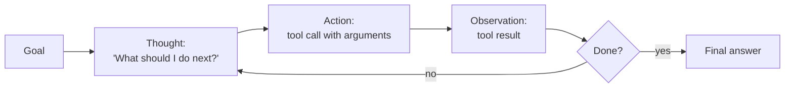

# Lesson 6-3: Agentic AI Design Principles

> Student follow-along resources, key concepts, and references for this sublesson.

## Overview

Effective agents do not emerge from a clever prompt alone — they come from disciplined design choices around how the agent reasons, what it can do, what it remembers, and when it stops. This sublesson introduces the foundational ReAct pattern, complementary patterns like Reflexion, multi-agent and router architectures, and the orchestration runtimes (LangGraph, CrewAI, AutoGen, OpenAI Agents SDK, AWS Bedrock AgentCore) that you'll see in real-world stacks.

## Learning objectives

By the end of this sublesson you should be able to:

- Explain the ReAct loop (Thought, Action, Observation) and why it improves on plain chain-of-thought.
- Describe complementary patterns: Reflexion, planning, multi-agent collaboration, and router agents.
- Apply the four core agent design concerns: state management, memory, feedback loops, and termination conditions.
- Compare leading orchestration frameworks at a high level (LangGraph, CrewAI, AutoGen, OpenAI Agents SDK).
- Recognize when to escalate from a single ReAct agent to a more elaborate multi-agent design — and when not to.

## Key concepts

### 1. The ReAct pattern: think, act, observe

ReAct (Yao et al., 2022) is the foundational pattern for tool-using LLM agents. The model interleaves *reasoning traces* (verbal thoughts) with *actions* (tool calls), grounded by *observations* (tool results) from the environment.

Why ReAct works:

- **Grounding.** Actions force the model to consult the environment (search, database, code), which reduces hallucination.
- **Interpretability.** You can log Thought, Action, and Observation for every step and audit the agent's reasoning.
- **Recovery.** When a tool fails, the next Thought can react to the error and choose a different approach.

ReAct outperforms reason-only (chain-of-thought) and act-only baselines on knowledge-intensive and decision-making tasks, and remains the default starting point for new agents.

### 2. Complementary design patterns

Most production agents combine ReAct with one or more of these patterns:

| Pattern | What it adds | When to use |
| --- | --- | --- |
| Planning | An explicit plan or task list before execution; often a DAG of subtasks | Long, structured tasks where ordering matters |
| Reflexion | The agent critiques its own output, generates self-feedback, and retries | Tasks with verifiable outcomes (tests pass, schema validates) |
| Tool use / function calling | Standardized JSON schema for tools the model can invoke | Anytime the agent must read or write external systems |
| Multi-agent collaboration | Multiple specialized agents (planner, researcher, coder, critic) coordinate | Tasks too large or diverse for a single role |
| Router agent | A controller dispatches each query to a specialized sub-agent or tool | Heterogeneous incoming requests |
| Debate / vote | Multiple agents argue or vote on the answer | High-stakes decisions where redundancy improves quality |

A useful rule of thumb from Anthropic's *Building effective agents*: **start simple**. Begin with a single ReAct agent and a small, well-described tool set. Add planning, reflection, or multi-agent structure only when a real bottleneck appears.

### 3. Four design concerns every agent must handle

Regardless of which patterns you pick, every agent has to answer four design questions:

- **State management.** What is the plan, which steps are complete, what tool results have we seen? Without explicit state, agents lose the thread on long tasks.
- **Memory.** Short-term conversation memory, a working scratchpad, and (often) long-term memory in a vector store or database. Memory lets the agent reuse past context across turns or sessions.
- **Feedback loops.** Mechanisms to learn from outcomes — automated checks (tests pass, schema validates), self-critique, or human ratings — and to adjust subsequent behavior.
- **Termination conditions.** Clear criteria for "done": goal achieved, max iterations reached, budget exhausted, or escalation triggered. Without termination, agents loop indefinitely and burn cost.

### 4. Orchestration frameworks

You rarely build the loop from scratch. Common choices in 2025–2026:

- **LangGraph (LangChain).** Models agents as a *graph* of nodes (steps) and edges (transitions) with explicit state, checkpoints, and time-travel debugging. Good when you want fine-grained control and auditability.
- **CrewAI.** Role-based multi-agent collaboration: you define crews of agents with goals and tools that work as a team.
- **AutoGen (Microsoft / AG2).** Multi-agent conversation framework; agents talk to each other and to tools, with code execution support.
- **OpenAI Agents SDK.** Lightweight Python SDK for tool use, handoffs between agents, and tracing, optimized for OpenAI models and the Responses API.
- **AWS Bedrock AgentCore / Bedrock Agents.** Managed runtime for hosting agents on AWS, with memory, identity, gateway, and observability primitives.
- **Microsoft Copilot Studio / Semantic Kernel / Agent Framework.** Microsoft's stack for enterprise agents integrated with Microsoft 365 and Azure.

The picture matters less than the principle: you want a runtime that gives you state, tracing, retries, and a clean way to plug in tools.

### 5. Transparency, control, and human-centric design

Modern guidance (Anthropic, NIST AI RMF, EU AI Act) emphasizes that agents should be **transparent** (their steps are visible), **controllable** (you can stop or override them), and **human-centric** (designed so users understand and can intervene). Concretely that means:

- Step-level traces of Thought, Action, Observation.
- Iteration caps and budget limits to prevent runaway loops.
- Sandboxed tool execution for risky actions (code, file writes).
- Clear escalation paths to a human (covered in Lesson 6-5).

## Why it matters / What's next

The patterns and concerns above are what separate a fragile demo from a production agent. The next sublesson, **Lesson 6-4: Model Context Protocol (MCP)**, looks at the standard way to expose tools and data to an agent so that the design choices above can be implemented portably across hosts and frameworks.

## Glossary

- **ReAct** — Pattern in which the agent interleaves verbal Thoughts, Actions (tool calls), and Observations.
- **Chain-of-thought** — Reasoning-only prompting; ReAct grounds it with actions.
- **Reflexion** — Self-critique pattern where the agent generates feedback on its own output and retries.
- **Multi-agent system** — Multiple agents with roles (planner, researcher, critic) collaborating on a task.
- **Router agent** — An agent that dispatches each request to a specialized sub-agent or tool.
- **State** — The structured record of plan, completed steps, and tool results that the agent maintains.
- **Memory** — Stored context (short-term conversation, scratchpad, long-term vector memory).
- **Termination condition** — Criterion that ends the agent loop (goal met, max steps, budget, escalation).
- **Orchestration framework** — Runtime that coordinates prompts, tools, and state (LangGraph, CrewAI, AutoGen, OpenAI Agents SDK, Bedrock Agents).
- **Function calling / tool use** — Mechanism by which an LLM invokes a tool with structured arguments.

## Quick self-check

1. Walk through one iteration of the ReAct loop with a concrete example (e.g., answering a question that needs a web search).
2. What problem does Reflexion address that plain ReAct does not?
3. Name the four core design concerns every agent must handle, and give a one-line description of each.
4. When would you prefer a multi-agent design over a single ReAct agent — and when would you *not*?
5. Pick one orchestration framework (LangGraph, CrewAI, AutoGen, OpenAI Agents SDK) and describe its main idea in one sentence.

## References and further reading

- Yao et al. — *ReAct: Synergizing reasoning and acting in language models.* https://arxiv.org/abs/2210.03629
- Google Research — *ReAct: Synergizing reasoning and acting in language models.* https://research.google/blog/react-synergizing-reasoning-and-acting-in-language-models/
- IBM — *What is a ReAct agent?* https://www.ibm.com/think/topics/react-agent
- Anthropic — *Building effective agents.* https://www.anthropic.com/research/building-effective-agents
- LangGraph — *LangGraph documentation.* https://langchain-ai.github.io/langgraph/
- CrewAI — *CrewAI documentation.* https://docs.crewai.com/
- Microsoft — *AutoGen / Agent Framework documentation.* https://microsoft.github.io/autogen/
- OpenAI — *OpenAI Agents SDK.* https://openai.github.io/openai-agents-python/
- AWS — *Amazon Bedrock AgentCore.* https://aws.amazon.com/bedrock/agentcore/
- AppsTek — *Design patterns for agentic AI and multi-agent systems.* https://appstekcorp.com/blog/design-patterns-for-agentic-ai-and-multi-agent-systems/
- Machine Learning Mastery — *The roadmap to mastering agentic AI design patterns.* https://machinelearningmastery.com/the-roadmap-to-mastering-agentic-ai-design-patterns/
- arXiv — *Agentic AI frameworks: architectures, protocols, and design challenges.* https://arxiv.org/abs/2508.10146

### Omar's resources and references (course-wide)

#### Foundational cybersecurity resources in O'Reilly

This section provides a curated list of resources that delve into foundational cybersecurity concepts, frequently explored in O'Reilly training sessions and other educational offerings.

##### Live training

- **Upcoming Live Cybersecurity and AI Training in O'Reilly:** [Register before it is too late](https://learning.oreilly.com/search/?q=omar%20santos&type=live-course&rows=100&language_with_transcripts=en) (free with O'Reilly Subscription)

##### Reading list

Despite the rapidly evolving landscape of AI and technology, these books offer a comprehensive roadmap for understanding the intersection of these technologies with cybersecurity:

- **[NEW: Agentic AI for Cybersecurity: Building Autonomous Defenders and Adversaries](https://www.oreilly.com/library/view/agentic-ai-for/9780135589861/).** Unlock the power of next generation AI agents to transform cybersecurity, business operations, and productivity. [Available on O'Reilly](https://www.oreilly.com/library/view/agentic-ai-for/9780135589861/)

- **[Redefining Hacking](https://learning.oreilly.com/library/view/redefining-hacking-a/9780138363635/)** — A Comprehensive Guide to Red Teaming and Bug Bounty Hunting in an AI-driven World. [Available on O'Reilly](https://learning.oreilly.com/library/view/redefining-hacking-a/9780138363635/)

- **[AI-Powered Digital Cyber Resilience](https://www.oreilly.com/library/view/ai-powered-digital-cyber/9780135408599/)** — A practical guide to building intelligent, AI-powered cyber defenses in today's fast-evolving threat landscape. [Available on O'Reilly](https://www.oreilly.com/library/view/ai-powered-digital-cyber/9780135408599/)

- **[Developing Cybersecurity Programs and Policies in an AI-Driven World](https://learning.oreilly.com/library/view/developing-cybersecurity-programs/9780138073992)** — Explore strategies for creating robust cybersecurity frameworks in an AI-centric environment. [Available on O'Reilly](https://learning.oreilly.com/library/view/developing-cybersecurity-programs/9780138073992)

- **[Beyond the Algorithm: AI, Security, Privacy, and Ethics](https://learning.oreilly.com/library/view/beyond-the-algorithm/9780138268442)** — Gain insights into the ethical and security challenges posed by AI technologies. [Available on O'Reilly](https://learning.oreilly.com/library/view/beyond-the-algorithm/9780138268442)

- **[The AI Revolution in Networking, Cybersecurity, and Emerging Technologies](https://learning.oreilly.com/library/view/the-ai-revolution/9780138293703)** — Understand how AI is transforming networking and cybersecurity landscape. [Available on O'Reilly](https://learning.oreilly.com/library/view/the-ai-revolution/9780138293703)

##### Video courses

Enhance your practical skills with these video courses designed to deepen your understanding of cybersecurity:

- **[Building the Ultimate Cybersecurity Lab and Cyber Range](https://learning.oreilly.com/course/building-the-ultimate/9780138319090/)** (video). [Available on O'Reilly](https://learning.oreilly.com/course/building-the-ultimate/9780138319090/)

- **[Build Your Own AI Lab](https://learning.oreilly.com/course/build-your-own/9780135439616)** (video) — Hands-on guide to home and cloud-based AI labs. Learn to set up and optimize labs to research and experiment in a secure environment. [Available on O'Reilly](https://learning.oreilly.com/course/build-your-own/9780135439616)

- **[Defending and Deploying AI](https://www.oreilly.com/videos/defending-and-deploying/9780135463727/)** (video) — Comprehensive, hands-on journey into modern AI applications for technology and security professionals, covering AI-enabled programming, networking, and cybersecurity; securing generative AI (LLM security, prompt injection, red-teaming); secure AI labs; AI agents and agentic RAG for cybersecurity. [Available on O'Reilly](https://www.oreilly.com/videos/defending-and-deploying/9780135463727/)

- **[AI-Enabled Programming, Networking, and Cybersecurity](https://learning.oreilly.com/course/ai-enabled-programming-networking/9780135402696/)** — Learn to use AI for cybersecurity, networking, and programming tasks with practical, hands-on activities. [Available on O'Reilly](https://learning.oreilly.com/course/ai-enabled-programming-networking/9780135402696/)

- **[Securing Generative AI](https://learning.oreilly.com/course/securing-generative-ai/9780135401804/)** — Security for deploying and developing AI applications, RAG, agents, and other AI implementations; incorporate security at every stage of AI development, deployment, and operation. [Available on O'Reilly](https://learning.oreilly.com/course/securing-generative-ai/9780135401804/)

- **[Practical Cybersecurity Fundamentals](https://learning.oreilly.com/course/practical-cybersecurity-fundamentals/9780138037550/)** — Essential cybersecurity principles. [Available on O'Reilly](https://learning.oreilly.com/course/practical-cybersecurity-fundamentals/9780138037550/)

- **[The Art of Hacking](https://theartofhacking.org)** — Over 26 hours of training in ethical hacking and penetration testing (e.g., OSCP or CEH prep). [Visit The Art of Hacking](https://theartofhacking.org)

##### Certification related

- **CompTIA PenTest+ PT0-002 Cert Guide, 2nd Edition** — [Available on O'Reilly](https://learning.oreilly.com/library/view/comptia-pentest-pt0-002/9780137566204/)

- **Certified Ethical Hacker (CEH), Latest Edition** — Very comprehensive (19+ hours). [Available on O'Reilly](https://learning.oreilly.com/course/certified-ethical-hacker/9780135395646/)

- **Certified in Cybersecurity - CC (ISC)²** — [Available on O'Reilly](https://learning.oreilly.com/course/certified-in-cybersecurity/9780138230364/)

- **CCNP and CCIE Security Core SCOR 350-701 Official Cert Guide, 2nd Edition** — [Available on O'Reilly](https://learning.oreilly.com/library/view/ccnp-and-ccie/9780138221287/)

- **CEH Certified Ethical Hacker Cert Guide** — [Available on O'Reilly](https://learning.oreilly.com/library/view/ceh-certified-ethical/9780137489930/)

##### Additional resources

- **Hacking Scenarios (Labs) on O'Reilly** — Cloud-based labs; no local install. [https://hackingscenarios.com](https://hackingscenarios.com)

- **Personal blog** — [becomingahacker.org](https://becomingahacker.org)

- **Cisco blog** — [blogs.cisco.com/author/omarsantos](https://blogs.cisco.com/author/omarsantos)

- **GitHub repository** — [hackerrepo.org](https://hackerrepo.org)

- **WebSploit Labs** — [websploit.org](https://websploit.org)

- **NetAcad Ethical Hacker Free Course** — [NetAcad Skills for All](https://www.netacad.com/courses/ethical-hacker?courseLang=en-US)
