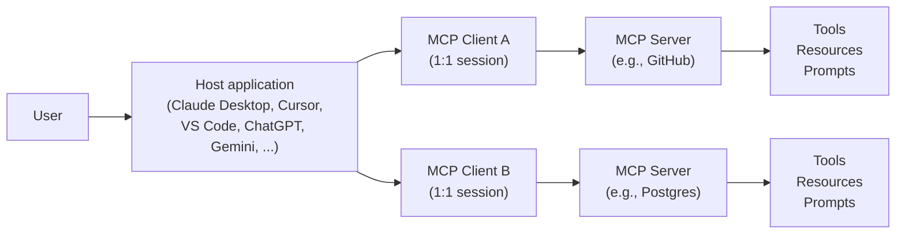

# Lesson 6-4: Model Context Protocol (MCP)

> Student follow-along resources, key concepts, and references for this sublesson.

## Overview

The Model Context Protocol (MCP) is an open standard for connecting AI applications to external data and tools. Introduced by Anthropic in late 2024 and rapidly adopted across the industry, MCP defines a common protocol that lets any compatible AI host (Claude, ChatGPT, Cursor, VS Code, Copilot, Gemini, and many others) talk to any compatible server providing tools, resources, and prompts. This sublesson covers what MCP is, how it is structured, what its primitives mean, and why it matters for building maintainable agentic systems.

## Learning objectives

By the end of this sublesson you should be able to:

- Explain in plain language what MCP is and what problem it solves.
- Identify MCP's three roles — host, client, server — and how they relate.
- Describe MCP's core primitives: tools, resources, and prompts (server-side) plus sampling, roots, and elicitation (client-side).
- Outline MCP's transports (stdio and Streamable HTTP) and its use of JSON-RPC 2.0.
- Recognize the SDKs and ecosystem available for building MCP clients and servers.

## Key concepts

### 1. Why MCP exists: the M×N problem

Without a standard, every AI application has to write a custom integration for every data source or tool, and every tool has to write a custom integration for every AI app. That is an **M×N problem**: M hosts × N tools = a lot of glue code.

MCP collapses M×N into M+N: write one MCP server for your tool, and any MCP-compatible host can use it; write one MCP client in your app, and you can plug into any MCP server.

It is often described as "a USB-C port for AI applications" — one connector, many devices.

### 2. Architecture: host, client, server

MCP uses a **client–host–server** architecture.

- **Host** — the AI application the user runs (Claude Desktop, Cursor, VS Code, ChatGPT, etc.). It coordinates sessions, runs the LLM, and manages user authorization.
- **Client** — a protocol-level component the host creates *per server*. Each client maintains a single, stateful connection to one server.
- **Server** — a program that exposes capabilities (tools, resources, prompts) over MCP. Servers can run locally (as a subprocess) or remotely (over HTTP).

### 3. The MCP primitives

MCP servers expose three primary primitives to the host:

| Primitive | What it is | Example |
| --- | --- | --- |
| Tools | Executable functions the model can invoke | `create_pull_request`, `run_sql_query`, `send_email` |
| Resources | Read-only data sources that provide context | A file, a database row, a wiki page, the contents of a folder |
| Prompts | Reusable templates that standardize a workflow | "Code review this diff," "Summarize these tickets" |

Hosts also offer **client-side features** that servers can request:

- **Sampling** — the server asks the host's LLM to complete something on its behalf (with the user's consent).
- **Roots** — the host tells the server which filesystem or resource entry points it is allowed to use.
- **Elicitation** — the server asks the user a follow-up question through the host (e.g., to confirm a destructive action or supply missing input).

### 4. Protocol mechanics

- **Message format.** MCP is built on **JSON-RPC 2.0**, with three message types: requests, responses, and notifications.
- **Capability negotiation.** When a session opens, the client and server exchange the features they support so each side knows what is available.
- **Transports.** MCP is transport-agnostic. The two primary transports are:
  - **stdio** — the host launches the server as a local subprocess and talks over standard input/output. Good for local tools, no networking required.
  - **Streamable HTTP** (with Server-Sent Events) — the server runs as a network service. Good for remote, multi-tenant deployments.
- **Authorization.** Modern MCP includes an OAuth 2.1-based authorization flow for remote servers, so users can grant scoped access to third-party data without sharing credentials with the AI host.
- **Lifecycle and security.** The spec covers session lifecycle, capability discovery, error handling, tool annotations (e.g., "destructive," "read-only"), and security guidance for both server authors and host implementers.

### 5. SDKs and ecosystem

Official SDKs are available in **TypeScript/JavaScript, Python, Java/Kotlin, C#, Go, Ruby, PHP, and Swift**, among others. By 2026 the ecosystem includes:

- Thousands of community and vendor MCP servers (GitHub, Slack, Postgres, Filesystem, Stripe, etc.).
- An **MCP Registry** for discovery and installation.
- Native MCP support in major hosts: **Claude, ChatGPT, Cursor, VS Code, GitHub Copilot, Gemini, Microsoft Copilot Studio**, and others.
- Stewardship by the **Agentic AI Foundation under the Linux Foundation**, with ongoing spec evolution.

### 6. Why MCP matters for agentic AI

For an agent, MCP acts as the **integration layer**:

- The agent reasons in the host; the host's MCP client routes tool calls to the right MCP servers.
- Tools and data are decoupled from agent logic — you can add, swap, or remove servers without changing the agent.
- Security and governance are applied consistently: identity, scopes, audit logs, and approval prompts live at the host/client boundary.
- The same MCP server works across many AI products, so investments in tooling are portable.

In short, MCP is to agents what a stable API or driver model is to an operating system: the contract that lets independent components interoperate.

## Why it matters / What's next

If Lesson 6-3 was about how the agent thinks, MCP is about how it *reaches into the world*. With a clean, standard tool surface, you can focus on agent design rather than reinventing integrations. The next sublesson, **Lesson 6-5: Human-in-the-Loop Strategies**, shows how to put guardrails around those tool calls so that autonomous behavior stays safe and accountable.

## Glossary

- **MCP (Model Context Protocol)** — Open standard for connecting AI applications to data and tools.
- **Host** — The AI application the user runs (Claude Desktop, Cursor, ChatGPT, etc.).
- **Client** — Protocol component inside the host that maintains a 1:1 connection with a server.
- **Server** — Program that exposes tools, resources, and prompts via MCP.
- **Tool** — An executable function exposed by a server that the model can call.
- **Resource** — A read-only data source (file, record, document) the server makes available.
- **Prompt** — A reusable template the server offers to standardize a workflow.
- **Sampling** — Server-initiated request for the host's LLM to complete a generation.
- **Roots** — Allowed filesystem or resource entry points the host shares with a server.
- **Elicitation** — Server-initiated request for additional input or confirmation from the user.
- **JSON-RPC 2.0** — The remote-procedure-call format MCP messages use.
- **stdio / Streamable HTTP** — The two main MCP transports (local subprocess vs. networked).

## Quick self-check

1. In one sentence, what problem does MCP solve, and how is it sometimes described informally?
2. Name the three roles in MCP's architecture and what each does.
3. List MCP's three server-side primitives and give an example of each.
4. What are the two main MCP transports, and when would you use each?
5. Why does standardizing tools through MCP make agent governance and security easier?

## References and further reading

- Model Context Protocol — *Official site (introduction and spec).* https://modelcontextprotocol.io/
- Model Context Protocol — *Architecture overview.* https://modelcontextprotocol.io/docs/learn/architecture
- Model Context Protocol — *Specification.* https://modelcontextprotocol.io/specification/
- Anthropic — *Introducing the Model Context Protocol.* https://www.anthropic.com/news/model-context-protocol
- Model Context Protocol — *Servers and SDKs (GitHub).* https://github.com/modelcontextprotocol
- WorkOS — *Understanding MCP features: tools, resources, prompts, sampling, roots, and elicitation.* https://workos.com/blog/mcp-features-guide
- AWS — *Unlocking the power of Model Context Protocol (MCP) on AWS.* https://aws.amazon.com/blogs/machine-learning/unlocking-the-power-of-model-context-protocol-mcp-on-aws/
- OpenAI — *Model Context Protocol in the OpenAI Agents SDK.* https://openai.github.io/openai-agents-python/mcp/
- Microsoft — *Model Context Protocol overview (Copilot Studio / Foundry).* https://learn.microsoft.com/en-us/azure/ai-foundry/agents/concepts/mcp
- Linux Foundation — *Agentic AI Foundation announcement.* https://www.linuxfoundation.org/press/announcing-the-agentic-ai-foundation
- ZBrain — *A deep dive into the Model Context Protocol (MCP).* https://zbrain.ai/model-context-protocol/

### Omar's resources and references (course-wide)

#### Foundational cybersecurity resources in O'Reilly

This section provides a curated list of resources that delve into foundational cybersecurity concepts, frequently explored in O'Reilly training sessions and other educational offerings.

##### Live training

- **Upcoming Live Cybersecurity and AI Training in O'Reilly:** [Register before it is too late](https://learning.oreilly.com/search/?q=omar%20santos&type=live-course&rows=100&language_with_transcripts=en) (free with O'Reilly Subscription)

##### Reading list

Despite the rapidly evolving landscape of AI and technology, these books offer a comprehensive roadmap for understanding the intersection of these technologies with cybersecurity:

- **[NEW: Agentic AI for Cybersecurity: Building Autonomous Defenders and Adversaries](https://www.oreilly.com/library/view/agentic-ai-for/9780135589861/).** Unlock the power of next generation AI agents to transform cybersecurity, business operations, and productivity. [Available on O'Reilly](https://www.oreilly.com/library/view/agentic-ai-for/9780135589861/)

- **[Redefining Hacking](https://learning.oreilly.com/library/view/redefining-hacking-a/9780138363635/)** — A Comprehensive Guide to Red Teaming and Bug Bounty Hunting in an AI-driven World. [Available on O'Reilly](https://learning.oreilly.com/library/view/redefining-hacking-a/9780138363635/)

- **[AI-Powered Digital Cyber Resilience](https://www.oreilly.com/library/view/ai-powered-digital-cyber/9780135408599/)** — A practical guide to building intelligent, AI-powered cyber defenses in today's fast-evolving threat landscape. [Available on O'Reilly](https://www.oreilly.com/library/view/ai-powered-digital-cyber/9780135408599/)

- **[Developing Cybersecurity Programs and Policies in an AI-Driven World](https://learning.oreilly.com/library/view/developing-cybersecurity-programs/9780138073992)** — Explore strategies for creating robust cybersecurity frameworks in an AI-centric environment. [Available on O'Reilly](https://learning.oreilly.com/library/view/developing-cybersecurity-programs/9780138073992)

- **[Beyond the Algorithm: AI, Security, Privacy, and Ethics](https://learning.oreilly.com/library/view/beyond-the-algorithm/9780138268442)** — Gain insights into the ethical and security challenges posed by AI technologies. [Available on O'Reilly](https://learning.oreilly.com/library/view/beyond-the-algorithm/9780138268442)

- **[The AI Revolution in Networking, Cybersecurity, and Emerging Technologies](https://learning.oreilly.com/library/view/the-ai-revolution/9780138293703)** — Understand how AI is transforming networking and cybersecurity landscape. [Available on O'Reilly](https://learning.oreilly.com/library/view/the-ai-revolution/9780138293703)

##### Video courses

Enhance your practical skills with these video courses designed to deepen your understanding of cybersecurity:

- **[Building the Ultimate Cybersecurity Lab and Cyber Range](https://learning.oreilly.com/course/building-the-ultimate/9780138319090/)** (video). [Available on O'Reilly](https://learning.oreilly.com/course/building-the-ultimate/9780138319090/)

- **[Build Your Own AI Lab](https://learning.oreilly.com/course/build-your-own/9780135439616)** (video) — Hands-on guide to home and cloud-based AI labs. Learn to set up and optimize labs to research and experiment in a secure environment. [Available on O'Reilly](https://learning.oreilly.com/course/build-your-own/9780135439616)

- **[Defending and Deploying AI](https://www.oreilly.com/videos/defending-and-deploying/9780135463727/)** (video) — Comprehensive, hands-on journey into modern AI applications for technology and security professionals, covering AI-enabled programming, networking, and cybersecurity; securing generative AI (LLM security, prompt injection, red-teaming); secure AI labs; AI agents and agentic RAG for cybersecurity. [Available on O'Reilly](https://www.oreilly.com/videos/defending-and-deploying/9780135463727/)

- **[AI-Enabled Programming, Networking, and Cybersecurity](https://learning.oreilly.com/course/ai-enabled-programming-networking/9780135402696/)** — Learn to use AI for cybersecurity, networking, and programming tasks with practical, hands-on activities. [Available on O'Reilly](https://learning.oreilly.com/course/ai-enabled-programming-networking/9780135402696/)

- **[Securing Generative AI](https://learning.oreilly.com/course/securing-generative-ai/9780135401804/)** — Security for deploying and developing AI applications, RAG, agents, and other AI implementations; incorporate security at every stage of AI development, deployment, and operation. [Available on O'Reilly](https://learning.oreilly.com/course/securing-generative-ai/9780135401804/)

- **[Practical Cybersecurity Fundamentals](https://learning.oreilly.com/course/practical-cybersecurity-fundamentals/9780138037550/)** — Essential cybersecurity principles. [Available on O'Reilly](https://learning.oreilly.com/course/practical-cybersecurity-fundamentals/9780138037550/)

- **[The Art of Hacking](https://theartofhacking.org)** — Over 26 hours of training in ethical hacking and penetration testing (e.g., OSCP or CEH prep). [Visit The Art of Hacking](https://theartofhacking.org)

##### Certification related

- **CompTIA PenTest+ PT0-002 Cert Guide, 2nd Edition** — [Available on O'Reilly](https://learning.oreilly.com/library/view/comptia-pentest-pt0-002/9780137566204/)

- **Certified Ethical Hacker (CEH), Latest Edition** — Very comprehensive (19+ hours). [Available on O'Reilly](https://learning.oreilly.com/course/certified-ethical-hacker/9780135395646/)

- **Certified in Cybersecurity - CC (ISC)²** — [Available on O'Reilly](https://learning.oreilly.com/course/certified-in-cybersecurity/9780138230364/)

- **CCNP and CCIE Security Core SCOR 350-701 Official Cert Guide, 2nd Edition** — [Available on O'Reilly](https://learning.oreilly.com/library/view/ccnp-and-ccie/9780138221287/)

- **CEH Certified Ethical Hacker Cert Guide** — [Available on O'Reilly](https://learning.oreilly.com/library/view/ceh-certified-ethical/9780137489930/)

##### Additional resources

- **Hacking Scenarios (Labs) on O'Reilly** — Cloud-based labs; no local install. [https://hackingscenarios.com](https://hackingscenarios.com)

- **Personal blog** — [becomingahacker.org](https://becomingahacker.org)

- **Cisco blog** — [blogs.cisco.com/author/omarsantos](https://blogs.cisco.com/author/omarsantos)

- **GitHub repository** — [hackerrepo.org](https://hackerrepo.org)

- **WebSploit Labs** — [websploit.org](https://websploit.org)

- **NetAcad Ethical Hacker Free Course** — [NetAcad Skills for All](https://www.netacad.com/courses/ethical-hacker?courseLang=en-US)
