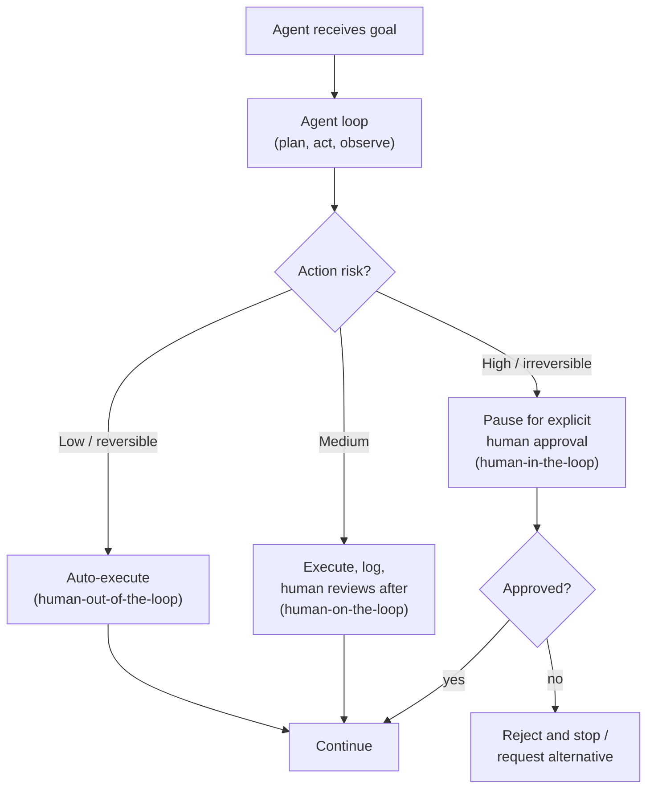

# Lesson 6-5: Human-in-the-Loop (HITL) Strategies

> Student follow-along resources, key concepts, and references for this sublesson.

## Overview

Agentic systems can act on their own, but for many real use cases that's exactly the problem. Human-in-the-loop (HITL) strategies place humans at specific points in the agent's workflow — to guide it, review its outputs, or approve high-risk actions — so that automation gains do not come at the cost of safety, accuracy, or accountability. This sublesson covers the main HITL patterns (approval workflows, tiered review, feedback loops), how they map to frameworks like LangGraph, and how they tie into governance regimes like the EU AI Act and the NIST AI Risk Management Framework.

## Learning objectives

By the end of this sublesson you should be able to:

- Define human-in-the-loop and contrast it with human-on-the-loop and human-out-of-the-loop.
- Identify when an agent action should pause for human approval and when it can proceed autonomously.
- Design a tiered HITL policy that varies oversight by risk, reversibility, and confidence.
- Apply approval, review, and feedback patterns in agent frameworks (e.g., LangGraph `interrupt()`).
- Map HITL controls to governance frameworks (EU AI Act Article 14, NIST AI RMF).

## Key concepts

### 1. Three levels of human involvement

- **Human-in-the-loop (HITL).** A human is *inside* the loop and must take an action (approve, reject, edit) before the agent proceeds.
- **Human-on-the-loop.** A human *monitors* and can intervene, but the agent acts in real time without per-step approval.
- **Human-out-of-the-loop.** Fully autonomous; humans only see aggregate metrics and audits.

The right level depends on risk, reversibility, regulatory exposure, and the agent's demonstrated reliability.

### 2. Where HITL belongs: high-stakes domains

By 2025–2026, HITL is considered essential in domains where errors are costly or regulated:

- **Healthcare** — diagnosis support, prior authorization, clinical documentation.
- **Finance** — payments, lending decisions, fraud actions.
- **Customer service** — refunds, account changes, deactivations.
- **Content moderation and safety** — escalation of borderline content.
- **Software engineering** — production deploys, schema changes, secret rotation.
- **Legal and compliance** — contract drafting, regulatory filings.

In each case, automation handles scale and consistency while humans provide context, judgment, and accountability.

### 3. Common HITL strategies

| Strategy | What it does | When to use |
| --- | --- | --- |
| Approval workflow | Pause before a sensitive action; require explicit approve/reject | Sending email, payment, data deletion, production deploy |
| Tiered review | Auto-approve low-risk; queue medium-risk; require approval for high-risk | Mixed workloads where most items are routine |
| Confidence-based escalation | Escalate when the agent's confidence falls below a threshold | Classification, summarization, retrieval-grounded answers |
| Draft-approve-execute | Agent drafts the action; human approves; system executes | Outbound communications, marketing copy, code changes |
| Tiered feedback / RLHF-style | Humans rate or correct outputs; corrections retrain or refine prompts | Long-running agents that need to improve over time |
| Escalation to specialist | Route to a domain expert when conditions match | Compliance edge cases, legal review, medical override |

A few engineering tips that consistently show up in production playbooks:

- Use **calibrated confidence**, not raw softmax probabilities, to drive escalation thresholds (e.g., temperature scaling, ensemble disagreement, or LLM-as-judge with calibration).
- **Time-box** human decisions with SLAs so the queue doesn't become a bottleneck.
- Use **structured approval briefings** ("here's what the agent wants to do, here's why, here are the risks") to combat automation bias — approvers should not just rubber-stamp.
- Run **no-blame post-incident reviews** when escalations spike, and use the data to refine prompts, tools, and guardrails.

### 4. HITL in agent frameworks

Modern frameworks build HITL directly into the runtime:

- **LangGraph** offers `interrupt()` to pause a graph at a node, return state to a human, and resume with a `Command` once the human responds. State is checkpointed, so long-running approvals (minutes to days) are supported.
- **OpenAI Agents SDK** supports tool-call confirmation and tracing.
- **AWS Bedrock Agents / AgentCore** include identity, gateway, and approval primitives at the platform layer.
- **Microsoft Copilot Studio / Agent Framework** expose approval connectors and audit logs through the Microsoft 365 admin surface.
- **HumanLayer, Orkes Conductor**, and similar tools provide cross-framework approval queues, often integrated with Slack, Microsoft Teams, or email.

The exact API differs, but the pattern is the same: the agent reaches a checkpoint, state is serialized, a human is notified, and the agent resumes when the human decides.

### 5. Governance and accountability

HITL is increasingly a **regulatory** requirement, not just a best practice:

- **EU AI Act, Article 14** mandates that high-risk AI systems be designed for *effective* human oversight — meaning trained humans with the authority and information to actually intervene.
- **NIST AI Risk Management Framework (AI RMF)** treats human oversight as a core control across its Govern, Map, Measure, and Manage functions.
- **OECD AI Principles** call for human-centred values and accountability.

Practical implications:

- Tie agent actions to a specific **identity** (the agent's, the user's, or both) so audit trails are meaningful.
- Log Thought, Action, Observation, and Approval decisions, and keep them queryable.
- Define a **policy** for which actions require HITL, who is accountable, and how decisions are reviewed.
- Train approvers; a checklist alone is not sufficient if reviewers do not understand what they are approving.

## Why it matters / What's next

HITL is what turns an interesting agent demo into a system you can deploy in a regulated business. Designed well, it actually *increases* throughput, because routine work is automated and humans focus on the cases where their judgment matters. The next sublesson, **Lesson 6-6: Data Transformation in AI Agents**, looks at the other side of trustworthy agents — making sure the data flowing through them is clean, well-mapped, and integration-ready.

## Glossary

- **Human-in-the-loop (HITL)** — A human must approve or edit before the agent proceeds.
- **Human-on-the-loop** — A human monitors and can intervene; the agent acts in real time.
- **Human-out-of-the-loop** — Fully autonomous operation; humans only review aggregate outcomes.
- **Approval workflow** — Pause-and-approve gate before a sensitive action.
- **Tiered review** — Risk-based routing of actions between auto, monitored, and approval lanes.
- **Confidence-based escalation** — Trigger human review when agent confidence is below a threshold.
- **Calibrated confidence** — A confidence score adjusted so values reflect true correctness rates.
- **Automation bias** — Tendency of human reviewers to over-trust AI suggestions.
- **EU AI Act, Article 14** — Provision requiring effective human oversight of high-risk AI systems.
- **NIST AI RMF** — U.S. risk management framework for AI; emphasizes governance and oversight.
- **Audit trail** — Persistent log of agent reasoning, actions, observations, and human decisions.

## Quick self-check

1. Distinguish human-in-the-loop, human-on-the-loop, and human-out-of-the-loop in one sentence each.
2. Give two factors you would use to decide which lane an action belongs in.
3. What is automation bias, and name one design choice that mitigates it.
4. How does LangGraph's `interrupt()` support long-running approvals?
5. Which provision of the EU AI Act specifically requires human oversight, and what does "effective oversight" mean in practice?

## References and further reading

- IBM — *What is human-in-the-loop (HITL)?* https://www.ibm.com/think/topics/human-in-the-loop
- LangChain — *Human-in-the-loop (LangGraph documentation).* https://langchain-ai.github.io/langgraph/concepts/human_in_the_loop/
- Towards Data Science — *Building human-in-the-loop agentic workflows.* https://towardsdatascience.com/building-human-in-the-loop-agentic-workflows/
- Galileo — *How to build human-in-the-loop oversight for AI agents.* https://galileo.ai/blog/human-in-the-loop-agent-oversight
- Strata — *Human-in-the-loop: a 2026 guide to AI oversight.* https://www.strata.io/blog/agentic-identity/practicing-the-human-in-the-loop/
- Agentic Patterns — *Human-in-the-loop approval framework.* https://agentic-patterns.com/patterns/human-in-loop-approval-framework/
- Orkes — *Human-in-the-loop in agentic workflows.* https://orkes.io/blog/human-in-the-loop/
- Elementum AI — *Human-in-the-loop agentic AI: when you need both.* https://www.elementum.ai/blog/human-in-the-loop-agentic-ai
- European Commission — *EU AI Act, Article 14: Human oversight.* https://artificialintelligenceact.eu/article/14/
- NIST — *AI Risk Management Framework (AI RMF 1.0).* https://www.nist.gov/itl/ai-risk-management-framework
- OECD — *AI Principles.* https://oecd.ai/en/ai-principles

### Omar's resources and references (course-wide)

#### Foundational cybersecurity resources in O'Reilly

This section provides a curated list of resources that delve into foundational cybersecurity concepts, frequently explored in O'Reilly training sessions and other educational offerings.

##### Live training

- **Upcoming Live Cybersecurity and AI Training in O'Reilly:** [Register before it is too late](https://learning.oreilly.com/search/?q=omar%20santos&type=live-course&rows=100&language_with_transcripts=en) (free with O'Reilly Subscription)

##### Reading list

Despite the rapidly evolving landscape of AI and technology, these books offer a comprehensive roadmap for understanding the intersection of these technologies with cybersecurity:

- **[NEW: Agentic AI for Cybersecurity: Building Autonomous Defenders and Adversaries](https://www.oreilly.com/library/view/agentic-ai-for/9780135589861/).** Unlock the power of next generation AI agents to transform cybersecurity, business operations, and productivity. [Available on O'Reilly](https://www.oreilly.com/library/view/agentic-ai-for/9780135589861/)

- **[Redefining Hacking](https://learning.oreilly.com/library/view/redefining-hacking-a/9780138363635/)** — A Comprehensive Guide to Red Teaming and Bug Bounty Hunting in an AI-driven World. [Available on O'Reilly](https://learning.oreilly.com/library/view/redefining-hacking-a/9780138363635/)

- **[AI-Powered Digital Cyber Resilience](https://www.oreilly.com/library/view/ai-powered-digital-cyber/9780135408599/)** — A practical guide to building intelligent, AI-powered cyber defenses in today's fast-evolving threat landscape. [Available on O'Reilly](https://www.oreilly.com/library/view/ai-powered-digital-cyber/9780135408599/)

- **[Developing Cybersecurity Programs and Policies in an AI-Driven World](https://learning.oreilly.com/library/view/developing-cybersecurity-programs/9780138073992)** — Explore strategies for creating robust cybersecurity frameworks in an AI-centric environment. [Available on O'Reilly](https://learning.oreilly.com/library/view/developing-cybersecurity-programs/9780138073992)

- **[Beyond the Algorithm: AI, Security, Privacy, and Ethics](https://learning.oreilly.com/library/view/beyond-the-algorithm/9780138268442)** — Gain insights into the ethical and security challenges posed by AI technologies. [Available on O'Reilly](https://learning.oreilly.com/library/view/beyond-the-algorithm/9780138268442)

- **[The AI Revolution in Networking, Cybersecurity, and Emerging Technologies](https://learning.oreilly.com/library/view/the-ai-revolution/9780138293703)** — Understand how AI is transforming networking and cybersecurity landscape. [Available on O'Reilly](https://learning.oreilly.com/library/view/the-ai-revolution/9780138293703)

##### Video courses

Enhance your practical skills with these video courses designed to deepen your understanding of cybersecurity:

- **[Building the Ultimate Cybersecurity Lab and Cyber Range](https://learning.oreilly.com/course/building-the-ultimate/9780138319090/)** (video). [Available on O'Reilly](https://learning.oreilly.com/course/building-the-ultimate/9780138319090/)

- **[Build Your Own AI Lab](https://learning.oreilly.com/course/build-your-own/9780135439616)** (video) — Hands-on guide to home and cloud-based AI labs. Learn to set up and optimize labs to research and experiment in a secure environment. [Available on O'Reilly](https://learning.oreilly.com/course/build-your-own/9780135439616)

- **[Defending and Deploying AI](https://www.oreilly.com/videos/defending-and-deploying/9780135463727/)** (video) — Comprehensive, hands-on journey into modern AI applications for technology and security professionals, covering AI-enabled programming, networking, and cybersecurity; securing generative AI (LLM security, prompt injection, red-teaming); secure AI labs; AI agents and agentic RAG for cybersecurity. [Available on O'Reilly](https://www.oreilly.com/videos/defending-and-deploying/9780135463727/)

- **[AI-Enabled Programming, Networking, and Cybersecurity](https://learning.oreilly.com/course/ai-enabled-programming-networking/9780135402696/)** — Learn to use AI for cybersecurity, networking, and programming tasks with practical, hands-on activities. [Available on O'Reilly](https://learning.oreilly.com/course/ai-enabled-programming-networking/9780135402696/)

- **[Securing Generative AI](https://learning.oreilly.com/course/securing-generative-ai/9780135401804/)** — Security for deploying and developing AI applications, RAG, agents, and other AI implementations; incorporate security at every stage of AI development, deployment, and operation. [Available on O'Reilly](https://learning.oreilly.com/course/securing-generative-ai/9780135401804/)

- **[Practical Cybersecurity Fundamentals](https://learning.oreilly.com/course/practical-cybersecurity-fundamentals/9780138037550/)** — Essential cybersecurity principles. [Available on O'Reilly](https://learning.oreilly.com/course/practical-cybersecurity-fundamentals/9780138037550/)

- **[The Art of Hacking](https://theartofhacking.org)** — Over 26 hours of training in ethical hacking and penetration testing (e.g., OSCP or CEH prep). [Visit The Art of Hacking](https://theartofhacking.org)

##### Certification related

- **CompTIA PenTest+ PT0-002 Cert Guide, 2nd Edition** — [Available on O'Reilly](https://learning.oreilly.com/library/view/comptia-pentest-pt0-002/9780137566204/)

- **Certified Ethical Hacker (CEH), Latest Edition** — Very comprehensive (19+ hours). [Available on O'Reilly](https://learning.oreilly.com/course/certified-ethical-hacker/9780135395646/)

- **Certified in Cybersecurity - CC (ISC)²** — [Available on O'Reilly](https://learning.oreilly.com/course/certified-in-cybersecurity/9780138230364/)

- **CCNP and CCIE Security Core SCOR 350-701 Official Cert Guide, 2nd Edition** — [Available on O'Reilly](https://learning.oreilly.com/library/view/ccnp-and-ccie/9780138221287/)

- **CEH Certified Ethical Hacker Cert Guide** — [Available on O'Reilly](https://learning.oreilly.com/library/view/ceh-certified-ethical/9780137489930/)

##### Additional resources

- **Hacking Scenarios (Labs) on O'Reilly** — Cloud-based labs; no local install. [https://hackingscenarios.com](https://hackingscenarios.com)

- **Personal blog** — [becomingahacker.org](https://becomingahacker.org)

- **Cisco blog** — [blogs.cisco.com/author/omarsantos](https://blogs.cisco.com/author/omarsantos)

- **GitHub repository** — [hackerrepo.org](https://hackerrepo.org)

- **WebSploit Labs** — [websploit.org](https://websploit.org)

- **NetAcad Ethical Hacker Free Course** — [NetAcad Skills for All](https://www.netacad.com/courses/ethical-hacker?courseLang=en-US)
