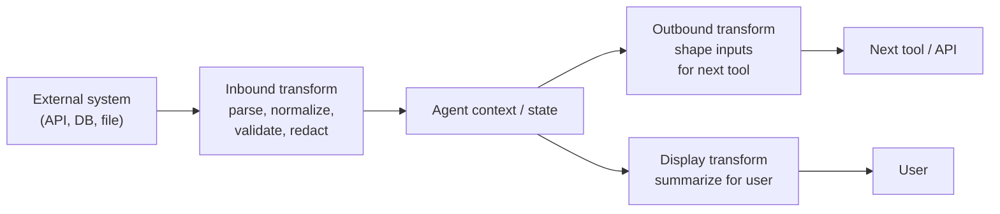

# Lesson 6-7: Data Transformation in AI Agents

> Student follow-along resources, key concepts, and references for this sublesson.

## Overview

Agents only work as well as the data they read and write. Real systems return JSON with messy field names, inconsistent types, nested structures, and noise the model does not need to see. This sublesson covers the disciplines that keep an agent grounded: **data mapping** (how fields in one system correspond to another), **data transformation** (formatting, filtering, aggregating, redacting), and **integration** (auth, retries, rate limits, errors). Together with MCP from Lesson 6-4—and optional browser-facing tool registration from Lesson 6-5 (WebMCP)—these are how data flows in and out of an agent without breaking it.

## Learning objectives

By the end of this sublesson you should be able to:

- Distinguish data mapping, data transformation, and integration in the context of AI agents.
- Use structured outputs and JSON Schema (with libraries like Pydantic or Zod) to enforce reliable data shapes.
- Apply common transformation steps — formatting, filtering, redacting, aggregating — between tools and the model.
- Handle integration concerns for tool calls: authentication, retries, rate limits, pagination, and errors.
- Design and document the data flow for an agent so that it is debuggable and maintainable.

## Key concepts

### 1. Data mapping: matching fields across systems

Mapping defines how a field in one system corresponds to a field in another. The simplest case is a rename — `customer_id` in the API maps to `userId` in your agent's internal model. Real cases are messier:

- **Type changes.** A string `"42"` becomes an integer; an ISO 8601 string becomes a `datetime` object.
- **Unit changes.** Cents to dollars, Celsius to Fahrenheit, milliseconds to seconds.
- **Nested vs. flat.** `address.city` becomes a top-level `city` field, or vice versa.
- **Many-to-one and one-to-many.** Multiple source fields combine into one target, or one source explodes into a list.
- **Lookup / enrichment.** A foreign key resolves to a name (`region_id` → `region_name`) via a separate call.

A clear, documented mapping is the difference between an agent that "mostly works" and one whose tool integrations break the next time an upstream API changes a field.

### 2. Data transformation: shaping data for tools and the model

Transformation converts data from one form to another. In an agent, transformations happen at three boundaries:

Common operations:

- **Formatting.** Dates, numbers, currencies, units, locale strings.
- **Filtering.** Drop fields the model does not need (verbose metadata, internal IDs, hashes).
- **Redaction.** Remove or mask PII, secrets, and other sensitive fields *before* they enter the prompt.
- **Aggregation.** Reduce a list of records to a count, total, or summary.
- **Truncation.** Keep payloads inside the model's context budget.
- **Schema coercion.** Convert third-party JSON into the agent's own canonical shape.

Why this matters: every token of raw payload competes with reasoning tokens. Clean, well-shaped inputs reduce hallucination, latency, and cost.

### 3. Structured outputs: making the model itself produce clean data

You also want the model to *emit* clean data. Modern LLM APIs support **structured outputs** that constrain generation to a JSON Schema:

- **OpenAI** — `response_format: { type: "json_schema", schema: ... }` and `strict: true` on tool definitions.
- **Anthropic** — `tool_use` with input schemas; structured outputs in the messages API.
- **Google Gemini** — controlled generation with `responseSchema`.
- **Amazon Bedrock** — strict mode for tool use and structured outputs.

In code, you typically define the schema once and reuse it:

- **Python** — Pydantic models, then `model.model_json_schema()` to feed the API; parse responses back into typed objects.
- **TypeScript** — Zod (or Valibot) schemas with similar reuse patterns.

This eliminates a whole category of "the model returned almost-JSON" bugs and lets the agent treat tool outputs as typed values.

### 4. Integration: making the connection reliable

Once the data shape is right, the *connection* itself has to be robust. Integration concerns that come up in every production agent:

| Concern | What to design for |
| --- | --- |
| Authentication | OAuth 2.1 or API keys; never paste secrets into prompts; prefer scoped, short-lived tokens |
| Authorization | Least privilege: the agent's tools should only see what they need |
| Rate limits | Backoff, jitter, and queueing; surface limits to the agent so it can pace itself |
| Retries | Idempotency keys for write operations; bounded retries with exponential backoff |
| Pagination | Loop over pages until done, or summarize in chunks; do not stuff everything into one prompt |
| Timeouts | Per-tool deadlines so a single slow API does not hang the whole agent |
| Errors | Return structured error messages the agent can reason about, not raw stack traces |
| Idempotency | Make sure retries do not double-charge, double-send, or double-create |
| Observability | Log requests, responses (sanitized), latency, and outcomes for every tool call |

A common pattern is to put a **unified API layer** or **MCP server** in front of third-party services. That layer handles auth, pagination, retries, and normalization once, and exposes a clean, agent-friendly interface upstream.

### 5. Putting it together: design the data flow explicitly

When you design an agent, write down — for each tool — three things:

1. **Input schema.** Exactly what fields, with what types and constraints, the tool expects.
2. **Output schema.** Exactly what the tool returns, with examples and error cases.
3. **Transformations.** What you do to the input on the way in, and to the output on the way out (filter, redact, normalize).

Keep these definitions next to the tool implementation, not buried in a prompt. That single habit makes agents far easier to debug, secure, and evolve.

## Why it matters / What's next

Data transformation is the unglamorous backbone of every agent that actually ships. Without it, even a sophisticated reasoning loop will be poisoned by malformed payloads, leak sensitive data into prompts, or break the moment an upstream API shifts.

**Next:** [Lesson 6-8: Agent Skills and Harnesses](Lesson-6-8.md) — how portable **skills** package expertise for agents and how a **harness** (runtime, tools, verification) turns a model into a dependable system.

Across the full course you connect:

- **Lesson 1** — generative AI models, hosting, context, and RAG.
- **Lesson 2** — prompt engineering.
- **Lesson 3** — AI ethics and security.
- **Lesson 4** — AI for data research and analysis.
- **Lesson 5** — AI for code and workflow optimization.
- **Lesson 6** — agentic AI, MCP, WebMCP, HITL/HOTL, data transformation, skills, and harnesses.

That sequence matches the Cisco AI Technical Practitioner picture: models, prompting, safety, data work, coding workflows, and agentic systems that act in the real world.

### Industry perspective (2025–2026)

- **Structured outputs in agent pipelines:** Platforms increasingly treat JSON Schema–constrained responses as first-class for batch extraction and multi-step workflows—not only for UI formatting—because validation and retries compose cleanly with orchestration (see vendor guidance from OpenAI, Anthropic, Google Gemini, and ecosystem frameworks such as Mastra and Microsoft Agent Framework).
- **Structured outputs vs. tool calling:** A single constrained completion is ideal for “shape this blob of text into JSON”; tool calling is for when the model must choose actions over multiple steps. Many production agents use both at different layers (see practitioner discussions comparing the two patterns).
- **Normalization before security analytics:** Enterprise security AI stacks emphasize consistent field names and types upstream so detection rules and agents do not drift when sources change—a parallel discipline to agent-side mapping and transformation.

## Glossary

- **Data mapping** — Defining how fields in one system correspond to fields in another.
- **Data transformation** — Converting data from one form to another (format, filter, aggregate, redact).
- **Structured outputs** — LLM responses constrained to a JSON Schema for reliable parsing.
- **JSON Schema** — A standard for describing the shape, types, and constraints of JSON data.
- **Pydantic / Zod** — Python and TypeScript libraries for declaring and validating data schemas.
- **Redaction** — Removing or masking sensitive fields (PII, secrets) before they reach the model.
- **Idempotency key** — A token that ensures repeated requests do not cause repeated effects.
- **Backoff and jitter** — A retry strategy that waits longer (with randomness) between attempts.
- **Rate limiting** — Caps on how often a client may call an API; agents must respect these.
- **Pagination** — Returning results in pages; the agent or layer must iterate.
- **Unified API layer** — A normalization layer that fronts many providers behind one consistent interface.
- **Observability** — Visibility into tool calls, latencies, errors, and outcomes via logs and traces.

## Quick self-check

1. In one sentence each, define data mapping, data transformation, and integration.
2. Give two reasons to redact or filter tool outputs before they enter the model's context.
3. How do structured outputs (e.g., JSON Schema with `strict: true`) reduce a class of agent bugs?
4. Name three integration concerns you must handle for any tool that writes to an external system.
5. For a tool you are designing, what three things should you write down before connecting it to the agent?

## References and further reading

- Mastra — *Structured output (agents).* https://mastra.ai/docs/agents/structured-output
- Databricks — *Structured outputs for batch and agent workflows.* https://www.databricks.com/blog/introducing-structured-outputs-batch-and-agent-workflows
- OpenAI — *Structured outputs guide.* https://platform.openai.com/docs/guides/structured-outputs
- Anthropic — *Structured outputs (Claude API).* https://docs.anthropic.com/en/docs/build-with-claude/structured-outputs
- Google AI — *Generate structured output (Gemini).* https://ai.google.dev/gemini-api/docs/structured-output
- AWS — *Structured outputs on Amazon Bedrock.* https://aws.amazon.com/blogs/machine-learning/structured-outputs-on-amazon-bedrock-schema-compliant-ai-responses/
- Microsoft Learn — *Producing structured outputs with agents (Agent Framework).* https://learn.microsoft.com/en-us/agent-framework/agents/structured-outputs
- Pydantic — *Pydantic documentation.* https://docs.pydantic.dev/
- Zod — *Zod documentation.* https://zod.dev/
- JSON Schema — *Specification and tooling.* https://json-schema.org/
- Elastic — *Structured outputs: creating reliable agents in Elasticsearch.* https://www.elastic.co/search-labs/blog/structured-outputs-elasticsearch-guide
- Truto — *Mapping AI agent patterns to integration platforms (2026).* https://truto.one/blog/mapping-ai-agent-patterns-to-integration-platforms-2026-tutorial/
- Seemplicity — *Data normalization: the foundation for security AI.* https://seemplicity.io/blog/data-normalization-ai-security/
- Model Context Protocol — *Tools, resources, and prompts.* https://modelcontextprotocol.io/docs/learn/server-concepts

### Omar's resources and references (course-wide)

#### Foundational cybersecurity resources in O'Reilly

This section provides a curated list of resources that delve into foundational cybersecurity concepts, frequently explored in O'Reilly training sessions and other educational offerings.

##### Live training

- **Upcoming Live Cybersecurity and AI Training in O'Reilly:** [Register before it is too late](https://learning.oreilly.com/search/?q=omar%20santos&type=live-course&rows=100&language_with_transcripts=en) (free with O'Reilly Subscription)

##### Reading list

Despite the rapidly evolving landscape of AI and technology, these books offer a comprehensive roadmap for understanding the intersection of these technologies with cybersecurity:

- **[NEW: Agentic AI for Cybersecurity: Building Autonomous Defenders and Adversaries](https://www.oreilly.com/library/view/agentic-ai-for/9780135589861/).** Unlock the power of next generation AI agents to transform cybersecurity, business operations, and productivity. [Available on O'Reilly](https://www.oreilly.com/library/view/agentic-ai-for/9780135589861/)

- **[Redefining Hacking](https://learning.oreilly.com/library/view/redefining-hacking-a/9780138363635/)** — A Comprehensive Guide to Red Teaming and Bug Bounty Hunting in an AI-driven World. [Available on O'Reilly](https://learning.oreilly.com/library/view/redefining-hacking-a/9780138363635/)

- **[AI-Powered Digital Cyber Resilience](https://www.oreilly.com/library/view/ai-powered-digital-cyber/9780135408599/)** — A practical guide to building intelligent, AI-powered cyber defenses in today's fast-evolving threat landscape. [Available on O'Reilly](https://www.oreilly.com/library/view/ai-powered-digital-cyber/9780135408599/)

- **[Developing Cybersecurity Programs and Policies in an AI-Driven World](https://learning.oreilly.com/library/view/developing-cybersecurity-programs/9780138073992)** — Explore strategies for creating robust cybersecurity frameworks in an AI-centric environment. [Available on O'Reilly](https://learning.oreilly.com/library/view/developing-cybersecurity-programs/9780138073992)

- **[Beyond the Algorithm: AI, Security, Privacy, and Ethics](https://learning.oreilly.com/library/view/beyond-the-algorithm/9780138268442)** — Gain insights into the ethical and security challenges posed by AI technologies. [Available on O'Reilly](https://learning.oreilly.com/library/view/beyond-the-algorithm/9780138268442)

- **[The AI Revolution in Networking, Cybersecurity, and Emerging Technologies](https://learning.oreilly.com/library/view/the-ai-revolution/9780138293703)** — Understand how AI is transforming networking and cybersecurity landscape. [Available on O'Reilly](https://learning.oreilly.com/library/view/the-ai-revolution/9780138293703)

##### Video courses

Enhance your practical skills with these video courses designed to deepen your understanding of cybersecurity:

- **[Building the Ultimate Cybersecurity Lab and Cyber Range](https://learning.oreilly.com/course/building-the-ultimate/9780138319090/)** (video). [Available on O'Reilly](https://learning.oreilly.com/course/building-the-ultimate/9780138319090/)

- **[Build Your Own AI Lab](https://learning.oreilly.com/course/build-your-own/9780135439616)** (video) — Hands-on guide to home and cloud-based AI labs. Learn to set up and optimize labs to research and experiment in a secure environment. [Available on O'Reilly](https://learning.oreilly.com/course/build-your-own/9780135439616)

- **[Defending and Deploying AI](https://www.oreilly.com/videos/defending-and-deploying/9780135463727/)** (video) — Comprehensive, hands-on journey into modern AI applications for technology and security professionals, covering AI-enabled programming, networking, and cybersecurity; securing generative AI (LLM security, prompt injection, red-teaming); secure AI labs; AI agents and agentic RAG for cybersecurity. [Available on O'Reilly](https://www.oreilly.com/videos/defending-and-deploying/9780135463727/)

- **[AI-Enabled Programming, Networking, and Cybersecurity](https://learning.oreilly.com/course/ai-enabled-programming-networking/9780135402696/)** — Learn to use AI for cybersecurity, networking, and programming tasks with practical, hands-on activities. [Available on O'Reilly](https://learning.oreilly.com/course/ai-enabled-programming-networking/9780135402696/)

- **[Securing Generative AI](https://learning.oreilly.com/course/securing-generative-ai/9780135401804/)** — Security for deploying and developing AI applications, RAG, agents, and other AI implementations; incorporate security at every stage of AI development, deployment, and operation. [Available on O'Reilly](https://learning.oreilly.com/course/securing-generative-ai/9780135401804/)

- **[Practical Cybersecurity Fundamentals](https://learning.oreilly.com/course/practical-cybersecurity-fundamentals/9780138037550/)** — Essential cybersecurity principles. [Available on O'Reilly](https://learning.oreilly.com/course/practical-cybersecurity-fundamentals/9780138037550/)

- **[The Art of Hacking](https://theartofhacking.org)** — Over 26 hours of training in ethical hacking and penetration testing (e.g., OSCP or CEH prep). [Visit The Art of Hacking](https://theartofhacking.org)

##### Certification related

- **CompTIA PenTest+ PT0-002 Cert Guide, 2nd Edition** — [Available on O'Reilly](https://learning.oreilly.com/library/view/comptia-pentest-pt0-002/9780137566204/)

- **Certified Ethical Hacker (CEH), Latest Edition** — Very comprehensive (19+ hours). [Available on O'Reilly](https://learning.oreilly.com/course/certified-ethical-hacker/9780135395646/)

- **Certified in Cybersecurity - CC (ISC)²** — [Available on O'Reilly](https://learning.oreilly.com/course/certified-in-cybersecurity/9780138230364/)

- **CCNP and CCIE Security Core SCOR 350-701 Official Cert Guide, 2nd Edition** — [Available on O'Reilly](https://learning.oreilly.com/library/view/ccnp-and-ccie/9780138221287/)

- **CEH Certified Ethical Hacker Cert Guide** — [Available on O'Reilly](https://learning.oreilly.com/library/view/ceh-certified-ethical/9780137489930/)

##### Additional resources

- **Hacking Scenarios (Labs) on O'Reilly** — Cloud-based labs; no local install. [https://hackingscenarios.com](https://hackingscenarios.com)

- **Personal blog** — [becomingahacker.org](https://becomingahacker.org)

- **Cisco blog** — [blogs.cisco.com/author/omarsantos](https://blogs.cisco.com/author/omarsantos)

- **GitHub repository** — [hackerrepo.org](https://hackerrepo.org)

- **WebSploit Labs** — [websploit.org](https://websploit.org)

- **NetAcad Ethical Hacker Free Course** — [NetAcad Skills for All](https://www.netacad.com/courses/ethical-hacker?courseLang=en-US)
