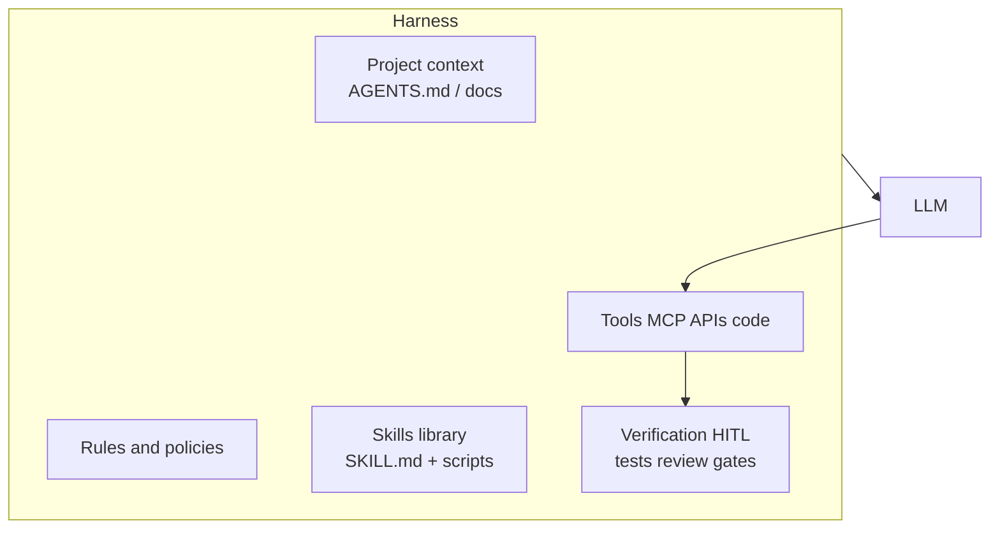

# Lesson 6-8: Agent Skills and Harnesses

> Student follow-along resources, key concepts, and references for this sublesson.

## Overview

Lesson 6 established how agents **reason**, **use tools** (including via MCP and optionally WebMCP in the browser), stay **human-governed** (HITL/HOTL), and **normalize data**. This closing sublesson connects that stack to how practitioners ship agents day to day: **Agent Skills** package reusable, portable expertise for assistants, and a **harness** is the engineered runtime around the model—policies, tools, verification, and project context—that turns raw LLM capability into something dependable in a codebase or workflow.

## Learning objectives

By the end of this sublesson you should be able to:

- Explain **Agent Skills** as an open, file-based standard and how `SKILL.md` fits into agent workflows.
- Contrast **skills** with **rules**, **memories**, and ad-hoc prompts for when each belongs.
- Describe an **agent harness** as model plus orchestration: tools, guardrails, verification loops, and repository context.
- Identify practical patterns: progressive disclosure of skill content, scoped skills by path, explicit-only skills via flags, and harness artifacts such as agent instructions files.
- Relate skills and harness design to Lesson 6 themes (MCP and WebMCP, HITL/HOTL, data contracts).

## Key concepts

### 1. Agent Skills: portable expertise

**Agent Skills** is an **open standard** for extending agents with domain-specific workflows and guidance. A skill is typically a **folder** containing a **`SKILL.md`** file with YAML frontmatter (`name`, `description`, optional `paths` scoping, optional `disable-model-invocation`, etc.) plus optional `scripts/`, `references/`, and `assets/`.

Why it matters:

- **Version control:** Skills live in the repo or install from remote sources—reviewable like code.
- **Progressive loading:** Implementations can expose short descriptions first and load full instructions or reference files only when relevant—protecting the context window.
- **Portability:** The same skill concept appears across multiple agent products that adopt the standard.

Cursor documents discovery from `.cursor/skills/`, `.agents/skills/`, user-global directories, and compatibility paths for other assistants; the ecosystem hub for the standard is **agentskills.io**.

### 2. Skills vs. rules vs. one-off prompts

| Mechanism | Typical use | Invocation |
| --- | --- | --- |
| **Rules** | Always-on or glob-scoped constraints; coding standards | Applied by policy when conditions match |
| **Skills** | Multi-step or domain workflows; scripts and references | Agent decides relevance, or `/skill` explicit invoke |
| **Ad-hoc prompt** | Single-turn clarification | User types each time |

Skills shine when the agent needs **repeatable procedure**—deploy checklist, incident triage, migration playbook—not when a single sentence of policy suffices.

### 3. Harness: model + runtime you engineer

Informally, practitioners describe the **harness** as everything wrapped around the LLM that makes an agent **usable**: orchestration SDK, allowed tool surface, retry and timeout policies, structured outputs, logging, **AGENTS.md** / project instruction files, test hooks, and sometimes **subagents** or **handoffs** for specialization.

Anthropic's engineering guidance distinguishes **workflows** (fixed code paths orchestrating LLM steps) from **agents** (the model dynamically directs tools); your harness chooses how much freedom exists and where deterministic rails replace model discretion—often mixing both in production.

A mature harness also encodes **verification**: linters, tests, diff review, human approvals (Lesson 6-6), and "stop conditions" so autonomy does not run unbounded.

### 4. Putting skills inside the harness

Skills sit in the **context supply chain**: they teach *how* to use tools and interpret results; MCP exposes *what* can be called; data transformation (Lesson 6-7) ensures arguments and observations stay shaped and safe.

### 5. Operational habits

- Keep **`description`** in skill frontmatter precise—agents use it for relevance ranking.
- Use **`paths`** (or nested `.cursor/skills/` per package) to avoid polluting unrelated tasks.
- Prefer **`disable-model-invocation: true`** when a skill must never auto-fire (dangerous ops, compliance).
- Store long references under `references/`; keep `SKILL.md` a concise entry point.
- Periodically **migrate** brittle dynamic rules into skills where workflow reuse warrants it (many products ship migration helpers).

## Why it matters / Course close

Skills and harness thinking are how teams scale agent adoption: repeatability, reviewability, and bounded autonomy. Together with models, prompting, safety, data fluency, coding workflows, MCP, WebMCP, HITL/HOTL, and data transformation, you have the full practitioner arc for designing agentic systems responsibly.

## Glossary

- **Agent Skills** — Open standard for packaged agent capabilities, usually centered on `SKILL.md`.
- **SKILL.md** — Markdown skill definition with YAML frontmatter and procedural instructions.
- **Progressive disclosure** — Loading skill metadata first and deeper files only when needed.
- **Harness** — The engineered runtime around an LLM: tools, policies, verification, and context.
- **Orchestration** — Coordinating prompts, tool calls, state, and handoffs across steps.
- **Workflow vs. agent (architecture)** — Fixed orchestration code vs. model-directed tool use; often combined.
- **Scoped skill** — Skill limited to certain paths or packages via `paths` or directory placement.

## Quick self-check

1. What two frontmatter fields belong on every `SKILL.md`, and what is one optional field that limits where a skill appears?
2. In one sentence, how does a skill differ from an always-on rule?
3. Name three components of an agent harness beyond the raw model weights.
4. Why might you attach `disable-model-invocation: true` to a skill?
5. How do MCP (Lesson 6-4) and skills complement each other?

## References and further reading

- Agent Skills — *Overview (open standard).* https://agentskills.io/
- Cursor — *Agent Skills (context/skills).* https://cursor.com/docs/context/skills
- Anthropic — *Building effective agents.* https://www.anthropic.com/research/building-effective-agents
- Model Context Protocol — *Introduction.* https://modelcontextprotocol.io/
- GitHub — *agentskills/agentskills specification.* https://github.com/agentskills/agentskills

### Omar's resources and references (course-wide)

#### Foundational cybersecurity resources in O'Reilly

This section provides a curated list of resources that delve into foundational cybersecurity concepts, frequently explored in O'Reilly training sessions and other educational offerings.

##### Live training

- **Upcoming Live Cybersecurity and AI Training in O'Reilly:** [Register before it is too late](https://learning.oreilly.com/search/?q=omar%20santos&type=live-course&rows=100&language_with_transcripts=en) (free with O'Reilly Subscription)

##### Reading list

Despite the rapidly evolving landscape of AI and technology, these books offer a comprehensive roadmap for understanding the intersection of these technologies with cybersecurity:

- **[NEW: Agentic AI for Cybersecurity: Building Autonomous Defenders and Adversaries](https://www.oreilly.com/library/view/agentic-ai-for/9780135589861/).** Unlock the power of next generation AI agents to transform cybersecurity, business operations, and productivity. [Available on O'Reilly](https://www.oreilly.com/library/view/agentic-ai-for/9780135589861/)

- **[Redefining Hacking](https://learning.oreilly.com/library/view/redefining-hacking-a/9780138363635/)** — A Comprehensive Guide to Red Teaming and Bug Bounty Hunting in an AI-driven World. [Available on O'Reilly](https://learning.oreilly.com/library/view/redefining-hacking-a/9780138363635/)

- **[AI-Powered Digital Cyber Resilience](https://www.oreilly.com/library/view/ai-powered-digital-cyber/9780135408599/)** — A practical guide to building intelligent, AI-powered cyber defenses in today's fast-evolving threat landscape. [Available on O'Reilly](https://www.oreilly.com/library/view/ai-powered-digital-cyber/9780135408599/)

- **[Developing Cybersecurity Programs and Policies in an AI-Driven World](https://learning.oreilly.com/library/view/developing-cybersecurity-programs/9780138073992)** — Explore strategies for creating robust cybersecurity frameworks in an AI-centric environment. [Available on O'Reilly](https://learning.oreilly.com/library/view/developing-cybersecurity-programs/9780138073992)

- **[Beyond the Algorithm: AI, Security, Privacy, and Ethics](https://learning.oreilly.com/library/view/beyond-the-algorithm/9780138268442)** — Gain insights into the ethical and security challenges posed by AI technologies. [Available on O'Reilly](https://learning.oreilly.com/library/view/beyond-the-algorithm/9780138268442)

- **[The AI Revolution in Networking, Cybersecurity, and Emerging Technologies](https://learning.oreilly.com/library/view/the-ai-revolution/9780138293703)** — Understand how AI is transforming networking and cybersecurity landscape. [Available on O'Reilly](https://learning.oreilly.com/library/view/the-ai-revolution/9780138293703)

##### Video courses

Enhance your practical skills with these video courses designed to deepen your understanding of cybersecurity:

- **[Building the Ultimate Cybersecurity Lab and Cyber Range](https://learning.oreilly.com/course/building-the-ultimate/9780138319090/)** (video). [Available on O'Reilly](https://learning.oreilly.com/course/building-the-ultimate/9780138319090/)

- **[Build Your Own AI Lab](https://learning.oreilly.com/course/build-your-own/9780135439616)** (video) — Hands-on guide to home and cloud-based AI labs. Learn to set up and optimize labs to research and experiment in a secure environment. [Available on O'Reilly](https://learning.oreilly.com/course/build-your-own/9780135439616)

- **[Defending and Deploying AI](https://www.oreilly.com/videos/defending-and-deploying/9780135463727/)** (video) — Comprehensive, hands-on journey into modern AI applications for technology and security professionals, covering AI-enabled programming, networking, and cybersecurity; securing generative AI (LLM security, prompt injection, red-teaming); secure AI labs; AI agents and agentic RAG for cybersecurity. [Available on O'Reilly](https://www.oreilly.com/videos/defending-and-deploying/9780135463727/)

- **[AI-Enabled Programming, Networking, and Cybersecurity](https://learning.oreilly.com/course/ai-enabled-programming-networking/9780135402696/)** — Learn to use AI for cybersecurity, networking, and programming tasks with practical, hands-on activities. [Available on O'Reilly](https://learning.oreilly.com/course/ai-enabled-programming-networking/9780135402696/)

- **[Securing Generative AI](https://learning.oreilly.com/course/securing-generative-ai/9780135401804/)** — Security for deploying and developing AI applications, RAG, agents, and other AI implementations; incorporate security at every stage of AI development, deployment, and operation. [Available on O'Reilly](https://learning.oreilly.com/course/securing-generative-ai/9780135401804/)

- **[Practical Cybersecurity Fundamentals](https://learning.oreilly.com/course/practical-cybersecurity-fundamentals/9780138037550/)** — Essential cybersecurity principles. [Available on O'Reilly](https://learning.oreilly.com/course/practical-cybersecurity-fundamentals/9780138037550/)

- **[The Art of Hacking](https://theartofhacking.org)** — Over 26 hours of training in ethical hacking and penetration testing (e.g., OSCP or CEH prep). [Visit The Art of Hacking](https://theartofhacking.org)

##### Certification related

- **CompTIA PenTest+ PT0-002 Cert Guide, 2nd Edition** — [Available on O'Reilly](https://learning.oreilly.com/library/view/comptia-pentest-pt0-002/9780137566204/)

- **Certified Ethical Hacker (CEH), Latest Edition** — Very comprehensive (19+ hours). [Available on O'Reilly](https://learning.oreilly.com/course/certified-ethical-hacker/9780135395646/)

- **Certified in Cybersecurity - CC (ISC)²** — [Available on O'Reilly](https://learning.oreilly.com/course/certified-in-cybersecurity/9780138230364/)

- **CCNP and CCIE Security Core SCOR 350-701 Official Cert Guide, 2nd Edition** — [Available on O'Reilly](https://learning.oreilly.com/library/view/ccnp-and-ccie/9780138221287/)

- **CEH Certified Ethical Hacker Cert Guide** — [Available on O'Reilly](https://learning.oreilly.com/library/view/ceh-certified-ethical/9780137489930/)

##### Additional resources

- **Hacking Scenarios (Labs) on O'Reilly** — Cloud-based labs; no local install. [https://hackingscenarios.com](https://hackingscenarios.com)

- **Personal blog** — [becomingahacker.org](https://becomingahacker.org)

- **Cisco blog** — [blogs.cisco.com/author/omarsantos](https://blogs.cisco.com/author/omarsantos)

- **GitHub repository** — [hackerrepo.org](https://hackerrepo.org)

- **WebSploit Labs** — [websploit.org](https://websploit.org)

- **NetAcad Ethical Hacker Free Course** — [NetAcad Skills for All](https://www.netacad.com/courses/ethical-hacker?courseLang=en-US)
